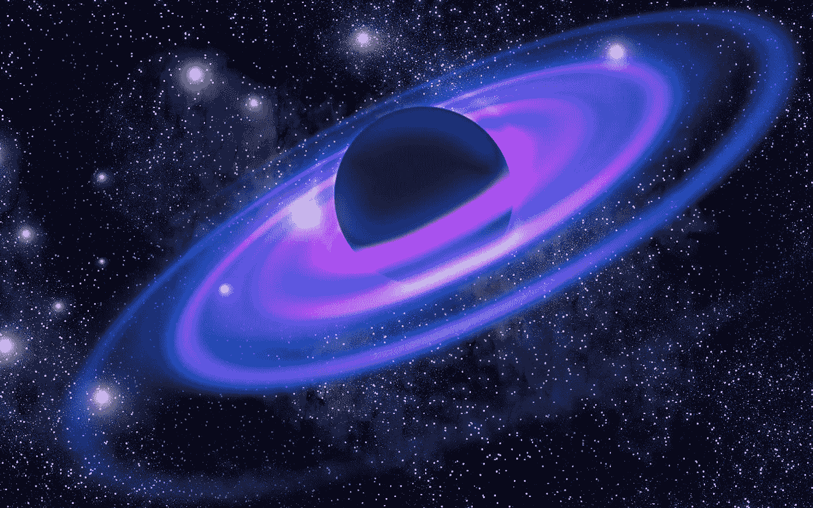
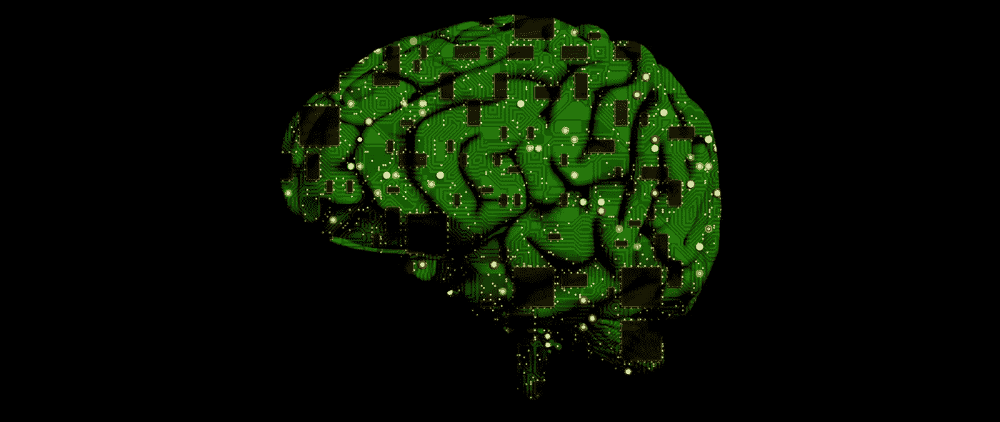

# 神经网络能以 1 亿倍的速度解决三体问题

> 原文：<https://medium.datadriveninvestor.com/neural-network-could-solve-the-three-body-problem-100-million-times-faster-7aa3320a3c06?source=collection_archive---------2----------------------->

三体物理学中最著名的复杂计算之一，可能在人工智能中遇到了对手:神经网络有望以比现有技术快 1 亿倍的速度找到解决方案。

首先由艾萨克·牛顿爵士提出，三体涉及计算三个引力相互作用的物体，如地球、月球和太阳的运动，例如给定它们的初始位置和速度。

 [## AI 将军是否已经超过了人类的智力容量？数据驱动的投资者

### 不仅在游戏中，而且在劳动力市场上，机器都比人类聪明。在今天的许多领域，使用…

www.datadriveninvestor.com](https://www.datadriveninvestor.com/2020/02/12/has-general-ai-exceeded-the-intellectual-capacity-of-humans/) 

乍听起来可能很简单，但随之而来的混沌运动数百年来一直困扰着数学家和物理学家，以至于除了最专注的人之外，所有人都试图尽可能避免去想它。

这就是为什么天文计时器在计算海上位置时比使用月亮和星星更受欢迎的原因——它不那么令人头疼。

今天，三体是弄清楚黑洞双星如何与单个黑洞相互作用，以及宇宙中一些最基本的物体如何相互作用的重要部分。

输入由英国爱丁堡大学和剑桥大学、葡萄牙阿威罗大学和荷兰莱顿大学的研究人员制作的神经网络。该团队开发了一个深度人工神经网络(ANN)，在现有三体问题的数据库上进行训练，加上已经精心制定的一部分解决方案。事实证明，人工神经网络有望比我们今天更快地得出准确的答案。

“一个训练有素的人工神经网络可以取代现有的数值解算器，使多体系统的快速和可扩展模拟成为可能，从而揭示一些突出的现象，如黑洞双星系统的形成或致密星团核心坍缩的起源。”在他们的研究论文中。

 [## 牛顿 vs 机器:使用深度神经网络解决混沌三体

### 自从艾萨克·牛顿爵士提出以来，求解三体运动方程的问题一直是一个难题

arxiv.org](https://arxiv.org/abs/1910.07291) 

研究人员简化了在一个平面上只包含三个等质量粒子的过程，所有粒子都从零速度开始，然后运行一个名为 Brutus 的现有三体解算器 10，000 次(9，900 次用于训练，100 次用于验证)。

 [## 多体模拟的可靠性

### 在 N 体社区的普遍共识是碰撞 N 体系综的统计结果…

arxiv.org](https://arxiv.org/abs/1411.6671) 

基于这种训练，新的人工神经网络被赋予了 5000 个新的工作场景，然后将结果与 Brutus 自己的预测进行比较。神经网络与布鲁图斯得出的结果非常吻合。基于人脑中进行的处理和决策权衡的各种类型的神经网络此前已被用于生产死亡金属，生成假脸，以及解决一些最大的物理学问题。它们给了我们一种方式来计算，但智能的捷径得到更快的路线来回答，同时仍然得到正确的最终结果。

在这项新的研究中，有一些限制需要讨论:这项工作还需要其他科学家的同行审查，它对三体做了一些简化和假设，这意味着在现阶段它更多的是一个概念证明。它表明，经过训练的神经网络可能能够与 Brutus 和类似的系统一起工作，当三体计算变得过于复杂以至于我们当前的模型无法应对时，它们就会跳出来。

“最终，我们设想，这种网络可以训练更丰富的混沌问题，如 4 和 5 体问题，从而进一步减少计算负担。”

这项研究还没有发表在同行评议的杂志上，但是可以阅读。

 [## 牛顿 vs 机器:使用深度神经网络解决混沌三体

### 自从艾萨克·牛顿爵士提出以来，求解三体运动方程的问题一直是一个难题

arxiv.org](https://arxiv.org/abs/1910.07291) 

感谢您阅读这篇文章……