# 神经网络数学 5 分钟

> 原文：<https://medium.datadriveninvestor.com/neural-network-maths-in-5-minutes-f385eeddf783?source=collection_archive---------2----------------------->

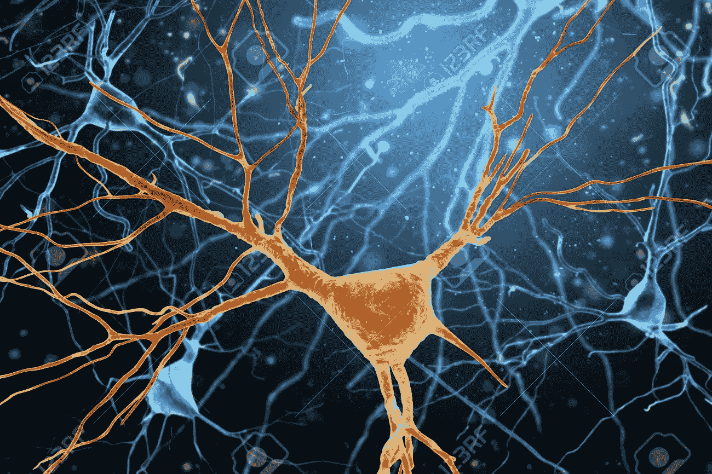

如果你是 21 世纪的工程师，你可能不能忽视神经网络。我们大多数人通常都知道神经网络的基础知识，但我们很少努力去理解它背后的数学和它实际上是如何工作的，主要原因是它太令人生畏和极其复杂。

本文的假设——你对神经网络有基本的了解，并依稀记得第十标准微分学。让我们从我们都熟悉的东西开始。最著名的线性方程。

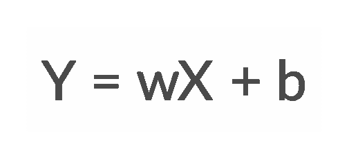

现在，让我们用神经网络的形式来表示它。忠太..

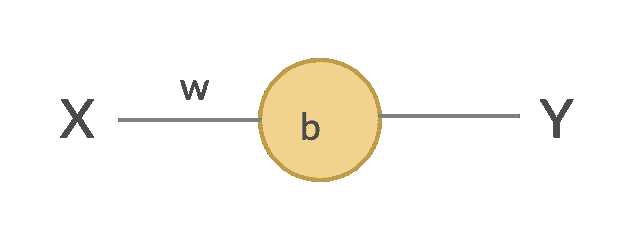

这是理解神经网络的最重要的部分之一——它只是我们线性方程的不同表示。当我们将一个输入(X)传递给系统时，它会将其乘以一个权重(w ),并添加一个偏差(b ),然后给出一个预测(Y)。仅此而已！现在让我快速介绍几个概念。

 [## 人类的未来是基因工程和神经移植|数据驱动投资者

### 领先的技术、音乐和电影节将于 2020 年 3 月 13 日至 22 日举行。它将以前沿的谈话为特色…

www.datadriveninvestor.com](https://www.datadriveninvestor.com/2020/01/13/the-future-of-humanity-is-genetic-engineering-and-neural-implants/) 

## 激活功能

上述等式的唯一问题是，Y 可以有任何范围的值，取决于 X、w 和 b。因此，为了将输出值控制在 0-1 之间，让我们在神经元上添加一个函数。这就是所谓的激活功能。其中最著名的是 sigmoid 函数。

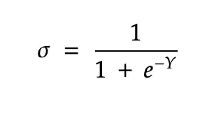

这就是我们新的神经网络在激活函数下的样子。

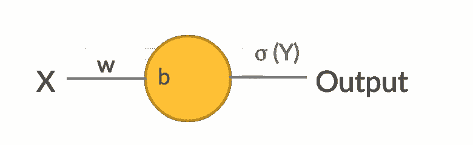

## 训练和测试集

这些是我们希望用来训练模型的实际值。这通常是这样的格式— (X，Y)。所以，当你把 X 输入系统时，你应该得到 Y 作为输出。

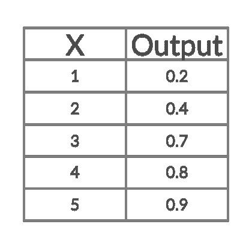

## 价值函数

简而言之，就是你的预测产出值和实际产出值之间的差异。通常以均方误差计算。

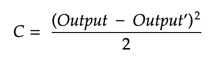

> 我们使用神经网络的目的是什么？

所以，我们通常会得到训练集和测试集。目标是找出 **w** 和 **b** 使得成本函数最小。这是通过**反馈**实现的。

那么，让我们从基本的数学计算开始。

## 迭代 1

*取 X = 1，输出= 0.2*

首先我们从假设开始，*假设 w = 2，b = 1。*

因此，我们得到了 0.95，但我们期望输出是 0.2。因此，成本函数是:

现在，我们想看看如何改变 **w** 和 **b** 来减少 **C** 。(我们的目标，记住！).我再重复一遍，那么，基本上我们应该怎么改变 w/b，这样 C 才会改变。想起来了吗！是的，那正是微分学！

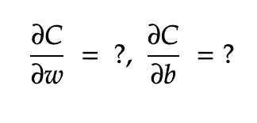

让我们来看第一项。

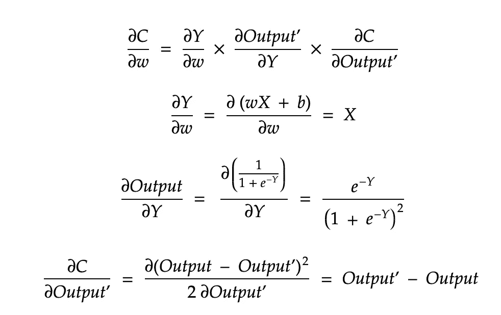

第 1 行:通过链式法则，在右边增加了一些术语。想想还是那个表情。

第 2-4 行:现在，让我们试着分别简化右边的每个术语。这些只是应用的差分计算规则。我强烈建议你重温一下规则，以便更好地理解上面的内容。这很简单，如果你还记得的话。

同样，对 b 重复这个过程。

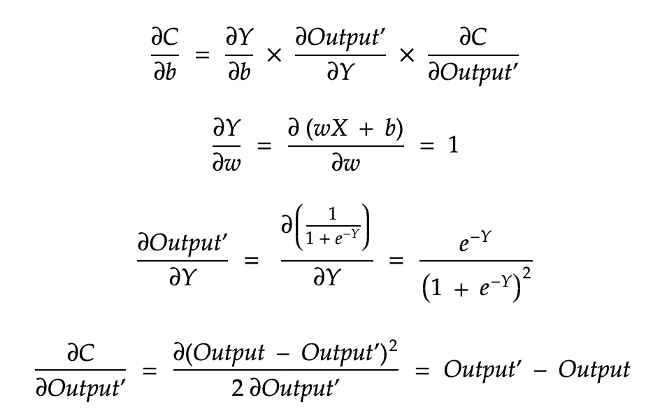

所以，变化的最终价值是。

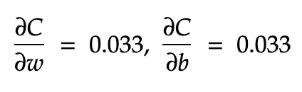

这是我们得到的零钱。所以，让我们改变 w 和 b，通过减去上面的值。我们取学习率= η = 0.5。基本上，我们添加学习率以确保我们不会过多地更新 w 和 b。

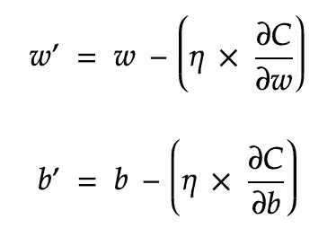

所以 tada，新的值 w = 1.98，b = 0.98

现在，对训练集的其他值重复这个过程，并不断更新 w 和 b。这就是我们所说的使用反向传播的随机梯度下降。

所以，这个博客就写到这里吧！这里，我试图用最简单的神经网络来简要解释反向传播实际上是如何工作的。然而在现实世界中，我们从来没有这么简单的神经网络。在这里，我们有许多神经元、权重和偏差，但总体思路是一样的。

**进入专家视角—** [**订阅 DDI 英特尔**](https://datadriveninvestor.com/ddi-intel)