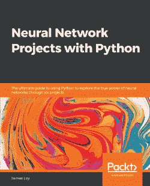
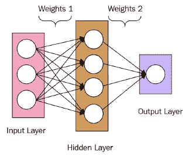

# 使用 Python 的神经网络项目

> 原文：<https://medium.datadriveninvestor.com/neural-network-projects-with-python-9f2f1914e02a?source=collection_archive---------7----------------------->



我最近偶然发现了一个很棒的资源，James Loy 的使用 Python 的 [*神经网络项目。我对神经网络及其应用非常着迷，并一直在寻找新的项目。这本书非常适合我的技能水平和兴趣，它还附带了一个很棒的*](https://www.packtpub.com/product/neural-network-projects-with-python/9781789138900) *[github 库](https://github.com/packtpublishing/neural-network-projects-with-python)，里面有完整的代码和解决方案。*

第一章相当容易理解，因为它通过一个简单的预测问题来介绍基本的神经网络结构。它还介绍了如何为这本书的项目设置必要的文件和下载环境，这对初学者来说非常好。



Basic neural network architecture from the text

第一章使用 iris 数据集，这是教授数据科学初学者的常用工具。它一步一步地指导读者如何在熊猫数据框架中使用基本的神经网络以及其他数据清理和处理技术来制作预测算法。

这是我的个人代码，是我从书上找到的，是一个简单的神经网络，用来预测数组的值。这是一个 keras 神经网络。

在[1]中:

```
**from** **keras.models** **import** Sequential
model=Sequential()
```

在[2]中:

```
**from** **keras.layers** **import** Dense
*# Layer 1*
model.add(Dense(units=4,activation='sigmoid',input_dim=3))
*# Output Layer*
model.add(Dense(units=1, activation='sigmoid'))
```

在[3]中:

```
model.summary()Model: "sequential_1"
_________________________________________________________________
Layer (type)                 Output Shape              Param #   
=================================================================
dense_1 (Dense)              (None, 4)                 16        
_________________________________________________________________
dense_2 (Dense)              (None, 1)                 5         
=================================================================
Total params: 21
Trainable params: 21
Non-trainable params: 0
_________________________________________________________________
```

在[4]中:

```
**from** **keras** **import** optimizers
sgd = optimizers.SGD(lr=1)
model.compile(loss='mean_squared_error',optimizer=sgd)
```

在[5]中:

```
**import** **numpy** **as** **np**
np.random.seed(9)
```

在[6]中:

```
X=np.array([[0,0,1],
          [0,1,1],
          [1,0,1],
          [1,1,1]])
y=np.array([[0],[1],[1],[0]])
```

在[7]中:

```
model.fit(X,y,epochs=1500,verbose=**False**)
```

Out[7]:

```
<keras.callbacks.callbacks.History at 0x1fe78596438>
```

在[8]中:

```
model.predict(X)
```

Out[8]:

```
array([[0.05130606],
       [0.9488281 ],
       [0.9468576 ],
       [0.0471536 ]], dtype=float32)
```

因此，正如我们所见，考虑到我们的输入数据，预测不会太离谱。这是一个非常容易制作的神经网络，它运行了 1500 次迭代，最终预测了上述结果。我们可以使用 scikit-learn 对这类数据运行几种类型的回归，但对于更复杂的数据集，神经网络可能是更好的选择。

我将继续阅读本书的其他章节，并在以后的帖子中提供我的代码示例。总的来说，我不得不强烈推荐这本书给那些想为神经网络和相关项目提高技能的人。