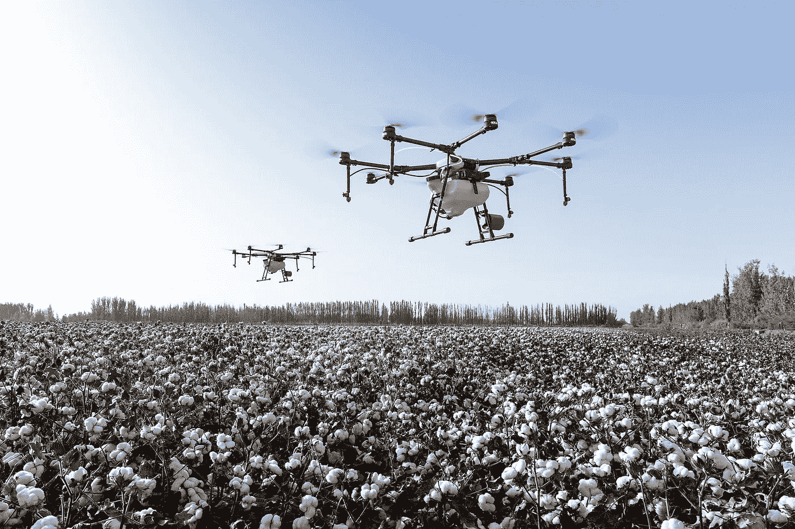
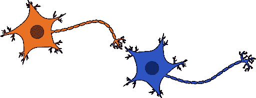
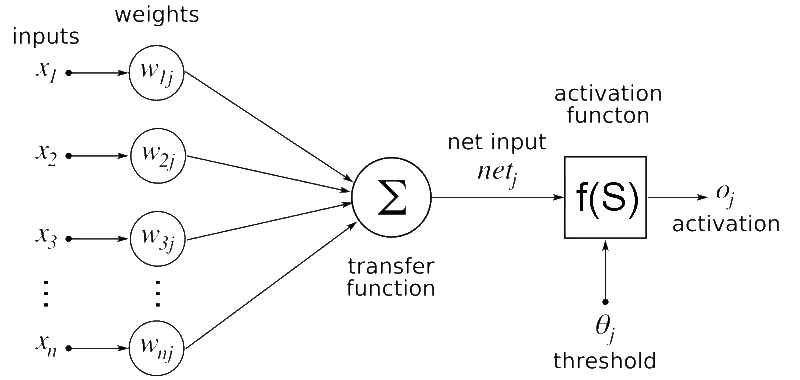
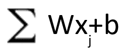
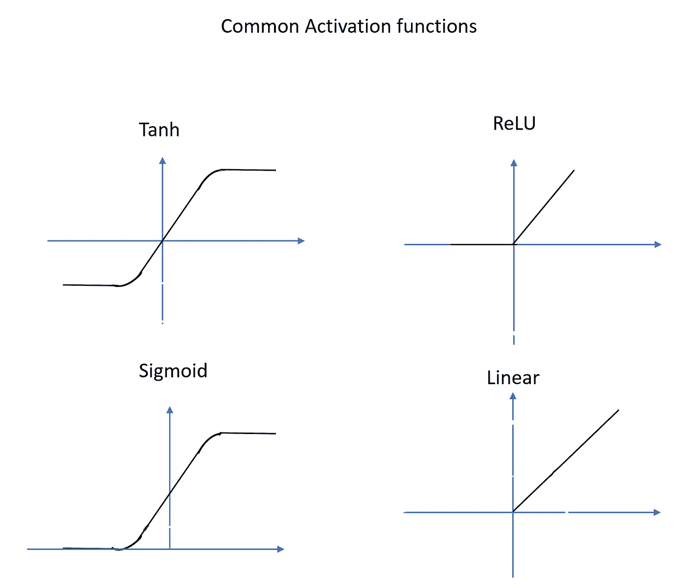
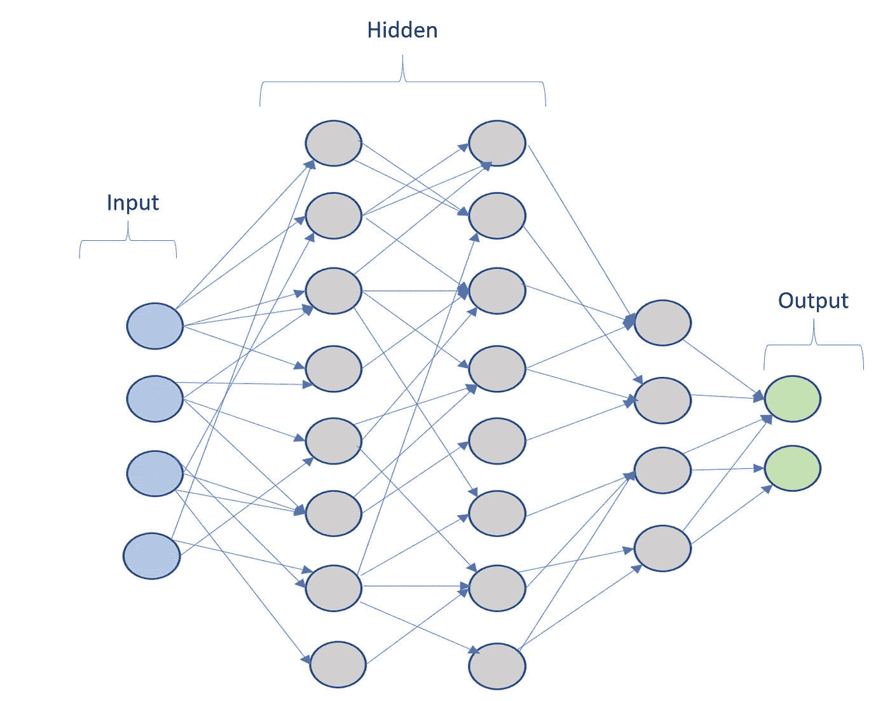

# 神经网络 101

> 原文：<https://medium.datadriveninvestor.com/neural-networks-101-51d065996717?source=collection_archive---------19----------------------->

Image courtesy commons.wikimedia.org

"我们将绘制出整个物体世界的地图."伊利诺伊大学的费-李非教授在 2006 年向她的小组宣布。这与其他人采取的方法完全不同。

20 世纪 90 年代，一个人决定下载整个互联网，听起来很疯狂，真的很疯狂。这个想法形成了谷歌的基础，并永远改变了我们与互联网的合作方式。神经网络的第一项工作可以归功于感知算法。它是弗兰克·罗森布拉特于 1958 年在康奈尔航空实验室发明的。但是，人工智能和神经网络都失去了兴趣和投资，进入了人工智能的冬天。几十年来没有太大进展。

在 2009 年，费和她的团队的努力表现为一个 ImageNet 数据集。Geoffrey Hinton 基于 ImageNet 的物体识别的开创性工作。这些事件推动了人工智能的繁荣，并重新引起了人们对神经网络的兴趣。

# 为什么是神经网络？

Photo by Markus Spiske from Pexels

很明显，人工智能是当今发展最快的领域之一，特别是神经网络能为我们做什么？

有几种机器学习方法可用。每种方法都有自己的优势。但是，神经网络非常擅长解决以下问题。

## 非结构化数据处理

考虑一个预测房价的例子。我们可能有信息，如卧室的数量，房子的大小，城市，位置，新的，翻修等。这是非常好的结构化数据，许多技术可以很好地预测价格。

现在考虑一个语音识别的问题。没有我们能够定义的清晰的特性集。这是非结构化数据的一个很好的例子。这个世界充满了非结构化数据问题。

神经网络尤其擅长从非结构化数据中学习和执行。例如，如果我们必须识别汽车、卡车和狗。神经网络是这项工作的技术。

## 复杂问题解决

神经网络尤其擅长处理复杂的解决方案。神经网络具有复合几层的能力。这使得神经网络能够管理大量的排列和组合。他们还可以在数据模糊、矛盾或不完整的情况下做出决策。想一想在拥挤的道路上你需要决定是减速还是超车的情况。

## 非线性问题解决

神经网络特别适用于非线性问题。比如说物体识别。如果我们需要训练人工智能来区分猫和狗。

## 并行执行

神经网络可以在并行执行平台上训练和运行。他们可以利用 GPU(图形处理单元)和 TPU(张量处理单元)。神经网络技术只需要很少或不需要修改代码就可以做到这一点。并行执行使神经网络能够在大型数据集上进行训练。这使他们能够解决复杂的问题。

# 神经网络在哪里被使用？

神经网络有一系列的应用，并且每天都在增长。神经网络的一些显著应用如下:

Image Courtesy Pixbay.com

**自动驾驶汽车**

神经网络最受欢迎的应用是在无人驾驶汽车上。神经网络最擅长对象跟踪和分类。受欢迎的汽车制造商特斯拉用神经网络识别他们的自动驾驶解决方案。https://www.tesla.com/autopilotAI[。](https://www.tesla.com/autopilotAI)

**无人机**

无人机已经迅速从技术演示者转变为现实世界的解决方案。如今，无人驾驶飞机被用于农业、安全、勘探等各个领域。对象识别和模式识别能力有助于神经网络在这些领域表现出色。

**监控系统**

神经网络也广泛用于监控系统。例如网络监控、系统监控。神经网络可以监控系统，也可以修复系统。假设如果用于太空探索。这些系统必须进行监控和自我修复。

**基于语言的系统**

神经网络非常擅长处理非结构化数据。语言在很大程度上也可以认为是非结构化数据。神经网络再次擅长处理和生成自然语言。这在各种各样的应用中使用，从对话机器人，翻译等等。

**模式检测(欺诈、交易等)**

神经网络也广泛用于安全应用。神经网络可以从大量变量中学习并识别模式。这用于欺诈检测、异常检测等。

# 人工神经网络到底是如何工作的？

Image courtesy commons.wikimedia.org

人工神经网络受到生物神经网络的启发。让我们考虑一个简单的生物神经网络的观点。

生物神经网络由数十亿个被称为神经元的细胞组成。神经元有连接其他神经元的长分支。神经元通过这些分支接收和发送被称为突触的信号。当一个神经元接收到一个信号，他们处理这个信号。基于阈值决定是否传递信号。一起放电的一组神经元形成了一种模式。这有助于解决一个问题，例如当一个人在野外看到一只老虎。

现在让我们考虑人工神经网络的情况，

Image courtesy commons.wikimedia.org by Geetika Saini

考虑来自人工神经网络的单个神经元。它有以下几个部分，

输入

砝码

转移函数

激活功能

输出

一个神经元可以有一个或多个输入。使用下面的简单线性方程处理输入。

这里 W 是输入的权重，b 是偏差因子。在学习过程中，神经网络通过改变 W 和 b 值进行学习。该方程是线性的，非线性分量由激活函数引入。激活函数决定神经元传递什么输出值。有几种常用的激活函数，下面是一个例子。

当这些简单的神经元被分成几层时，它们可以学习和解决复杂的问题。

# 神经网络的主要类型

有不同种类的神经网络来解决不同的问题。一些常见的神经网络如下。

## 正向输送

这些是最简单的一种神经网络，其中的连接没有形成一个环。连接仅向前移动。尽管配置很简单，但它们可以有效地解决复杂的问题。

## 卷积神经网络(CNN)

这些神经网络最常用于图像处理。CNN 有简化和提取信息图像的层。这些可以做物体检测和跟踪。

## 递归神经网络(RNN)

利用 RNN，每一层接收当前输入和来自前一层的记忆或隐藏状态。RNN 承载上下文，在语言解决方案和其他应用中非常有效。

## 长/短时记忆(LSTM)

这些网络能够学习或记忆预测问题中的顺序依赖性。这使得它非常适合涉及 IoT(物联网)的应用。

关于神经网络类型的更详细的讨论可以在这里找到，

[https://en . Wikipedia . org/wiki/Types _ of _ artificial _ neural _ networks](https://en.wikipedia.org/wiki/Types_of_artificial_neural_networks)

# 构建神经网络解决方案

我们很少有好的深度学习平台。这些使我们能够容易地建立基于神经网络的解决方案，

## 张量流

TensorFlow 是一个端到端开源的深度学习平台。TensorFlow 是当今最流行的深度学习平台。它由 Google 开发，由 Google 内部用于几个产品。TensorFlow 可以用 Python、C++和 r 之类的语言编程。

TensorFlow 拥有优秀的文档和充满活力的社区。这使得它成为神经网络平台的首选。

https://www.tensorflow.org/learn

## PyTorch

PyTorch 是一个开源的机器学习框架，它加速了从研究原型到生产部署的过程。PyTorch 也是最受欢迎的深度学习平台之一。PyTorch 支持一个叫做动态图的概念(TensorFlow 1.0 中不支持)。这使得 PyTorch 更容易理解调试和构建。PyTorch 可以用 Python 编程。这个平台得到了脸书和一个相当大的社区的支持。

[https://pytorch.org/tutorials/](https://pytorch.org/tutorials/)

## 微软认知工具包(CNTK)

微软认知工具包(CNTK)是一个用于商业级分布式深度学习的开源工具包。众所周知，这是高度可扩展和分布式的。可以使用 Python、C#和 C++对 CNTK 进行编程。CNTK 背靠微软，将 will 与微软 Azure 整合。

https://docs.microsoft.com/en-us/cognitive-toolkit/

# 结论

人工智能作为一个整体和神经网络已经走出了人工智能的冬天，并在现实世界中找到了广泛的适应性。如今，神经网络对企业和开发者来说都是一种竞争优势。你会想买一张票，和神经网络一起进入激动人心的新未来。