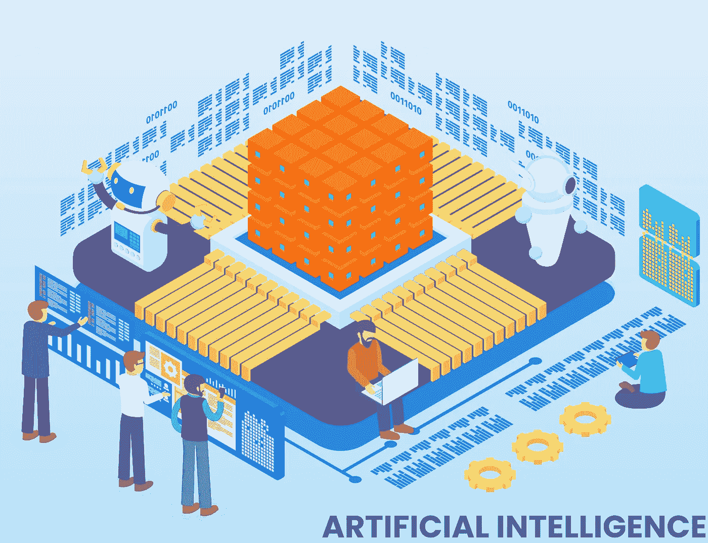

# 神经网络——人工智能如何影响现代数字世界

> 原文：<https://medium.datadriveninvestor.com/neural-networks-how-artificial-intelligence-impacts-the-modern-digital-world-a980bb688124?source=collection_archive---------12----------------------->

Image from [Envato](https://elements.envato.com/isometric-artificial-intelligence-vector-concept-4MAANFB)

如今，企业面临着处理大量数据的需求。他们分析的质量和速度决定了决策的有效性和客户支持的水平。人工智能技术有助于应对日益增长的信息流。它们基于深度机器学习算法，结合了某些类型的神经网络。人工智能、机器学习和其他智能技术被用于各种行业。

## 什么是神经网络？

人工神经网络(ANN)或连接主义系统是由构成动物大脑的生物神经网络模糊启发的计算系统。这种系统通过考虑例子来“学习”执行任务，通常没有用特定于任务的规则来编程。

现在出现了一个认识到人工智能在产品中有多么有用的机会。这只能归功于不断增长的大数据量，大数据积累了足够多的信息，并创造了快速分析的手段。

# 工业中使用以下类型的神经网络:

## 卷积神经网络(CNN)

它们模仿大脑视觉皮层的工作，部分完成抽象思维的功能。它们完美地应对了图像识别的任务，它们的计算很容易在 GPU 上并行化，这使得你可以创建具有 AI 元素的相对廉价的硬件平台。

卷积神经网络用于无人驾驶车辆、商用无人机、机器人的机器视觉系统，以及视频监控系统。如果你在智能手机的设置中启用了面部识别，你也可以每天使用 CNN。

## 递归神经网络

它们具有短期记忆，因此可以很容易地分析任意长度的序列。rnn 将数据流分成基本部分，并评估它们之间的关系。这些算法主要用于手写和语音识别。当你在 Shazam 中搜索一段旋律，与 Siri 聊天，Google Now，为 Cortana 手写留下笔记——在云平台上，这里使用的是递归神经网络。

**具有长期和短期记忆的网络(LSTM)** 成为 RNN 的进一步发展。它们有助于通过外推法预测变化(例如，汇率或消费者需求)。它们也用于自然语言的深入分析。例如，谷歌在谷歌翻译的个人助理和机器翻译系统中使用 LSTM。如果没有 LSTM，翻译质量将停留在 90 年代的程序水平，有时自己翻译文本比纠正大量错误更容易。

**门控循环单元(GRU)** 是对 RNN 模型相对较新的修改，于 2014 年出现。它们被用来合成语音，语音带有感情色彩，听起来像真的一样。例如，在谷歌 Duplex 和微软 XiaoIce 服务的测试中，人们无法区分会说话的机器人和实时对话。值得关注的是，XiaoIce 让微软在亚洲市场站稳了脚跟，语言障碍一直制约着公司的发展。

## 深度神经网络(DNN)

这是任何超过三层的网络。它们是深度机器学习机制的基础，可以发现异构数据之间的隐含关系。一个突出的例子是使用 IBM Watson 在大量科学文章中搜索疾病发展和各种潜在因素之间的相关性。

## 生成对抗网络

gan 是神经网络的组合，其中一个生成选项，另一个消除它们(充当仲裁器)。这种结合允许在没有老师的情况下实现机器学习，增加了 AI 的自主性。这些类型的网络包括两个在游戏中相互竞争的神经网络(在博弈论的意义上，经常但不总是以零和游戏的形式)。给定一个训练集，这种技术学习生成具有与训练集相同的统计数据的新数据。举例来说，受过摄影训练的甘，可以制作出新的照片，至少在人类观察者看来，表面上是真实的，具有许多逼真的特性。虽然 gan 最初是作为无监督学习的生成模型的一种形式提出的，但是它们已经被证明对于半监督学习、完全监督学习和强化学习是有用的。

例如， [PixelDTGAN](https://github.com/fxia22/PixelDTGAN) 为在线商店的目录生成衣服、鞋子和配件的单独图像。作为输入数据，照片被用于模特展示这些衣柜物品。迄今为止，拍摄服装目录被认为是电子商务中成本相当高的一部分。尽管如此，在未来几年，神经网络仍有可能在不吸引摄影师的情况下快速展示目录。

处理照片也需要很多时间。通过使用另一个神经网络来添加和删除图形对象，您可以尝试更快地做到这一点。类似的 DRAGAN 神经网络已经用于自动渲染动画角色和卡通。它可以让你加快新系列的发布速度，并保持娱乐频道的观众，而不会让动画师负担过重。GANs 允许你将一个人的三维模型制作成动画，并将另一个人的动作实时传输到其中。最初的结果看起来不太令人信服，但任何神经网络的特点是，它会随着每一条新数据而改进。

Image from [Envato](https://elements.envato.com/robots-hand-typing-on-keyboard-W8CUP4S)

## 哪些行业领袖使用 AI？

**谷歌在其所有服务中使用神经网络**——从在线搜索和邮件过滤到选择 YouTube 上的视频和翻译文本。与旧的机器翻译模型不同，谷歌神经网络在识别语言模式时几乎可以使用无限量的数据。他们可以识别更多的语义联系，并通过不断的学习每次都改善结果。

自 2001 年以来，谷歌**已经使通过图片**进行搜索成为可能，但起初，一个简单的元数据分析被用于此。也就是说，搜索是根据图像的文本描述进行的，这通常是不准确的。这项服务的现代版本使用了一个图形文件自动分类系统。它建立在递归和卷积神经网络的结合上，所以你可以在其中搜索相似的图像，按类型排序，甚至找到没有文本注释的图形文件。

对于与不同国家的客户合作的大公司来说，谷歌云语音转文本已经成为真正的魔法。超越本土区域的边界总是对技术支持的组织提出很高的要求。如果以前需要开设地区分支机构或雇佣翻译，现在这项服务可以集成到呼叫中心解决方案中。它支持应用程序编程接口，并有助于使用神经网络模型将对话记录转换为文本。目前，它可以识别 120 多种语言，并继续学习新的语言。

**ABBYY** 使用一个框架，为软件开发人员提供强大的深度学习和传统的机器学习算法，用于创建推动数字化转型的应用。

开发人员可以使用 ABBYY 的开源 [NeoML](https://www.abbyy.com/neoml/) 来构建、训练和部署用于对象识别、分类、语义分割、验证和预测建模的模型，以实现各种业务目标。例如，银行可以开发模型来管理信贷风险和预测客户流失，电信公司可以分析营销活动、零售和快速消费品(FMCG)的表现，通过面部识别和数据验证来建立远程客户身份。该框架的一个关键优势是它显著提高了可用云资源的使用效率。

NeoML 由 ABBYY 工程师用于计算机视觉和自然语言任务，包括图像预处理、分类、文档布局分析、OCR 以及从结构化和非结构化文档中提取数据。

NeoML 是一个通用工具，用于处理和分析各种格式的数据，包括文本、图像、视频等。它支持 C++、Java 和 Objective-C 编程语言；Python 将很快加入。NeoML 的神经网络模型支持 100 多种层类型。它还提供 20 多种传统的 ML 算法，如分类、回归和聚类框架。该库完全跨平台，是一个可以在所有流行的操作系统上运行的单一代码库，包括 Windows、Linux、macOS、iOS 和 Android，并针对 CPU 和 GPU 处理器进行了优化。

 [## ABBYY NeoML:我们如何创建开源机器学习库以及我们为什么需要它

### 该框架为软件开发人员提供了强大的深度学习和传统的机器学习算法…

towardsdatascience.com](https://towardsdatascience.com/abbyy-neoml-how-we-made-the-open-source-machine-learning-library-and-why-we-need-it-dc0a13e4c3f) 

**LinkedIn 在**中使用神经网络结合线性文本分类器来分析通过其平台分发的所有记录。正如 LinkedIn AI 副总裁 Deepak Agarwal 解释的那样，这种组合有助于更有效地检测垃圾邮件和攻击性内容，并选择最佳的个性化推荐。

**脸书**使用类似的神经网络文本分析算法。它叫做 **DeepText** ，主要用于定向广告。此外，脸书使用[卷积神经网络进行人脸识别，使用生成-对抗网络进行图像处理。](https://research.fb.com/publications/eye-in-painting-with-exemplar-generative-adversarial-networks/)举个例子，如果一个人在一张照片里眨眼，那么来自的甘会发现他睁着眼睛的形象，并以此类推，对失败的照片进行修饰。可供分析的用户画像越多，结果就越准确。

特斯拉在其专有的**自动驾驶系统中使用了 DNN 套件。**它们实时识别机器周围的所有物体，对它们进行分类，并确定特征。由于数据流的增加，第九版的自动驾驶仪比第八版复杂了四倍。八个摄像头变成了八个摄像头，分辨率也提高了。这就是特斯拉 Autopilot v.9 的样子。

**反病毒开发者**使用各种神经网络来搜索信息安全的新威胁。它们有助于识别恶意文件的未知修改和新型网络攻击。以下是赛门铁克 ICSP 神经演示:

有一段时间，人工神经网络只适用于大公司。然而，近年来出现了许多负担得起的解决方案、现成的开发工具和云服务，它们很容易适应您的任务。例如，IBM 为 Watson Studio 发布了一个[测试版的神经网络建模器。该工具允许您在开发用于处理图像、文本和音频文件的 DNN 架构时使用可视化方法，而无需编程技能。](https://www.ibm.com/cloud/watson-studio)

2018 年 3 月，微软推出了 Project Brainwave，这是一种基于英特尔的现场可编程门阵列(FPGA)硬件和软件系统，使神经网络更容易实时识别和分类物体。现在，这个平台被用于 Bing 品牌的搜索引擎，将查询处理速度提高了一个数量级。它也正在由微软的一个合作伙伴在一个自动光学缺陷检测系统中进行测试，以加快装配线的装配。

2018 年 11 月，英特尔推出了[神经计算棒 2](https://newsroom.intel.com/news/intel-unveils-intel-neural-compute-stick-2/) ，新一代神经网络紧凑型加速器。凭借闪存驱动器的大小，英特尔 NCS2 可以连接到任何设备的 USB 端口。对于复杂的任务，你可以同时使用几个这样的加速器，它们的数量可以随时改变，这简化了人工智能技术的分阶段实施。

神经网络可以帮助公司优化业务运营，改善预测和客户体验。最终，它们提供了通过对所有可用数据进行更深入的分析来提高竞争力的机会。客户的期望不断增长，他们选择基于人工智能的服务，因为它们可以更快、更充分地满足他们的需求。