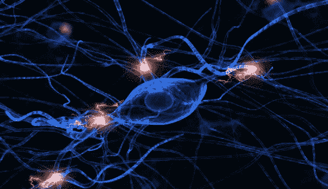

# 神经网络。你需要知道什么？

> 原文：<https://medium.datadriveninvestor.com/neural-networks-what-you-need-to-know-90ce3b94ab8b?source=collection_archive---------17----------------------->

先说神经网络。我们将用一种简单的方式来展示复杂的信息，即使是一个孩子也能理解。我们学习了基础知识，并从头开始钻研这个话题。

机器学习、数据科学、神经网络——这些领域不仅非常有趣，而且相当复杂。先解释一下是什么，说说基本概念。

# 神经元

…是神经网络的基本单元。每个神经元都有一定数量的输入，这些输入接收信号，考虑到每个输入的重要性(权重),对这些信号求和。接下来，信号被送到其他神经元的输入端。每个这样的“结”的权重可以是正的也可以是负的。例如，如果一个神经元有四个输入，那么它就有四个可以相互独立调整的权重值。

人工神经网络模仿自然神经网络(人脑)的操作，用于创建具有人工智能的机器。一般来说，为了教授人工智能，你需要一个“老师”——一组具有某些参数、值和指标的信息。

 [## 挑战你对人工智能和社会看法的 4 本书|数据驱动的投资者

### 深度学习、像人类一样思考的机器人、人工智能、神经网络——这些技术引发了…

www.datadriveninvestor.com](https://www.datadriveninvestor.com/2019/02/28/4-books-on-ai/) 

# 化合物

…将神经元相互绑定。权重值与连接直接相关，训练的目标是更新每个连接的权重，以便将来不会出现错误。

# 排水量

…是神经元的附加输入，它始终为 1，因此有自己的权重。这确保了即使当所有输入都为零时，神经元也将是活跃的。

# 激活功能

…用于将非线性引入神经网络。它决定了神经元的输出值，该值取决于输入的总值和阈值。这个功能还决定了哪些神经元需要被激活，因此，哪些信息将被传输到下一层。由于激活功能，可以训练深层网络。

# 输入层

…是神经网络中的第一层，它接收传入的信号并将其传递到后续级别。

# 隐藏(计算)层

…对输入数据应用各种变换。隐藏层中的所有神经元都与下一层中的每个神经元相关联。

# 输出层

…是网络中从最后一个隐藏层接收数据的最后一层。有了它，我们可以在期望的范围内得到正确的数值。

# 重量

…代表神经元之间连接的强度。例如，如果节点 1 和 3 的连接的权重大于节点 2 和 3 的权重，这意味着神经元 1 对神经元 3 具有更大的影响。零权重意味着输入变化不会影响输出。负权重表示增加输入将减少输出。权重决定了输入对输出的影响。

# 直接传播

…是将输入值传输到神经网络并接收输出的过程，该输出称为预测值。当输入值被传送到神经网络的第一层时，该过程不进行任何操作就通过了。网络的第二级接受第一级的值，并在乘法和激活操作之后进一步传递这些值。同样的过程发生在更深层。

# 反向误差传播

直接分布后，我们得到一个值，叫做预测值。为了计算误差，我们使用损失函数将预测值与实际值进行比较。然后，我们可以计算神经网络中每个权重的误差值的导数。
反向传播法使用微分法则。梯度(误差值的导数)由神经网络最后一层的权重值(误差信号以与信号直接传播相反的方向传播)计算，并用于计算层梯度。重复该过程，直到计算出神经网络中每个权重的梯度。然后，从权重值中减去梯度值以减小误差值。这可以让你实现最小的损失。

# 学习速度

…是在神经网络训练期间使用的特征。它决定了反向传播过程中权重值的更新速度。学习速度要快，但不能太快，否则算法会发散。如果学习速度太低，算法会收敛很长时间，陷入局部极小值。

# 趋同；聚集

…是一种现象，在迭代过程中，输出信号变得更接近某个值。为了避免重新训练(由于高速度导致的新数据问题)，使用正则化-在保持参数的同时降低模型的复杂性。在这种情况下，损失和权重向量(在该算法中被研究的参数的向量)被考虑。

# 数据标准化

…是在 0 到 1 的范围内改变一个或多个参数标度的过程。如果您不知道数据是如何分布的，应该使用这种方法。同样，在它的帮助下，你可以加快学习速度。

值得一提的是全连接层这一术语。这意味着一层中所有节点的活动会传递到下一层中的每个节点。在这种情况下，层将完全连接。

使用损失函数，可以计算训练的特定部分的误差。这是学习函数的平均值:

*   “MSE”——二次误差
*   ‘二元交叉熵’—用于二元对数
*   '分类交叉熵'—用于多类对数

为了更新比例，模型使用优化器:

*   SGD(随机梯度下降)优化动量。
*   RMSprop —根据 Jeff Hinton 方法自适应优化学习速度。
*   Adam 是一个自适应矩分数，它也使用自适应学习速度。

性能度量用于测量神经网络性能。准确度、损耗、验证准确度、评估只是其中的一些指标。

# 完全连接的层

…是每次迭代的训练例子的数量。批量越大，需要的空间就越大。

# 纪元的数量

…显示模型接受学习的次数。Epoch 是所有学习示例向前或向后的一个通道。

# 人工神经网络

那么什么是**人工神经网络**？这是一个相互作用的神经元系统。每个神经元接收信号或将信号发送给其他处理器(神经元)。团结在一个大网络中，正在学习的神经元可以执行复杂的任务。

*最初发表于*[T5【https://geniusee.com】](https://geniusee.com/single-blog/neural-networks)*。*