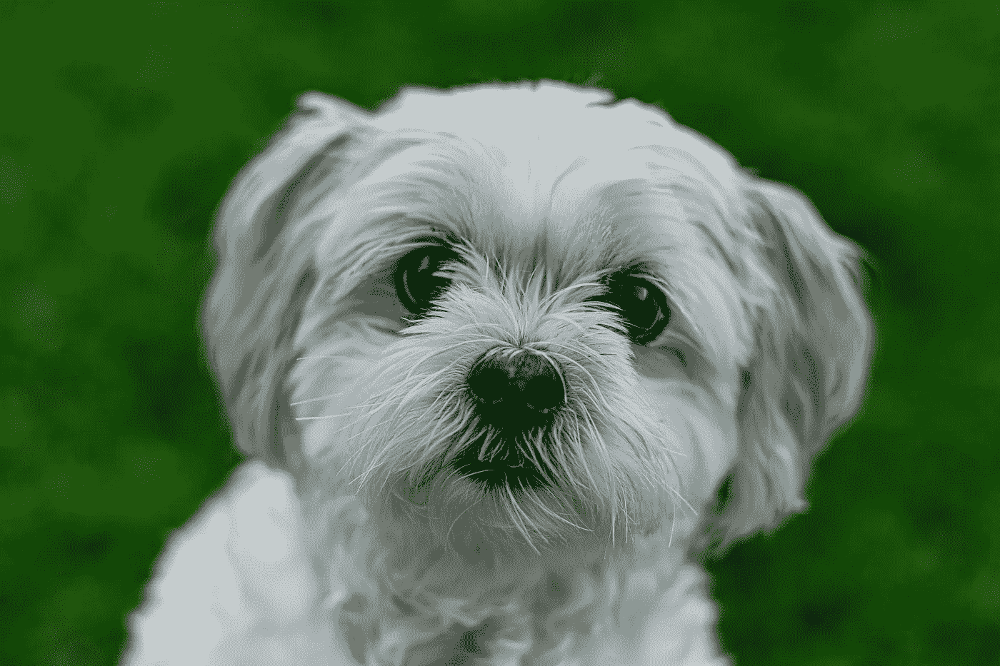
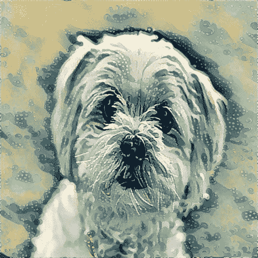

# 神经风格转移(人工智能在艺术中)与克拉斯和 TF2

> 原文：<https://medium.datadriveninvestor.com/neural-style-transfer-ai-in-art-with-keras-and-tf2-34392aeaeb39?source=collection_archive---------9----------------------->

考虑到艺术在过去几年里在不同领域取得的进步，人工智能在艺术中是不可避免的。我们在人工智能方面取得的一切总是让我惊叹不已，但深入了解这些组件如何产生像艺术中的人工智能这样的想法，比想法本身更令人惊叹。

在这篇文章中，我想以最简单的方式强调如何实现风格转换，这是一个在艺术中使用人工智能来实现一些惊人的美丽效果的概念。

## 内容

1.  什么是风格转移？
2.  我们将使用什么？
3.  我们从哪里开始？
4.  深度学习模型
5.  损失函数
6.  计算渐变
7.  最佳化
8.  对结果图像进行反向预处理
9.  来源和信用

## W 什么是风格转移？

风格转移是一个基本上在另一个图像上采用一个图像的视觉风格的概念。让我们举一个经典的例子，一张[葛饰北斋](https://en.wikipedia.org/wiki/Katsushika_Hokusai)的大波浪图像作为参考风格图像，一张狗图像作为内容图像组合在一起应该导致狗图像以大波浪图像的风格显示。

Content Image

Style Image

现在不再多说，我将向你展示如何创建这个程序，我相信你会发现，考虑到许多人对人工智能或深度学习表现出的神秘感，这并不困难。

 [## 人工智能和监督资本主义|数据驱动的投资者

### 大科技，总是现在:人工智能推动的大科技，已经使购物，搜索，在你的…

www.datadriveninvestor.com](https://www.datadriveninvestor.com/2020/03/04/on-artificial-intelligence-and-surveillance-capitalism/) 

## 我们将使用什么？

对于这个应用程序，我们将使用 Keras 进行后端和深度学习模型，使用 PIL 进行图像处理，使用 scipy 进行优化算法，使用 time 查看我们的训练过程每次迭代需要多长时间。

**但是我不知道 Keras。我该怎么办？**

即使你不熟悉 Keras，你也应该能够理解这一点，因为它的语法很简单，我会尽最大努力用尽可能简单的语言解释代码。

## 我们从哪里开始？

我们将使用 Jupyter 笔记本，因此让我们导入一些基本的必需品，以及我们想要在环境中使用的图像。

Importing headers and the images

我们将这些图像转换成 numpy 数组。我们将为这些 numpy 数组添加一个额外的维度，以便我们创建一个包含内容、风格和组合数据的张量，用于深度学习模型。

因为我们将使用预训练的 VGG16 模型，所以我们需要对输入图像进行一些预处理。我们将使用图像网络数据集预先计算的平均值减去每个 RGB 通道。

现在反转 RGB 到 BGR，以匹配架构 VGG16，这是写在咖啡馆。

我们现在把每个变量转换成张量。我们还创建了组合变量来保存创建时的组合图像。如前所述，我们将所有这些张量连接起来，为深度学习模型创建一个输入张量。

## 深度学习模型

好了，在我们所有的输入准备之后，我们终于到了导入我们的深度学习模型 VGG16 并玩一些层的部分。

VGG16 模型是为分类问题而创建的，但我们没有这样做，所以我们不需要一些负责分类的称为全连接层的层。我们可以通过使用 include_top 参数来排除它们。创建一个字典，如代码片段的最后一行所示，通过层名访问每个层。

VGG16 模型的计划是让模型“理解”图像的特征。我们利用这一点来找出内容图像和组合图像之间以及样式图像和组合图像之间的损失，并计算梯度以最小化损失。

让我们继续编写损失函数。

## 损失函数

考虑到我们之前看到的 VGG16 模型能够对图像的感知特征进行编码。我们将使用它的一些层来实现这一点。你可以在 Gatys 等人的[原始论文中读到模型层，但是我们将实现](https://arxiv.org/abs/1508.06576) [Johnson 等人【2016】](https://arxiv.org/abs/1603.08155)的层

**内容丢失**

内容图像和组合图像之间的损失就是这两个变量之间的 MSE。

Calculate content loss with the combination image.

**风格丧失**

风格损失并不完全是我们计算内容损失的方式。我们想捕捉这两幅图像的风格。我们这样做的方法是通过计算 gram 矩阵，它是样式图像变量与其转置的点积。

这种转变带来了对风格的关注，而不是对图像内容的关注。

**总变化损失**

现在，我们计算[总变化损失](https://arxiv.org/abs/1412.0035)，以增加或减少损失项中的噪声，我们将看到它是如何做到的。

但在此之前，我们需要给这三个损失一些权重，这样我们就可以改变每个损失对总损失项的影响。

让我们创建一个损失变量，把所有这些损失加起来。

## 计算渐变

我们需要的东西都准备好了。我们现在需要做的就是调用一个优化器来迭代和优化组合图像。让我们为组合变量的损失建立梯度。在这个特定的代码中，我使用 TF1，因为我喜欢梯度函数，但在 TF2 [梯度急切执行不被支持](https://github.com/tensorflow/tensorflow/issues/34235)(不确定这是一个错误还是一个功能)，所以我鼓励你尝试一下[梯度带](https://www.tensorflow.org/api_docs/python/tf/GradientTape)函数。

为了更好地理解 backend.function，看看这篇[堆栈溢出帖子](https://stackoverflow.com/questions/48142181/whats-the-purpose-of-keras-backend-function)。

我们将评估函数中的损失和梯度，以确保我们有正确的值。

为了让我们的生活更轻松，我们将创建一个类，并返回损失值和梯度值，优化器将尝试修改这些值以产生最佳结果。

## 最佳化

所以让我们编写优化部分的代码。我们将使用来自 scipy 的 [fmin_l_bfgs_b](https://docs.scipy.org/doc/scipy/reference/generated/scipy.optimize.fmin_l_bfgs_b.html) 算法。我们用随机数据创建一个变量，并将创建的图像存储在这个变量中。

optimization

## 对结果图像进行反向预处理

我们现在颠倒了我们以前的做法。将 BGR 转换为 RGB 值，我们将平均值添加到图像中。我们将我们的值裁剪为 0 到 255 个像素值。

现在我们看到了最终的图像。

Resultant image

## 来源和信用

1.  [https://harishnarayanan . org/writing/artistic-style-transfer/](https://harishnarayanan.org/writing/artistic-style-transfer/)风格转移方面最好的博客之一。感谢 Harish Narayan 如此精彩的解释。它帮助我练习风格转换。
2.  [https://keras.io/examples/neural_style_transfer/](https://keras.io/examples/neural_style_transfer/)NST 的 Keras 文档和 Keras 代码令人惊叹。

[**Github 回购本笔记本**](https://github.com/anand0427/style-transfer-with-keras) **或者从** [**本页面**](https://anand0427.github.io/style-transfer-with-keras/) **看一看笔记本。**

我想知道你对我博客的想法和看法。建设性的批评很受欢迎。如果你喜欢这个博客，你可以点击下面的按钮给我买杯咖啡。

