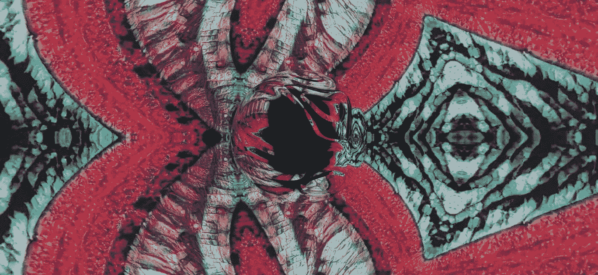

# 神经联觉:当艺术遇到甘斯

> 原文：<https://medium.datadriveninvestor.com/neural-synesthesia-when-art-meets-gans-6453c7c0c5b8?source=collection_archive---------7----------------------->

[神经共感](https://vimeo.com/neuralsynesthesia)是一个 AI 艺术项目，旨在用人工智能创造新的独特的视听体验。它通过人类和生殖网络之间的合作来做到这一点。结果感觉就像有机艺术。当面孔、风景、物体和建筑转变成音乐时，色彩和图像的漩涡融合在一起。有一种东西在独特的感觉和奇怪的熟悉感之间摇摆的感觉。

神经联觉是由在线内容创作者史云光·斯廷布鲁格创造的，他在从事脑机接口工作时在数据科学领域起步。在他的硕士论文期间，他帮助建立了一个系统，通过大脑信号对想象的运动进行分类。这个系统允许患有闭锁综合症的病人用他们的思想操纵物理物体。这次经历让 Steenbrugge 深刻认识到机器学习的重要性，以及人工智能技术创造惊人事物的潜力。

在神经联觉之外，Steenbrugge 与一家使用机器学习进行药物发现的初创公司合作，并经营着一个受欢迎的 YouTube 频道。他还在开发 [wzrd.ai](https://wzrd.ai/) ，这是一个通过人工智能的工作用沉浸式视频增强音频的平台。在这次采访中，我们谈论神经联觉的灵感，它是如何工作的，并讨论 AI 和创造力。

# 神经联觉的灵感是什么？

我一直对美学很着迷。例子有山脉全景、独立游戏设计、珊瑚礁潜水、迷幻体验和塔尔夫斯基的电影。美丽的视觉场景具有不用语言就能传达意思的力量。这几乎就像一种原始的、[视觉语言](https://www.youtube.com/watch?v=jS48PjhfKu8)我们都凭直觉说话。

当我看到生成模型(尤其是 GANs)令人印象深刻的进步时，我开始想象这会导致什么。就像相机和投影仪带来了电影产业一样，我想知道在深度学习革命的基础上可以建立什么样的叙事。为了掌握这一点，我的第一个想法是简单地调整 GANs 的现有代码库，以允许音频的直接可视化。神经联觉就是这样诞生的。

# 你为第一个神经联觉作品做了多少工作？你面临过什么独特的挑战吗？

我认为第一个渲染视频的编码花了六个多月，因为我是在业余时间做的。最大的挑战是如何使用从音轨中提取的特征来操纵 GANs 潜在输入空间。我想在视觉和听觉之间为观众创造一个令人满意的匹配。

下面是我所做的一点见解:我应用傅立叶变换从音频中提取时变频率成分。我也进行和声/打击乐分解，基本上是把旋律从音轨的节奏成分中分离出来。这三个信号(瞬时频率内容、旋律能量和节拍)然后被组合起来操纵 GANs 的潜在空间，产生由音频直接控制的视觉效果。

# 每个影像数据集都是唯一的吗？您如何为这些数据集收集图像，您需要多少图像？

我花了很多时间收集大量多样的图像[训练数据](https://lionbridge.ai/training-data-guide/)来创建有趣的生成模型。这些数据集的主要目标是美学，而不是现实主义，就像大多数 GANs 一样。尝试各种图像集合的混合是耗时的，因为 GAN 训练需要大量的计算，而我并没有一个数据中心可供我支配。

我使用的大多数数据集是我多年来遇到的图像集。我保存它们是因为我知道有一天我会用到它们。我对美学一直很感兴趣，所以当我发现什么能触发第六感的东西时，我会保存它。

大多数 GAN 论文使用超过 50，000 张图像的数据集，但在实践中，您可以使用更少的示例。第一步是从已经在大数据集上训练过的预训练 GAN 模型开始。这意味着模型中的卷积滤波器已经成形，并且包含关于视觉世界的有用信息。其次，还有[数据增强](https://lionbridge.ai/articles/data-augmentation-with-machine-learning-an-overview/)，它基本上是翻转或旋转图像，以有效地增加训练数据量。由于我并不真正关心样本的真实性，我实际上可以负担得起非常积极的图像增强。这导致训练图像比实际的源图像多得多。例如，我在泰特现代美术馆最近的一次演出中使用的模型只有 3000 幅真实图像，但经过积极扩充后，训练集达到了 70000 幅左右。

最近，许多新的研究明确提出了 gan 的低数据体制(例如您可以在这里找到、这里的和这里的)。我目前的代码库利用这些技术来训练只有几百张图片的 GANs。

# 你把神经联觉说成是你自己和 AI 之间的合作。你认为利用人工智能技术的创意项目的未来有什么样的潜力？

这实际上是整个项目中最有趣的部分。我通常会带着具体的意图出发，比如我想创造什么类型的视觉效果。然后，我整理我的数据集，调整训练脚本的参数，并开始训练模型。一次完整的训练通常需要几天时间来收敛。但是很快，模型开始返回经常是意想不到和令人惊讶的样本。这启动了一个有趣的反馈循环，我改变模型的代码，模型用不同的样本响应，我做出反应，然后继续下去。创作过程不再完全由我控制；我正在有效地与一个人工智能系统合作来创作这些作品。

我真的相信这是这种方法最大的优点:你不会被自己的想象力所限制。有一个完全陌生的系统也在影响着同一个思想空间，通常是以意想不到和有趣的方式。这将引导你作为一个创造者进入你从未独自漫游过的领域。

看着人工智能领域的巨大进步，强烈地激励我想象 10 年后可能发生的事情。毕竟现代深度学习才 8 岁！我预计摩尔定律将继续带来更强大的计算能力，人工智能模型将继续随着更多的计算而扩展，这种媒体的可能性将遵循这种指数趋势。

目前形式的神经联觉是一个原型。这是一个更宏大的想法的 0.1 版本，利用深度学习作为未来高级互动媒体体验的核心组件。

# 你对神经联觉的未来有什么样的创意作品规划？你有什么目标或者未来的计划吗？

我一直对[概览效应](https://www.youtube.com/watch?v=CHMIfOecrlo)很着迷，宇航员描述了从太空中看到地球的全貌如何深刻地改变了他们的世界观，点燃了我们都是同一脆弱生态系统的一部分的意识，悬浮在黑暗的太空中。

对我来说，这是深刻的、疏远的经历能够对人们的选择和行为产生惊人影响的有力证据。我们需要的是观念上的转变，远离我们对他们的部落感觉。我们需要走向一个有着共同目标和共同挑战的全球社会。

我们的世界正日益面临全球性问题，这些问题深深植根于我们以地方为中心的世界观。这些观点深深植根于我们的基因中；我们在小部落中进化，只需要关注他们当地的环境。然而，世界正朝着一个全球互联的事件网络发展，在这个网络中，现在不再能够与整个系统相分离。例如，看看气候变化，以及人们为人为划定的国籍、种族甚至性别边界而争斗。

因此，我的长期愿景是创造丰富的身临其境的体验，并拥有改变视角的力量。影院 2.0，如果你愿意的话。我想象一种互动体验，一群人可以进入一个人工智能生成的世界(例如，使用虚拟现实耳机)，其中的视觉场景是如此完全陌生和令人惊叹，以至于它迫使大脑暂时停止描述正在发生的事情。这本质上是冥想的目标:体验世界的本来面目，强调当下的体验，而不是我们围绕它构建的叙事。

目标是模仿一个人从积极的迷幻体验、冥想的洞察力或太空之旅中感受到的感知转变。认识到我们“正常”的世界观只是可能经历的一小部分。我相信这种感知的转变可能是人类最独特的特征。它让想象力的伟大奇迹为我们的世界提供动力，也是我们应对世界上最大挑战的最强大的工具。

# 从技术角度来看，我们离创造这些基本的“影院 2.0”体验还有多远？

我想说，从技术角度来看，我们已经非常接近了。最新的生成模型(例如 StyleGANv2 或 BigGanDeep)能够创建非常逼真的样本，并允许非常高的多样性。目前所缺乏的是让非编码人员利用这项技术进行创作的创造性工具。主要的挑战，至少对我来说，是创造一个引人注目的故事。

你可以在 Steenbrugge 的[专用主页](https://vimeo.com/neuralsynesthesia)看到更多 Steenbrugge 的神经联觉作品，在这里试用 [wzrd.ai。他还活跃在](https://wzrd.ai/) [YouTube](https://www.youtube.com/channel/UCNIkB2IeJ-6AmZv7bQ1oBYg/videos) 和 [Twitter](https://twitter.com/xsteenbrugge) 上，并乐于与其他有类似想法和抱负的创意者合作。你可以在 neuralsynesthesia@gmail.com 和他联系。

[原创文章](https://lionbridge.ai/articles/neural-synesthesia-when-art-meets-gans/)经许可转贴。