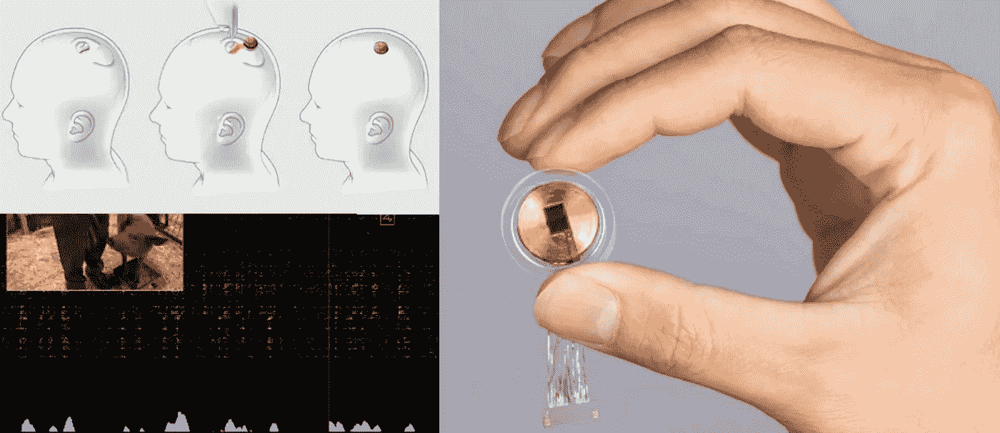

# Neuralink:未来还是终结？

> 原文：<https://medium.datadriveninvestor.com/neuralink-future-or-the-end-73333e8c97da?source=collection_archive---------10----------------------->

from [Neuralink live session on August 28th, 2020](https://www.youtube.com/watch?v=iOWFXqT5MZ4)

见见 Neuralink，埃隆·马斯克的新宝贝。一个微小的大脑植入物可以将脑电波实时传送到你的手机上。**现在就这样**。目的是将这些数据发送到云端进行分析和机器学习过程。分析的结果将影响大脑，解决神经元的故障，如失明或瘫痪。

听起来像黑镜电影？是的，它是。只有这个还活着。

This would go into your skull. photo by [CNBC](https://www.cnbc.com/2020/08/28/elon-musk-demonstrates-brain-computer-tech-neuralink-in-live-pigs.html)

在 2020 年 8 月的最后一周，该公司进行了第一次现场演示，展示了它的发展。马斯克展示了 3 只猪:一只有一个植入物，几个月前被移除了，另一只有一个活性植入物，第三只同时有几个活性植入物。

Live demo from 28 august 2020

> “云驱动的人工智能影响了我的大脑？还没有……”。我，今天…

解决大脑中的电问题是一项伟大的事业。许多人可能会同意提供他们的大脑数据，如果他们知道这将为他们解决这些问题。

 [## 英特尔公司，芯片与汽车:战略分析|数据驱动投资者

### 英特尔为什么收购 Mobileye 和 Moovit？芯片制造商与汽车行业有什么关系？嗯，作为前…

www.datadriveninvestor.com](https://www.datadriveninvestor.com/2020/05/18/intel-corporation-chips-cars-strategic-analysis/) 

酪这意味着，由于云驱动的人工智能和机器学习给予它的决定，设备将影响我们的脑电波。是的，其他技术已经以类似的方式运作，自动驾驶汽车行业也是如此。但是人脑不是一个载体。

# 什么时候可以接受测试植入物？

我一直说，我已经准备好试验植入物，当然，只要它们被证明对宿主身体是健康的。但是大脑现在还远远不够。连接的设备是太远的第二步。

我们应该试验的第一批植入物是不相连的设备，可以控制和拆卸。像[外骨骼](https://www.youtube.com/watch?v=lWmFEoDjUc4)这样的东西来强化身体，或者机器人假肢([手](https://www.youtube.com/watch?v=doSynaDdEBA)，[腿](https://www.youtube.com/watch?v=kaFiwC1xh2Y))。

from [TheConversation](https://theconversation.com/heres-how-to-convince-the-brain-that-prosthetic-legs-are-real-65009)

我认为任何**增强人类**(有机械植入物的人类)都需要能够立即独立地移除他们的任何植入物。我们还需要一个保证，通过这样做，设备不再影响身体。

> **“当**增强版人类可以立即独立移除植入物时，植入物将被社会接受”

# 埃隆·马斯克为什么要开新闻发布会？

马斯克一点也不傻。他是一个营销奇才。他知道自己在做什么。Neuralink 展示的技术甚至与它所说的愿景相去甚远。

但他分享这一发展的原因甚至不是为了获得更多的投资者或资金。这是为了让社会讨论继续下去。因为这是该技术的最大障碍，正如你可能从我的文章中理解的那样。但在某种程度上，我写这篇文章的事实实际上支持了埃隆·马斯克的意图，并使增强人类或机器人的未来更近了一步。

# 未来还是终结？这由我们来决定

如果不是埃隆在背后捣鬼，我可能会考虑成为一名 beta 测试者。不是设备本身；是他让我毛骨悚然。我无法相信他，他这样做是出于他所说的正当理由。但这是个人的事情，我真的希望我会发现我错了。

他说，“我们的这款设备超过了 FDA 的要求”。这是另一个让我害怕的原因。FDA 和其他监管机构还没有为这些技术做好准备。他们比开发人员走得慢。

未来仍然是可配置的，并在我们的控制之下。监管者没有准备好，政府设施反应太慢。唯一会阻碍新技术的是客户。如果你不是 100%有信心某种产品对你有好处，并且没有给你提供返回的方法->不要做。

机器人、仿生人和机器人会很快和我们生活在一起吗？这由我们来决定。

**访问专家视图—** [**订阅 DDI 英特尔**](https://datadriveninvestor.com/ddi-intel)