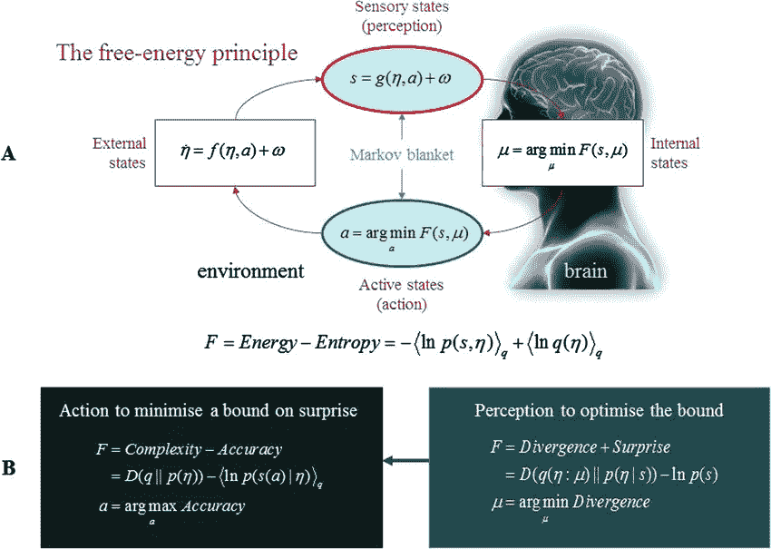

# 神经突触的有效编码——信息最大原则

> 原文：<https://medium.datadriveninvestor.com/neuro-syntapic-efficient-encoding-the-infomax-principle-431d3597f4a2?source=collection_archive---------20----------------------->

继续理论的范例(参考之前关于相同的[自由能原理](https://amit02093.medium.com/mathematical-modelling-of-consciousness-free-energy-principle-b3cbb90f8541)和[贝叶斯大脑假说](https://amit02093.medium.com/bayesian-brain-hypothesis-3554540132d0)的博客)关注大脑的神经功能。代表自由能原理特例的一个理论权利是**信息最大原理。**

**Infomax 原理**

该原理优化了感觉状态和这些感觉状态的内部表示之间的相互信息，这些感觉状态是在这些内部表示的效率的约束下由大脑通过外部世界的内部模型进行的。

首先，什么是互信息。要理解这一点，我们首先需要理解信息论中熵的含义。随机变量的**熵**是一个试图描述随机变量“不可预测性”的函数。假设一个随机变量 X 代表轮盘赌中出现的数字，一个随机变量 Y 代表一个公平的 6 面骰子中出现的数字。X 的熵大于 Y 的熵。除了数字 1 到 6，轮盘赌轮盘上的值可以取值 7 到 36。从某种意义上说，这是不可预测的。

因此，系统的熵越高，就意味着不可预测性越高。有关熵的数学表达式的更多信息，请参考这个简短的[说明链接](https://people.cs.umass.edu/~elm/Teaching/Docs/mutInf.pdf)。

**互信息**是测量同时采样的两个随机变量之间关系的量。特别是，它衡量的是一个随机变量相对于另一个随机变量平均传达了多少信息。例如，假设 X 代表一个公平的 6 面骰子的掷数，Y 代表掷数是否为偶数(0 表示偶数，1 表示奇数)。很明显，Y 的值告诉我们一些关于 X 的值，反之亦然。也就是说，这些变量共享共同的信息。

> 互信息可以被定义为两个随机变量之间的**纠缠熵**，其中一个变量的较高不可预测性可以导致另一个变量的较高不可预测性，因此两个随机变量之间的互信息将最小。

回到感觉状态和感觉状态的内部表示，当感觉状态精确地编码这些感觉状态的内部表示的可预测性时，反之亦然，两个实体之间的相互信息最大化。这将导致对感觉状态的内部表征的有效编码。

**将 Infomax 原理与自由能原理联系起来**

Infomax 可用于优化识别密度，即最小化自由能系统的结果。因此，我们可以说 info-max 原理成为自由能原理的特例。

更正式地说，info-max 原则可以从自由能分解为复杂性和准确性的角度来理解:当条件期望最大化准确性(或最小化预测误差)时，互信息得到优化，而通过最小化复杂性来确保效率。例如，考虑将猫识别为是产生感觉输入的原因的物体，通过优化交互信息以最大化准确性，意味着感觉状态的内部表示已经学习了猫的高度准确的表示(感觉输入),从而减少了识别的预测误差。为了在最小化复杂性的同时实现效率，意味着猫作为感觉状态的概率表示由尽可能最小的图来表示。

有趣的是，先进的模型优化技术使用自由能优化来消除冗余的模型参数，这表明自由能优化可能为大脑在神经发育和睡眠期间发生的突触修剪和稳态提供了一个很好的解释。

**结论**

总之，有效编码的原则是，大脑应该优化其感觉信号和一些简约的神经元表征之间的相互信息。这与在复杂性约束下优化生成模型的参数以最大化预测的准确性是一样的。这两者都是由自由能原理决定的，自由能原理可以被看作是 infomax 原理的概率概括。

**确认**

1.  [https://www . researchgate . net/publication/330701736 _ The _ hierarchy _ mechanical _ mind _ A _ free-energy _ formulation _ of _ The _ human _ psyche](https://www.researchgate.net/publication/330701736_The_hierarchically_mechanistic_mind_A_free-energy_formulation_of_the_human_psyche)
2.  [https://www . research gate . net/publication/41001209 _ Friston _ KJ _ The _ free-energy _ principle _ a _ unified _ brain _ theory _ Nat _ Rev _ neuro sci _ 11 _ 127-138](https://www.researchgate.net/publication/41001209_Friston_KJ_The_free-energy_principle_a_unified_brain_theory_Nat_Rev_Neurosci_11_127-138)