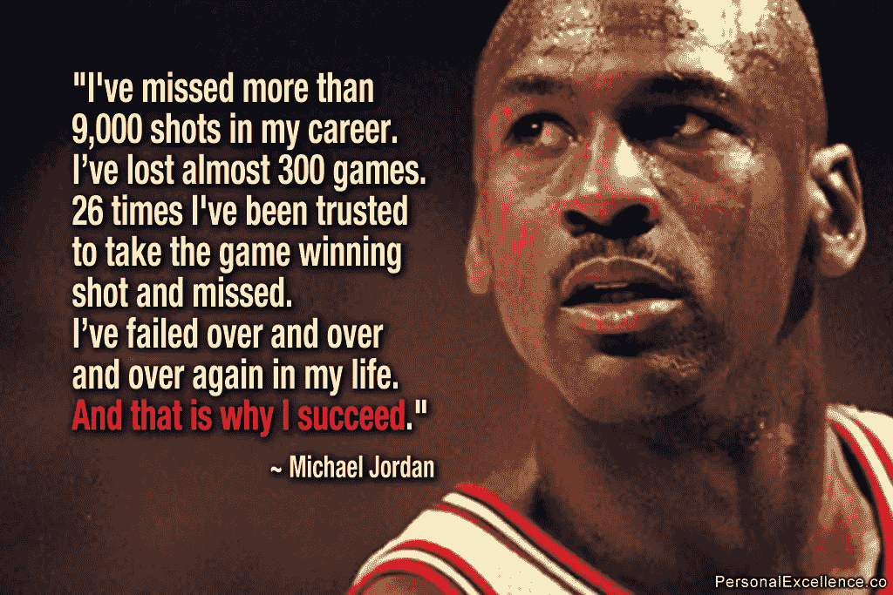
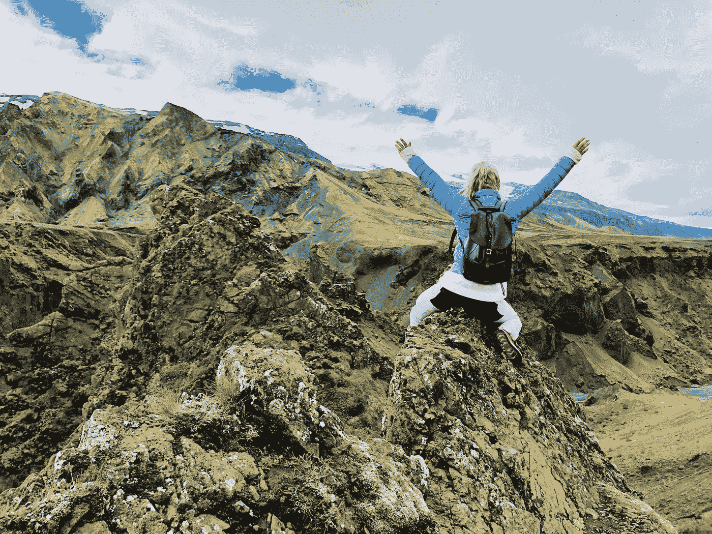

# 不要飞得太高，那样你会失去氧气，也不要飞得太低，那样你会淹死

> 原文：<https://medium.datadriveninvestor.com/never-fly-too-high-so-you-lose-oxygen-and-never-fly-too-low-so-you-drown-6ef6f2084361?source=collection_archive---------7----------------------->

成功、幸福和满足不是目的地，而是一段旅程。

LaunchBox

最近，我听了一集[史蒂文](https://medium.com/u/988b81c0441e?source=post_page-----6ef6f2084361--------------------------------)巴特利特的播客*一个 CEO 的日记*，我强烈推荐。他谈到在生活中朝着我们更大的目标循序渐进。

有趣的是，几个月前的五月，在隔离期间，我写下了我自己对战胜抑郁症和广泛性焦虑症的旅程/进展的想法，以及我已经走了很长一段路的事实。然而，从一个瘫痪的影子到活跃的生产力的过程是混乱的。

所以，这篇文章是关于五个月前的今天我的想法:

当我在看一部关于网飞的电影时，一个问题突然出现在我的脑海里:“*为什么我们还要看爱情喜剧或动作片，而在大多数情况下，我们都知道电影会有怎样的结局？!"*

我的意思是，难道我们不知道布拉德·皮特**得到女孩**和杰森·斯坦森**踢坏人**的屁股？！我们看，而且我们还在看。

然后我问自己这个问题:“*如果电影只有 2 分钟长，我们会看同样的电影吗？”*

主角们相识，接吻，结局！

警察找到了罪犯，并逮捕了他，结束了！

哇哦，多么惊奇！！

在大多数情况下，我们不会看这部电影(除非你没有病态的不耐烦)。

所以，生活和看一部好莱坞电影有一些共同之处，因为它们都由开头、中间部分和结尾组成。

## 我们最喜欢看哪一部分？

你已经猜到了:**中间的**。

## ***【中间部分】*由什么组成？**

这是**故事展开**和所有**行动发生**的部分。

它显示了**的渐进**

*   两个人一起走过来。
*   警察正在收集证据抓捕罪犯。

正是主角们**所经历的**，那些**起起落落**、**障碍**，以及**他们所面临的困难**，才造就了一部电影*【可看】*。

同样的道理也适用于一般的生活或我们想要达到的目标。我们朝着最终目标取得的进展是生活*【宜居】*或目标令人兴奋的原因；**不是结果**。

正是这些**障碍**，这些**拒绝**，这些**重新定向**，以及这些**调整**让你不得不去做，以便达到你想达到的目标或成为你想成为的人，这才让生活如此精彩。

# 目的地不重要，重要的是旅程。

就像爬山一样。这条**向上的路**充满了危险和疲惫，因此**值得攀登**。当然，当你到达顶端时，**的景色和你已经做到的事实会让你吃惊，但是你在顶端感受到的巨大喜悦会很快消退。**

Photo by [Charlotte Karlsen](https://unsplash.com/@charlottemsk?utm_source=medium&utm_medium=referral) on [Unsplash](https://unsplash.com?utm_source=medium&utm_medium=referral)

## 让我们一起做些事情:

试着生动地想象你在山顶上，向下看着你身后数百米的地方。这让你感觉如何？十有八九，**为自己的**感到骄傲，你**不顾**

*   你的恐惧
*   你的疲惫
*   质疑你爬这么远的能力吧？

即使你把这种经历告诉别人；人们想听的不是你已经爬上这座山的事实，而是“如何爬上这座山”！

# ***【如何】*比*【何处】*更重要。**

## 这不是高高在上的问题，而是你是如何做到这一点的！

没有人问迈克尔·乔丹今天在哪里，每个人都想知道他是如何成为有史以来最伟大的篮球运动员的。答案是每天训练，即使是在淡季，度过艰难时期。即使他不喜欢，也要每天进步。

有趣的是，不仅仅是看电影中的中间部分更令人兴奋；在*人生*中，也是**中间部分**带给你**最大的欢乐**。因为生活不是由**无尽的顶端**组成的。它还包括**下降**和**单调**天。

另一件事是，一旦你到达山顶，你的兴奋会很快消失。你**不能保存**这一刻或者把它放进**盒子里重温**它。没了！

不幸的是，我们倾向于认为我们的人生是分阶段的。就像**我们只是为了**的重大时刻**而活**。我们脑海中有个小小的声音告诉我们，如果我们完成了这件大事，我们会更快乐、更满足、更感恩，但事实恰恰相反。

如果我们不能享受 A 和 B 之间的旅程，我们永远不会真正快乐。因为当大多数人想到他们必须做些什么来缩小他们自己和他们想要成为的人或他们想要实现的目标之间的差距时，他们会感到害怕和不知所措。如果他们没有足够快地到达他们的目标点，他们会感到气馁，对自己不满意，最终对自己的生活不满意。

当我想到我自己的旅程和进步时，我并不惊讶于今天的我，而是惊讶于我已经走了多远。当我回顾我开始的地方，以及我周围和我身上发生了多大的变化时，我很自豪。

我为自己的颠簸之旅感到自豪，但它让我摆脱了所有让我感到沉重的东西。

## 最终想法:

你必须记住，每种感觉，好的或坏的，高的或低的，最终都会消失。成功、幸福和成就感不是你站在人生山顶的那一刻。真正的成功、幸福和满足是你不顾痛苦、失望、疲惫、自我怀疑和失败而奋力前行的旅程、道路和路径。

享受旅程是至关重要的，你的进步**缓慢但坚定**。

# 享受中间的时光。

伟大的成就令人敬畏，可能会给你翅膀，让你飞得更高，但请记住…

## …不要飞得太高，那样你会缺氧；也不要飞得太低，那样你会淹死。

## …永远不要太兴奋，这样你会变得自满；也不要太不兴奋，这样你会变得太自我批评。

**中间的**总是**最好的位置**。

感谢阅读:-)

哈蒂斯