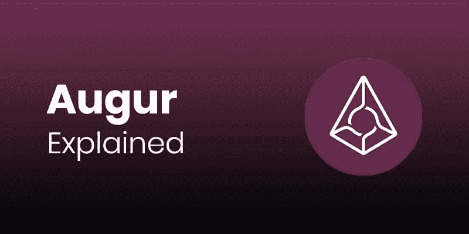

# 永远不要低估占卜符号的影响

> 原文：<https://medium.datadriveninvestor.com/never-underestimate-the-influence-of-augur-token-c735eba4d9c9?source=collection_archive---------1----------------------->

交易市场通常需要一个中央中介来协调供求关系并完成订单。作为回报，中介收取交易费，这可能导致达成交易的高价。由于这些费用，交易往往只在特定事件上达成，并且只由已建立的代理人达成，这也意味着许多竞赛没有得到详细考虑。

奥格区块链平台正是为了解决这个问题而设计的。有了一个全球性的、开放的、去中心化的预测市场平台，任何人都可以为任何事件创建一个预测市场，并提供其份额。高经纪费被淘汰。区块链技术和群体智能消除了信任中央经纪人的需要。

 [## 区块链上的占卜、暗杀和道德|数据驱动的投资者

### 令人不寒而栗的 2014 年电影《蓝魔人》记录了杰克·吉伦哈尔的卢·布鲁姆的崛起，一个轻度精神病患者，特拉维斯…

www.datadriveninvestor.com](https://www.datadriveninvestor.com/2018/08/12/augur-assassination-and-morality-on-the-blockchain/) 

# 什么是预兆？

本质上，它是一个分散的市场预测平台，因为 ERC20 令牌占卜者使用以太坊网络来预测真实事件。群众决定了一个潜在的估计，即一个相当大的分散样本的人。

值得注意的是，这种预测能力导致的结果比相关领域顶尖专家的结果更准确。预测不是什么新鲜事；在很多圈子里，会叫赌博，也有人会叫分析。

# 什么是预测市场？

通过 Augur，参与者可以买卖未来事件结果的股票，价格由事件发生的概率决定。研究表明，预测市场可能比专业机构更可靠。

预测市场并不新鲜，因为政治赌博的预测市场记录可以追溯到 1503 年。他们利用所谓的“群众的智慧”对事件做出准确的估计。

潜在的前提是，如果样本量足够大，那么答案通常与单个专家或一组专家给出的建议一样精确，甚至更可靠。

## 它有市场吗？

“大众的智慧”可以带来惊人的准确预测，并最终使市场更有效地运行。十多年来，谷歌和福特汽车公司一直在内部使用预测市场。

虽然这些指标主要用于衡量内部流程的有效性，但也可用于金融部门。预测市场的一个令人兴奋的应用是发展中国家的保险，那里的公民没有其他选择来保护自己免受政治、经济甚至气候风险。

有了预测市场，生活在这样一个国家的人可以通过购买一份在不幸事件发生时会得到偿付的预测合同来购买针对内战、干旱、洪水或货币贬值的保险。

# 占卜者团队及其历史

Augur 是由杰克·彼得森(Jack Peterson)和乔伊·克鲁格(Joey Krug)领导的 13 人团队于 2014 年 10 月创立的首批平台之一。在奥格之前，两人在开发比特币的分支 Sidecoin 时获得了区块链技术的经验。除了奥格的经验丰富的团队，以太坊的创造者维塔利克·布特林(Vitalik Buterin)是该项目的顾问。

2015 年 6 月发布了第一个公开的 alpha 版本，今年比特币基地将 auger 评为年度最令人兴奋的区块链项目之一。2016 年 3 月发布了测试版的 Augur。
最大的 Augur 竞争对手是 Gnosis (GNO)，它也是基于以太坊网络，与 Augur 项目非常相似。这两个项目的主要区别在于经济模型的使用。虽然 Augur 使用基于交易量的收费模式，但 Gnosis 根据发行在外的股票数量收取费用。

加密货币 REP 是通过 Augur 的初始硬币发行(ICO)创建的，其中 1100 万 REP 令牌中的 880 万被出售给投资者。剩余的 220 万个令牌在顾问和团队中分发，并分发给负责维护和进一步开发 Augur 平台的预测基金会。

众卖的结果是收集了 19053.92 BTC 和 1176816.43 埃特，使当时的总数达到 5，318，331.63 美元。根据该公司的白皮书，这些资金的大部分被用于开发第一版以外的平台。

# REP 试图解决的问题是什么，需要 REP 做什么？

一方面，创建这样一个市场是复杂和成本密集型的，这就是为什么它通常只有大型博彩公司才有可能。
另一方面，由于当前博彩市场的核心特征，结果以及事件及其结果的报道可能会受到操纵或扭曲和影响。到目前为止，结果总是只由中央博彩办公室报告。

另一个问题是，存款通常必须存放在中央中间人处，然后中央中间人才能获得资金，这就带来了风险和信任问题。

Augur 平台承诺为所有这些问题提供一个创新的、分散的、全球性的和开放的解决方案。此外，Augur 平台的分散式区块链结构使得无需向任何中介支付过多的费用成为可能——所有利润都分配给做市商和记者。总而言之，这导致了成本的大幅降低，这使得任何人都可以创建预测市场。第三方的信任问题也可以消除，因为有了 Augur，任何第三方都无法方便地获取或控制一方的资金，因为所有交易都是直接对等完成的。这些特点的另一个结果是，由于成本低，现在可以为只有少数人参与的活动创造市场，而这些活动在以前是无利可图的。

Augur 的设计是如此开放和广泛，它可以用于广泛的应用程序，并不明确支持其中任何一个。正如该公司网站上所列，Augur 可用于创建政治、体育、金融、文化和密码市场事件的预测市场。例如，更多的用例是可以想象的。

创建活动市场及其实现的过程如下。

第一步，您可以使用 Augur 平台创建一个事件。这是一个可能发生也可能不发生的潜在事件。

下一步是购买或出售那些对事件的发生或不发生进行投机的用户的股票。

购买后，这些可以出售，或者可以购买更多，直到场景的结果变得明显。如果你赌对了结果，并拥有一份(或多份)相应的股份，一旦知道结果，你的利润将直接发送到你的以太坊钱包。

# 采矿是如何工作的？

不可能直接挖掘加密货币 REP，因此作为外部用户，您不能通过挖掘获得 REP 令牌。

占卜和金币有什么关系？
奥格区块链是一个平台，它使任何人都能够为单个事件打开预测市场——例如，在政治、体育、文化或类似领域。

Augur 平台可以通过桌面客户端操作，并能够通过 3 个简单的步骤创建和执行预测市场。因为，除了市场生产者，事件结果的分散确定还需要大量的报告者，所以发明了加密货币声誉(REP)。

代表(或声誉)令牌是驱动 Augur 的分散式 Oracle 系统的因素。你可以把它看作是在 Augur 平台上交易的工具。REP tokens 的持有者可以用它作为赌注，对市场上列出的事件结果进行下注。

Augur 将代表令牌的数量限制在 1100 万个，其中 80%是在他们的 ICO 中销售的。代表令牌持有者被视为“报告者”，必须报告占卜市场上列出的随机事件的结果。

# 拥有 REP 令牌的优势

拥有代表或声誉使你有权成为一名记者，报道市场上的事件。您拥有的代表令牌越多，您的报告越准确，您从费用中获得的份额就越多。

## 谁使用奥格网络？

在 Augur 区块链生态系统中有三个核心角色:市场创造者、记者和交易者。然而，应该注意的是，只有记者需要代理令牌，其他演员可以不需要这些令牌或追求他们的目标。

市场创建者是那些通过 auger 平台创建预测市场的代理人，因此构成了 auger 网络中所有交易的基础。他们收到一部分交易费用，这些费用是为了预测他们的事件发生/不发生而产生的，因此可以对他们的工作进行奖励。

记者:每次市场关闭时，作为一名代表，你必须报告该市场的确切事件。你也使用一定数量的 REP 来保护你的索赔。如果您看到事件尚未发生，您可以将其标记为“无效”，因为您无法对其进行报告。占卜平台要求一个市场的创建者指示一个特定的记者，然后他有三天的时间来报道这个事件。如果你愿意，作为一名记者，你可以在 3 天内对结果提出质疑。如果没有人质疑指定的记者，市场就会进入下一轮。

当然，另一个用户群是交易者或在创建的预测市场中购买股票的交易者，他们或者进入或者不进入。除了这种投资的娱乐因素之外，如果他们押注于正确的结果，他们可以获得合理的回报。交易者也在几个方面受益于 Augur 平台的无许可协议。他们可以在特定事件中购买任意数量的股票。当然，与其他市场相比，它们也受益于较低的交易费用。由于有了区块链，市场一周七天、一天 24 小时开放，所以交易者可以在任何时候清算他们的头寸，前提是可以为他们的交易找到交易对手。

# 销售代表钱包是如何工作的？

奥格区块链的本地代表令牌是一个 ERC-20 令牌，这就是为什么它可以用于所有 ERC-20 兼容的钱包。虽然这也包括在线和桌面钱包，但我建议你使用安全的硬件钱包，也称为“冷存储”，用于更长期的存储，因为它们没有连接到互联网。

 [## 如何找到适合自己的比特币钱包？

### 这篇文章将帮助你，使你能够最大限度地降低损失比特币的风险。

medium.com](https://medium.com/the-capital/how-do-you-find-the-right-bitcoin-wallet-for-you-c88e087f80f2) 

我在每月一期的 [**简讯中分享了更多私密的想法，你可以在这里**](https://mailchi.mp/bf8f8e8ed697/keep-in-touch-with-lukas) 查看。请在评论中告诉我，并在各种社交媒体平台上加入我:

[**推特**](https://twitter.com/WiesfleckerL)●[**insta gram**](https://www.instagram.com/lukaswiesflecker/)●[**脸书**](https://www.facebook.com/lukaswiesfleckerr)●[**Snapchat**](https://www.snapchat.com/add/luggooo)**●[**LinkedIn**](https://www.linkedin.com/in/lukas-wiesflecker-1b11251a5/)**

**无论你做什么，都要带着爱和激情去做！**

****访问专家视图—** [**订阅 DDI 英特尔**](https://datadriveninvestor.com/ddi-intel)**