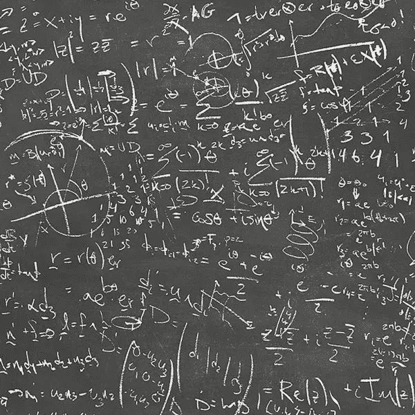
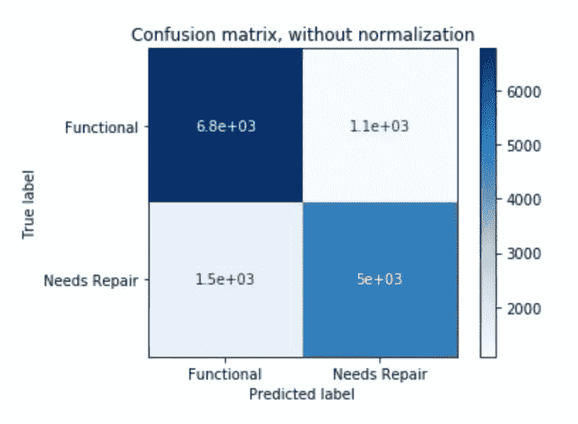

# 然而，她解决了数学问题

> 原文：<https://medium.datadriveninvestor.com/nevertheless-she-solved-math-problems-cebd680d77bd?source=collection_archive---------6----------------------->

一个令人困惑的混乱矩阵

大家好！今天，我宣布了一个新的系列，探索数据科学主题背后的数学原理。我将探索概率和统计、机器学习的主题，甚至一些高级主题。我们开始吧。



首先，我想说一下基本概率。让我来介绍一下，这是你在统计学课上会看到的一种方式，然后(我保证)我会从数据中加入一些灵感。我将从一些定义开始，以确保我们在同一页上。

# 定义

**样本空间** —是实验中所有可能结果(也称为**事件**)的集合。

**分离事件**——当实验结果不重叠时。

**概率** —事件发生几率的精确度量，以小于 1 的正数表示。如果你将一个概率乘以 100%，你的度量现在代表一个百分比。

# 神奇的例子

这里有一个例子:假设我们有一个[魔法 8 球](https://en.wikipedia.org/wiki/Magic_8-Ball)，它有 20 个算命答案(在一个[二十面体](https://en.wikipedia.org/wiki/Icosahedron)上)。Python3 中编码为列表的示例空间是:

```
magic_8_ball = [‘It is certain.’, ‘It is decidedly so.’, ‘Without a doubt.’, ‘Yes — definitely.’, ‘You may rely on it.’,’As I see it, yes.’, ‘Most likely.’, ‘Outlook good.’, ‘Yes.’, ‘Signs point to yes.’, ‘Reply hazy, try again.’, ‘Ask again later.’, ‘Better not tell you now.’, ‘Cannot predict now.’, ‘Concentrate and ask again.’, ‘Don\’t count on it.’, ‘My reply is no.’, ‘My sources say no.’, ‘Outlook not so good.’, ‘Very doubtful.’]
```

样本空间有 20 个事件。

```
len(magic_8_ball)
>>>20
```

我们可以打印一个事件。

```
magic_8_ball[14]
>>>'Concentrate and ask again.'
```

并且，那个事件的概率是(集中注意力再问一次的次数。在一次摇动中发生)/(可能结果的总数)= 1/20。

# 应用

我将尝试将这一概率课程应用于一个真实世界的例子:**预测坦桑尼亚水井的功能**。(我这个项目的 GitHub repo 可以在[这里](https://github.com/karenkathryn/tanzania-water-wells)找到。)

**背景:**这个项目是我和[亚伦·亚伯拉罕森](https://medium.com/@aabrahamson3)在华盛顿州西雅图熨斗学校为期 15 周的沉浸式数据科学训练营期间完成的。

**数据集:**该项目的数据文件可以在驱动数据网站[这里](https://www.drivendata.org/competitions/7/pump-it-up-data-mining-the-water-table/data/) [](https://www.drivendata.org/competitions/7/pump-it-up-data-mining-the-water-table/data/%E2%80%8B)找到，数据字典可以在[这里](https://www.drivendata.org/competitions/7/pump-it-up-data-mining-the-water-table/page/25/)找到。下载需要帐户设置。

*   该数据集中有 59，400 条记录，每条记录有 40 个特征
*   部分数据用于训练机器学习模型，其余数据用于评估

**目标:建立一个预测性的机器学习模型，该模型指示某个水井是否需要修复(标记为损坏和不可用)或不需要修复(标记为可用)。**

**方法:**我们对数据集进行了彻底的 ed a，并建立了几个机器学习模型来检测水井是否需要修复。我们尝试了六种不同的分类模型，其中随机森林分类器表现最佳。

[](https://www.datadriveninvestor.com/2019/03/03/editors-pick-5-machine-learning-books/) [## DDI 编辑推荐:5 本让你从新手变成专家的机器学习书籍|数据驱动…

### 机器学习行业的蓬勃发展重新引起了人们对人工智能的兴趣

www.datadriveninvestor.com](https://www.datadriveninvestor.com/2019/03/03/editors-pick-5-machine-learning-books/) 

**指标:**我们考虑了准确性和特异性。根据记录，我们的随机森林分类器模型总体准确率为 82%。不幸的是，最适合我们业务案例的指标 specification(使用真实需求修复)表现最差，为 77%。

Woah！你刚刚是不是忽略了度量部分？是时候把它分成更容易管理的部分了。

在预测一口井是否正常工作后，我们可以将结果分类到一个**混淆矩阵**。在下面的矩阵中，左上角称为真阳性(TP)分类，右下角为真阴性(TN)分类。最后两个框不太直接:右上显示了功能正常但被分类为需要修复(损坏)的井的数量，左下显示了损坏但被误分类为功能正常的井的数量。这些分别是假阴性(FN)和假阳性(FP)。



TP — 6800 口井被正确识别为功能井

TN——5000 口被正确识别为破裂的井

FN——1100 口井被错误地认定为损坏，但功能正常

FP — 1500 口井被错误地识别为功能井，但实际上已经破裂

有了这些数字，我们就能感觉到这个模型在度量上的表现。这里，我们来考虑一下准确率和召回率。

精确度定义如下:

```
Accuracy = (TP + TN)/(TP + TN + FP + FN) = 11800/14400 ~= .82 or 82%
```

特异性是:

```
Specificity = TN/(FP + TN) = 5000/6500 ~= .77 or 77%
```

让我们把这个和我们之前讨论的联系起来。混淆矩阵只是我们可以用来计算概率的不相交事件的列表。准确度是正确预测的标签(不相交的事件)与所有可能性之和的比率。特异性是井被正确标记为破裂的概率。

我们还可以考虑其他指标，如召回率、F1 值和精确度。为了记住所有这些指标和计算，我参考这张令人惊叹的图片。


Check out the blog this image is from! [[link](https://manisha-sirsat.blogspot.com/2019/04/confusion-matrix.html)]

原来如此！所有这些都表明，你可以使用一些基本的概率原理来解释机器学习算法的输出。

一如既往——让我们在评论中聊天吧！