# 新人工智能再现草图绘制过程

> 原文：<https://medium.datadriveninvestor.com/new-ai-reproduces-sketch-drawing-process-29ba1acf5059?source=collection_archive---------6----------------------->

## 深度学习

## 华为海思的研究人员提出了一种生成基于图像的逼真草图的新方法

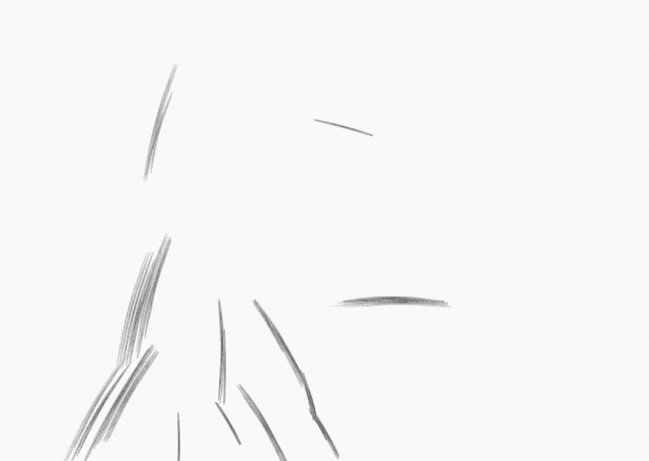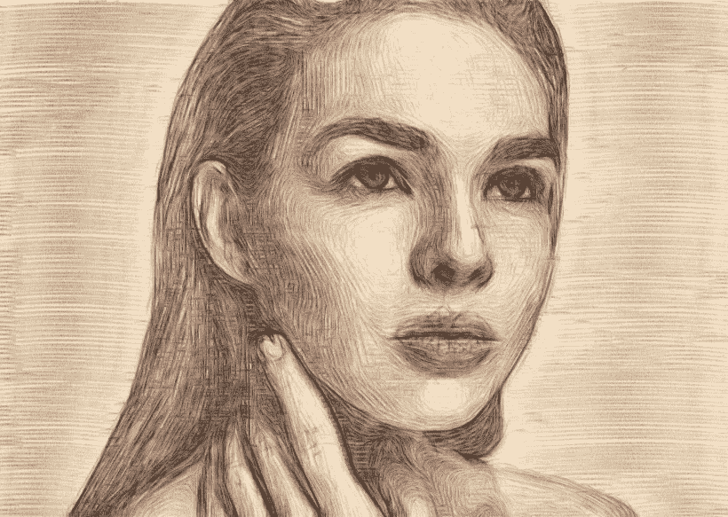

Source: [Github](https://github.com/TZYSJTU/Sketch-Generation-with-Drawing-Process-Guided-by-Vector-Flow-and-Grayscale)

所提出的新的神经网络模型不仅能够生成草图图像，而且能够恢复绘图过程本身。该模型在纹理质量、风格和用户评级方面绕过了以前的方法。

# 有什么问题？

现有的铅笔草图算法大多基于纹理渲染，而不是直接模仿笔画。

作为一个例子，下面有三个真实的铅笔画。从放大的区域可以看出，铅笔画的纹理实际上是一些平行的笔画，可以通过直接建模来模仿，而不是简单地渲染为一些偶然的纹理。

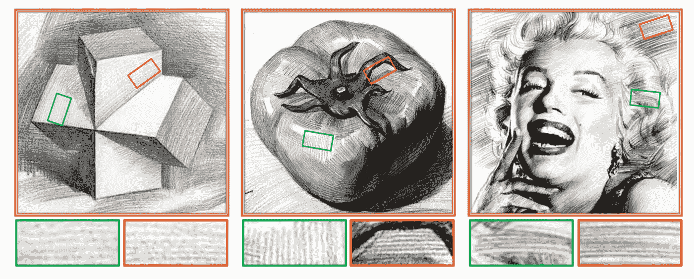

Source: [Arxiv](https://arxiv.org/pdf/2012.09004.pdf)

结果，这限制了这种方法恢复草图绘制过程本身的能力。为了解决这一限制，[华为海思](https://en.wikipedia.org/wiki/HiSilicon)的研究人员定义了一种模拟铅笔笔划的明确算法，该算法最近在 AAAI 2021 人工智能会议[T3 上提出。](https://aaai.org/Conferences/AAAI-21/important-dates/)

 [## 机器学习和人工智能如何改变电子商务的面貌？|数据驱动…

### 电子商务开发公司，现在，整合先进的客户体验到一个新的水平…

www.datadriveninvestor.com](https://www.datadriveninvestor.com/2020/11/19/how-machine-learning-and-artificial-intelligence-changing-the-face-of-ecommerce/) 

# 例子

给定一个自然图像(在最右边的一列)作为输入，我们的算法可以通过每次画一个笔画的过程产生一个铅笔草图。

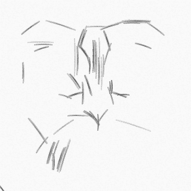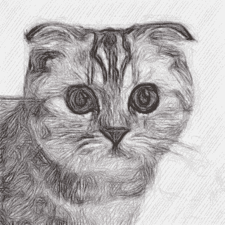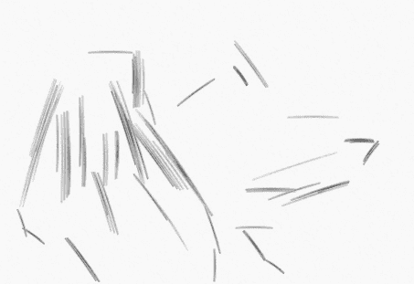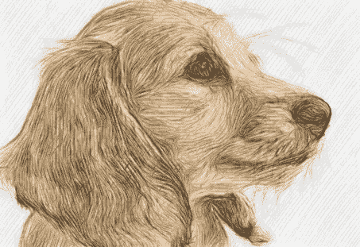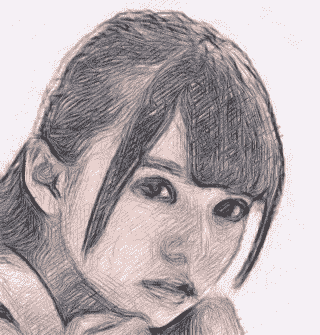

Source: [Arxiv](https://arxiv.org/pdf/2012.09004.pdf)

# 关于方法

所提出的用于真实生成铅笔笔划的方法主要由三部分组成:

1.  **区域划分:**估计包含相同方向笔画的区域；
2.  **笔画:**在确定的区域内定义笔画的角度和粗细；
3.  **细节增强:**阐明草图的细节，如阴影、笔画间距、不连续等。

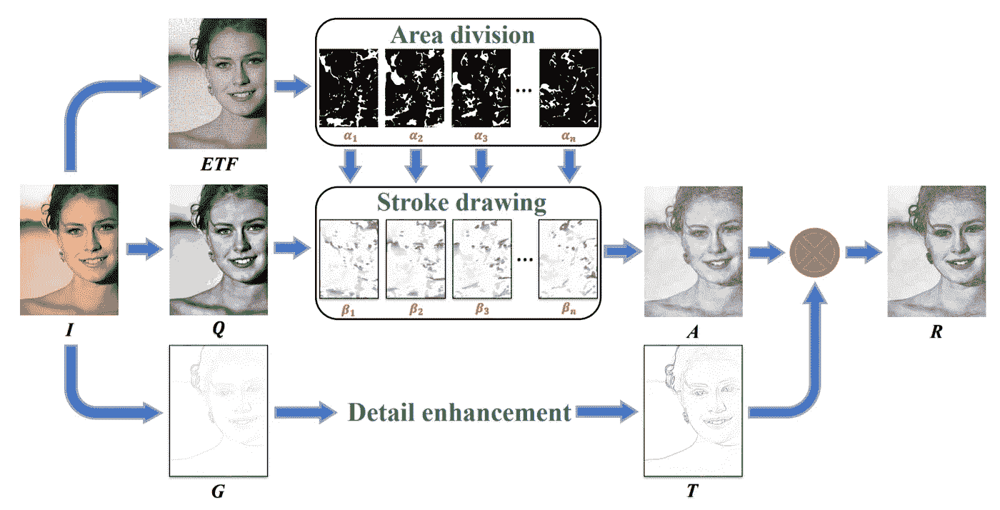

Schematic illustration of the algorithm. **I** is the input. **ETF** is the visualization of edge tangent flow vector field. **{α1, α2, . . . , αn}** are the area divisions of the input according to the direction of **ETF** vectors. **Q** is the quantization result of **I**. **{β1, β2, . . . , βn}** are the stroke drawing results of each area. **A** is the aggregation of **{β1, β2, . . . , βn}**. **G** is the gradient map of **I**. **T** is the edge map generated by **G. R** is the final result obtained by multiplying **A** and **T**. Source: [Arxiv](https://arxiv.org/pdf/2012.09004.pdf)

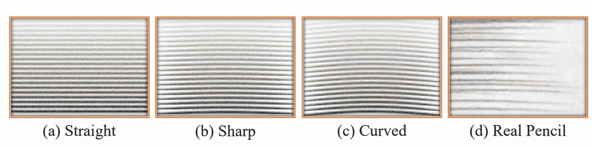

Stroke generation steps. Source: [Arxiv](https://arxiv.org/pdf/2012.09004.pdf)

# **与其他方法的比较**

在框架的帮助下，现在可以生成逼真的铅笔草图，每次画一笔。除了提高绘图质量之外，该方法的另一个优点在于它的可解释性，因为铅笔笔划被直接建模。

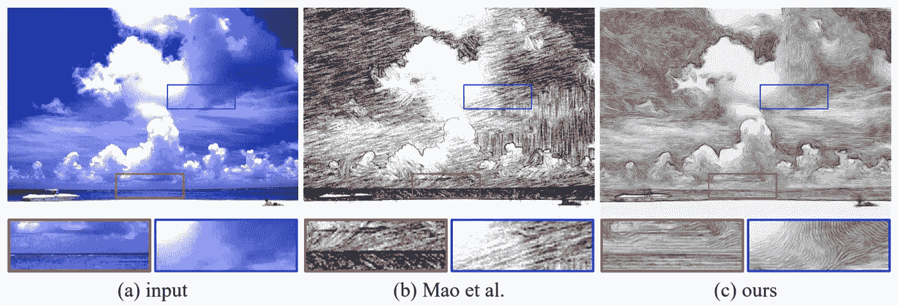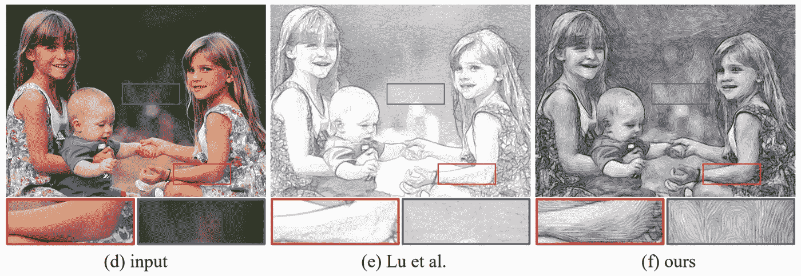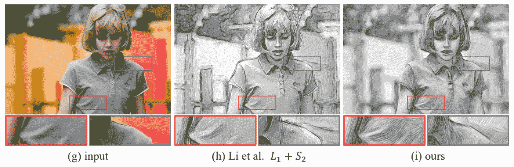

Comparison with several existing algorithms. Source: [Arxiv](https://arxiv.org/pdf/2012.09004.pdf)

# 对深度学习感兴趣？

*如果您觉得本文有帮助，请单击💚或者👏按钮或分享关于脸书的文章，这样你的朋友也可以从中受益。*

# 参考

## 访问专家视图— [订阅 DDI 英特尔](https://datadriveninvestor.com/ddi-intel)