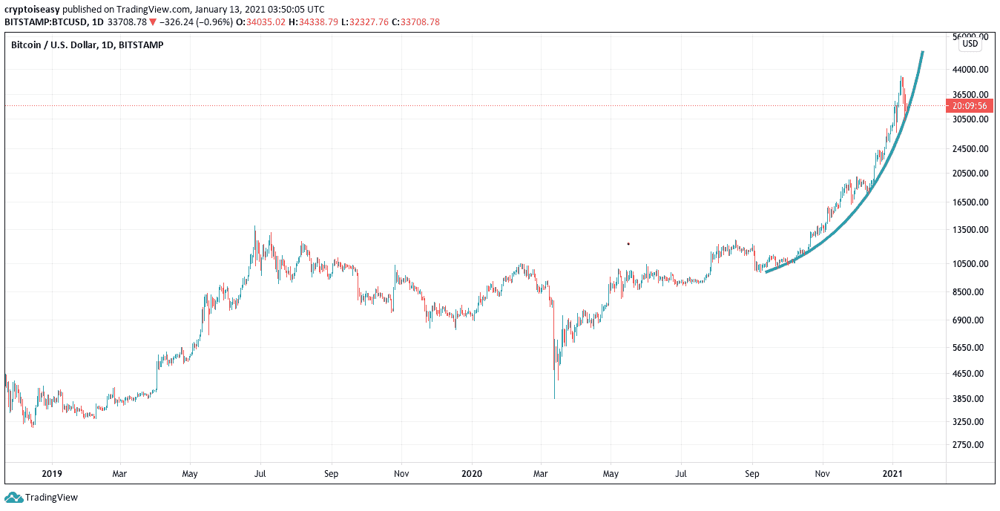
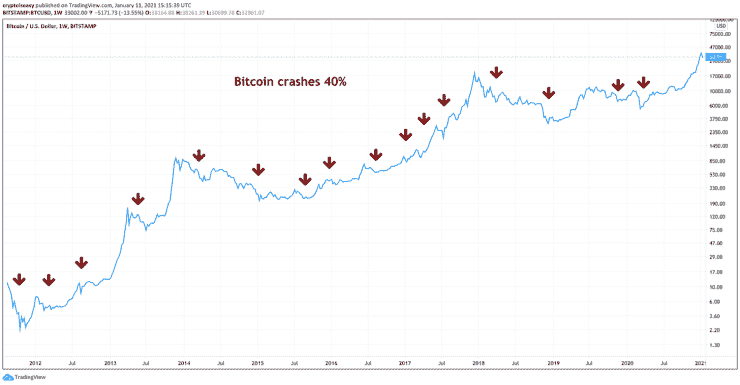
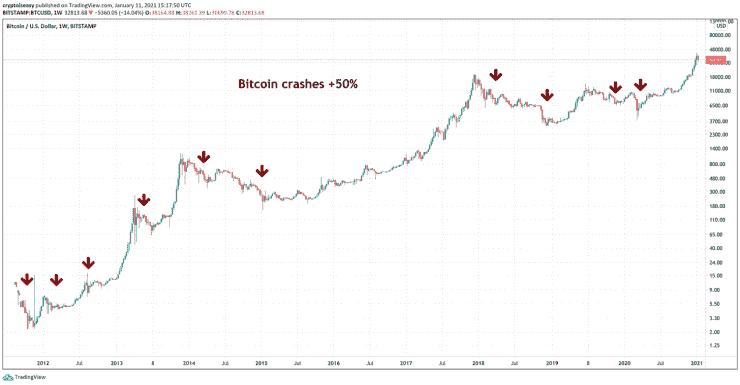

# 比特币新牛市？它已经在这里很多年了

> 原文：<https://medium.datadriveninvestor.com/new-bitcoin-bull-market-its-been-here-for-years-ecd8cac2a264?source=collection_archive---------8----------------------->

你看到 CNN 的标题了吗？这是:

 [## 比特币三天暴跌逾 20%。它现在处于熊市

### 上周五，比特币价格飙升至近 42，000 美元的历史新高，但随后一路暴跌至约…

www.cnn.com](https://www.cnn.com/2021/01/11/investing/bitcoin-prices-plunge/index.html) 

Riiiiight。

归咎于一个编辑把“熊”错当成了“牛”

至少我希望如此。人们只是在过去几个月才开始喊“牛市”，但事实是比特币已经处于牛市两年了。

# 有些事情永远不会改变

在 2020 年的几乎所有时间里，我听到人们谈论比特币熊市。

2019 年 1 月，比特币的价格是 3200 美元。2020 年 1 月，它的价格是 7347 美元。2021 年 1 月，截至我写这篇文章的那天，它的价格差不多是 34000 美元。

这听起来像熊市吗？

现在，一泡就结束了？

这种“崩溃”甚至没有打破比特币的抛物线上升趋势。看看蓝线，这是基于过去三个月的上涨对比特币价格的预测:

Two years of bitcoin’s price going up. Today’s parabola is still intact.

仍有望在 2 月中旬达到 10 万美元。

我们可以从今天的价格再下跌 30%，仍然符合典型的比特币崩盘。这将标志着从最近的峰值 41，000 美元*下降 40%,并融入价格图表。*

查看比特币崩溃 40%或更多的所有时间:

Bitcoin crashes of 40% or more.

自 2018 年崩盘以来，比特币的价格已经下跌了 40%或更多四次——通常是在上涨。

更大的崩溃怎么办？绝对有可能。看看这 50%的跌幅:

Bitcoin crashes of 50% or more.

# 波动并不意味着毁灭

2018 年的那场大规模崩盘仍在人们的脑海中挥之不去。这些更小、更近的下跌只会加深对另一场更大的下跌的恐惧。

比特币现在会进入另一轮熊市吗？

当然可以。所有牛市最终都会结束。

25%的跌幅很难结束这种局面。从今天的价格来看，*比特币的价格可能会下跌 50%，并保持健康的长期上涨趋势。*

人们仍然不会相信这个牛市。怎样才能说服他们？

# 当它全部倒下

好消息是，每当熊市来临，另一个牛市就会随之而来。

就像 2019 年初一样，除了你和我，没有人会注意到，直到比特币的价格涨得太高，以至于来不及赶上。

在我们有证据之前，先不要说熊市。如果你想要人人梦寐以求的 100 万美元比特币，你必须接受一路上的大规模崩溃。

有些崩盘是挫折，有些则是真正的熊市。我们遭遇了挫折，但这并不意味着牛市已经结束。

预计价格会上涨。和崩溃。最终，一个熊市。

只是还没有。

马克·赫尔夫曼发布了 [*加密易*](https://cryptoiseasy.substack.com/) 简讯。他也是顶尖的比特币作家，在[和*黑客正午*和](https://hackernoon.com/u/MarkHelfman)上。他的书《共识岛》和《比特币或破产:华尔街进入加密货币》探索了加密货币的社会、文化和商业挑战。在他的简历中了解更多关于他的信息。

原载于[*Voice.com*](https://www.voice.com/post/@markhelfman/new-bitcoin-bull-market-its-been-one-for-years-1610468049-1410425296)。