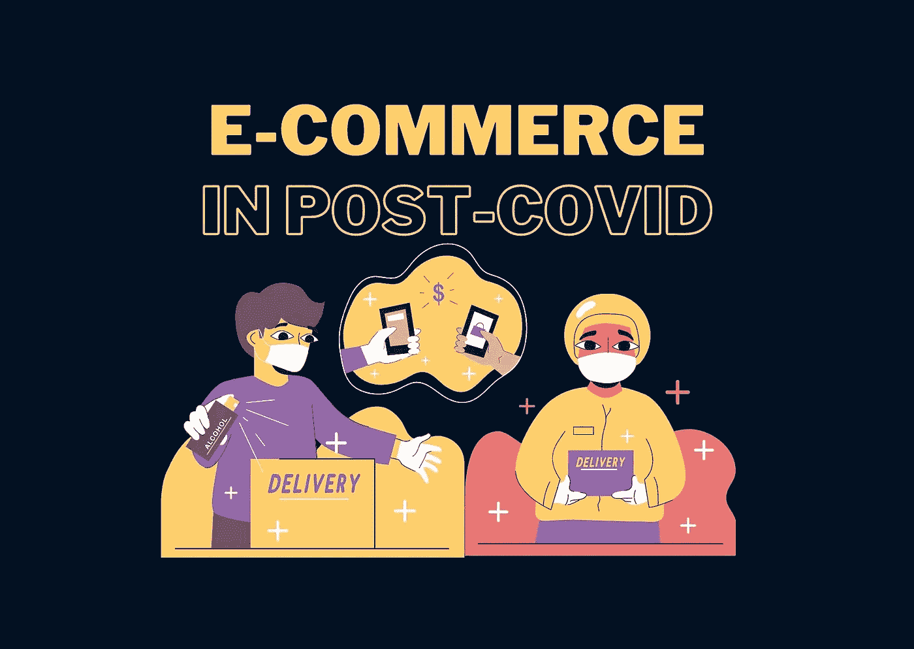
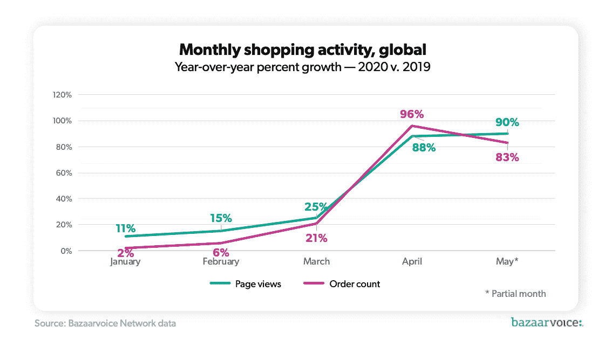
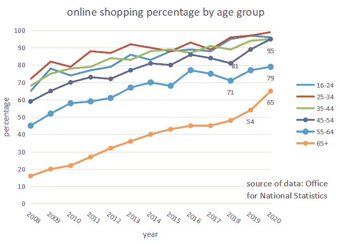
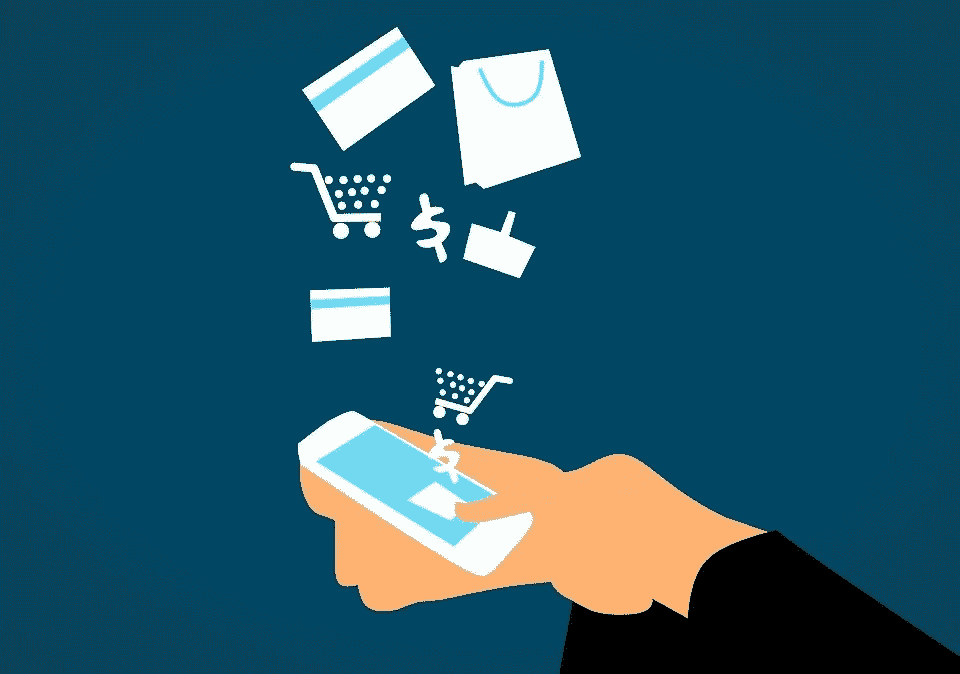

# 新的消费“生态系统”:在后疫情时代，什么将推动电子商务的增长

> 原文：<https://medium.datadriveninvestor.com/new-consumption-ecosystem-what-will-drive-e-commerce-growth-in-post-pandemic-environment-c507b94419a?source=collection_archive---------15----------------------->

Image created by Americana Chen using Canva

在这个“社交距离时代”，电子商务的崛起并不令人惊讶，2019 年和 2020 年 1 月的月度在线订单同比增长率仅为 2%，而 4 月份则飙升至 96%。(《集市之声》，2020 年)

你可能会认为这是另一个电子商务泡沫，在线下零售店能够开业、经济恢复到疫情之前的活跃水平或者电子商务行业已经相当饱和之后，这个泡沫很快就会消失。这种观点可能明显得到我们已经看到的许多历史数字泡沫的支持，然而，这一次有许多方面表明 ***电子商务环境本身的根本变化，导致持续增长和长期转向新的消费生态系统。***

Fig. 1 year-on-year comparison of growth in monthly online shopping activity (by [Bazzarvoice Network data](https://www.bazaarvoice.com/blog/tag/network-data/))

# **未开发的市场——不断变化的人口统计数据**

Fig.2 Online shopping percentage by age group — age group from 45 to 65+ have seen largest growth in the past two years ( graph created by Americana using data from Office for National Statistics)

虽然电子商务商家的目标客户和互联网购物的主要参与者主要是 25-45 岁的千禧一代和工作年龄的人，但最近客户群的增长实际上主要来自 45 岁以上的人。电子商务的原始市场已经相当饱和，如图 2 所示，2017 年，16-45 岁的英国家庭使用在线购物的比例已经达到 95%左右，(国家统计局，2020 年)，增长潜力很低，而由于不愿接受技术变革和缺乏信任，较老的客户群更难挖掘。根据疫情，更脆弱的老一代人更倾向于自我隔离，因此被迫适应新的购物方式。用户界面设计的快速改进，由机器学习算法和人工智能支持的推荐系统，促进了在线购物快速融入他们的日常购买习惯。这为电子商务商家提供了新客户的巨大边际增长，随着他们进一步分享他们的经验并影响他们的社会群体，改变客户群的人口结构并推动未来的增长，甚至还有更大的扩张潜力。

# **互补增长——关联服务的发展**

另一个大大增强了电子商务长期增长潜力的方面是相关服务的加速改进，如送货、在线支付、聊天机器人、客户关系管理等。

金融科技领域最近的崛起引发了各种需要更少中介的新支付方法，这降低了交易费用和时间，同时确保了更安全的支付。从 Ripple 到 Bitpay，它使用区块链来确保支付结算的可追溯性；到微信，利用社交网络 app 的人脉效应的 Venmo 对支付宝来说，分支进入蚂蚁金服，提供金融服务，打开投资机会。电子支付方式在不断发展，这反过来又使得消费者在网上购物时能够更快、更便宜、更安全地进行网上支付。执行率大大提高，还记得上次你决定不继续购买是因为支付屏幕在你的浏览器上触发了一个“不安全”的通知，还是因为你必须通过重复而繁琐的步骤来验证你的支付吗？投保结账是在线购物业务的首要转换优化问题之一，11%的在线客户会因为缓慢而复杂的结账流程而放弃他们的整个购物车，7%的人会因为没有足够的支付选项而放弃(investp，2019 年)这个百分比可能看起来很小，但考虑到交易量很大，绝对影响可能是巨大的。平稳、无摩擦和安全的支付至关重要。

image free to use under [Pixabay License](https://pixabay.com/service/license/)

此外，更快的交付和运输服务的发展提高了客户满意度和在线购物体验。49%的购物者表示，当天送货将使他们更有可能在网上购物(investp，2019)，尤其是在疫情时代，日常公用事业和食品在网上购物中的份额不成比例地飙升，更多的客户将要求当天送货。技术使我们能够改善运输和交付的物流，使用人工智能设计最快的路线，分析实时数据以制定最佳计划，大大提高了运输效率。自主航运处于航运物流技术发展的前沿，2018 年，劳斯莱斯和 Finferries 推出了第一艘全自动汽车渡轮。在 B2C 最后一英里交付中使用自主卡车的成本优势也很大，与传统交付方法相比，有可能降低 10%的交付成本(麦肯锡，2018 年)。成本优势鼓励更多商家探索自主最后一英里交付方法，推动整个电子商务行业的增长

 [## 你的 COVID 等级是多少？为疫情安全设计办公空间|数据驱动投资者

### 自从新冠肺炎·疫情席卷美国，迫使工人逃离办公室，走向孤立无援的境地…

www.datadriveninvestor.com](https://www.datadriveninvestor.com/2020/11/23/whats-your-covid-rating-designing-office-spaces-for-pandemic-safety/) 

# **保持后疫情时代的势头—“供应商锁定效应”**

image free to use under [Pixabay License](https://pixabay.com/service/license/)

一般来说，供应商锁定效应使您的客户很难转向其他产品或服务提供商，事实上，疫情已导致人们购买日常公用事业的模式转变，这基本上使人们很难在疫情后转向线下供应商购物。在这个漫长的适应和交易期间，企业能够积累客户数据，用于推荐系统，并增强在线购物体验。随着推荐越来越准确，它变得更像一个个性化的供应商，客户可以很容易地获得他们想要的产品，甚至在他们意识到他们需要它之前。独家在线会员资格、回购优惠、购买后自动激活的优惠券等功能构建了一个自我增强的在线购物系统，使得转回到线下购物的“隐性成本”不受客户欢迎。

为了“重建得更好”，我们正在逐步进入一个新的消费生态系统，在后迂腐经济中，很可能会看到电子商务的股份继续扩大。我们正在向“远程”生活方式转变，更多地转向在家工作、在家学习，更多的企业关闭线下零售店，完全基于网络，甚至银行、医生诊断等服务也在寻找数字化解决方案。电子商务企业将在很大程度上受益于这一大趋势，并利用这些机会。

# 关注我/连接到:

LinkedIn: [Americana 陈](https://www.linkedin.com/in/americana-chen-94432219a/)

insta gram:[@ africccana](https://www.instagram.com/africcccana/)

[美国陈](https://www.facebook.com/profile.php?id=100008216859133)

# **参考文献:**

1.  匿名，2020 年。2020 年趋势与预测:电子商务运输与物流。*七宝*。可在:[https://gos hippo . com/blog/2020-趋势-预测-电子商务-航运-物流/](https://goshippo.com/blog/2020-trends-predictions-e-commerce-shipping-logistics/)【2020 年 11 月 11 日访问】。
2.  Martin Nyrop，*新冠肺炎将永久改变丹麦的电子商务*。可从以下网址获取:[https://www2 . Deloitte . com/content/dam/Deloitte/dk/Documents/strategy/e-commerce-新冠肺炎-one page . pdf](https://www2.deloitte.com/content/dam/Deloitte/dk/Documents/strategy/e-commerce-covid-19-onepage.pdf.)
3.  Heid，b .等人，2020 年。交付的技术:对最后一英里生态系统中的成本、客户和竞争的影响。*麦肯锡&公司*。可在:[https://www . McKinsey . com/industries/travel-logistics-and-transport-infra structure/our-insights/technology-delivered-implications-for-cost-customers-and-competition-in-the-last-mile-ecosystem](https://www.mckinsey.com/industries/travel-logistics-and-transport-infrastructure/our-insights/technology-delivered-implications-for-cost-customers-and-competition-in-the-last-mile-ecosystem)【2020 年 11 月 11 日获取】。
4.  凯利，j .和文蒂辛克，洛杉矶，2020 年。新冠肺炎对各类电子商务的影响。*市集声音*。可从以下网址获取:[https://www . bazaarvoice . com/blog/the-impact-of-the-新冠肺炎-on-e-commerce-by-category/](https://www.bazaarvoice.com/blog/the-impact-of-covid-19-on-e-commerce-by-category/)【2020 年 11 月 11 日获取】。
5.  2015 年，m .萨迪吉、m .戈巴迪和 m .马蒂科拉伊。电子商务中顾客锁定效应的概念模型。 *2015 第 12 届国际信息技术大会——新一代*。
6.  Saleh，2018。当天送达的重要性—统计数据和趋势。 *Invesp* 。上市时间:[https://www.invespcro.com/blog/same-day-delivery/](https://www.invespcro.com/blog/same-day-delivery/)【2020 年 11 月 11 日上市】。
7.  2020 年，k .萨利赫。购物车废弃率统计[信息图]。 *Invesp* 。可在:[https://www . invespcro . com/blog/shopping-cart-abbased-rate-statistics-infograph/](https://www.invespcro.com/blog/shopping-cart-abandonment-rate-statistics-infographic/)【2020 年 11 月 11 日访问】。
8.  轮回，2020。2020 年十大供应链和物流技术趋势。*运输、物流&创新*。可在:[https://transmetrics . eu/blog/supply-chain-logistics-technology-trends/# warehouse _ robotics](https://transmetrics.eu/blog/supply-chain-logistics-technology-trends/#warehouse_robotics)【2020 年 11 月 11 日访问】。

## 访问专家视图— [订阅 DDI 英特尔](https://datadriveninvestor.com/ddi-intel)