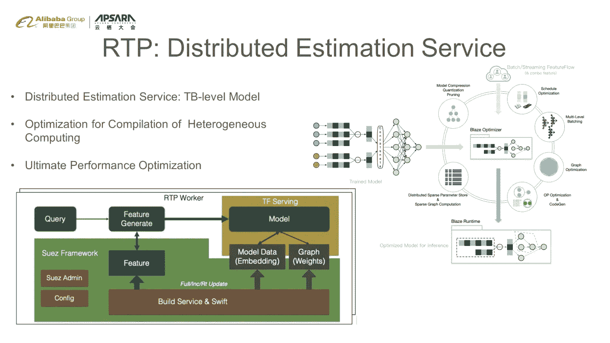

# AI OS 的新探索:面向算法工程的设备对设备平台

> 原文：<https://medium.datadriveninvestor.com/new-exploration-of-ai-os-a-device-to-device-platform-for-algorithm-engineering-fc8af3e6a99c?source=collection_archive---------36----------------------->

*在* [*赶 2020 Apsara 大会重播此链接*](https://www.alibabacloud.com/apsara-conference-2020/live-streaming) *！*

*由* [*麋鹿极客*](https://community.alibabacloud.com/users/5170386418630976) *主讲，特邀嘉宾阿里巴巴集团高级技术专家张迪*

今天的话题将聚焦深度学习算法工程。通过介绍淘宝上搜索、推荐和广告的最佳实践，我们将阐述阿里云如何为人工智能算法平台构建高效的设备到设备平台。

# 人工智能推动了淘宝上搜索、推荐和广告的深度技术发展

如今淘宝上呈现的大量内容已经针对成千上万的用户进行了个性化处理。以搜索、推荐和广告为核心的内容交付在个性化方面发挥了重要作用。在过去的五年里，深度学习技术等人工智能技术已经成为淘宝上搜索、推荐和广告改进的核心驱动力。**深度学习的关键要素是计算能力、算法和数据。**如何搭建高效的设备对设备 AI 平台，直接决定了业务规模和迭代效率。

# 对计算能力日益增长的需求

随着人工智能算法变得智能，对计算能力的需求不断增加。

*   从算法的角度来看，算法工程师希望自由地设计和组装模型，就像堆积积木和快速验证模型的效果一样。因此，随着全连接网络中各种结构的负载增加，对理解稀疏表示和表征连续行为的要求也在增加。
*   从计算规模来看，模型可以包含数百亿个特征，数千亿个参数，具备 TB 级能力。这对模型训练和在线评估提出了挑战。

# 改进的算法多样性

算法变得越来越多样化。除了标准的深度神经网络(DNN)模型，基于图形声音的网络、强化学习和基于树的深度学习等技术也在淘宝的业务中得到广泛应用。

*   图形-声音网络可以描述用户和产品之间的联系，通过使用图形嵌入提高产品召回能力。
*   强化学习技术有利于优化广告中的每次点击成本(OCPC ),使广告群花的每一分钱都更准确。
*   基于树的深度匹配技术将强大的模型特征能力集成到广告召回中。

# 设备到设备算法平台

日益增加的算法复杂性和多样性需要高效的设备到设备算法平台的支持。

## 三维优化目标

**1。对 AI 计算能力的无限需求**

该平台可以不断释放深度学习的计算能力，提高算法效果。

**2。迭代效率加速**

该平台提供持续的设备到设备体验，并确保算法的全过程迭代效率。

**3。支持算法创新**

平台的设计应具有高度的灵活性，以支持算法的不断创新。

# AI-OS:大数据深度学习的工程技术系统

作为大数据深度学习的工程技术体系，AI-OS 已经覆盖了 AIOfflinePlatform(综合建模平台)和 AIOnlineServing(在线 AI 服务系统)。它们是设备到设备大数据人工智能的引擎，用于离线系统的无缝连接。目前，AI-OS 一直在处理大数据，以支持 Alibaba.com 的搜索、推荐和广告业务。它指导的交易主导了阿里巴巴集团的电子商务市场。此外，作为中间平台技术的中坚力量，AI-OS 已经成为阿里巴巴集团、Alibaba.com、阿里云、优酷、菜鸟、Freshippo、DingTalk 的基础设施。更重要的是，AI-OS 中的云产品矩阵通过阿里云提供给全球开发者。

# 工业机器学习解决的问题

工业机器学习解决的问题涉及算法模型的代码开发。它还涵盖了离线闭环环境中的全过程问题，包括特征、样本和模型。

# 一体化建模平台

对于搜索、推荐和广告等场景，阿里云开发了一个一体化的建模平台。该平台提供全流程的设备到设备服务，如特征管理、样品组装、模型训练和评估以及模型交付。

基于 KubeFlow 在底层的云原生基础，一体化建模平台为用户提供批量学习和在线学习。

XFC 提供标准化管理和趋势的功能。通道是样本计算的抽象概念，而模型中心是由模型工厂提供的，用于模型训练、共享和交付。

模型分析系统中多维模型的可视化分析和模型安全性的验证不需要考虑底层系统的操作。在此基础上，算法工程师可以编辑算法流程的逻辑，完成算法流程的开发、部署和在线 O&M。该平台为计算存储提供了内置的统一沿袭管理。基于上述关系和对算法逻辑描述的分析，该平台具有一组用于计算存储和编辑的优化层。这些优化层可以自动优化特征、样本和模型数据的共享，以及计算存储。例如，当两组算法实验过程的重叠比例较高时，系统会自动合并那两组特征进行计算和存储，提高整个平台的存储效率。

通过一体化建模平台，可以实现更多的业务创新，并以更低的成本实施项目和效果验证。从而让用户实现从产品思路、算法到项目的快速迭代和循环。

# 批量在线集成深度学习解决方案

随着人们对服务时效性的日益追求，在线深度学习变得越来越重要。因此，阿里云提供了批量在线集成的深度学习解决方案，允许模型实时更新，用户实时捕捉客户的行为变化。

## 什么是批量联机集成？

批量-在线集成是指允许用户用一套算法逻辑完成日常批量学习和在线实时学习。它可以降低算法开发过程的复杂性，并确保完整数据模型和实时模型之间的一致性。

*   得益于 Blink 强大的计算能力，批量在线集成提供了高度可靠的丢失样本计算，在执行表征样本的实时计算时，QPS 高达数百万。通过 X-Deep Learning (XDL)，用户可以实现实时深度训练。批量在线集成还提供了高度可靠的实时模型验证。它基于实时传输协议(RTP)将模型更改实时更新到在线模型服务，并且可以在几分钟内提供设备到设备的模型更新。在阿里巴巴集团的搜索、推荐和广告中，批量-在线集成在提高系统的及时性方面发挥了重要作用。

# XDL:稀疏训练的高维引擎

深度学习中计算能力的提升主要涉及两个关键方面:

1.  深度模型训练的效率
2.  深度模型在线估计的效率

搜索、推荐、广告都是高维稀疏场景。它们的特征是**数百亿个特征和数千亿个参数。这些场景的模型既广泛又深入。因此，他们需要同时优化宽度和深度计算。**

XDL 是深度学习的分布式训练框架，专为高维稀疏场景设计。

*   XDL 的目标是执行大量的分布式模型优化和重新设计高性能的参数服务器。通过基于实时统计数据放置动态参数，XDL 消除了参数服务器的计算热点，并实施了出色的分布式灾难恢复策略。从而可以完成更高效的高并发训练。
*   它通过优化大量分布式计算图来加速计算。这些包括数据处理的高性能线、稀疏算子的融合、具有交换参数的通信合并以及计算和通信的最终异步化。这些优化使 XDL 能够支持具有数百亿个特征、数千亿个参数和数千个数据的分布式高维稀疏训练。此外，在自动分发和自动处理线方面的出色能力允许模型开发人员专注于他们的模型开发逻辑，而不用担心底层的细节。
*   在高层范式中，XDL 支持良好的结构训练和流训练。结构化训练是指在搜索、推荐、广告场景中，通过使用结构化的互联网样本，充分减少前面项目和后面项目的计算。它可以大大提高训练效率。

# RTP:分布式评估服务

RTP 作为 AI-OS 深度学习的分布式估算服务，通过模块化机器学习的在线估算能力，为模型应用提供强大的编排能力。因此，机器学习技术可以应用于在线服务的整个过程，如搜索、推荐和广告，包括回忆、细粒度排序、洗牌和摘要选择。

RTP 还可以支持一致性语义、分布式模型之间的完整数据交换和分布式特性。还可以支持 TB 级机型的在线服务。

*   深度学习模型的在线推理效率至关重要，因为模型需要在一定的延迟要求下执行大量的深度学习计算。因此，RTP 集成了一个专门的异构推理计算加速引擎。通过这样做，RTP 支持各种异构硬件，如 FPG、CPU、GPU 和阿里巴巴 NPU，为深度学习领域的业务提供强大的计算能力。
*   整个交付过程也很重要，无论是在离线训练模型还是在线评估模型中。在交付过程中，需要对模型进行量化压缩。此外，开发人员重写模型计算图的逻辑，以最大化模型的在线推理逻辑。

# 摘要

为了支持快速算法迭代，淘宝在线下闭环环境下搭建了一个设备到设备的算法平台。该平台允许算法解决方案在不同场景之间快速复制和迁移。该平台基于核心的训练引擎和评估引擎，在搜索、推荐和广告中使用高维度和稀疏场景进行深度场景优化。该平台还允许人工智能算法充分利用计算能力，最大限度地减少算法结果。

# 原始来源:

 [## AI OS 的新探索:面向算法工程的设备对设备平台

### 阿里巴巴 Clouder 年 10 月 23 日 176 点击此链接观看 2020 年 Apsara 大会重播！由麋鹿怪胎，与…

www.alibabacloud.com](https://www.alibabacloud.com/blog/new-exploration-of-ai%C2%B7os-a-device-to-device-platform-for-algorithm-engineering_596787)