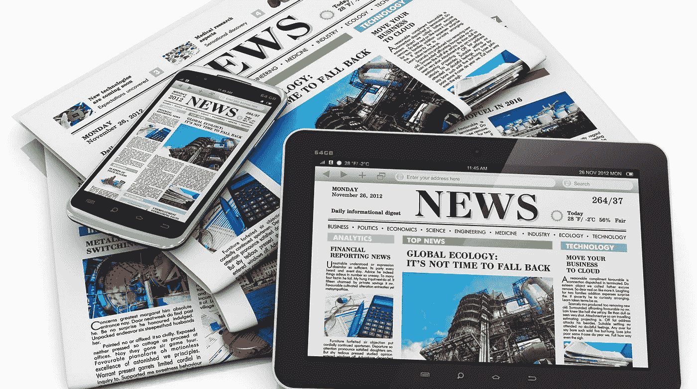

# 新媒体正在接管

> 原文：<https://medium.datadriveninvestor.com/new-media-is-taking-over-b05397c6176?source=collection_archive---------16----------------------->

Image Courtesy: TechCrunch

以前是三大网络。后来出现了有线电视。现在任何人都可以讲述他们的故事。

**子堆栈旋转**

过去几周新闻业最大的新闻是[格伦·格林沃尔德离开截击](https://greenwald.substack.com/p/my-resignation-from-the-intercept)。在他报道了爱德华·斯诺登之后，他与劳拉·珀特阿斯和硅谷巨头皮埃尔·奥米迪亚一起创立了“拦截”。但由于编辑分歧和审查制度，格伦离开了他帮助创建的媒体帝国。现在，格伦和其他许多人一样，加入了简讯平台 Substack。 [Substack 是一家总部位于硅谷的时事通讯初创公司，但其灵感来自微信](https://www.scmp.com/tech/apps-social/article/3105825/how-us-newsletter-site-substack-took-inspiration-chinas-wechat) ( [展示了全球科技抄袭中国的崛起](https://www.gartner.com/en/marketing/insights/daily-insights/how-us-tech-giants-copy-china))。其他一些离开知名媒体公司加入 substack 的著名记者包括:

*   [马特·泰比](https://taibbi.substack.com/)(之前在滚石——以[“吸血乌贼”](https://www.rollingstone.com/politics/politics-news/the-great-american-bubble-machine-195229/)文章而出名)
*   Matthew Yglesias (与 Ezra Klein 共同创立 Vox)

Substack 的天使投资人之一是比尔·毕晓普，他撰写关注中国的时事通讯 [Sinocism](https://sinocism.com/) ，是商界、金融界和政策界领袖信任的顶级“中国观察家”之一。

**YouTube 和播客**

YouTube 已经成为人们获取新闻的地方。年轻观众不再打开电视，而是登录 YouTube 观看他们最喜欢的新闻频道。超过 800 万人观看了两个月前乔·罗根对爱德华·斯诺登的采访。仅他的 YouTube 频道就有超过 1000 万用户。甚至像梅根·凯利这样的资深记者也开始走播客路线。

**新媒体变得“更新”**

就连新媒体公司的创始人也在离开，去重新创造这个领域。例如，迈克·艾伦和吉姆·文德黑伊都创造了政治。政治与华盛顿特区的传统媒体背道而驰，成为政治的“ESPN ”,像报道体育一样报道政治。迈克和吉姆随后都离开了政治，创办了 Axios，两位创始人都将其描述为“经济学人遇上 Twitter”，并以适合阅读和回复只有 280 个字符的新一代的方式讲述新闻。即使是格伦·格林沃尔德的前新闻媒体公司 Intercept，也已经是一个初创的媒体项目，旨在发出与主流媒体不同的声音。

 [## 社交媒体和通过赞助受欢迎度超过可信度的秘密审查|数据驱动的投资者

### “喜欢”按钮，如选项、鼓掌、关注或推荐按钮，是社交网络平台、互联网…

www.datadriveninvestor.com](https://www.datadriveninvestor.com/2020/11/19/social-media-and-covert-censorship-by-sponsoring-popularity-over-credibility/) 

**大型科技公司和风险投资公司正在意识到新媒体的潜力**

大型科技公司注意到了新媒体及其创造者日益增长的影响力。乔·罗根与 Spotify 签署了一项独家协议，让他的播客成为音乐和播客流媒体服务的独家内容。这笔交易价值 1 亿美元。梦工厂联合创始人兼投资人杰弗瑞·卡森伯格向 YouTube 政治新闻频道《少壮派》投资了 2000 万美元。[亚马逊想收购最后一家播客制造商 Wondery。](https://www.wsj.com/articles/amazon-in-talks-to-buy-podcast-maker-wondery-11606931396)谷歌、苹果、Spotify、SoundCloud、Podbean 和[这么多其他初创公司都在给独立播客一个推广他们作品的机会。](https://www.podcastinsights.com/best-podcast-apps/)

信息高速公路只会越走越宽

信息是一切的关键。无论你是投资者、权力掮客、决策者，还是普通的无名氏，了解世界上正在发生的事情都很重要。新闻对于设置议程也很重要。如果数据是新的石油，新闻就是新的燃料。现在，你不必成为鲁珀特·默多克(Rupert Murdoch)或有线电视的高薪新闻播音员来讲述新闻。你也不一定要去新闻学院才能称自己为记者或作家。只要有像样的无线网络连接和笔记本电脑，任何人都可以开始写作。这就是为什么我甚至开始在媒体上写作。我希望能够给出我的分析和观点。我一直热爱写作，想成为一名讲故事的人。媒体给了我追求梦想的机会。

子堆栈和播客也带来了独立性。没有人必须审查你的想法或被“思想警察”控制。你是名真正的独立记者和作家。这就是格伦·格林沃尔德(Glenn Greenwald)、马特·泰比(Matt Taibbi)和马修·伊格莱西亚斯(Matthew Yglesias)等资深记者离开老牌新闻机构成为独立作家的原因。信息高速公路越来越宽，让每个人都有发言权。新媒体革命的赢家将是作家和播客，他们可以提供独特的视角，为听众和读者提供价值，而主流学者不会看到、听到或重复这些观点。

**进入专家视角—** [**订阅 DDI 英特尔**](https://datadriveninvestor.com/ddi-intel)