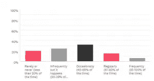
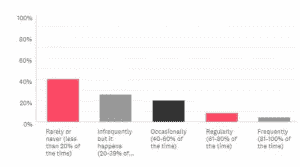

# 新调查让您对购物选择有了更深入的了解

> 原文：<https://medium.datadriveninvestor.com/new-survey-gives-insight-on-your-shopping-choices-e55303ab9b96?source=collection_archive---------23----------------------->

为什么买什么就买什么？你的购买是出于正确的原因吗？[研究表明](https://www.top10.com/blog/posts/survey-shows-most-customers-trust-their-gut-when-making-shopping-decisions)人们在购物时高估了自己的逻辑决策，反而在购物中做出许多非理性的选择。我们认为我们购物是基于自我导向的目标。事实上，我们的 [**很大程度上是由**](https://www.spring.org.uk/2009/12/when-situations-not-personality-dictate-our-behaviour.php) 我们的外部环境塑造的:广告和销售人员营造的环境，以及网站和商店的布局。

人们高估了自己控制冲动的能力，行为经济学家和神经科学家将这种趋势称为 [**克制偏差**](https://psycnet.apa.org/record/2011-20736-001) 。它是科学家称之为 [**认知偏差**](https://disasteravoidanceexperts.com/how-to-evaluate-unconscious-bias-caused-by-cognitive-biases-at-work/) 的一百多个精神盲点之一，导致我们在购物、 [**人际关系**](https://disasteravoidanceexperts.com/blindspots) 和 [**其他生活领域做出糟糕的选择。**](https://disasteravoidanceexperts.com/author-page/the-truth-seekers-handbook-a-science-based-guide/)

我们可以利用 [**研究型策略**](https://disasteravoidanceexperts.com/wise-decision-maker-movement-manifesto/)[**注意认知偏差**](https://disasteravoidanceexperts.com/how-to-evaluate-unconscious-bias-caused-by-cognitive-biases-at-work/)[**克服这些心理盲点**](https://disasteravoidanceexperts.com/nevergut/) 这是件好事。

# 那些认为自己处于控制中的人往往是最冲动的

[**关于克制偏差的研究表明**](https://www.ncbi.nlm.nih.gov/pubmed/19883487) 那些对自己的冲动控制能力评价较高的吸烟者往往会让自己受到更大的诱惑，从而导致更高的复吸率。所以如果你认为你很擅长控制冲动，请三思。

Top10.com 的[的一项新的在线调查为人们购物选择中的背景效应而不是内在目标和驱动力提供了更多的证据。该调查询问了超过 1000 名美国人的代表性样本，询问他们冲动购物的频率，他们的购物选择由他们最近了解到的事情引起的频率，以及环境影响他们购买决定的频率。](https://www.top10.com/)

通常，人们在回答这类问题时会低估自己的行为，尤其是在社交场合，因为他们对不得不承认自己的错误决定感到尴尬。回答网络调查时也是如此。

科学家将这种认知偏差命名为 [**购后合理化**](https://dl.acm.org/citation.cfm?id=3323453) ，指的是人们在做出购物决定后，无论是好的还是坏的决定，都会自我证明，并对购物决定产生更积极的感受。因此，外部驱动的购物行为的实际比率可能比调查结果中看到的要高得多。

# 沉浸在那一刻

当亲自购物时，只有五分之一的受访者表示他们很少或从不冲动购物。超过一半的受访者表示，他们购物时 40%的时间都在冲动购物。如果你考虑与冲动购物概念相关的负面内涵，正如关于如何停止冲动购物的 [**在线文章**](https://www.developgoodhabits.com/impulse-buying/) 甚至关于该主题的 [**治疗计划**](https://www.goodtherapy.org/learn-about-therapy/issues/compulsive-shopping) 所证明的那样，有理由假设现实情况要高得多。

这些数字描述了美国绝大部分的购物行为，这些行为仍然发生在人与人之间。例如，美国商务部 [**报告称**](https://www.thebalancesmb.com/compare-brick-and-mortar-stores-vs-online-retail-sites-4571050)2017 年，电子商务销售额总计仅为 4530 亿美元，而实体店销售额为 30.43 亿美元。尽管如此，与面对面销售相比，网上购物的增长速度更快，从 2016 年到 2017 年，电子商务增长了 16%，而同期实体店增长了 2%。

那么你认为有多少冲动购物发生在网上？看看下面的图表。

**当你亲自购物时，与深思熟虑后的购买决定相比，你冲动购物的频率有多高？**

**在网上购物时，与深思熟虑后的购买决定相比，您冲动购物的频率如何？**

两倍多的人尽量减少网上冲动购物，五分之二的人给出“很少或从来没有”的答案，相比之下，五分之一的人选择当面购买。超过三分之一的人表示，40%的时间会在网上冲动购物，相比之下，超过一半的人会在网上冲动购物。

# 如何解释这些差异？

[**研究显示**](https://www.emerald.com/insight/content/doi/10.1108/IntR-12-2016-0377/full/html) 网上评论经常推动人们的冲动购买行为。许多购物者因为相信他们在网上看到的评论而犯下危险的判断错误。尽管虚假评论无处不在，但大多数人并没有努力去了解如何识别假货。

[**研究发现**](https://aisel.aisnet.org/jais/vol12/iss1/3/) 影响网上冲动购物可能性的另一个因素与网站质量有关:如果网站看起来不错，我们更有可能冲动购物。 [**此外**](https://www.emerald.com/insight/content/doi/10.1108/10662241211250962/full/html) ，互动生动的网站也刺激了购买冲动。如果你想抑制冲动购物，就要小心这些网站。

然而，有一些因素可以限制网上冲动购物。生动只影响我们的视觉，只影响五种主要感觉中的一种。此外，当我们在网上橱窗购物时，我们可以使用购物比较网站 对商品进行快速比较，或者——如果没有其他选择——浏览在线评论。我们也可以放下手机或者远离电脑理性思考。

相比之下，亲自购物限制了这种比较，所以更难抗拒，因为我们的大多数感官都会受到刺激。人们不应该低估店内刺激的感官生动性的影响，因为它直接与我们的自动驾驶系统对话，我们的情感部分 [**激发了大多数**](https://disasteravoidanceexperts.com/wise-decision-maker-movement-manifesto/) 决策。这部分引导冲动购买，而我们的意向系统——我们的理性部分——一旦被情感上吸引人的刺激触发，往往无法阻止自动驾驶系统。

 [## 3 家发展最快的新兴数字健身公司|数据驱动型投资者

### 新冠肺炎疫情迫使世界各地的人们寻找他们喜欢的活动的解决方案和替代方案…

www.datadriveninvestor.com](https://www.datadriveninvestor.com/2020/10/21/the-3-fastest-rising-startup-digital-fitness-companies/) 

# 你的环境还是你的性格？

前 10 名调查显示，受访者没有自我意识到他们是在环境的驱使下做出购物选择的。冲动购买只是众多情境型购物决策中的一种。这意味着，购物决策的频率受到购物环境的外部环境(面对面和在线)的显著影响，必须比冲动购物决策的频率大得多。

然而，当被问及他们做出受环境影响的选择的频率时，受访者给出的数字低于他们为冲动购物给出的数字。约五分之二的当面购物和网上购物者表示，他们很少或从未根据具体情况做出购物决定。只有三分之一的人承认自己在 40%以上的时间里亲自做出购物决定，而只有不到三分之一的人在网上购物。

# 是怎么被诬陷的？

如何解释这种缺乏意识的现象？一个主要的罪魁祸首是被称为 [**框架效应**](https://science.sciencemag.org/content/211/4481/453) 的微妙而强大的认知偏见，即根据 [**环境如何为我们框架**](https://www.sciencedirect.com/science/article/abs/pii/S0167487000000325?via%3Dihub) 决定不同的倾向。

假设你走进一家鞋店，看到一个牌子，上面写着“买两双鞋，免费送一双鞋”这很诱人，即使你本来只想买一双，你也很可能会买。毕竟，你会得到一双免费的鞋子！

现在，想象一下，如果你走进另一家商店买一件毛衣，看到一个牌子写着“买两件毛衣，送第三件。”你会发现这个交易没那么诱人，因为为了得到免费赠品，你必须为两件毛衣付钱，而你原本想要的只是一件。

为什么会有这种反应？我们的情绪遵循第一印象，更喜欢最简单的路线。你更有可能选择鞋店，因为与毛衣店相比，鞋店首先提供免费的一双鞋，只有在说你必须先购买两双之后，才会得到快速的积极反应。

人们经常忽视的环境的另一个方面是信息环境，无论是来自外部环境还是零售商。人们通常会过度关注他们最近学到的一些情绪化的东西，尤其是负面信息，这种认知偏差被称为 [**注意力偏差**](https://psycnet.apa.org/doiLanding?doi=10.1037%2F0021-843X.111.1.107) 。

# 你能做什么？

你可以 [**开发一系列心理技能**](https://disasteravoidanceexperts.com/12-mental-skills-to-defeat-cognitive-biases/) 来避免你遇到的危险判断错误。

首先，承认你易受认知偏见的影响，并致力于解决它们。

第二，专注于 [**改变你的情境**](https://www.ncbi.nlm.nih.gov/pubmed/28346113) 来限制糟糕的购物决定。你可以在网上购物来避免诱惑。

第三，在购买前至少推迟半个小时做决定，或者如果可以的话再考虑一下。这有助于增加你的有意系统的吸引力。

第四，[、**列一个清单**、](https://www.amazon.com/gp/product/0312430000/ref=as_li_qf_asin_il_tl?ie=UTF8&tag=intentinsigh-20&creative=9325&linkCode=as2&creativeASIN=0312430000&linkId=f86e5426386bd62ad02033cc24c673e1)列出你要买的东西，每样多少，多少钱，也能帮到你。你不能对你买的所有东西都这样做，所以对一次性超过 100 美元的大额支出或你经常购买的物品这样做。

最后，高质量的建议**被发现有助于抑制糟糕的选择。这可能来自信誉良好的网上资源或你信任的人。确定这些人是谁，并在做出购物决定前咨询他们。**

# **关键外卖**

> **说到购物，我们高估了自己抑制冲动的能力。你可以通过培养大量购物心理技能来避免糟糕的购物选择。→ [点击发微博](https://twitter.com/intent/tweet?url=https%3A%2F%2Fdisasteravoidanceexperts.com%2F%3Fp%3D6045&text=When%20it%20comes%20to%20shopping%2C%20we%20overestimate%20our%20abilities%20to%20keep%20our%20impulses%20in%20check.%20You%20can%20avoid%20poor%20shopping%20choices%20by%20developing%20a%20host%20of%20shopping%20mental%20skills.%20&via=dr_gleb_tsipursky&related=dr_gleb_tsipursky)**

# **需要考虑的问题(请在评论区分享你的想法)**

*   **你上一次做出糟糕的购物决定是什么时候，不管是亲自还是在网上？**
*   **文章中有什么可以帮助你抑制冲动购物的吗？**
*   **根据阅读这篇文章，你将采取哪些后续步骤？**

**[***改编版***](https://www.top10.com/blog/posts/what-really-drives-you-to-buy-what-you-buy)**

***图片来源:*[*pix abay/stock snap*](https://pixabay.com/photos/wallet-money-credit-card-online-2125548/)**

***原载于* [*避灾专家*](http://disasteravoidanceexperts.com/new-survey-gives-insight-on-your-shopping-choices/)**

**—**

****简历** : [格莱布·齐布尔斯基博士](https://disasteravoidanceexperts.com/glebtsipursky/)是一位国际公认的思想领袖，他的使命是通过制定最有效的决策策略来保护领导者免受被称为认知偏差的危险判断错误的影响。作为一名畅销书作家，他最著名的作品是《T4》*《永远不要跟着感觉走:先锋领导者如何做出最佳决策并避免商业灾难* (职业出版社，2019 年)、《我们之间的盲点:如何克服无意识的认知偏见并建立更好的关系 (《新先驱》，2020 年)和《恢复力:适应并规划新冠肺炎冠状病毒疫情 (《变革者图书》，2020 年)他在[*Inc .*](https://www.inc.com/entrepreneurs-organization/a-behavioral-scientist-explains-why-your-swot-analysis-is-dangerously-flawed.html)[*企业家*](https://www.entrepreneur.com/article/348115)[*CBS 新闻*](https://www.cbsnews.com/video/study-says-taking-a-small-break-from-facebook-might-be-good-for-your-mental-health/)[*时代*](http://time.com/4257876/wounded-warrior-project-scandal/)[*商业内幕*](https://www.businessinsider.com/disaster-expert-companies-should-face-coronavirus-with-pessimism-2020-3)[*政府行政*](http://www.govexec.com/excellence/promising-practices/2017/03/heres-why-your-gut-instinct-wrong-work-and-how-know-when-it-isnt/136104/)[*慈善大事记中发表了超过 550 篇文章和 450 篇访谈他的专业知识来自于 20 多年的*](https://www.philanthropy.com/article/Opinion-Science-Shows/237890)*[咨询](https://disasteravoidanceexperts.com/consulting/)、[辅导](https://disasteravoidanceexperts.com/coaching/)、以及[演讲和培训](https://disasteravoidanceexperts.com/speaking/)作为[避灾专家](http://disasteravoidanceexperts.com/)的首席执行官，以及作为行为经济学家和认知神经科学家在学术界超过 15 年*的[。通过 Gleb[at]DisasterAvoidanceExperts[dot]com、Twitter](http://disasteravoidanceexperts.com/research)[@ Gleb _ tsipursky](https://twitter.com/Gleb_Tsipursky)、insta gram[@ dr _ Gleb _ tsipursky](https://www.instagram.com/dr_gleb_tsipursky/)、 [LinkedIn](https://www.linkedin.com/in/dr-gleb-tsipursky/) 联系他，注册他的免费[明智决策者课程](https://disasteravoidanceexperts.com/newsletter/)。**

## **访问专家视图— [订阅 DDI 英特尔](https://datadriveninvestor.com/ddi-intel)**