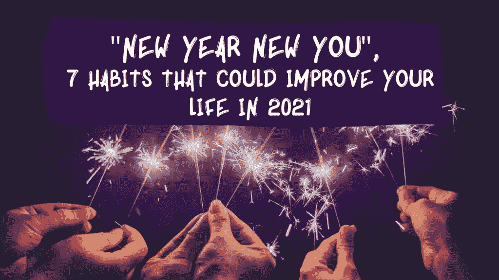

# 新年新的你，2021 年能改善你生活的 7 个习惯

> 原文：<https://medium.datadriveninvestor.com/new-year-new-you-7-habits-that-could-improve-your-life-in-2021-e006fccebdb8?source=collection_archive---------25----------------------->

canva.com user-edited photo

当你经历生活方式的改变时，让你的 2021 年轰轰烈烈地开始吧，去掉某些不会给你的生活带来任何好处的习惯，代之以能改变生活并带来全年成功的习惯。

如果你迫切需要改变，以便成为你渴望成为的人，因为你认为你今年没有做任何有价值的事情，那么不要犹豫，在新的一年里这样做，因为新的一年总是让你的生活变得更好的好方法

记住，新的一年意味着新的开始，是时候翻开新的一页，开始你生活的新篇章了。所以，不管你以前做过什么不值得骄傲的事情，都把过去一年发生的事情抛在脑后，永远不要回头看。

在进入崭新的一年时，总是欢迎一个新的开始，也就是说，做一些未来的自己会感谢你的事情，这是形成习惯，这将从根本上改善和改变你的生活，并帮助你获得成功。

## 话虽如此，我还是在下面列出了 7 个你可以开始做的有效习惯，它们将有利于你来年的进步和成功。

canva.com user-edited photo

**1)通过社交媒体排毒来照顾你的心理健康**——通过减压和限制使用社交媒体来放松自己。如果你不需要使用手机或笔记本电脑，就把它们收起来，除非是重要的事情，因为这对你的心理健康没有好处，因为研究表明，我们在社交媒体上花的时间越多，就越有可能患抑郁症。

限制你对电子产品的使用，如果可以的话，不要每天花太多时间在电子产品上。我知道现在很难做到这一点，特别是因为我们生活在一个数字世界已经占据了我们生活的方方面面的时代，但这样做不仅可以改善一个人的心理健康，而且对身体健康也有好处，因为例如，由精神混乱引起的压力与二型糖尿病等重大疾病有关。

**2)把自己放在第一位的习惯**——通过练习自我保健，你已经把自己放在第一位了。告诉自己为什么你是重要的，做一些让你开心的事情，帮助你改善生活。做一些让你自我感觉良好的事情，无论是学习一门你一直想学的新技能，享用一顿美餐，还是进行一次皮肤护理，等等。不管是什么，确保你从中受益。

感恩并开始更多地欣赏——开始每天的感恩练习，训练你的大脑不断寻找生活中发生的好事，不要想当然。我们每个人都有别人没有的幸运之处，我知道很容易被别人的成功所吸引，但现在是时候去欣赏我们所拥有的每一件小事以及每天仍然和我们在一起的亲人了。通过开始欣赏生活中的小乐趣，你会变得越快乐，因为它创造了积极，消除了压力，改善了你的生活方式

每天提醒自己，每次上床睡觉时，你都感激什么。写日记，实践这个习惯，让生活更快乐。

**整理床铺**——每天醒来的时候，不要把你的床弄得乱七八糟，相反，要整理好你的床铺！你的物质环境对你的精神状态有很大的影响，整理床铺会鼓励你在一天的剩余时间里有条不紊，并改善你的情绪。当你没有条理的时候，你不可能平静、放松、专注，所以整理床铺是练习组织技巧的第一步，并使之成为一种习惯。

**5)不自我专注，乐于学习**——每天花些时间阅读或研究你感兴趣的话题，学习一些新东西，如果阅读不是你的强项，考虑通过播客、有声读物或视频等平台学习，因为这些形式非常方便，尤其是在当今时代。这些在旅行或通勤时也很有帮助，你不会浪费时间，而是会有一段富有成效的时间来获取新知识。

另一种学习新事物的方法是通过你每天交谈或遇见的人。做一个倾听者，不要太专注于自己，因为你也会从别人的经历或建议中获得知识。此外，不要害怕问，因为他们可以教你一些你以前没有经历过的事情，比如克服挑战性的情况等。

一次专注于一件事——虽然偶尔多做几件事没有坏处，但有时不停地在任务间转换会限制你的注意力，只会造成精神混乱，因为这让你的大脑很难过滤掉不相关的信息。根据斯坦福大学进行的研究，繁重的多任务处理会降低效率，还可能损害一个人的认知控制。话虽如此，重要的是在尽可能转移到下一个任务之前专注于一个单一的任务。试着列出你需要在一天内完成的事情。管理好你的时间，从最重要的任务开始，一直到最不重要的任务。

不要和消极的人混在一起，不要做一个取悦他人的人——你不可能取悦所有人，所以不要做一个取悦他人的人，这样你就不会把这些人排除在你的生活之外，相反，只和那些给你的生活带来好处的人在一起。让你周围都是积极向上、志同道合的人，他们接受真实的你，放下那些让你沮丧而不是让你振作的关系。你不需要为了让人们喜欢你而改变自己，因为不管你是谁，拥有什么，合适的人都会关心你。你应该仔细考虑你和谁在一起。

~~~~~~~~~~~~~~~~~~~~~~~~~~~~~~~~~~~~~~~~

**如果你错过了我们之前的文章，可以点击下面这些链接阅读；**

 [## 健康生活的最佳新年决心

### 对我们许多人来说，新的一年意味着新的开始，这就是为什么每当一年即将结束时，人们都会开始…

stephup.medium.com](https://stephup.medium.com/the-best-new-years-resolution-for-a-healthy-living-565cc74c371d)  [## 为什么我们需要保持水分？

### 你有没有过这样的感觉，每天有太多的事情要做，在某个时候你的身体…

stephup.medium.com](https://stephup.medium.com/why-do-we-need-to-stay-hydrated-11d0a3f84582)  [## 更好的你的 10 个个人发展目标(自我提升)

### 设定目标会给你一种生活的目标感，让你把时间和精力集中在真正重要的事情上

medium.com](https://medium.com/datadriveninvestor/10-personal-development-goals-for-a-better-version-of-you-self-improvement-2b87194a3ac9) 

## 获得专家观点— [订阅 DDI 英特尔](https://datadriveninvestor.com/ddi-intel)