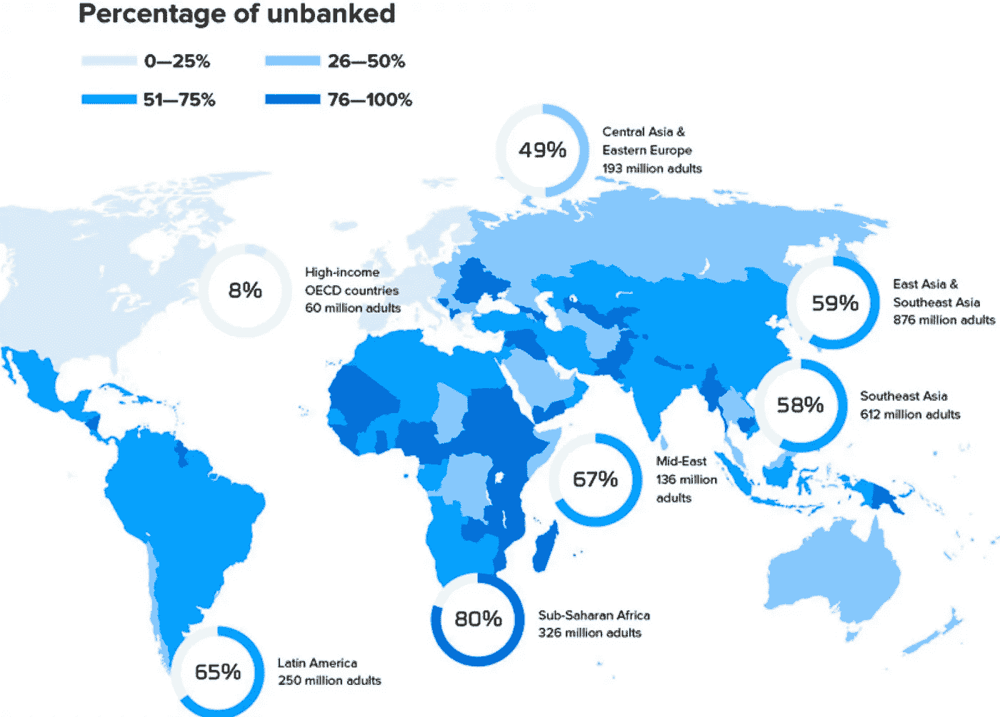
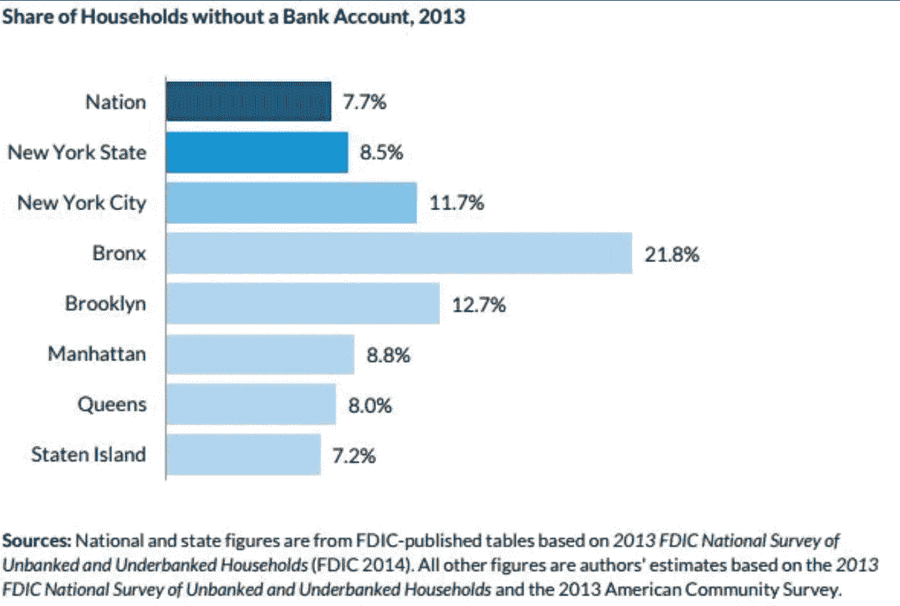

# 纽约计划给没有银行账户的人一个“电子钱包”

> 原文：<https://medium.datadriveninvestor.com/new-york-plans-to-give-the-unbanked-an-e-wallet-a69b774f84dc?source=collection_archive---------0----------------------->

## 他们称之为“公共 Venmo”。

世界银行估计，今天仍有 17 亿成年人“没有银行账户”。也就是说，他们没有金融机构或移动货币提供商的银行账户。

这是一个全球性问题，但它对发展中经济体的损害最大:

迄今为止，脸书和谷歌等大型科技公司已经提出了解决方案。毕竟，在今天的大多数国家，拥有智能手机的成年人比拥有银行账户的成年人还多。

用扎克伯格的话来说，脸书的 Libra 加密货币是迄今为止创建所需的“数字金融架构”的最明显尝试。

 [## 分散金融的出现|数据驱动的投资者

### 当前的全球金融体系为拥有资源、知识和财富的人创造了巨大的财富

www.datadriveninvestor.com](https://www.datadriveninvestor.com/2019/03/14/the-emergence-of-decentralized-finance/) 

这给科技公司带来了商机，许多科技公司都在为创建发展中国家的数字基础设施而战。

迄今为止，很少有公共机构提出连贯的计划来解决这一问题。

因此，本周阅读《Vice》杂志 **上的** [**很有意思，纽约的目标是发展一个“公共 Venmo”来吸引更多的人进入当地经济。**](https://www.vice.com/en_ca/article/pked9v/new-york-is-proposing-the-creation-of-a-public-venmo)

像 Venmo 这样的服务允许用户通过应用程序从他们的应用程序余额中免费汇款。不过，他们确实对某些交易收取手续费，而且这些交易与银行账户相关联。

例如，与拉丁美洲相比，美国没有巨大的“无银行账户”问题。

尽管如此，美国仍有 8%的成年人(纽约州为 9%)没有银行账户，可能最终要依赖利息过高的短期贷款提供商。此外，那些通过直接存款获得报酬的人需要支付大量费用才能获得他们的工资。

这些美国居民表示，他们没有或不能开立银行账户的主要原因是，他们没有政府颁发的身份证，他们不信任银行系统，或者他们无法维持银行要求的最低账户余额。

后一种回应指出了一个根本的挑战，提供免费的网上银行无法解决这个问题。比起银行账户，人们更需要钱，但那是另一天的时事通讯。

# 那么，纽约的系统会如何运作呢？

提议的法案被称为包容性价值总账(你可以在这里看到它**)，如果通过，它“将创建该国第一个公有电子银行平台，以及一种可以在该国境内交换商品和服务的数字货币。”**

**每个居民都将得到一个电子钱包，他们可以在州内通过这个钱包即时、免费地发送和接收资金。州政府也可以将退税款和福利发送到电子钱包中。显然，这些支出每年总计 550 亿美元，因此应该可以启动整个微观经济。**

**纽约并不是唯一一个本币可以站稳脚跟的地方。 [**这家巴西社区银行**](https://www.uclg-cisdp.org/en/observatory/banco-palmas) 看起来很迷人，可能很快就值得一试。现在在巴西的贫民区有超过 50 个类似的项目。**

**纽约的计划在通过之前还有很长的路要走，更不用说实施了。尽管如此，这是一个现实的建议，其他公共机构可以借鉴。如果没有别的，它创造了扎克伯格先生所设想的脸书驱动的反乌托邦的另一种选择。**