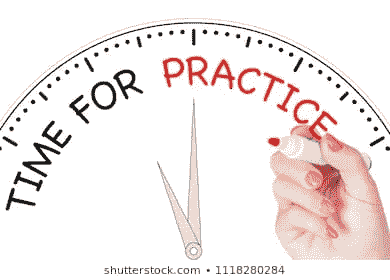

# 新手数据科学家？如何保持专注…

> 原文：<https://medium.datadriveninvestor.com/newbie-data-scientist-how-to-keep-you-focus-fc6e135caf9e?source=collection_archive---------14----------------------->

如果你只是转到数据科学领域，很难记住所有的数据科学术语。如果你刚完成一个为期 3 个月的训练营，那会更有挑战性。无论你是在在线训练营还是在校园里学习，一旦你完成了那些日常高强度的数据科学练习，一旦压力释放，保持动力可能会很难。如何保持专注？让我们来看几个非详尽的想法，无论你是在找工作还是在做自己的生意/项目，你都可以使用它们。

## 经常练习。

> “熟能生巧”

虽然我更像一个“萨尔瓦多·达利”——我提到达利只是因为我喜欢他的名言:“不要害怕完美。你永远也够不着。’(不是我们在这里要讨论的)——我不得不承认，练习有助于取得真正的进步。我们总是记得我们每天做的事情，因为它已经成为我们日常生活的一部分。事实上，我们可以对数据科学算法和机器学习模型进行同样的研究。养成定期练习的习惯。

**Practice image from shutterstock.com**

首先，每天或每周进行编码挑战有助于掌握编码的模糊性。至少对我来说，编码大部分时间是一个脑筋急转弯，直到我形成了解决问题的心态。通过实践获得。必须处理不同类型的代码挑战可以带来自信，并为任何技术面试做好准备。其次，参与项目可以提高我们解决现实世界问题的技能。资源是无限的——我们必须选择我们想谈论的话题。符合我们的专长或兴趣。虽然有些网站为练习几种机器学习模型提供了干净的数据。我更喜欢使用 python 工具，比如 web-scraping，来收集数据、清理数据并进行分析。数据永远不会为我们在现实世界中使用做好准备。

 [## 成为数据科学家所需的 8 项技能|数据驱动型投资者

### 数字吓不倒你？没有什么比一张漂亮的 excel 表更令人满意的了？你会说几种语言…

www.datadriveninvestor.com](https://www.datadriveninvestor.com/2019/02/07/8-skills-you-need-to-become-a-data-scientist/) 

## 写作、教学或谈论数据科学

发现某人精通一门复杂学科的一种方法是请他/她用简单的英语解释它。类似的问题总是在采访中出现:“你如何向一个 5 岁的孩子解释《随机森林》？你怎么通俗地解释梯度下降？”如果你优先考虑谈论数据科学，你将能够习惯这些术语。这就像在用一种新语言交流时感到舒服一样。你必须通过交谈来掌握正确的口音、发音和词汇。这同样适用于数据科学，因为与数据科学家的定期对话或交流将培养“数据科学家”的本能:使用什么机器学习模型，什么可视化最适合特定类型的分析等等。如果进行公开对话成为一个问题，我可以推荐网络作为一个很好的练习来结识人们并谈论数据科学。最终，它会帮你找到一份工作。此外，你可以使用 Youtube 或 Twitter 这样的媒体来互动或分享视频内容，在这里你可以解决一个问题并提出一些合理的解决方案。

教学和写作还有另一个优势，因为它也提高了你的沟通技巧。在我最近的一篇博客文章中，我强调了有效沟通的重要性，因为“数据科学家不是在真空中工作的；他应该能够利用数据与多个利益相关方沟通，同时也应该是一个积极的倾听者。”对于一个数据科学家来说，拥有一个博客是很重要的，他可以在这里分享他的想法并不断地写作。这将使他为将来要做的任何报告或陈述做好准备。验证模型是好的，但是你需要能够以一种非数据人员能够理解的方式呈现你的最终结果。维护博客在某种程度上为此做了准备。教学收益无穷。

我有几个其他的活动，我会在下一篇文章中开发。我希望今天分享的一个想法可以帮助你重新获得注意力。下周我将继续这个话题。
如果你想讨论——你可以联系我！分享想法和谈论一般的数据科学将是一件愉快的事。