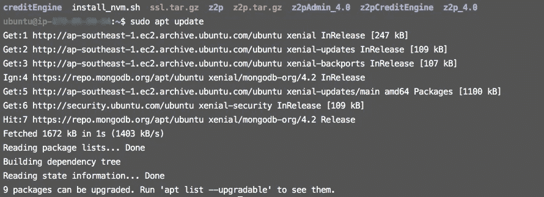
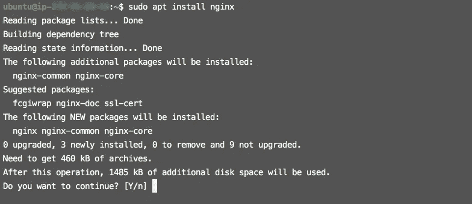
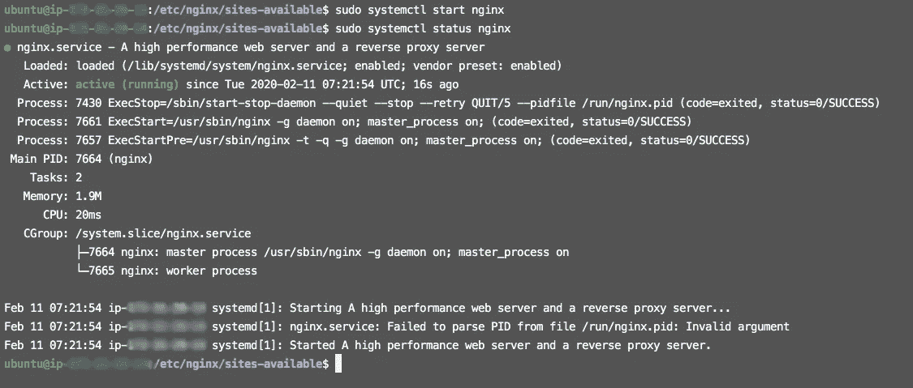
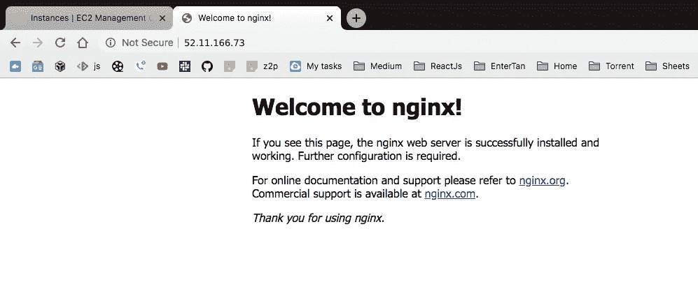
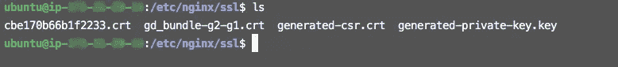
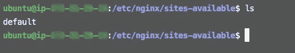
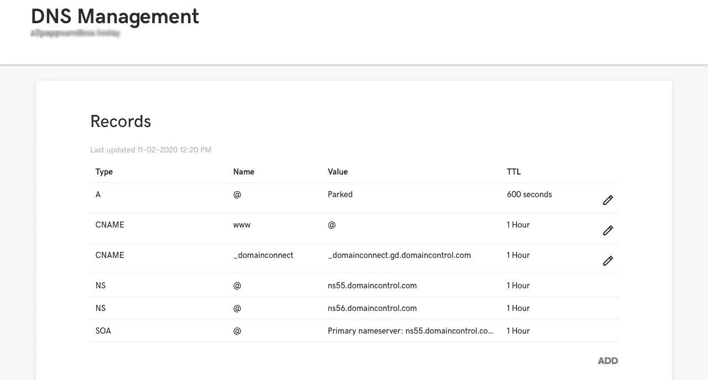
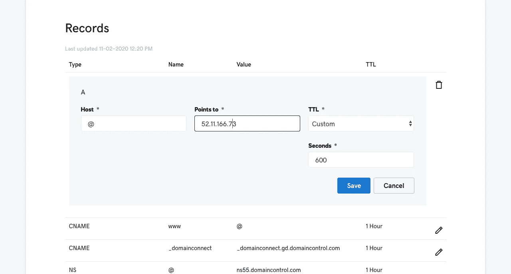

# AWS EC2 Linux 上的 Nginx 服务器 SSL 设置

> 原文：<https://medium.datadriveninvestor.com/nginx-server-ssl-setup-on-aws-ec2-linux-b6bb454e2ef2?source=collection_archive---------0----------------------->


在本文中，我们将讨论如何使用 SSL 在 **Nginx** 服务器中设置任何域。 **Nginx** 可以处理大量的连接， **NGINX** 通常用作反向代理和负载平衡器来管理传入的流量，并将其分发到较慢的上游服务器。

[](https://www.datadriveninvestor.com/2019/03/25/a-programmers-guide-to-creating-an-eclectic-bookshelf/) [## 创建折衷书架的程序员指南|数据驱动的投资者

### 每个开发者都应该有一个书架。他的内阁中可能的文本集合是无数的，但不是每一个集合…

www.datadriveninvestor.com](https://www.datadriveninvestor.com/2019/03/25/a-programmers-guide-to-creating-an-eclectic-bookshelf/) 

在开始之前，我假设这些点都准备好了。

> 1.获得了一个域名。
> 2。为 http 连接打开了端口 80。
> 3。为 SSL 或 https 连接打开了端口 443。
> 4。获得了 SSL 证书。
> 5。已下载私钥、证书和捆绑文件。

**第一步:-连接你的服务器**

通过`ssh`命令将服务器连接到本地终端。

```
$ ssh -i [key] ubuntu@[DNS]
```

**步骤 2:-更新软件包**

通过`update`命令更新所有包。

```
$ sudo apt update
```



**步骤 3:-安装 Nginx**

通过下面的命令安装 Nginx。

```
$ sudo apt install nginx
```



**步骤 4:-验证 Nginx**

当您检查**状态时。**它应该**激活**，如果它没有激活，那么你必须通过下面的命令启动 Nginx。

```
**Start Nginx:-**
$ service nginx status**Status Nginx:-** $ sudo service nginx start
```



如果状态是**活动(运行)**那么你可以通过 Ip 地址点击浏览器，你会在你的窗口上看到 Nginx 的默认页面。



现在， **Nginx** 已经成功安装并正常运行。

**步骤 5:-保存密钥和证书**

现在，证书和私钥保存在你的服务器上的`/etc/nginx/ssl`里。如果`**ssl**`文件夹不存在，则创建并保存文件。



**步骤 6:-修改默认文件**

转到`/etc/nginx/site-available`，在默认文件中添加代码。这里`/etc/nginx/site-available`默认文件和`/etc/nginx/site-enable`默认文件是软连接的。如果您要更改`site-available`默认文件的代码，那么`site-enable`默认文件的代码会自动更改。

```
server {
       listen 80;
       server_name example.com [www.example.c](http://www.z2psandbox.today)om;
       return 301 [https://example.com$request_uri](https://z2psandbox.today$request_uri);}server {
       listen 443 ssl;server_name example.com web.example.com;
       **# Certificate**
       ssl_certificate /etc/nginx/ssl/cbe170b66b1f2233.crt;

       **# Private Key**
       ssl_certificate_key /etc/nginx/ssl/generated-private-key.key;
       location / {
               proxy_pass [http://localhost:5000](http://localhost:5000);
               proxy_set_header Host $host;
               proxy_set_header X-Real-IP $remote_addr;
               proxy_set_header X-Forwarded-For $proxy_add_x_forwarded_for;
               proxy_set_header X-Forwarded-Proto $scheme;}
}
```



核实这些变化是否有任何错误。您可以通过下面的命令进行检查。

```
**Test Nginx Configuration:-**$ service nginx configtest
$ sudo nginx -t
```

`service nginx configtest`命令告诉你是否有错误。


`nginx -t`命令告诉我们哪里有什么错误。


修复错误后，现在一切正常，然后你可以通过这些命令**重启**或**重新加载**你的服务器。

```
**Restart Nginx:-** $ service nginx restart **Reload Nginx:-** $ service nginx reload    OR**Start Nginx:-**
$ service nginx status**Status Nginx:-** $ sudo service nginx start
```


**第 7 步:-更改 A 记录**

您应该必须更改`**A**`记录，因为 A **记录**将域名映射到 IP 地址。去域名提供商那里，你的域名是可用的。如果它在 **GoDaddy** 中，那么您应该在 DNS 设置中更改 **A 记录**。



现在，您应该可以使用`https`访问您的网站。

**基本 Nginx 命令:-**

```
**Start Nginx:-** $ sudo service nginx start 
$ sudo systemctl start nginx**Stop Nginx:-**$ sudo service nginx stop 
$ sudo systemctl stop nginx**Restart Nginx:-**$ service nginx restart 
$ systemctl restart nginx**Reload Nginx:-**$ service nginx reload 
$ systemctl reload nginx**Status Nginx:-**$ service nginx status 
$ systemctl status nginx**Test Nginx Configuration:-**$ sudo nginx -t 
$ service nginx configtest
```

*保护您的服务器。*🤓

欢迎在评论区提出任何问题或疑问，或者你可以在脸书上 ping 我。