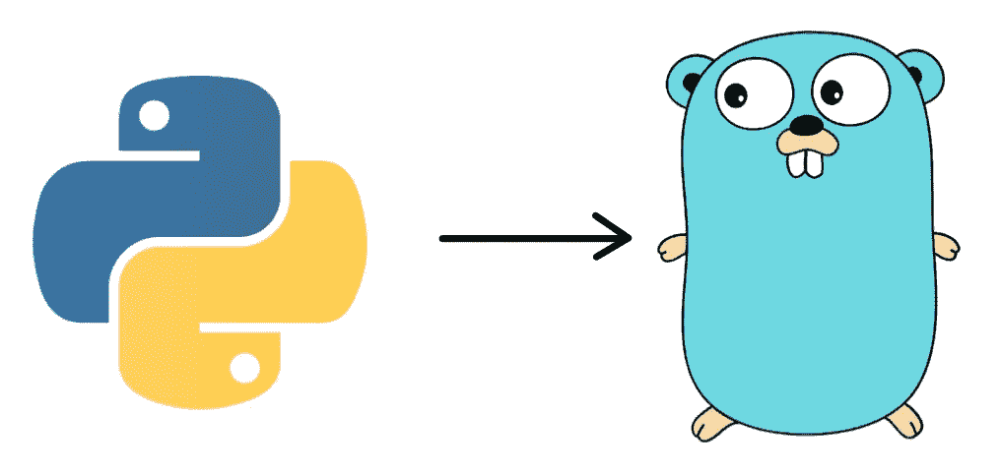
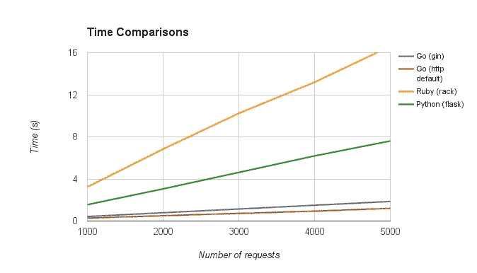

# 从 Python 转到 Go 的九个理由

> 原文：<https://medium.datadriveninvestor.com/nine-reasons-to-switch-from-python-to-go-f1b0cd746974?source=collection_archive---------0----------------------->



切换到一种新的编程语言通常是一件大事，尤其是当团队成员对原始语言有很多经验的时候。今年早些时候， [Stream 的](https://getstream.io/)将其主要编程语言从 Python 切换到 Go。本文将解释他们决定从 Python 转向 Go 的一些原因。

# 使用 Go 的理由

# 原因 1 —性能



围棋非常快。其性能接近 Java 或 c，Go 比 Python 快 30 倍。

# 原因 2 —语言本身的性能很重要

对于许多应用程序来说，编程语言只是应用程序和数据库之间的粘合剂。语言本身的表现通常并不重要。

Stream 是一个 API 提供商，为 500 家公司和超过 2 亿的最终用户提供反馈基础设施。多年来，我们一直在优化 Cassandra、PostgreSQL、Redis 等软件的性能，但现在我们已经达到了我们正在使用的编程语言的极限。

[](https://www.datadriveninvestor.com/2019/03/25/a-programmers-guide-to-creating-an-eclectic-bookshelf/) [## 创建折衷书架的程序员指南

### 每个开发者都应该有一个书架。他的内阁中可能的文本集合是无数的，但不是每一个集合…

www.datadriveninvestor.com](https://www.datadriveninvestor.com/2019/03/25/a-programmers-guide-to-creating-an-eclectic-bookshelf/) 

Python 是一种很棒的语言，但是对于诸如序列化/反序列化、排序和聚合之类的例子，它表现很差。我们经常遇到性能问题，Cassandra 需要 1ms 的时间来检索数据，Python 在接下来的 10ms 内将其转换为对象。

# 原因 3——开发者效率，没有太多创新

请看一下教程“如何开始学习围棋”这一节的围棋代码。

```
type openWeatherMap struct{}func (w openWeatherMap) temperature(city string) (float64, error) {
    resp, err := http.Get("http://api.openweathermap.org/data/2.5/weather?APPID=YOUR_API_KEY&q=" + city)
    if err != nil {
        return 0, err
    } defer resp.Body.Close() var d struct {
        Main struct {
            Kelvin float64 `json:"temp"`
        } `json:"main"`
    } if err := json.NewDecoder(resp.Body).Decode(&d); err != nil {
        return 0, err
    } log.Printf("openWeatherMap: %s: %.2f", city, d.Main.Kelvin)
    return d.Main.Kelvin, nil
}
```

如果您是新手，阅读这段代码不会有太多惊喜。它演示了赋值、数据结构、指针、格式和内置的 HTTP 库。

刚接触编程的时候，一直喜欢用 Python 的高级特性。Python 让你从你正在编写的代码中获得很好的想法。例如，您可以:

*   当代码初始化时，自己用元类注册该类
*   对错转换
*   将函数添加到内置函数列表中
*   用魔术方法重载运算符

这些特性很有趣，但大多数程序员认为这增加了阅读他人代码的难度。

Go 强制你使用最基本的东西，这样很容易读懂别人的代码。

*注:当然，“容易”取决于具体项目。如果你想创建一个基本的 CRUD API，我还是推荐使用 Django 和* [*DRF*](http://www.django-rest-framework.org/) *或者 Rails*

# 原因 4 —并发和通道

作为一门编程语言，Go 一直保持着尽可能的简单。它没有引入太多新概念，因为目标是创建一种易于使用的编程语言。它唯一有创新的地方是路线和渠道。Goroutines 是 Go 的轻量级线程解决方案，Channels 是与 Goss 交互的首选方式。

Goroutines 非常轻量级，只需要几千字节的额外内存。由于 go routine 非常轻量级，因此可以同时运行数百甚至数千个 go routine。

您可以使用通道在 Goroutines 之间进行通信。Go 运行时处理所有的内部复杂性。Goroutines 和基于通道的并发方案使应用程序可以轻松使用所有可用的 CPU 内核并处理并发 ioo，而不会使开发复杂化。与 Python/Java 相比，在 Goroutinerequires 上运行一个函数需要很少的固定代码。您只需使用关键字“go”调用该函数:

```
package mainimport (
    "fmt"
    "time"
)func say(s string) {
    for i := 0; i < 5; i++ {
        time.Sleep(100 * time.Millisecond)
        fmt.Println(s)
    }}func main() {
    go say("world")
    say("hello")
}
```

[https://tour.golang.org/concurrency/1](https://tour.golang.org/concurrency/1)

Go 的并发解决方案很好用。与 Node 相比，这是一个非常有趣的场景，在 Node 中，开发人员必须密切关注如何处理异步代码。

Go 并发的另一个焦点是[竞争检测。](https://blog.golang.org/race-detector)它让应用程序很容易知道异步代码中是否有任何竞争条件。

以下是了解 Go 和渠道的一些重要资源:

*   【https://gobyexample.com/channels 
*   [https://tour.golang.org/concurrency/2](https://tour.golang.org/concurrency/2)
*   [http://guzalexander . com/2013/12/06/golang-channels-tutorial . html](http://guzalexander.com/2013/12/06/golang-channels-tutorial.html)
*   [https://www.golang-book.com/books/intro/10](https://www.golang-book.com/books/intro/10)
*   [https://www . going go . net/2014/02/the-nature-of-channels-in-go . html](https://www.goinggo.net/2014/02/the-nature-of-channels-in-go.html)
*   [go routines vs Green threads](https://softwareengineering.stackexchange.com/questions/222642/are-go-langs-goroutine-pools-just-green-threads)

# 原因 5 —编译速度快

用 Go 写的最大的微服务项目，只需要 6 秒钟就可以编译完成。与 Java 和 c 等语言的龟速编译相比，Go 的快速编译速度是其主要生产力。

# 原因 6 —组件团队的能力

先说这个数据:围棋开发者没有 C 和 Java 多。根据 [StackOverflow，](https://insights.stackoverflow.com/survey/2017) **38%** 的开发者使用 Java， **19.3%** 使用 C，而**只有 4.6%** 使用 Go。 [GitHub 数据](https://madnight.github.io/githut/)显示[类似的趋势:](http://githut.info/) Go 比 Erlang、Scala、Elixir 等语言应用更广泛，但不如 Java、c 流行。

幸运的是，Go 是一门非常简单易学的语言。它只提供您需要的基本功能，没有其他额外功能。它引入了新的概念，如[“defer”](https://blog.golang.org/defer-panic-and-recover)语句和内置的“go 例程”以及通道并发管理。团队中任何一个 Python、Elixir、C、Scala 或者 Java 开发人员都可以在一个月内学会用 Go 编程，因为 Go 太简单了。

与其他语言相比，我们发现建立一个 Go 开发团队更容易。如果你在竞争激烈的环境中招聘，这是一个非常重要的优势，比如博尔德和阿姆斯特丹。

# 原因 7 —强大的生态系统

对于我们这样规模的团队(大约 20 人)来说，生态系统非常重要。如果你必须重新发明所有的功能，你就不能为你的客户创造价值。Go 对于我们经常使用的工具是一个很大的支持。比如 Redis、RabbitMQ、PostgreSQL、模板解析、任务调度、表达式解析、DBRocks 等都可以使用现成的库。

与 Rust 或 Elixir 等其他较新的语言相比，Go 具有巨大的生态系统优势。尽管它不能与 Java、Python 或 Node 相比，但您会发现许多基本需求都有高质量的包。

# 原因 8 — Gofmt，强制代码格式化

Gofmt 是一个优秀的命令行程序，内置于 Go 编译器中，用于格式化代码。从功能上来说，和 Python 的 autopep 8 差不多。我们大多数人不喜欢争论制表符和空格，但是格式的目标是一致的，实际的格式标准位置并不重要。Gofmt 以一种正式的方式格式化代码，以避免所有这些争论。

# 原因 9 — gRPC 和协议缓冲区

Go 为协议缓冲区和 gRPC 提供一流的支持。这两个工具完美地结合在一起，构建了一个通过 RPC 进行通信的微服务器。您只需要编辑一个定义 RPC 调用及其参数的清单文件，服务端和客户端就可以从中自动生成适当的代码。这样不仅速度快，而且占用网络空间少，使用起来更方便。

其他语言(如 C、Java、Python 和 Ruby)的客户端代码可以基于同一个清单文件生成。这样就和内部 REST 接口没有冲突，我们也不用每次都写几乎一样的客户端和服务端代码。

# 使用 Golang 的缺点

# Cons1 —缺乏框架

Go 没有一个 staple 框架，比如 Ruby 的 Rails、Python 或者 Django 或者 PHP 的 Laravel。这个话题在 Go 社区引起了激烈的争论，许多人认为现成的框架不应该用来启动一个项目。在某些情况下，我完全同意这一点。然而，如果你想构建一个简单的 CRUD API，使用 Django/DJRF、Rails Laravel 或 [Phoenix 会更容易。](http://phoenixframework.org/)

# Cons2 —错误处理

Go 通过简单地从函数返回错误来处理错误。虽然这种情况是存在的，但是很容易丢失错误的范围，从而很难向用户提供有价值的错误消息。错误包通过[返回](https://github.com/pkg/errors)错误的上下文和错误堆栈来解决这个问题。

还有一个问题，很容易忘记处理错误。虽然 errcheck 和 megacheck 等静态分析工具可以避免这些错误，但总感觉不够完美。也许我们应该期待一个语言级别的错误处理方案。

# 缺点 3 —包装管理

Go 的包管理并不完美。默认情况下，它无法指定依赖项的特定版本，也无法创建可重复的构建场景。Python，Node，Ruby 都有比较好的包管理系统。然而，如果使用正确的工具，Go 的包管理可以变得更容易。

您可以使用 [Dep](https://github.com/golang/dep) 来管理依赖关系，它指定并固定版本。此外，我们为多项目管理提供了一个名为 [VirtualGo](https://github.com/getstream/vg) 的开源工具。

# Python vs Go

我们做了一个有趣的实验，用 Go 重写了最初的 [Python 编写的提要](https://getstream.io/docs/#custom_ranking)。看看这种排序方法的一个例子:

```
{
    "functions": {
        "simple_gauss": {
            "base": "decay_gauss",
            "scale": "5d",
            "offset": "1d",
            "decay": "0.3"
        },
        "popularity_gauss": {
            "base": "decay_gauss",
            "scale": "100",
            "offset": "5",
            "decay": "0.5"
        }
    },
    "defaults": {
        "popularity": 1
    },
    "score": "simple_gauss(time)*popularity"
}
```

Python 和 Go 代码都需要执行以下操作来支持这种排序方法:

1.  解析分数表达式，将“simple_gauss”转换为函数，进入 activity，输出分数。
2.  从 JSON 配置中创建函数。例如，我们希望 simple_gauss 以 5 天的比例调用“decay_gauss”，偏移 1 天，衰减因子为 0.3。
3.  当字段没有值时，解析“defaults”配置采用默认值。
4.  开始使用步骤 1 中的函数对提要中的所有活动进行评级。

开发 Python 版本的排序代码花了大约三天时间，包括编写代码、单元测试和文档。接下来，我们花了大约 2 周的时间来优化代码。其中一个优化是将 score 表达式(simple_gauss(time)转换成一棵[抽象语法树。](https://docs.python.org/3/library/ast.html)我们还实现了可用于预测分数的缓存逻辑。

相比之下，开发这段代码的 Go 版本需要大约四天的时间，并且不需要在后面的阶段进一步优化性能。结果，尽管 Python 在一开始发展得更快，但 Go 版本最终需要更少的努力。另一个优势是 Go 代码比我们高度优化的 Python 代码快大约 40 倍。

当然，这只是我们改用 Go 后遇到的性能提升的一个简单例子:

*   分类代码是我用 Go 写的第一个项目。
*   Go 代码是在 Python 代码之后编写的，因此对这个项目有了更深入的理解
*   Go 的表达式解析库质量更高

你的体验可能会不一样。我们系统的一些其他组件需要比 Python 更多的时间来构建。总的趋势是，我们看到编写 Go 代码需要更多的努力。但是，优化代码的性能花费的时间更少。

# 仙丹 vs 围棋

我们要评价的另一种语言是[仙丹。](https://elixir-lang.org/) Elixir 是一种构建在 Erlang 虚拟机上的迷人语言。我谈论它是因为我们的一个项目团队精通这门语言。

正因如此，我们才注意到 Go 原来的表现更好。Go 和 Elixir 都支持数千个并发请求。然而，如果你看单个请求的性能，Go 要快得多。我们选择 Go 的另一个原因是生态系统。Go 对我们需要的组件有更成熟的库，而 Elixir 还不适合生产。同时，很难培训和找到使用 Elixir 的开发人员来使用 Elixir。

# 结论

Go 是一种非常高性能的语言，对并发的支持非常强大。几乎和 C 和 Java 一样快。虽然 Go 编译起来比 Python 或 Ruby 慢，但是你可以节省很多优化代码的时间。

Go 有一个**巨大的生态系统**供新手使用，并且很容易学会**使用，**它有**超快的性能**和在并发方面强大的**支持**，以及一个非常高效的开发环境。这些特性让 Go 成为开发者最合适的选择。

如果你想了解更多关于围棋的知识，请阅读下面的文章。要了解更多关于 Stream 的信息，请浏览本[互动教程。](https://getstream.io/get_started/)

# 阅读更多关于切换到 Golang 的信息

*   [https://movio.co/en/blog/migrate-Scala-to-Go/](https://movio.co/en/blog/migrate-Scala-to-Go/)
*   [https://hackernoon.com/why-i-love-golang-90085898b4f7](https://hackernoon.com/why-i-love-golang-90085898b4f7)
*   [https://sendgrid.com/blog/convince-company-go-golang/](https://sendgrid.com/blog/convince-company-go-golang/)
*   [https://dave.cheney.net/2017/03/20/why-go](https://dave.cheney.net/2017/03/20/why-go)

# 去学习吧

*   [https://learnxinyminutes.com/docs/go/](https://learnxinyminutes.com/docs/go/)
*   [https://tour.golang.org/](https://tour.golang.org/)
*   [http://howistart.org/posts/go/1/](http://howistart.org/posts/go/1/)
*   [https://getstream . io/blog/building-a-performant-API-using-go-and-Cassandra/](https://getstream.io/blog/building-a-performant-api-using-go-and-cassandra/)
*   [https://www.amazon.com/gp/product/0134190440](https://www.amazon.com/gp/product/0134190440)