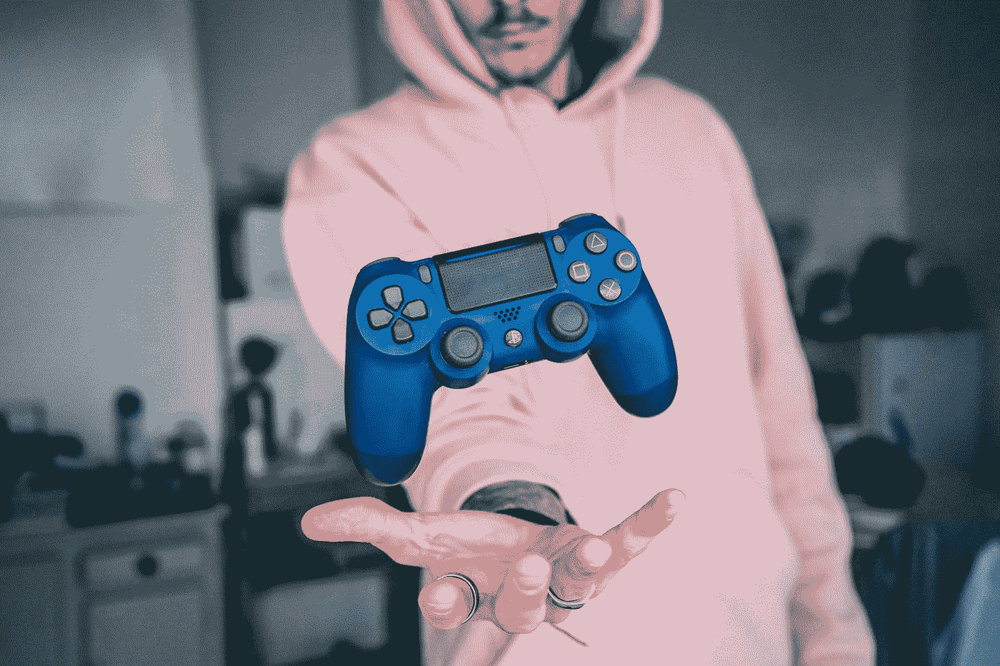
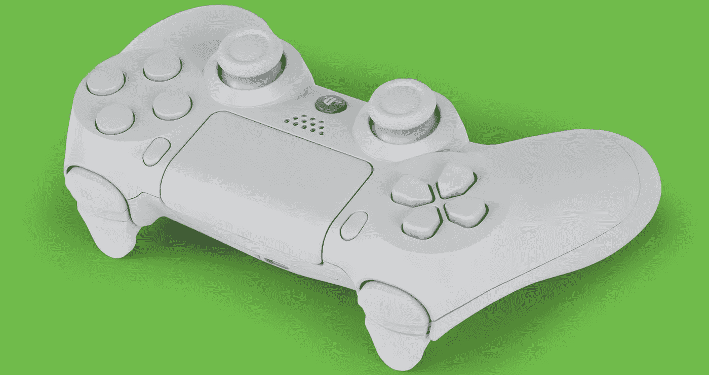
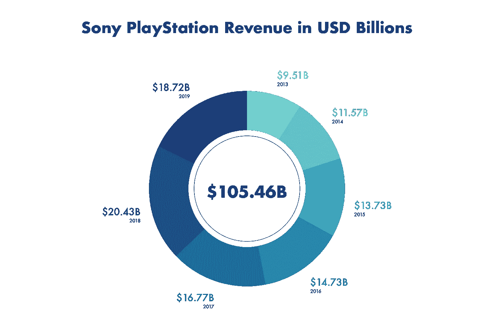
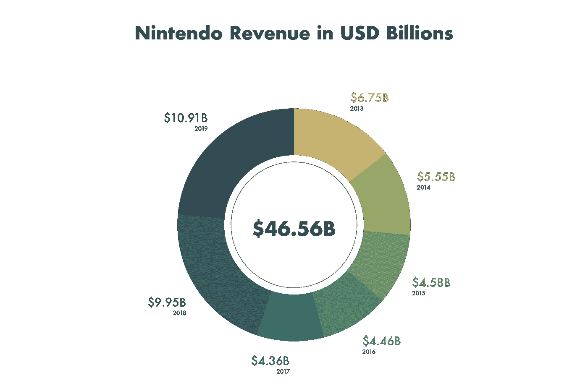
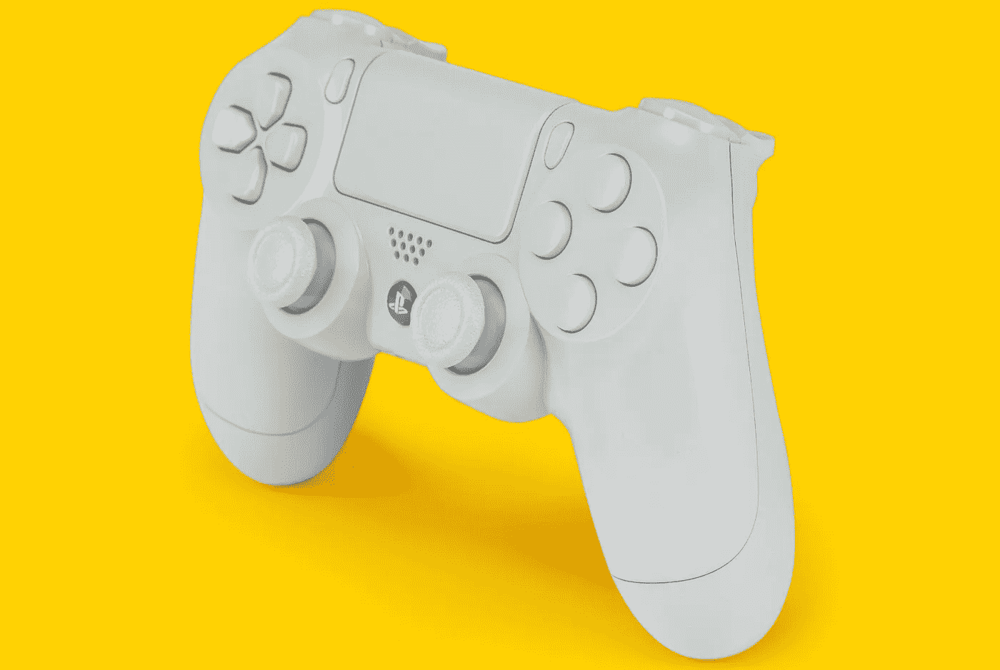

# 任天堂因为一个错误的决定失去了 PlayStation

> 原文：<https://medium.datadriveninvestor.com/nintendo-lost-playstation-because-of-one-bad-decision-6b8866ee608a?source=collection_archive---------0----------------------->

## 不能在主机上玩《马里奥兄弟》、《塞尔达》、《神奇宝贝》的原因。

Photo by [Florian Gagnepain](https://unsplash.com/@florian_gagnepain?utm_source=medium&utm_medium=referral) on [Unsplash](https://unsplash.com?utm_source=medium&utm_medium=referral)

在过去的十年里，电子游戏占据了娱乐业的宝座。游戏世界没有任何停止的迹象。其他的挑战者如电影和音乐都落后好几光年。

2020 年，游戏产业将达到[1600 亿美元。索尼](https://newzoo.com/insights/articles/newzoo-games-market-numbers-revenues-and-audience-2020-2023/)和任天堂是视频游戏[惊人流行背后的罪魁祸首。该行业经历了前所未有的繁荣，到 2025 年可能达到 2000 亿美元。](https://www.ejinsight.com/eji/article/id/2280405/20191022-video-game-industry-silently-taking-over-entertainment-world)

 [## 数据驱动始于数据素养|数据驱动的投资者

### 光是听到“数据”这个词就令人生畏。老实说，只有 21%的全球员工对自己的工作充满信心

www.datadriveninvestor.com](https://www.datadriveninvestor.com/2020/03/22/data-driven-starts-with-data-literacy/) 

从这些数字来看，电影和音乐都可以纳入全球游戏收入，有足够的空间来建立一个私人国家。

全球[电影产业](https://en.wikipedia.org/wiki/Film_industry)票房已经达到 410 亿美元，[全球音乐产业](https://www.musicbusinessworldwide.com/the-global-recorded-music-industry-generated-over-20bn-last-year-but-streaming-growth-slowed/)轻松 200 亿美元。如果加上家庭娱乐收入，电影产业将膨胀到 1300 亿美元。这两个行业加起来仍比游戏热潮低 100 亿美元。

Photo by [Mike Meyers](https://unsplash.com/@mike_meyers?utm_source=medium&utm_medium=referral) on [Unsplash](https://unsplash.com?utm_source=medium&utm_medium=referral)

# 电子游戏杀死了电影明星

在 80 年代和 90 年代初，任天堂在游戏世界占据上风。该公司是游戏机游戏的同义词。[游戏机](https://www.nintendo.co.uk/Corporate/Nintendo-History/Game-Boy/Game-Boy-627031.html)、[超级任天堂](https://en.wikipedia.org/wiki/Super_Nintendo_Entertainment_System)和 [NES](https://en.wikipedia.org/wiki/Nintendo_Entertainment_System) 游戏机主宰着全球市场。

索尼当时是一家消费电子公司，正在努力向数字时代转型。该公司生产电视机、照相机和音乐技术，但没有视频游戏方面的经验。

这里的关键人物是 Ken Kutaragi 和他建立 3D 游戏革命的愿景。Ken Kutaragi 是索尼的一名数字开发人员，但他明白，如果任天堂真的想制造他梦想中的游戏机，就必须参与进来。

Data [Sony](https://www.sony.net/SonyInfo/IR/library/presen/er/pdf/18q4_sonypre.pdf) by [Toni Koraza](https://medium.com/u/8f3c320ada07?source=post_page-----6b8866ee608a--------------------------------)

# 任天堂的举动

索尼仅在 Playstation 上赚的钱就比 T2 任天堂公司赚的钱还要多。玩 Playstation 不会想到任天堂的原因隐藏在 90 年代的游戏革命中。

任天堂的游戏机内置了可怕的声音，索尼成为新音频芯片的生产商。你还记得以前的超级马里奥的声音吗？任天堂的声音是对耳膜的可怕侵犯。

索尼与任天堂合作，与游戏机 Playstation 一起生产新的音频解决方案。这笔交易因合同条款而告吹。作为任天堂游戏机视频游戏的唯一生产商，任天堂通过销售视频游戏盒获得了最大的收入。该机型名为 [*剃须刀&刀片*](https://www.investopedia.com/terms/r/razor-razorblademodel.asp) ，而[吉列](https://gillette.com/)首先完善了这一经营策略。

通过销售单独的刀片，而不是手柄，你可以赚到最多的钱。在这种情况下，游戏机是剃刀柄，而视频游戏是刀片。

索尼-任天堂合同中的条款给了索尼一个与任天堂并肩生产视频游戏的机会。该公司在 1991 年退出交易，并背着索尼与菲利普斯合作。

Source: [Toni Koraza](https://medium.com/u/8f3c320ada07?source=post_page-----6b8866ee608a--------------------------------)

# PlayStation 革命

你可以说任天堂的过度反应不是商业史上最聪明的举动。[紧凑型 Dic Interactive 或 CD-i](https://en.wikipedia.org/wiki/CD-i) 是飞利浦合作的成果。这款游戏机从来没有达到宣传的效果，索尼通过收购哥伦比亚电影公司在娱乐圈加倍下注。

索尼公司准备在游戏世界掀起一场风暴。第一款 [Playstation](https://en.wikipedia.org/wiki/PlayStation_(console)) 上市，引发了数字时代的游戏革命。这些游戏是视觉上令人兴奋的 3D 游戏。故事模式超越了 2D 跳跃的关卡和与飞鸭无休止的枪战。

CD 可以容纳更多的信息，索尼娱乐系统增强了声音和图像体验。第一台 Playstation 上市，全年累计销量超过 1.03 亿台。

Photo by [Mike Meyers](https://unsplash.com/@mike_meyers?utm_source=medium&utm_medium=referral) on [Unsplash](https://unsplash.com?utm_source=medium&utm_medium=referral)

# 一个错误的决定

该公司已宣布将于 2020 年底推出第五代游戏平台([PS5](https://www.playstation.com/en-us/ps5/))。由于最近的政治和健康担忧，全球人口越来越多地转向视频游戏。索尼从 Playstation 生态系统中赚了数十亿美元。大约有 1 亿玩家活跃在 Playstation 世界中。

肯·库塔拉吉成为索尼电脑娱乐公司的董事长，为全世界数十亿人带来欢乐。任天堂从未达到索尼的全球知名度，尽管该公司每年仍有 10 亿美元的收入。

索尼公司的规模使任天堂在规模和影响力上相形见绌。你可以将这一切追溯到一家公司对另一家视频游戏制造商的过度反应。

如果任天堂当初留在索尼，无视企业的不安全感，任天堂今天可能会大 10 倍。玩家可以在 Playstation 游戏机上玩马里奥、塞尔达和口袋妖怪游戏。

一个错误的决定可能会让你失去合作关系、影响力和数十亿美元的收入。永远不要低估企业不安全感的力量。

**访问专家视图—** [**订阅 DDI 英特尔**](https://datadriveninvestor.com/ddi-intel)