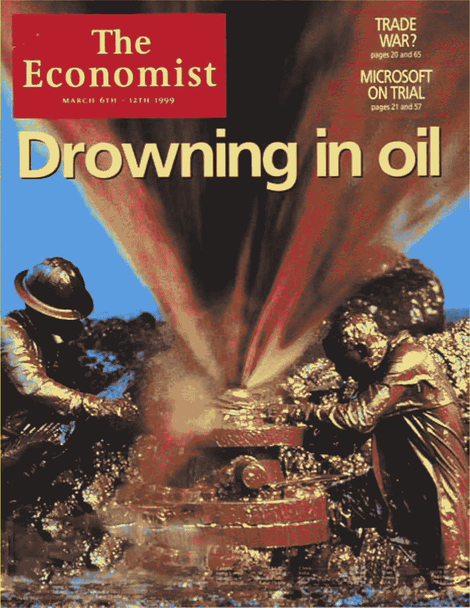
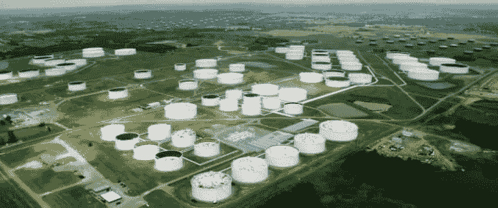

# “没人出价，神经病！”

> 原文：<https://medium.datadriveninvestor.com/no-bids-mental-c09c3ce38d27?source=collection_archive---------13----------------------->

## 美国石油陷入无政府状态…和常识

The Economist’s cover, March 1999 (Source: The Economist)

昨天，石油交易员和地球上几乎所有人都见证了一个不太可能重现的时刻(永远不会)?)2020 后。西德克萨斯中质油(WTI)的五月合约在收盘时以**-37 美元**易手。换句话说，石油生产商会*支付* *你*37 美元从他们手中拿走一桶石油。事实上，这一事件的发生绝对是精神上的。它标志着石油时代的结束吗？几乎没有，但它确实加快了它。

以一种奇怪的方式，这是供需完美互动的时刻之一——一旦 CME 集团(经营 WTI 交易的交易所)表示他们将允许价格下跌。

在我们开始之前，有几件事情需要注意！

1.  基于这一点，你不可能在 WTI 问题上“做多”或“有建设性”。为什么？因为这是一份 5 月份的合同，今天(4 月 21 日)到期。过了今天你就不能交易了。
2.  为什么全球炼油厂不吞噬这些疯狂的免费石油呢？新冠肺炎关闭造成的需求破坏意味着，各国和炼油厂已经充斥着石油，不想再要那些黑色、难闻、易燃的东西，因为他们没有地方存放这些东西(此外，大多数炼油厂通常被配置为加工特定等级的石油，你不能随便倒入你想要的任何等级的原油)；
3.  美国内陆原油的动态不同于交易范围更广、更易获得的布伦特原油；
4.  那么，为什么价格甚至会下跌…这就是有趣的地方…

# 昨天到底发生了什么？

一份五月交割的合同仅仅意味着在到期日(即今天)持有这份合同(期货)的人将不得不在俄克拉荷马州的库欣交割一桶原油。库欣是一个典型的石油城镇，除此之外几乎没什么可看的。库欣也是储存石油的地方。按照目前的速度，预计在 5 月底之前存储将会满。

Cushing, Oklahoma. The “The Pipelines Capital of the World” and the US storage capital (Source: OilPrice)

回到期货合约的持有者——这个人/团体/用户将被期望在库欣通过管道、卡车或注射到他们自己的仓库中进行交割。这个空间并不存在，因为几周前就应该用完的石油因为封锁还在仓库里。想象一个天生的囤积者，他/她不能再囤积东西了，因为他/她拒绝扔掉旧垃圾。

 [## 如果资本主义失败了，那么还有什么选择呢？数据驱动的投资者

### 在当前政治领域的修辞之旅中，我们都可以面对面地接触到流行词汇，如…

www.datadriveninvestor.com](https://www.datadriveninvestor.com/2020/03/16/if-capitalism-is-a-failure-then-what-is-the-alternative/) 

无论如何，昨天持有这些合约的大多数人都是散户投资者。这些人推测未来油价会上涨，但他们没有能力在自己的车库里储存原油(如果他们有，那么他们就是本世纪真正的摇滚明星交易员)。

当合约接近到期时，持有人会“展期”，即他们卖出 5 月份的合约，买入 6 月份的合约(他们也可以将合约展期至未来其他月份)。这意味着，当合约接近到期时，交易量确实很少，因为大多数交易者已经展期了合约。在这种情况下，剩下来拿着烫手山芋的是散户投资者——父母投资者，他们显然不会去库欣把战利品带回来。他们慌了，在倒数第二天开始抛售。昨日的交易量是这些合约通常交易量的十分之一。

成交量萎缩通常表明谁还在继续持有，但这也加剧了波动性。一旦 CME 集团宣布他们将让价格滑落到 0 以下；投资者头脑中的理论极限，一片混乱。石油以前所未有的速度倾斜，而且可能永远也不会。

对于能源投资者和交易者来说，这是我们永远不会忘记的一天，可能在我们有生之年也不会再看到。昨天还提醒人们，尽管有电子交易和人为表现的供求关系，实际上，实物供求曲线是有效的。

> 当没有地方储存石油，也没有地方使用石油时，没有人想要该死的石油，这是完全有道理的！因此，越来越低的负价格会刺激任何人去购买石油。

# 这对未来的石油意味着什么

最近为拯救油价而在欧佩克+达成的协议(T3)的设计者唐纳德·川普并不太担心，他说“这很大程度上是一次金融紧缩”，并且会在“很短的时间内”结束。在 10 次尝试中，他大约有一次对了一半；所以我也对他有一半的信任。这种情况可能永远不会重演，但生产商、交易商和投资者不能自满。最紧迫的是，这可能会给 6 月合约带来严重后果(该合约今天确实下跌了 40%以上)。这对我们大多数人来说突破了一个心理障碍。

低价的解药总是低价——而不是多边协议。根本没有其他办法来削减足够的供应/刺激足够的需求，而且这确实是沙特阿拉伯在 2014 年 11 月发起的市场份额战争的未完成议程。如果需求没有在-37 美元被刺激，那么它可能永远不会——但当然这是由于一系列特殊的情况发生的。

> 值得注意的是，这不是在远程交易所进行的神秘合约交易。WTI 是世界第二大交易商品。

这就是为什么当各国拒绝原油油轮时，布伦特原油很可能会把 WTI 原油追到海底，而且，我以前也说过，“原油油轮可能会在公海上游荡很长一段时间，无人认领”。几周前我就说过，俄国走开或欧佩克+同意少得可怜的 1000 万桶的减产在短期内同样是徒劳的。

从理论上讲，如果所有人都拒绝交货，所有人都耗尽库存，美国内陆原油的动态可能会在全球舞台上复制。这不会发生，因为各国总能补充战略石油储备。如果没有别的事情，警钟已经敲响。

如果石油真的是一个很好的先行指标，那么前往 [*别再称之为衰退——这是几天前*的“一级防范禁闭”萧条**](https://medium.com/datadriveninvestor/stop-calling-it-a-recession-this-is-the-great-lockdown-depression-2877616977ed) 。

— — — — — — — — — — — — — — — — — — — — — — — — — — — —

[*虚张声势能叫吗？*](https://medium.com/@der_Wille/can-the-bluff-be-called-7e3f9f0b3082)*2013 年 10 月*

[*虚张声势叫牌了吗？*](/@der_Wille/has-the-bluff-been-called-cda77245078c)*2014 年 10 月*

)(我)(们)(都)(不)(知)(道)(,)(我)(们)(还)(不)(知)(道)(,)(我)(们)(还)(不)(知)(道)(,)(我)(们)(还)(不)(知)(道)(,)(我)(们)(还)(不)(知)(道)(,)(我)(们)(还)(不)(知)(道)(,)(我)(们)(还)(不)(知)(道)(。 )(我)(们)(都)(不)(知)(道)(,)(我)(们)(还)(不)(知)(道)(,)(我)(们)(还)(不)(知)(道)(,)(我)(们)(还)(不)(知)(道)(,)(我)(们)(还)(不)(知)(道)(,)(我)(们)(还)(不)(知)(道)(,)(我)(们)(还)(不)(知)(道)(,)(我)(们)(还)(不)(知)(道)(,)(我)(们)(还)(不)(知)(道)(。 )(我)(们)(都)(不)(知)(道)(,)(我)(们)(还)(不)(知)(道)(,)(我)(们)(还)(不)(知)(道)(,)(我)(们)(还)(不)(知)(道)(,)(我)(们)(还)(不)(知)(道)(,)(我)(们)(还)(不)(知)(道)(,)(我)(们)(还)(不)(知)(道)(,)(我)(们)(还)(不)(知)(道)(。 )(我)(们)(都)(不)(知)(道)(,)(我)(们)(还)(不)(知)(道)(,)(我)(们)(还)(不)(知)(道)(,)(我)(们)(还)(不)(知)(道)(,)(我)(们)(还)(不)(知)(道)(,)(我)(们)(还)(不)(知)(道)(,)(我)(们)(还)(不)(知)(道)(,)(我)(们)(还)(不)(知)(道)(。

[*第十二:运动会将领出场……*](/@der_Wille/the-national-identity-xii-the-games-generals-play-and-they-need-to-stop-d4626e3da18a)

[*XIV:特种部队内部身份危机*](/@der_Wille/the-national-identity-xiv-inside-the-special-forces-identity-crisis-3b31c721bedf)

[*十九:克什米尔的印度士兵*](/@der_Wille/the-national-identity-xix-the-indian-soldier-in-kashmir-2f55fce00ea4)

[*XXV:多瓦尔·杜巴*](/dialogue-and-discourse/the-national-identity-xxv-doval-durbar-40406945808)

[*二十八:少数民族军队*](/the-national-identity/the-national-identity-xxviii-the-minority-army-5fa264b15835)

[*XXX:卡吉尔，巴基斯坦谎言的保镖*](/@der_Wille/the-national-identity-xxx-kargil-the-bodyguard-of-pakistans-lies-6c905fe417ff)

[*XXXV:印度三军*](/the-national-identity/the-national-identity-xxxv-the-three-indian-armies-f1dc8a2cc96b)