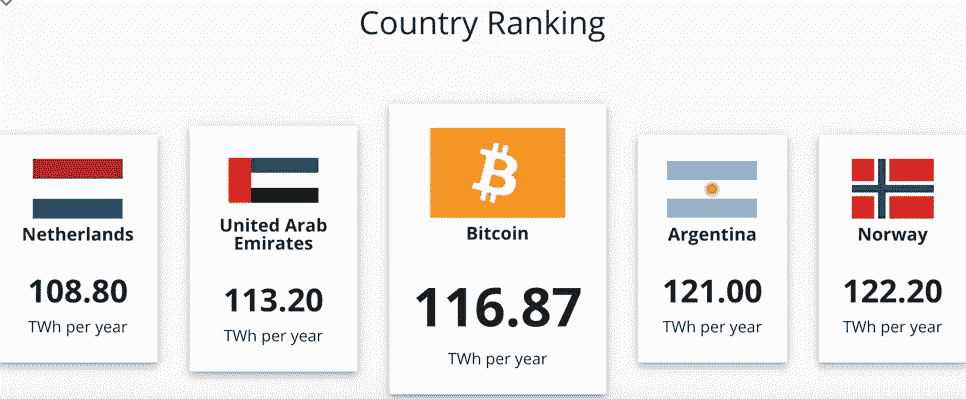
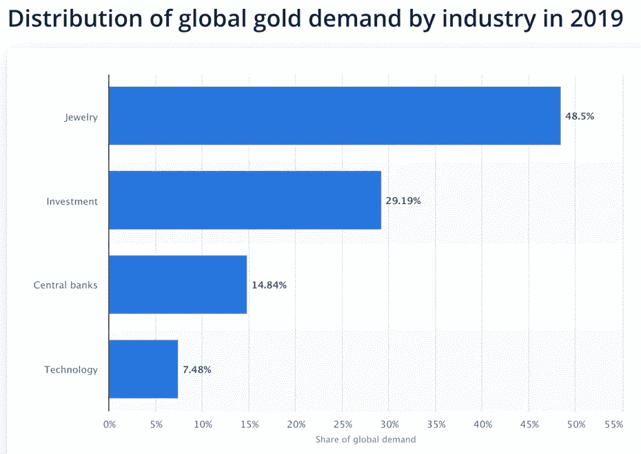
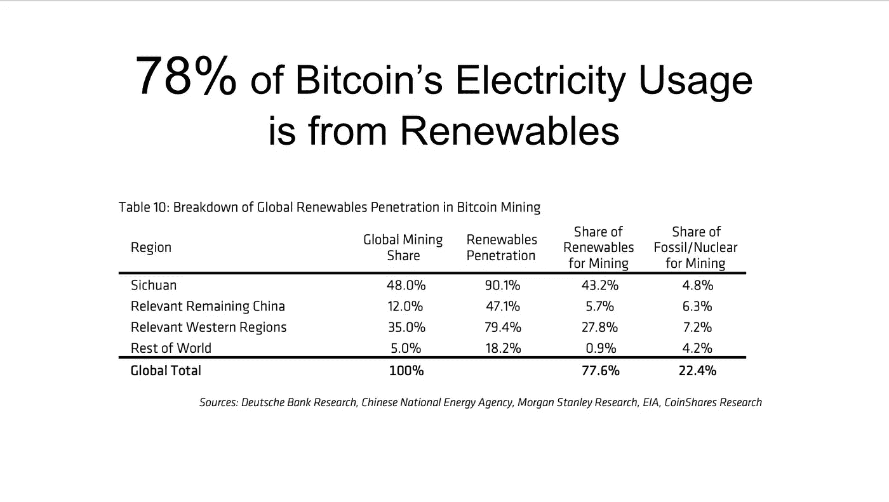
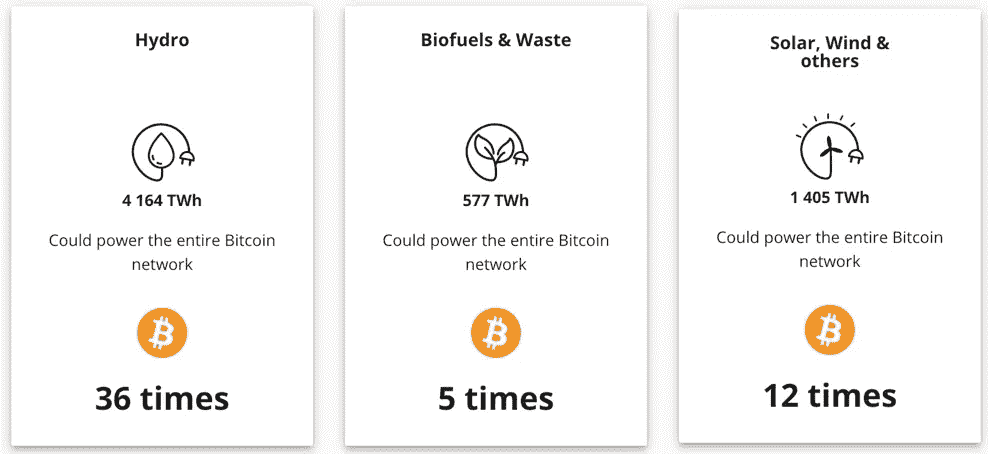

# 不，比特币对地球没有坏处

> 原文：<https://medium.datadriveninvestor.com/no-bitcoin-isnt-bad-for-the-planet-d8c957fc3ecb?source=collection_archive---------12----------------------->

## 批评者说，加密货币是一种能源饕餮，会产生太多的二氧化碳，但他们大错特错

Gerd Altmann / Pixabay

有些人真的不喜欢比特币。

像彭博专栏作家莱昂内尔·洛朗这样的人。上周，他称这是对绝望人群的掠夺性愚弄。他嗤之以鼻地说，更糟糕的是，这场投机淘金热消耗的能源比整个国家都多。

关于第二部分他是对的。

用于创造比特币的计算机化计算比包括阿联酋和荷兰在内的一些国家消耗更多的能源。

Cambridge Centre for Alternative Finance

这种能源消耗确实会产生大量的二氧化碳。

劳伦特引用了大约 3700 万吨的数据，这大约相当于新西兰产生的二氧化碳量。

实际上很难确定比特币行业的二氧化碳排放量。这个行业是由分散在世界各地的小站点组成的，它们使用多种多样且不断变化的混合能源。

但是让我们假设 3700 万吨二氧化碳的数字是真实的。这是否意味着洛朗和其他批评者关于比特币对地球有害的观点是正确的？

不，差远了。

因为如果我们要谈论使用比特币的成本，那么我们需要解决我们现在在没有比特币的情况下所做的成本。

我们需要谈谈钱和黄金。

# 现金的成本

几年前，英国银行委托 T2 对他们的“纸币”的碳足迹进行研究。

研究发现，一张纸币每年产生约 400-500 克二氧化碳，英国流通的所有纸币每年排放约 174，000 吨二氧化碳。

现在关于这项研究有趣的事情是，它发现来自“纸币”的绝大部分二氧化碳——至少 90%——是由于通过自动取款机的现金流动。

这有助于我们对全世界货币的二氧化碳排放量做出一个很好的猜测。

英国有 61000 台耗电的自动取款机，产生 174000 吨二氧化碳。因此，将这些数字外推到全世界 300 多万台自动取款机上，我们看到使用“纸币”每年至少排放**860 万吨**二氧化碳。

这几乎是比特币每年产生的 3700 万吨二氧化碳的四分之一。

这告诉我们的只是钱的碳足迹的一部分。在货币的生产和维护背后，有一个巨大的物质基础设施，这个基础设施没有包括在英国的研究中。

他们没有提到来自赚钱机器、ATMS 制造、甚至银行分行和处理现金的出纳员的二氧化碳。

开车去自动取款机的费用呢？美联储估计，美国每年大约有 50 亿笔现金从自动取款机中取出。

还有就是硬币的能源成本。仅美国每年就创造超过 120 亿枚硬币。他们使用成千上万吨的锌和铜，这不仅产生成千上万吨的二氧化碳，而且这些金属的开采造成了世界上最严重的空气和水污染。

以及与这些钱相关的 65 亿张借记卡和信用卡的碳足迹。这个[加起来](https://www.creditcards.com/credit-card-news/mastercard-to-cut-plastic-pvc-from-payment-cards/)相当于另一个**每年 136，500 吨二氧化碳**。

然后是黄金。

# 黄金的价格

比特币通常被称为数字黄金。

人们使用黄金作为硬实物资产，以保护他们的财富免受政府大量货币造成的财富不断流失的影响。

我们来算一下数字。

2019 年，世界生产了约 3400 吨黄金，每吨黄金[产生](https://www.reuters.com/article/us-mining-gold-emissions-idUKKBN2832ZN)令人难以置信的 32689 吨二氧化碳。

现在，并不是所有的黄金都用于金融，所以我们必须确保我们只计算将被数字黄金(即比特币)取代的黄金。

从下面的[图](https://www.statista.com/statistics/299609/gold-demand-by-industry-sector-share/)中可以看到，大约 44%的黄金用于金融。

(有人可能会说，黄金首饰也被用作财富的金融储存手段，尤其是在印度，但我们不要去想它。)

Statista

因此，如果全球每年生产约 3400 吨黄金，其中 44%或 1524 吨用于金融，那么我们会得出一个相当惊人的结论。

黄金的生产仅仅作为一种价值储存手段(不包括珠宝)，每年就产生近 5000 万吨二氧化碳。

这需要消化很多东西，所以让我们回顾一下。

据估计，比特币每年会产生 3700 万吨二氧化碳。

货币至少生产 860 万吨。

用于金融的黄金产量为五千万吨。

很明显，我们当前的货币和财富体系产生的二氧化碳量让比特币产生的二氧化碳量相形见绌。

我们还没有完成。与传统货币相比，比特币还有另一个优势。

# 再生性能源

比特币使用能量的方式不同于传统货币和黄金使用能量的方式。

自动提款机、金矿和其他传统货币的基础设施必须使用它们所在位置的电力，这通常包括很高比例的化石燃料。

但是比特币挖矿中心可以设在任何地方。它们可以安装在非常偏远的地方，那里有可再生能源。

他们确实是。

比特币设施越来越多地位于孤立的水力发电站附近，比如瑞典的这个水电站和 T2 西伯利亚的其他水电站。

在美国，一个比特币矿工集群已经在华盛顿州哥伦比亚河水电站大坝附近形成，而另一个集群正在得克萨斯州[形成，以利用该州不断增长的风力发电产量。](https://www.technologyreview.com/2020/02/27/905626/how-texass-wind-boom-has-spawned-a-bitcoin-mining-rush/)

Coinshares 的一项研究称，令人难以置信的是，用于比特币的电力有 78%来自可再生能源。

Credit: Coinshares

比特币的崛起对地球来说不是问题。这是一个解决方案。

虽然我们传统的货币和财富体系依赖于传统能源，并向大气中排放大量二氧化碳，但比特币是可再生能源的理想伴侣。

根据剑桥替代金融中心的数据，仅水力发电一项就可以为整个比特币网络供电 36 倍。

Cambridge Centre for Alternative Finance

比特币有很多批评者。但这种批评大多源于误解。

数字货币不仅是传统货币的高级替代品，可以提供稳定性和匿名性，它还是一项非常适合我们向可再生能源过渡的技术。

一个声称关心环境的金融新闻服务机构——比如彭博——应该更清楚。

但是他们没有，至少现在还没有。