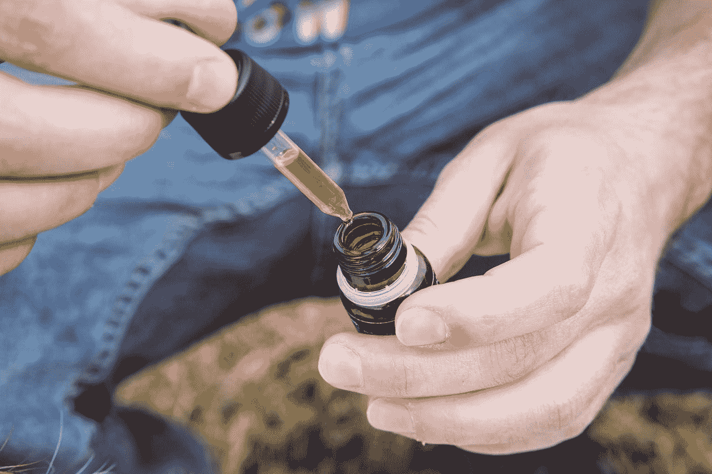

# 不再买处女股票

> 原文：<https://medium.datadriveninvestor.com/no-longer-a-stock-buying-virgin-77cb45f0f1ba?source=collection_archive---------9----------------------->

## 麦蒂的金钱疯狂

## 我怎么花了这么长时间才成为一个财务大人？

Photo by [Markus Spiske](https://unsplash.com/@markusspiske?utm_source=medium&utm_medium=referral) on [Unsplash](https://unsplash.com?utm_source=medium&utm_medium=referral)

几周前，一位朋友问我是否有购买任何股票的计划，鉴于所有的新闻都是关于市场崩溃和股票价值暴跌，这个问题似乎很有趣。

"你知道最好的买入时机是价格暴跌的时候，对吗？"

我的朋友懂一些东西，多年来一直建议我应该考虑投资股票市场。但我生性谨慎，真的不喜欢大银行。在我看来，这些家伙并没有真正把我的利益放在心上。

Photo by [Floriane Vita](https://unsplash.com/@flo_?utm_source=medium&utm_medium=referral) on [Unsplash](https://unsplash.com?utm_source=medium&utm_medium=referral)

我们接下来的对话是这样的:

“我不想和银行家打交道。我不信任那些理财顾问。”

“所以不要用一个。”

“我还能怎么买股票？”(尽管我一般不喜欢明智地对待金钱，但如果说*在我的财政岩石下给了我一条建议的话，那就是‘低买高卖’，所以我实际上对尝试整个投资说大话的想法有点兴趣。)*

“使用应用程序。”

 [## 投资区块链前要问的三个简单问题(也是一个困难的问题)|数据…

### 现在是了解区块链的最佳时机。不同货币之间的增长率，比如…

www.datadriveninvestor.com](https://www.datadriveninvestor.com/2020/03/12/three-simple-questions-and-one-difficult-one-to-ask-before-investing-in-a-blockchain/) 

“比如从银行？”这似乎是一个比实际进入并与财务顾问交谈好不了多少的选择，目前，考虑到 COVID 锁定，这甚至不是一个选择。

我的朋友此时正在摇头。

"不——你可以用手机交易股票."

“什么？”

“是的——有选择的余地。”

You can buy stocks with your phone?????? Photo by [Austin Distel](https://unsplash.com/@austindistel?utm_source=medium&utm_medium=referral) on [Unsplash](https://unsplash.com?utm_source=medium&utm_medium=referral)

"你必须存入的金额有最低限额吗？"

“没有。而且费用比和经纪人交易要好。”

我想我茫然的眼神是在暗示她加一句，“试试简单财富。这是相当白痴证明。”

幸好我不容易被冒犯。我挂断了 Facetime 的电话，立即在 [WealthSimple](https://www.wealthsimple.com/en-ca/product/trade/) 开了一个账户。而且，是的，这是白痴证明。资金从我的银行转移到应用程序需要几天时间，但我用 50 美元全押了。

## 我们去购物吧！！

然后，当然，我不得不选择要买的东西。在对任何事情都没有概念的情况下(顺便说一下，这是进入股市的一个非常愚蠢的方式，所以我从小股开始是一件好事……)，我从一只出现在交易活跃的股票列表中的股票开始。我不知道活跃的交易并不代表明智的购买。

Photo by [Enecta Cannabis extracts](https://unsplash.com/@enecta?utm_source=medium&utm_medium=referral) on [Unsplash](https://unsplash.com?utm_source=medium&utm_medium=referral)

无论如何，接近顶端的是 Aurora 大麻公司(ACB)，它在 TSX 交易(我在加拿大，所以我至少意识到我会在开始时呆在家里以免在货币兑换上受到打击)。事实证明，我是 Aurora 的客户——我购买他们的 CBD 滴剂来帮助治疗慢性关节炎疼痛——而且，股票价格很低——一美元五十美分。我以 15.10 美元买了 10 股，就这样，我进入了市场！

## 然后，我做了作业

这种交易有趣的是，自从加拿大大麻合法化以来，股票价格一直在稳步下降，今天的低价与 COVID 和市场崩盘没有太大关系。如果我足够了解股票价格的变化，我会发现在过去的一年里，ACB 已经从 12.00 美元稳步下跌到 1 美元多一点。这不像是事情稳定下来，然后股票跌落悬崖(就像我一直在关注的其他股票一样)，它看起来更像是一只开始被高估的股票，一直在缓慢而稳定地恢复理智。

感觉有点不好意思，我几乎想卖掉它，再想一想，但我提醒自己，我对长期更感兴趣，真的，随着越来越多的州将大麻产品合法化，越来越多像我一样的老年人发现 CBD 油可以对疼痛产生神奇的效果，对大麻的需求不太可能消失(我赶紧补充一句，这里不是医学上的说法，只是报道我自己的经历)。

然后，安大略省关闭了所有的医用大麻商店(我问你，当酒类商店是必不可少的服务时，它们怎么不是呢？)股价再次暴跌至略高于 1 美元。我做投资人才两天，我的净资产已经跌了三分之一。对我的交易生涯来说，这不是一个好的开始。价格此后有所反弹，目前为 1.22 美元。

Photo by [Carlos Muza](https://unsplash.com/@kmuza?utm_source=medium&utm_medium=referral) on [Unsplash](https://unsplash.com?utm_source=medium&utm_medium=referral)

与此同时，我一直在注册股票提示简讯，并在我以前从未访问过的互联网部分(主要报纸的金融版块，各种提供信息和分析的网站)闲逛，其他人都在谈论 Aurora。虽然该公司也遇到了麻烦，但总体感觉似乎是它目前被低估了，虽然属于风险较高的股票类别，但仍有很大的上涨潜力。

Photo by [Karen Ciocca](https://unsplash.com/@kciocca?utm_source=medium&utm_medium=referral) on [Unsplash](https://unsplash.com?utm_source=medium&utm_medium=referral)

所以，我坐在我的小窝里，什么也不做。这似乎是许多人认为明智的策略。幸运的是，在可预见的未来，我不需要得到那 15 美元的投资。而且，我知道了，在点击那个非常简单的“购买”按钮之前，先问一些问题是个好主意！

我还投资了什么吗？是的……但是我的另外 35 美元发生了什么是另一天的故事。

对我的股市之旅感到好奇？这就是一切开始的地方……

 [## 金融崩盘，我该不该投资？

### 决定在疫情保持冷静的头脑并不容易…

medium.com](https://medium.com/datadriveninvestor/in-a-financial-crash-should-i-or-shouldnt-i-invest-aa6cc7c8b7dc)