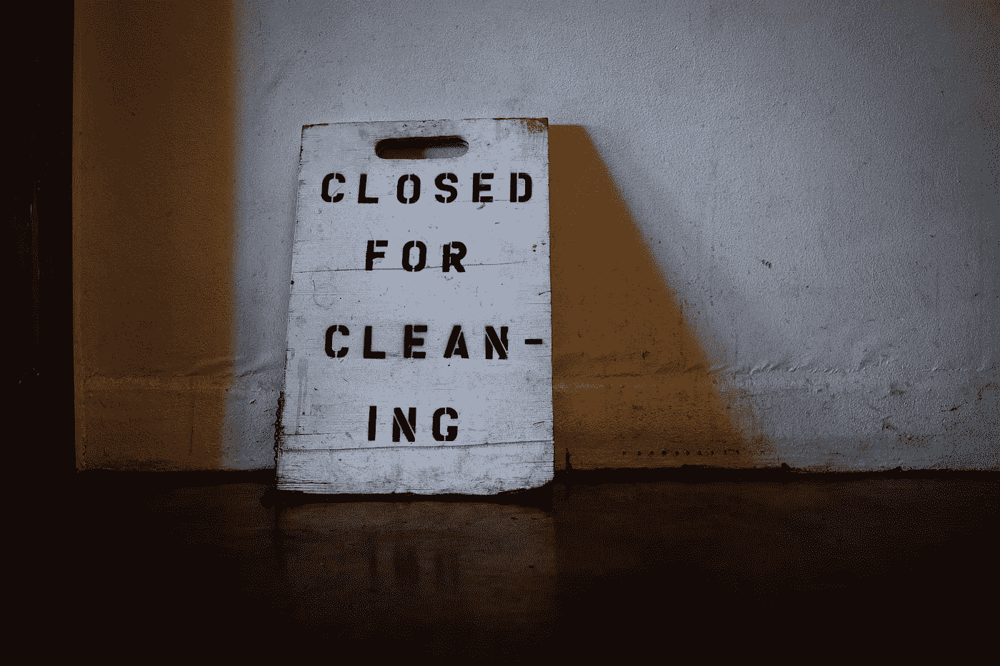
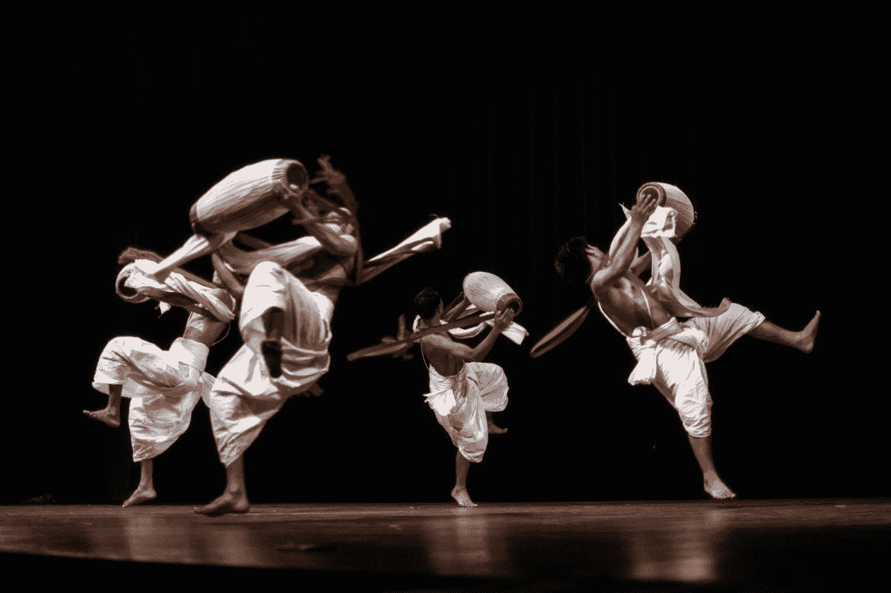
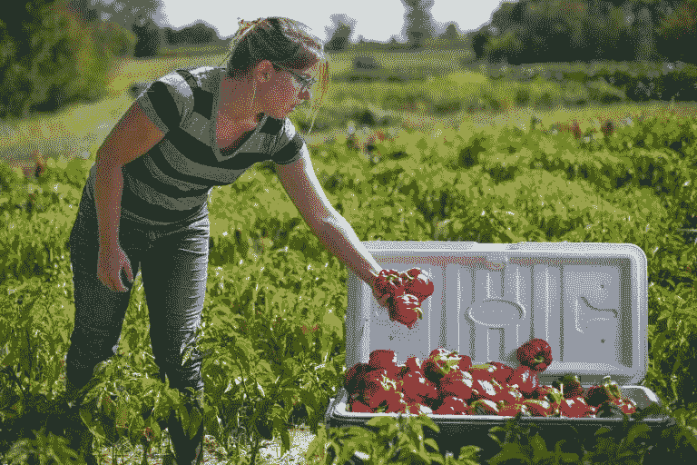

# 不再照常营业——重新思考后 Covid 世界| P2P 基金会的经济价值

> 原文：<https://medium.datadriveninvestor.com/no-more-business-as-usual-rethinking-economic-value-for-a-post-covid-world-p2p-foundation-eb9fbeb6a57b?source=collection_archive---------17----------------------->

"在任何情况下，任何经济利益都不能凌驾于对生命的尊重之上."— [曼弗雷德·马克斯-尼夫](https://www.zinnedproject.org/materials/rethinking-the-economy)，智利经济学家，1932 -2019 年

一场全国性的对话已经开始，这令人担忧，但也很熟悉。它谈到了成本和权衡，损失和账户。这是一场用经济学语言构建的关于人类生活的对话。

布里斯托尔大学(Bristol University)风险管理教授 Philip Thomas 最近的一项[研究](https://www.thetimes.co.uk/article/economic-crash-could-cost-more-lives-than-coronavirus-study-warns-nxrn3bzbs)表明，“如果冠状病毒封锁导致 GDP 下降超过 6.4%，那么经济衰退导致的寿命损失将超过战胜病毒带来的寿命损失”。

像这样的研究给我们带来了一个可怕的困境，甚至导致[一些人怀疑](https://www.bbc.co.uk/sounds/play/m000gn75)当试图拯救老年人和弱势群体的生命会使经济瘫痪几十年时，这种交易是否真的值得。

在这种时候，记住这一点会有所帮助，那就是每次我们决定凭良心行事时，都会看到这种误导性的叙述。有人告诉我们，我们不能停止武器贸易，因为我们会失去工作。我们被告知我们不能减少碳排放，因为我们会失去工作。现在我们被告知，我们无法拯救人们的生命，因为我们会失去工作。几十年来，政府一直利用衰退的威胁来逼迫我们维持一种经济体系，这种体系以牺牲地球的支持系统为代价，让穷人更穷，富人更富。我们被告知这在经济上是有意义的，但事实如此吗？

 [## 如果资本主义失败了，那么还有什么选择呢？数据驱动的投资者

### 在当前政治领域的修辞之旅中，我们都可以面对面地接触到流行词汇，如…

www.datadriveninvestor.com](https://www.datadriveninvestor.com/2020/03/16/if-capitalism-is-a-failure-then-what-is-the-alternative/) 

# 经济学 vs .数学

经济学家赫尔曼·戴利和神学家小约翰·科布在他们的著作《为了共同的利益》中解释了经济学(来自希腊语 oikonomia，意为“管理家庭，以增加其对所有成员的长期使用价值”)和 chrematistics(来自 khrema，意为金钱，指的是“与操纵财产和财富有关的政治经济学分支，以最大化所有者的短期货币交换价值”)之间的区别:

> “Oikonomia 在三个方面不同于 chrematistics。首先，它采取长期而非短期的观点。其次，它考虑了整个社区的成本和收益，而不仅仅是交易双方的成本和收益。第三，它强调具体的使用价值及其有限积累，而不是抽象的交换价值及其无限积累的动力。对于 oikonomia 来说，有这样一件事就够了。对于圣诞老人来说，越多越好……”

在经济学的这一定义中，金融财富并不凌驾于社区福祉之上，因为它不同于一个社会必须采取的照顾其成员的行动。GDP 下降所代表的对我们生计的威胁是由于经济学和基督教的融合。

如果我们把它们分开一会儿，我们会看到一幅不同的画面。

尽管封锁导致了 GDP 增长的下降，伴随着经济衰退的威胁和许多人可能的困难，除了限制我们的行动，它通常不会降低我们的能力。这将意味着我们中的许多人将无法获得社会当前的交换手段(金钱)，但这并不代表着大多数人的能力、才华和贡献意愿的丧失。

事实上，尽管危机引发了恐惧和焦虑，但我们看到的是慷慨和创造力的惊人增长，因为人们齐心协力，竭尽所能相互支持。我们正在集体挑战流行的经济学概念，即人类是自私的效用最大化的个体，并且大多表现出团结和善良。在这个过程中，我们意识到谁是真正的财富创造者。他们是[关爱经济](http://caringeconomy.org/about/)中的一线工作者:护士和医生、店员和送货司机、货架堆垛机、清洁工、75 万(还在增加)前来帮助 NHS 的志愿者。在网上，他们是提供免费教育、表演、健身课程、金融建议、博物馆参观、心理健康支持的人，这样的例子不胜枚举。闭门造车的是那些管理家庭生活的人:家庭成员尽最大努力让他们的孩子和自己保持健康、快乐和理智，朋友们通过众多平台在远处聚在一起。

Artists are sharing their work online for free. Pic by Kosygin Leishangt

在这个危机时刻，全球化体系的脆弱性暴露无遗，正是“普通人”和社区共同努力，避免了社会经济崩溃。用纳奥米·克莱恩在她的书*中的话来说，他们证明了“不是不够的，*‘如果我们的目标是从一个基于无休止的索取和消耗的社会转变为一个基于照顾和更新的社会，那么我们所有的关系都必须基于同样的互惠和照顾的原则——因为我们彼此之间的关系是我们最宝贵的资源。’

Covid 19 的影响将继续给社会带来前所未有的压力，需要国际合作、想象力和勇气来克服，但这些努力绝不能旨在恢复一切照旧。相反，我们需要突出过去四十年来由致力于创造服务于地球上所有生命的经济体系的学者和实践者发展起来的无数社会和经济实践，并建立奖励人们创造真正财富和价值的机制。

# 大胆解决方案的时候到了

经过多年的等待，全民基本收入(UBI)现在已经进入公众讨论。许多试点项目正在进行中，但最古老的正在进行的实验——阿拉斯加分红基金——显示出[劳动力市场的参与率没有下降，并且“显著减轻了贫困，特别是阿拉斯加农村弱势土著人口的贫困”](https://www.sciencedirect.com/science/article/pii/S0305750X1830024X)

像 Bernard Lietaer 这样的货币专家已经表明，使我们的外汇系统多样化将使它们更能抵御全球市场的冲击，并使我们能够支持社会和生态的再生。20 世纪 80 年代在拉丁美洲开发的[人类规模发展](https://en.wikipedia.org/wiki/Manfred_Max-Neef%27s_Fundamental_human_needs)框架可以帮助我们评估我们目前生产的产品是真正满足了我们的真实需求，还是虚假地满足了人为的需求。与甜甜圈经济学和稳态经济学一起，这样的框架可以帮助我们将我们的经济活动控制在地球的极限之内。

Wild Woods Farm. Pic by Preston Keres

脆弱的国际食品链现在必须被可再生的本地食品系统所取代。建立一个充满活力的饮食文化可以同时[解决肥胖](https://www.birmingham.ac.uk/news/thebirminghambrief/items/2018/06/childhood-obesity-time-for-more-comprehensive-regulation-of-the-food-industry.aspx)和[青年失业](https://www.independent.co.uk/news/uk/politics/young-people-uk-unemployment-poverty-life-state-support-benefits-cuts-a8347401.html)，同时确保未来的粮食安全[恢复我们的土壤](https://sustainablefoodtrust.org/articles/the-hidden-cost-of-uk-food-soil-degradation/)。必须对土地和财产所有权进行审查和重新设想，以确保粮食主权、自然生境的再生以及所有人真正负担得起和安全的住房。工人合作社的创建和对当地企业的支持已经被证明能够成倍增加当地的财富和福祉，这也是创建更具凝聚力的生活和工作社区所需要的。

为了让人们在塑造他们的生活和社区方面有发言权，地方当局可以引入[参与式预算](https://www.local.gov.uk/topics/devolution/engaging-citizens-devolution/approaches-civic-and-democratic-engagement-0)、[公民大会](https://www.involve.org.uk/resources/methods/citizens-assembly)和[社区宪章](https://www.communitychartering.org/community-charters/)。无论是在国内还是在国际上，我们都必须想办法废除那些迫使人们从事不安全工作或陷入贫困的沉重债务。我们还必须立即开始一场关于互联网作为公共事业的讨论。P2P 基金会和地方自力更生研究所所做的工作可以为分享我们共同努力创造的财富提供一个指导框架，并确保我们都能获得其重要的服务。

这种病毒引发的意外社会实验提供了一个千载难逢的机会，让我们重新思考我们的经济和社会组织，以帮助我们在电晕疫情和正在上演的气候变化的更大威胁中生存下来。与其让人类和地球适应数字，不如让数字(金融机制、交换系统)开始适应人类和地球。

GDP 并不能衡量我们最看重的东西。这场危机必须是一个挑战我们以经济增长的名义允许世界各地的公司利用自然环境(方便地称为资源)和人(劳动力)的机会。撒切尔错了:还有其他选择。我们中的许多人已经研究了几十年。我们准备在谈判桌上占据我们应有的位置，帮助我们把这个角落变成一个可能的、充满希望的未来。

由[蒂姆·莫斯霍尔德](https://unsplash.com/photos/E4tb-iOLpKA)拍摄的主图

*原载于 2020 年 4 月 6 日*[*【https://blog.p2pfoundation.net】*](https://blog.p2pfoundation.net/no-more-business-as-usual-rethinking-economic-value-for-a-post-covid-world/2020/04/06)*。*