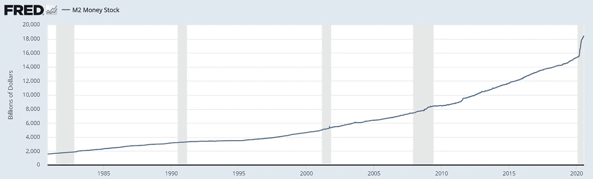
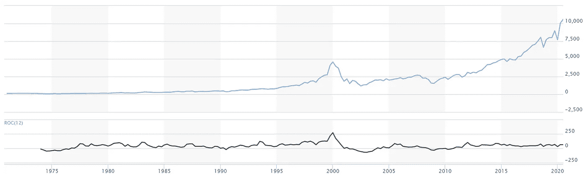

# 不，短期内不会发生崩盘

> 原文：<https://medium.datadriveninvestor.com/no-there-wont-be-a-crash-anytime-soon-d227968f784b?source=collection_archive---------10----------------------->

## 股票

## 三张图让熊不敢靠近

Photo by [Thai _ An](https://unsplash.com/@thaian_99?utm_source=medium&utm_medium=referral) on [Unsplash](https://unsplash.com?utm_source=medium&utm_medium=referral)

我敢肯定，到现在为止，你可能已经看过几篇媒体文章，暗示我们正处于泡沫之中，股市即将崩盘。

我明白为什么会有这种感觉，真的。疫情给了我们一个新的。我们的失业率创下新高，小企业纷纷倒闭。如果我们看看传统的经济周期、特定资产的估值以及股市的整体增长率，感觉我们应该进行一次大调整。然而，有迹象表明这不会发生。

谈到最近的泡沫，我们的大脑会想到 2007 年至 2008 年的房地产市场。当谈到大多数可比的泡沫时，我们看看 2000 dot com。这两个都不是。

我们所处的这个时间线是独一无二的，有几个图表有助于构建我们还不会崩溃的情况。

 [## 对有商业头脑的投资者有用的行为经济学概念|数据驱动的投资者

### 在美国企业界，高斯统计，对我们周围世界的确定性解释，以及理性…

www.datadriveninvestor.com](https://www.datadriveninvestor.com/2020/07/09/helpful-behavioral-economics-concepts-for-the-business-minded/) 

# 货币供应量

St. Louis Fed

这张图取自[美联储](https://fred.stlouisfed.org/series/M2)。正如你在这里看到的，自 1980 年以来，我们的货币供应一直在稳步增长，但其增长率一直在上升。最值得注意的是 2020 年的大幅上升——你现在看到的是刺激因素。注入市场的资金量足以维持目前的表面水平。

# 劳动收入+失业救济金

Joe Weisenthal from Bloomberg

由于刺激计划增加了每周 600 美元的失业救济金，人们在 5 月份比停工前赚了更多的钱。此外，这个**不包括**许多美国人收到的 1200 美元刺激支票。支出似乎也在下降，所以我们知道，对于大多数家庭来说，还有钱在等待支出。

这是额外的货币供应在起作用。

# 变动率

NASDAQ Value (top), Rate of change (Bottom)

这是互联网泡沫最大的分割线。如果我们看看底部黑色的变化率图表，我们可以看到这个时代并没有真正符合 1998-2000 年的疯狂。此外，今天的科技公司创造收入，超越预期，并已成为我们经济和生活方式的支柱。当 ROC 图开始像 1999-2000 年那样出现峰值时，我们才应该开始考虑发出警报。

想了解更多关于商业和技术的内容，请查看我的时事通讯[br ology](http://bryology.substack.com)，我每周会在那里发布多次。

**进入专家视角—** [**订阅 DDI 英特尔**](https://datadriveninvestor.com/ddi-intel)