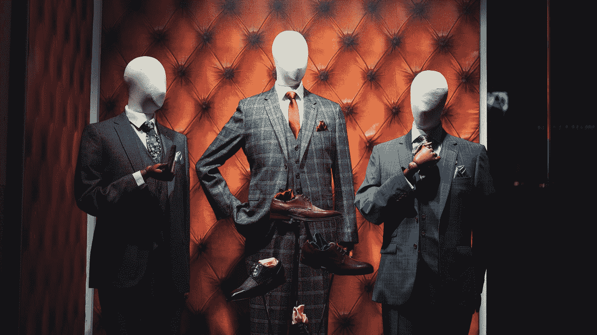

# 不，你的脸不记得了

> 原文：<https://medium.datadriveninvestor.com/no-your-face-doesnt-ring-a-bell-96c514a51214?source=collection_archive---------10----------------------->

我的面容失认症或“面部失明”的生活和时代

How the world often appears to me. (lePhoto by [Shengpengpeng Cai](https://unsplash.com/@tsaichinghsuan?utm_source=medium&utm_medium=referral) on [Unsplash](https://unsplash.com?utm_source=medium&utm_medium=referral))

虽然我直到 30 多岁才意识到这一点，但我一生都生活在轻度的面容失认症或“面部失明”中。简单来说，我不能像其他人一样认出熟悉的面孔。我并不孤单；根据由哈佛大学、伦敦大学和达特茅斯大学联合运营的面孔失认症研究基金会 FaceBlind.org[的数据，大约每 50 个人中就有一个患有面孔失认症。但这只是一个粗略的估计，因为在现实中，研究人员不知道有多少人患有面孔失认症。因为如果你有，你不会*知道*你有。有道理吗？](https://www.faceblind.org)

为了更好地说明这个悖论，知道我们人类极度依赖一些非常懒惰的偏见是有帮助的。而其中一个偏差就是: ***我们假设自己的经历和别人的完全一样。*** 例如，如果你是色盲，或者缺乏天生的方向感，或者[闻不到“芦笋尿”，](https://www.huffpost.com/entry/asparagus-pee_n_5ab932e3e4b0decad04cc745)你可能甚至没有*注意到*你缺少什么，直到它引起你的注意。你不知道你没有经历过什么。谁能想象其他人拥有的这些超能力？

面部失明也是如此。

在我生命的大部分时间里，我一直无忧无虑地认为我无法识别人是人类的正常经历。我甚至不知道面孔失认症是一种东西——一种我拥有的东西——直到我读到灵长类动物学家简·古道尔的精彩回忆录《希望的理由》她写下了在演讲结束时遇到的问题；演讲结束后，许多与会者向她走来——其中许多人她之前*见过**—*但她很少认出他们中的任何一个。她将这种现象描述为她作为名人面临的最困难和尴尬的挑战之一，因为她无法识别人，这让她显得漠不关心或势利。

 [## 良好的生活是习惯的形成|数据驱动的投资者

### 过度思考是过度紧张。仅仅几个简单的习惯就会在一天中产生巨大的影响。那是…

www.datadriveninvestor.com](https://www.datadriveninvestor.com/2020/01/17/a-good-life-is-habit-forming/) 

我困惑地读了这篇文章。我想，“为什么这是一个特殊的问题？不是每个人都有这种经历吗？”

过了一会儿，接着是，“我靠。等等——难道只有我*？”(嗯，当然还有简。)*

*我一生都很钦佩的古德女士，她不仅揭示了面容失认症的概念，还告诉我(晚了 30 年)我也有这种病，这让我大吃一惊。*

*在那该死的一瞬间，我的整个观点都改变了。在读这本书之前，我一直认为每个人都很难认出别人。我曾认为，如果没有视觉、听觉或“设定和设置”的线索，我们所有人都多少有些模糊不清，难以辨认。*

*是的，回答你的下一个问题:事实上，在我的一生中，我注意到其他人*都能认出*我*。但是我真的相信，这不是一个玩笑，我真的相信我是非常令人难忘的。说真的！**

*(在我看来，我比一般的熊矮得多，我留着卷曲的卷发，而且我经常是一屋子技术男中唯一的女性。在我的面孔认知世界里，这些是独特的识别线索。)*

*我慢慢开始意识到我的一生会被怎样看待。当我在办公室遇到不认识的同事时，我不会打招呼。当我经常光顾商店和餐馆时，我不会和以前不认识的员工打招呼。现在我明白了为什么朋友和家人会小心翼翼地问我为什么显得“冷漠”，甚至“势利”……我不认识人，还满不在乎地认为其他人也不认识人，这被其他人视为故意怠慢。如果我认识他们，我会尊敬和问候他们。*

*没有办法解释这是一个多么可怕的认识。我无法改变我过去的行为，也无法向我冒犯的人道歉或解释。我现在能做的最好的事情就是把更多的注意力放在识别人的身份线索上，并且对别人坦诚我无法识别面孔。*

*当我向人们透露我的“面部失明”时，大多数人起初感到困惑，然后变得好奇。最想知道的两件事:*

> *你过了多久才认出我？*
> 
> *认不出人是什么感觉？*

*第一个问题不太容易回答。虽然如果人们有独特的特征，比如亮红色的头发或面部疤痕，我可以立即区分他们，但通常需要五六次一对一的对话，人们的面孔才能“融入”我的识别记忆。*

*但是对于第二个问题，我有很多答案。*

# *这就是面容失认症患者的生活。*

**

*Photo by [Allie Smith](https://unsplash.com/@creativegangsters?utm_source=medium&utm_medium=referral) on [Unsplash](https://unsplash.com?utm_source=medium&utm_medium=referral)*

## *…如果熟悉的人在不熟悉的环境中，我无法认出他们。*

*我去同一个牙医那里看了十多年。一次体检后的几天，我在一家卖酒的商店里，这时我身后的一个男人说，“我希望你喝完酒后刷牙。”我转过身，实际上是告诉这个陌生人滚蛋。他脸色苍白，结结巴巴地说他只是在跟我的牙医开个玩笑。但是没有他的白大褂，没有他牙医诊所的环境，我不知道他是谁。*

*但是等等！你觉得这很糟糕吗？一个被冒犯的牙医对这件轶事一无所知:在约会六个月后，我当时的男朋友去西班牙过了一个夏天。两个月后我去机场接他的时候，一个陌生男人走下飞机，直接站在我面前，期待地盯着我。没错:我没认出我的*男朋友*。*

*令人惊讶的是，三年后他娶了我。真爱 1，面容失认症，0。*

## *…我经常被电影和电视里的人物搞糊涂。*

*我从来都跟不上《教父》的情节，因为所有的人物在我看来都一样。我试着看了很多次，但在那个穿着黑色西装的黑发意大利人向另一个意大利人开枪的场景中，我放弃了。你知道的。*那个*场景。*

## *…如果人们改变了简单的服装或发型，我很难认出他们。*

*我在一家科技公司进行了一整天的面试，会见了多位面试官。我和招聘经理很合得来，他是那天的第一个面试官。几个小时后，一位女士走进房间进行当天的最后一次面试。我站起来介绍自己。她既困惑又有点生气，因为显然我们已经在早上一个长达 8 小时的采访中见过面了。我没有再认出那个招聘经理，因为她已经换了一件衬衫。剧透:我没得到那份工作。*

## *…我无法区分具有相似身体特征的人群。*

*在我度过了整个职业生涯的技术办公室里，一群 30 多岁的白人男性，穿着相似的衣服，留着相似的发型，对我来说是一个模糊的面孔——就好像有人模糊了他们的脸应该在哪里。现在，在办公桌轮用的黑暗日子里，我甚至不能依靠你办公桌的位置来判断你到底是谁。*

## *…我花了很多时间愉快地假装认识那些看起来认识我的人。*

*现在我意识到了我的面孔失认症，我只是假装认识那些和我打招呼的人，直到我得到他们身份的线索。我会注意到这个系统的缺陷，然而…我发现自己与乞丐和希望让我皈依各种宗教的人有过多次不愉快的遭遇。但至少我看起来很友好！*

## *…我一直避免使用别人的名字，也很少做介绍。因为我绝对会让我们所有人难堪。*

*在和我丈夫的活动中，我们使用古老的老把戏:他先介绍自己，然后是 T2，所以没被认出的人必须介绍自己。或者如果他已经认识这个人，我丈夫会以“亲爱的，我确定你记得< *在这里插入不认识的人的名字*>……”(旁注:我很确定我不记得。)*

*说真的，如果我能在每个人的头上贴上便利贴，我的世界会变得更加简单。*

## *…我会把面部配饰相似的人搞混。*

*对于那些没完没了的 30 多岁、留着大屁股、戴着黑框眼镜、留着山羊胡的白人男性潮人来说:在我看来，你们都一样。*

*当然，这些轶事很有趣。但也许你在这些故事中看到了自己。你可能想知道你是不是我们中的一员……[一个包括已故的伟大的奥利弗·萨克斯博士、简·古道尔和史蒂夫·沃兹尼亚克](https://en.wikipedia.org/wiki/Category:People_with_prosopagnosia) ( [可能还有布拉德·皮特的俱乐部！](https://edition.cnn.com/2013/05/23/showbiz/celebrity-news-gossip/brad-pitt-esquire-face-blindness/index.html))。谁不想参加那个鸡尾酒会呢，阿米利特？*

*如果你好奇，[你可以阅读更多关于面容失认症的症状，](https://prosopagnosiaresearch.org/symptoms)甚至[做一个在线测试](https://openpsychometrics.org/tests/EBFMT/)。*

*但如果你想问我，你得先向我介绍你自己。*多次*次。*