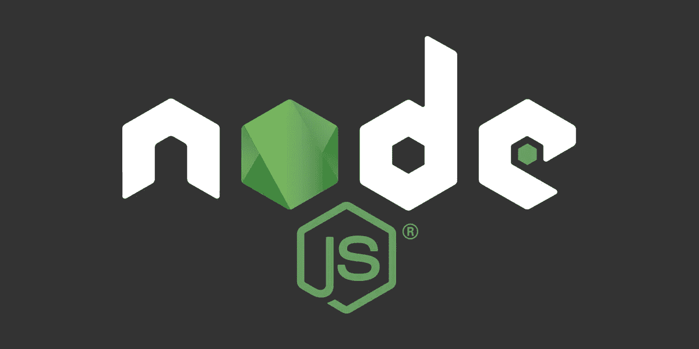
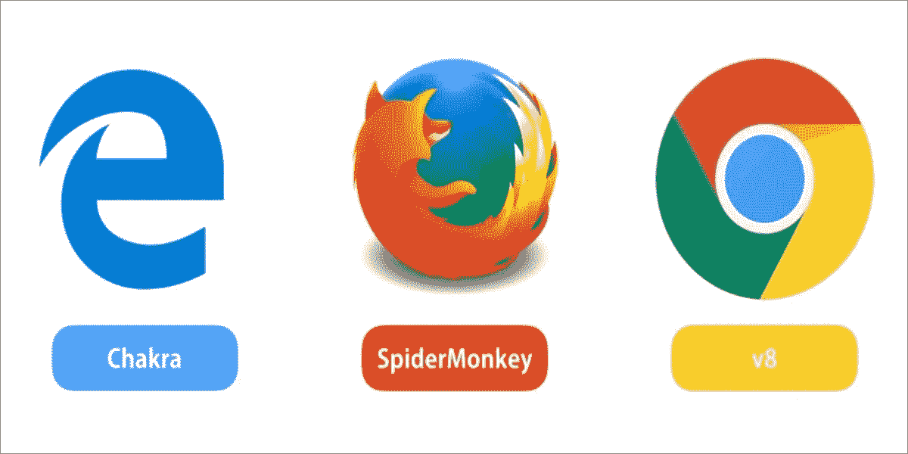
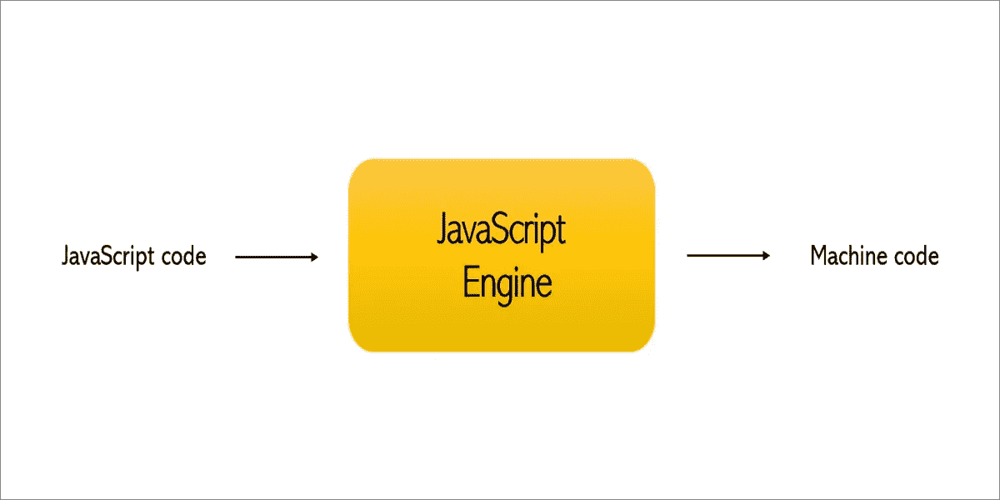
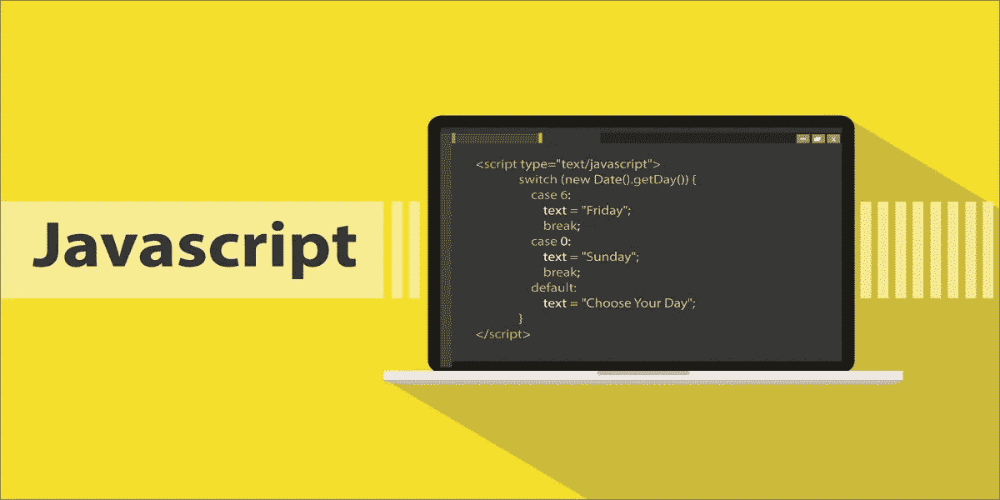
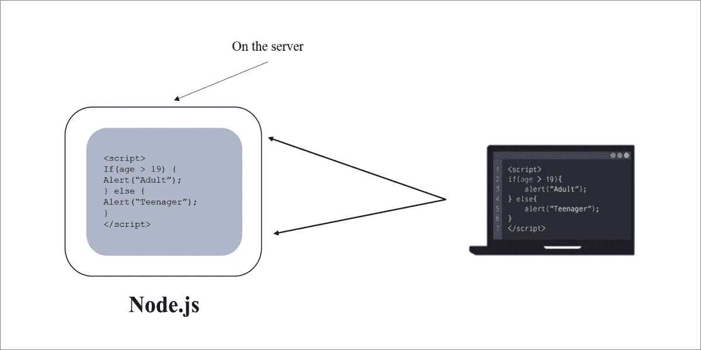
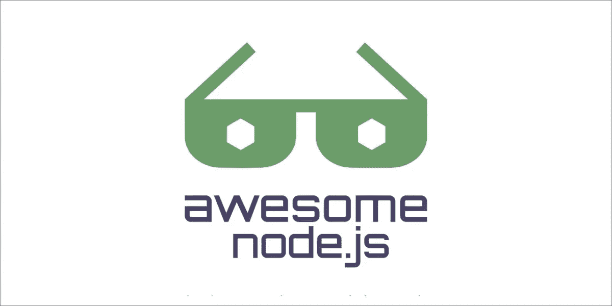
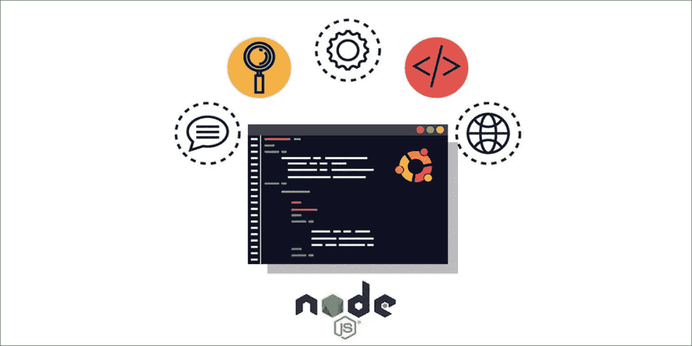

# 节点. js

> 原文：<https://medium.datadriveninvestor.com/node-js-41eba3e2d45f?source=collection_archive---------9----------------------->

# 一个新的想法！

Node js 于 2009 年发布，已经走过了漫长的道路。毫无疑问，它是当今使用最多的运行时，现在有影响力的品牌正在转向 node.js 后端。

Node.js 是一个开源的服务器环境。它是免费的，可以在各种平台上运行，包括 Windows、Linux、Unix、Mac OS 等等。在创建节点之前，创建后端是一件繁琐而复杂的事情。但现在，用 node.js 创建后端就不那么详尽了，感觉很理性，代码行更少，速度超快，可扩展性也很高。它仍然很复杂，因为它毕竟是后端，但这种复杂性值得学习。

好的，现在，让我们在 node.js 上开始这个令人惊叹的系列。我将让每个人都非常简单地开始，在下面的文章中，我们将增加我们的复杂性，并学习 node 可以做的所有令人惊叹的事情。

# **之前 Node.js**

在 node.js 到来之前，我们只在浏览器中使用 Javascript。浏览器提供了一个运行时环境，在这个环境中，浏览器可以本地识别 HTML、CSS 和 JavaScript。所以基本上，你的浏览器就是你的 javascript 运行时。

每个浏览器都有 javascript 引擎就像谷歌 Chrome 有 V8，微软 Edge 用 Chakra，Mozilla Firefox 用蜘蛛猴。

javascript 引擎接收 javascript 代码，并将其转换为计算机可以理解的机器代码。由于浏览器和 javascript 引擎的多样性，javascript 代码在不同的浏览器上可能呈现不同的效果。

# 好吧，什么是 Javascript？

Javascript 是一种编程语言。它是世界上最流行和最广泛使用的编程语言，并且每天都在增长。Javascript 也被称为创业公司的语言。最初，Javascript 被用来创建交互式网页，但现在它变得更加强大，因为它拥有巨大的社区支持以及来自品牌和公司的大量投资。现在，您可以使用 javascript 创建 web 或移动应用程序、实时网络应用程序、命令行工具，甚至游戏。

# Node.js 是什么？

很多人认为 node.js 是后端语言。这不是真的。Node.js 是一种运行时语言，而不是后端语言。Node.js 是一个运行时环境，Javascript 代码可以在浏览器之外执行。有了 node，我们可以在服务器上获取 Javascript 代码，并在一个单独的容器中运行它，而不会受到限制，也不用担心我们的代码在不同的浏览器上如何呈现。

Node.js 就像一个容器，用 javascript 编写的程序可以在浏览器外部执行，而不是在本地 javascript 引擎上的特定浏览器内部执行。

# Node.js 到底是怎么执行代码的？

现在的关键问题是，如果代码是在浏览器之外执行的，那么到底是谁在执行代码。谷歌 Chrome 使用 V8 (javascript 引擎)在 Chrome 浏览器内部运行 javascript 代码。因此，Rayn(node . js 的创建者)将 V8 引擎封装在一个 c++程序中，在浏览器之外的服务器上执行 javascript 代码。该程序被称为 Node.js，因此 node.js 在服务器上执行的独立容器中使用 V8 javascript 引擎。

# 哪里使用节点，哪里不使用

Node.js 是创建后端的快速、可伸缩和有效的方法。但是，仍然存在 node.js 可能不太成功或者不是一个好的选择的情况。在创建 API、数据流应用程序或服务器端呈现的应用程序时，最好选择节点。您不应该选择 node.js 来构建具有繁重服务器端处理的应用程序或具有大量图像操作或文件压缩的应用程序，也不应该首选 node.js。在这些情况下，您可以使用 PHP。

# 两端 Javascript！

Node.js 是服务器端的 javascript。它快速、高效、轻量且可扩展。它非常适合构建快速且可伸缩的数据密集型应用程序。

此外，使用 node.js，您可以在整个堆栈中使用 javascript。您可以使用 javascript 创建前端，使用 node 创建后端，并且您不必在不同语言之间切换。

# 可供选择的事物

Node.js 已经成为创建和执行 web 应用程序不可或缺的一部分，Node Js 的替代品并不多。然而，除了 node 之外，还可以选择 ASP.net、Python、Perl、Rebol、Ceylon 和 PHP 来创建后端。

# Node.js 用什么分隔？

我想你对 node.js 和我们为什么使用 node 有更好的理解。node.js 的需求和使用每天都在增加，无法更快被取代。

⚈其他 node.js 的替代品远远落在后面，并且没有其他类似于 node.js 的框架来构建快速、可伸缩和生产就绪的后端代码。

⚈ Node.js 是最流行的编程语言 javascript。几乎每个重要的框架都支持或使用 Node.js。

⚈在 node.js 之前，开发人员不得不依赖其他开发人员进行服务器端编程，或者自己学习一种新的服务器端编程语言。因此这是巨大的，也是 Node.js 受欢迎的最大原因之一。

⚈Node.js 有一个神奇的东西叫做 NPM(节点包管理器)，它是世界上最大的软件注册中心。NPM 注册表包含 600，000 多个用于构建基于 Javascript 的应用程序的包。

⚈是全世界令人难以置信的开发者社区。

最后，Node.js 是开源的，永远免费。这些是 node.js 从其替代品中脱颖而出的一些原因。

# 一个人为什么要学习 Node.js？

Node.js 在后端开发和创建高度可伸缩的 API 方面发挥着重要作用。它是构建聊天应用程序、移动和 web 应用程序、命令行工具等等的首要选择。Node 拥有庞大的在线社区支持，当你遇到困难时可以随时获得帮助。它还允许你开发跨平台的应用程序，甚至游戏。因此你应该学习 node。

所以我希望我已经说服了你去学习 node 来创建你的后台。在接下来的文章中，我将深入探讨 node.js 的工作原理。在那之前，祝你愉快，保持动力。