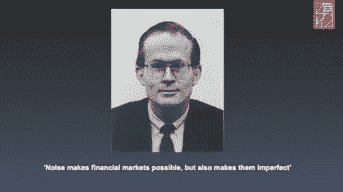
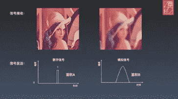
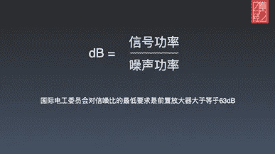
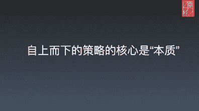
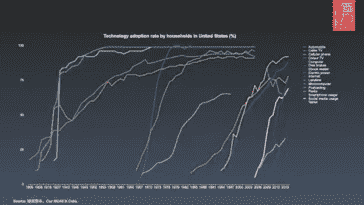
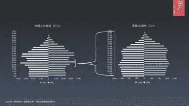
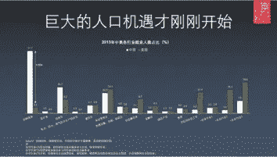
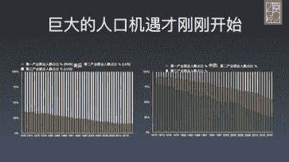

# 技术投资中的噪声与信号——第二部分

> 原文：<https://medium.datadriveninvestor.com/noise-vs-signal-in-tech-investments-part-2-393d04b83f3?source=collection_archive---------1----------------------->

我之前写过我的朋友**张金健 **Trustbridge Partners** 的[投资理念](https://medium.com/hackernoon/noise-vs-signal-in-tech-investments-f7ac0cec43e3)。几个月前，金健在中国上海创立了自己的风险投资基金 [Vitalbridge Partners](http://p.vitalbridge.com/) 。在最近的一次谈话中，金建更深入地探讨了他的“噪音对信号”投资哲学。**

— -

本文根据 42 章经 线下活动「决策中的信噪比」整理而来。

本文整理自 MyFortyTwo 线下活动“决策中的信噪比”

2019–2020 年市场很冷，有人选择离开、有人选择蛰伏、有人选择变化。从《投资中的信号与噪声》时的挚信资本，成长为文中的绿洲资本，并不是个容易的决策，张津剑在这篇文章中分享了他对创投市场核心决策的方法论。

2019-2020 年市场一片荒凉。有些人选择了离开；有些处于休眠状态，有些选择改变。从*投资中的信号和噪声*中的 Trustbridge 转移到本文中的 Vitalbridge 并不容易。张金健在这篇文章中分享了他在风险资本市场中的核心决策方法。

噪声为金融市场创造了可能性，也使得这个市场不完美。

*— — 量化经济学家 Fischer Black*

Noise makes financial markets possible, but also makes them imperfect. By Econometrist Fischer Black.

市场中充斥着信号与噪声。

The market is filled with signals and noise.

我们每个人都知道要追寻信号，摒弃噪声，然而没有噪声就没有交易。试想，如果所有人都拥有同样的信号，那意味着你想买的时候别人不肯卖，交易无法达成。

我们每个人都知道追求信号，抛弃噪音。然而，没有噪音，我们就没有交易。想象一下，如果每个人都有同样的信号，你想买的东西就没有人卖了，交易也不会成交。

所以说噪声其实也在推动我们整个创投行业的生态，但到了去年噪声一下子少了很多，噪声交易者也少了很多，那这个市场的流动性就弱了，这个时候大家突然变的很焦虑和疑惑。

所以，噪音，其实是驱动了我们整个创投行业的生态。然而，去年噪音和噪音交易者暴跌，从而削弱了市场的流动性。在这种情况下，每个人都充满了焦虑和困惑。

整体市场流动性降低时，“做点什么”总是能给我们安全感，但因此努力寻找独家信息并以此交易，会不可避免的成为噪声交易者。

在市场整体流动性降低的时候，“有所作为”总会给我们带来安全感。不可避免的结果是，噪音交易者将会出现，因为人们很难找到独家信息并进行交易。

其实，我们更应该在噪声变少的时候更回归本质去思考信号是什么。

其实一定要回归本质，在噪声降低的时候识别信号。

所以说，当下最好的方法是保持安静，在安静中不断提高决策中的信噪比。

所以，目前最好的反应就是保持平和。在平静的状态下，你提高了决策的信噪比。

那什么是信噪比呢？我们先来看上面这张图。

信噪比是多少？我们来看看上图。

图片左侧是我们理想中希望接受的信息，右侧则是实际接收的信息。左侧灰色面积 A 是理想消耗的功率，右侧是实际的。可以看到，噪声带来的“冗余”信息不单影响质量，而且消耗能量。

左边的图是我们希望收到的信息，右边的图是我们实际收到的信息。左边的灰色区域 A 是理想功耗，右边是实际功耗。我们可以看到，“过多”的信息不仅影响质量，而且消耗能量。

很遗憾，人的思考方式更接近右侧的模拟电路而非数字电路，因而表达会更偏向“冗余”而非“精简”。

不幸的是，人们的思维方式更接近右边的模拟电路而不是数字电路，从而使表达方式倾向于“冗余”而不是“简化”。

更遗憾的是，既然是模拟电路，就会受限于不同的电路板设计和元器件选择。对于我们而言，就是受限于自身成长背景、经历和性格特点，这些会让我们在沟通中进一步增加系统噪声。

更重要的是，由于它是模拟电路，限制在于不同的电路设计和元件选项。对于我们来说，这些限制来自于我们的个人背景、经历和性格特征，这将增加我们交流中的系统噪音。

就像上次文章[《投资中的信号与噪声》](http://mp.weixin.qq.com/s?__biz=MzIyMDE5OTYyMw==&mid=2651048827&idx=1&sn=51dd4a5e6b428a842591723453b68825&chksm=8c38c4d3bb4f4dc50d961db0869529b1aebb6b093c1b31d29f49437b21d648507e62b3c53b91&scene=21#wechat_redirect)中提到过的大学室友，他鼓起勇气给他暗恋的女孩（女孩也暗恋他）写了一封情书，洋洋洒洒 six 页纸，讲述了自己的成长经历以及不可放弃的报国志向，最后加了一句：“你也很重要”。寄出去，室友兴奋了一夜，女孩却以为自己被委婉拒绝而哭了一宿。

就像我上一篇文章*投资中的信号与噪音*提到的大学室友，他鼓起极大的勇气给暗恋的女生写了一封情书(而女生也暗恋他)。在这封六页的信中，他分享了自己的人生经历和不可抗拒的报效国家的愿望。他加的最后一句话是，“你也很重要。”发出去后，舍友激动了一夜，女孩却误以为信是委婉的拒绝，哭了一夜。

再比如，当我们沟通一个项目的时候，你如果问他投不投？其实你需要的答案就是 0 或 1，但大多时候这个人会告诉你说“这里有很大的机会，分别是 1、2、3，但是这里同时又有风险，分别是 1、2、3、4、5。”

再比如，我们谈一个项目，你问他投资不投资，你需要的答案不是 0 就是 1。然而，大多数情况下，这个人会回答，“我在这里看到了巨大的机会，这是 1，2，3，但是也有风险，这是 1，2，3，4，5。”

那你再次问投不投呢？最后他的回答可能是“我们去谈谈价？”。

你又问“投资不投资？”最后，他的回答可能是，“我们可以讨价还价吗？”

在这个例子里面，其实很多信息都是噪声，而信号却并没有被挖掘出来，所以最后得出的结论也是模棱两可的。

在这个例子中，许多信息实际上是噪声，而信号是未被覆盖的。所以最后的结论是模棱两可的。

所以信噪比就是信息中信号与噪声的比例，数学上等于信号功率除以噪声功率。这个数字越大，说明信号的比例越高，信息质量越好。

因此，信噪比是信息中信号与噪声的比率。数学上，它是信号功率除以噪声功率。数字越大，信号比例越高，信息质量越好。

然而所有元器件，但凡你要发出一个信号，就会有噪声产生，只是这里面的比例多少而已。那么在投资里面，我们每天都在做大量的决策，我们该如何有效筛选信号，提高信噪比呢？

但是，只要有信号发出，所有的元件都无法避免产生或多或少的噪声。在投资中，我们每天都要做很多决定。怎样才能有效的筛选出信号，提高信噪比？

其实类似的问题，“大脑”每天也在遇到。受限于人类大脑的处理能力，我们无法处理视网膜收集到的所有信息，所以人类通过两个办法来解决：1.忽略视网膜边缘的信息；2.“聚焦”处理特定区域的信息。

其实我们的大脑每天都会遇到类似的问题。受限于人脑的处理能力，我们无法处理视网膜收集的所有信息。人类用两种方法解决这个问题:(1)忽略视网膜边缘的信息，(2)“聚焦”于处理特定区域的信息。

所以即使我们能看到整本书，我们也只能“阅读”一行文字。后者，就是人类的进化出的“注意力”机制。这种机制，极大提升了视觉信息处理中的“信噪比”。

所以，即使能看到一整本书，也只能“读”一行文字。后者是人类进化出来的“注意”机制。该机制大大提高了视觉信息处理的“信噪比”。

比如上面这幅图，驾驶员会迅速“聚焦”红色的“STOP”信号，而直接忽略其他信息。计算机则不然，由于无限制的计算能力，计算机会进行全局的分析而非快速聚焦。

比如上图，司机会立刻“专注”在“停”的红色信号上，而忽略其他信息。相比之下，拥有无限计算能力的计算机将进行无所不包的分析，而不是瞬间聚焦。

简单的讲，注意力机制是一种“自上而下”驱动“自下而上”的策略。

简而言之，注意机制是一种“自上而下”——驱动——“自下而上”的策略。

投资中，“自上而下”是归纳法：寻找事物之间的内在联系和相同特性，归纳事物普遍性特征。比如优秀的企业家有什么共同的特征，高质量的项目遵循怎样相同的商业模式；

在投资学中，“自上而下”就是归纳法:寻找事物之间的内在联系和共有特征，归纳出共同特征。比如优秀的创业者有哪些共同的特点？或者说，高质量的项目一般遵循哪些商业模式？

“自下而上”是演绎法：寻找事物之间的外在区别和不同特点，演绎事物个体结论。比如这个企业家在这个环境中会做寻找什么样的资源，做出什么样的转型；

“自下而上”是演绎:寻找事物之间的外部变化和不同特征，并展示个体的独特性。例如，企业家将在这种环境中寻找什么资源？会有什么转变？

前者需要大样本量的抽象总结能力；后者需要具体事件中的洞察想象能力。各有利弊， 我们展开来说。

前者需要对大样本进行抽象和总结的能力；后者需要对具体事件的洞察和想象能力。两者都有利弊。我们来讨论一下这个。

面对生活中的小样本，“自下而上”更加灵活，所以演绎法是我们日常中的主要策略：

面对生活中的小样本，“自下而上”更灵活，所以演绎是我们日常生活中的主要策略:

比如在日常生活里，你现在要在三家装修供应商之中选一家，最好的策略是什么？是三家供应商全部见完，你自然会得到结论，这种策略的核心就是比较，也就是通过“比较”寻找“全局最优”解法。

例如，在日常生活中，你现在需要从三家家具供应商中选择一家。最佳策略是什么？三个供应商都见一面，你就得出结论了。策略的核心是比较，即通过比较所有选项来确定“最优”的解决方案。

当然也有商家利用这点，比如经济学人杂志订阅的经典三选项：

当然，一些企业利用了这一点。例如，*《经济学人》*提供了三个经典的订阅选项:

1、电子版，59 美金 / 年

2、纸质版，125 美金 / 年

3、电子版+纸质版，125 美金 / 年

1.数字，每年 59 美元

2.印刷品，每年 125 美元

3.数字+印刷，每年 125 美元

你会选择谁？如果没有选项 2，你会选择谁？选项 2 的出现，让 3 成为了全局最优选择。

你会选择哪一个？如果没有选项 2，你会选择哪个？方案 2 的存在使得方案 3 成为最优选择。

但大家要知道其实这个比较，就是生活和决策里面最多噪声的来源，因为在这个过程里，我们不断通过比较来确认自己的选择是最好的，而随着比较选项的增多、系统复杂度的增加，我们就陷入了一个过载的系统之中。

然而，每个人都必须知道，事实上，比较本身正是生活和决策中大多数噪音的来源，因为，在这个过程中，我们通过不断的比较，相信我们的选择是最好的。随着可供比较的选项越来越多，系统的复杂性越来越大，我们把自己推入了一个超负荷的系统。

就像人和人之间一样，毕业之前可能大家只是比比成绩，但毕业之后发现成绩已经不能够支撑我们之间的比较了，就变成了薪酬待遇、社会地位、名望、你的妻子、儿子，从一个点变成一百个点，这也就是日益剧增的 Peer Pressure 的来源。

同样，人们在日常关系中也有这个问题。我们在学校比较分数。但是，毕业后，你发现分数已经无法建立对比。它转移到薪水、社会地位、名誉、你的妻子、儿子……这种比较从一个方面延伸到一百个方面，成为增加同伴压力的来源。

所以，自下而上的比较法面对大样本量的环境的时候就会失效。

所以，当人们面对大样本的环境时，自下而上的比较法就失效了。

比如今天告诉你说，中国有一百个顶级的大夫你只能做一次选择，这次选择可能决定了你的生命接下来的长度，你怎么去做这个选择，你可能会花两年的时间，把这一百个大夫全部见完吗？即使见完之后你也不一定能通过比较做出选择。

例如，今天我告诉你，你只有一次机会从中国一百名顶尖医生中选择。这个选择可能会决定你的寿命。你会如何选择？你会花两年时间会见所有的 100 位医生吗？即使你会，你也很难在会议后做出决定。

2012 年的创投市场，正是一个小样本量的环境。简化来说，就像上面这幅图，中国 2012 年整个市场可能就是这五家公司，竖着的表示有价值的公司，横条就是没有价值的。

2012 年的风险投资市场正是一个小样本的环境。简单来说，就像上图一样:2012 年中国的整个市场是由这五家公司组成的。竖条代表有价值的公司，横条代表没价值的公司。

那个时候生态也不成熟，比如 FA 机构，整个中国就那么几家，你只要认识一家，就能知道市场上发生的所有变化，每年年末的时候所有投资人坐在一起，大家都知道说今年哪些项目融到钱、这个项目怎么样， 所有人都见过所有的项目。

那个时候的生态也不成熟。例如，中国只有少数金融顾问机构。只要你知道一个，你就知道市场的所有变化。每年年底，所有投资人都聚集在一起，分享具体项目的融资和发展情况。每个人都看了每个项目。

这个时候，“自下而上”的比较策略是最好的方法，整个市场量很小，你足以在短时间里见到所有的项目，你只要把这五个项目全部见完，自然知道哪个项目是最好的，可以通过比较做决策，所以“Sourcing”是这个阶段的核心。

当时，“自下而上”的比较策略效果最好。整个市场的容量很小。你可以在短时间内查看所有的项目。只要你看完所有五个项目，你就能找出最好的一个。你可以通过比较来做决定。因此，“采购”是这个阶段的核心。

但今天市场变了，今天市场变成上图这样， 变成了大样本量的环境。

然而，今天市场已经发生了变化。今天的市场就像上图，是一个大样本的环境。

有的人恰好把某一列的见完（都是不好的标的），就说糟糕，这个市场已经没有什么创新了，因为一个值得投资的公司都没有，而有的人碰巧见了三个公司就见到好的标的公司了，就说这个市场太好了，简直是春天。

有些投资者恰好遇到一列公司，都是不好的标的，消极地说市场不再有创新，因为没有一家公司值得投资。相反，如果一些投资者不约而同地看到了三家好的目标公司，他们会说市场像春天一样繁荣。

对于我们过去自下而上的比较策略而言，我们如果仍然想在这个市场里面找到这两个最有价值的投资的公司，我们怎么做？

如果我们还想找到市场上最有价值的两家公司，我们过去自下而上的比较策略能做什么？

由于策略是比较，所以不能“遗漏”，进而投资机构开始围绕“Soucing”来扩大，有的组织以一横为单位分赛道，有的组织以一纵为单位分产业。试图通过分组的方式，把一副图形分成一、二、…七、八组，然后每一组有一个 leader，leader 之间再相互讨论，得出今年项目要投什么的结论。

因为策略就是比较，什么都不能“漏掉”。此外，投资机构开始围绕“采购”进行扩张。有的机构横向把整体分成赛道，有的机构纵向把整体分成行业。通过划分和分组，机构试图将图形分成一、二、…、七、八组。每个小组会有一个组长，组长之间互相讨论，得出今年投资什么的结论。

但是在这个时候会发现有什么问题呢？

但目前出了什么问题？

第一，没有人能看到全局信息，就是说没有人能基于全局信息做比较，那你比较的东西跟我比较的不一样，我们怎么做交叉验证？

首先，没有人能看到信息的全貌。也就是说；没有人能根据完全的信息做出比较。如果你对比的和我的不一样，我们怎么进行交叉验证？

第二，信息维度越来越多的时候，单一的比较方式就不行了，我们必须不断增加“比较点”。“比较点”多了之后，噪声也就随之增加了，市场开始随之分化。

其次，当信息维数成倍增加时，单一的比较方法失效。我们必须继续添加“比较点”随着更多的“比较点”，噪音增加，市场开始分化。

这里还有两点。 第一点是之前提到的单位元器件的结构性差异。 就是当一个人已经没有办法去覆盖整个市场的时候，他只能通过雇佣更多的人去做这件事。所以你会发现国内 VC 这个行业的层级变的越来越多，不像美国的 Benchmark 到现在只有合伙人和分析师。 但很多人忘记了一个东西，就是任何一个原器件在发出信号的时候一定是有噪声的。

还有两点。首先是关于前面提到的单元组件的结构差异。当一个人不能覆盖整个市场时，只有雇用更多的人才能完成研究。因此，你会发现国内风投行业的层级越来越多。与美国的基准不同，该公司只有合伙人和分析师。很多人忘记了一个关键点，任何组件发出信号都会产生噪音。

第二点是比较对象过多会造成整个系统的过载。 就像去年一样，突然有一天，你会觉得这个市场怎么这么冷，你会发现周围突然很多人都疲惫、迷失了，是因为市场在高速流动性的刺激下，这个系统已经没有办法支撑这么庞大信息的搜集了。

第二，过多的比较对象会让整个系统过载。就像去年，有一天，你意外地遇到了市场的荒凉，发现周围的人疲惫而失落。这是因为市场体系在高流动性的刺激下，未能支持信息的巨大收集。

之前我们提到过，“噪声各有不同，信号寻找相同”，当样本变大，比较无法选择的时候。我们需要通过寻找相同来寻找信号。

我们之前提到过，噪声显示差异，但信号显示相似性。当样本变大，比较不能帮助我们选择时，我们需要识别相似性来找到信号。

而“自上而下”的归纳法正是探索大样本事物之间的相同点，而非不同点。 我们将这种相同点叫做特征，而这些特征构成了事物的本质。我们经常提到复盘，复盘就是通过归纳法不断总结成败特征，进而了解本质的过程。

“自上而下”的归纳方法正是在一个大样本的事物中探索相似之处，而不是不同之处。我们把相似性称为特殊性。我们常说的复习，正是通过归纳总结成功与失败的特质，从而理解本质的过程。

对于个人，就是想过什么样子的一生，有哪些特征可以定义，反过来指导决策；对于投资组织，就是我们要寻找什么样的的企业家，什么样的公司。是成长的快的还是质量高的，到了最后，这些本质特征成为个人和组织一以贯之的行为准则，就是我们的时常说的“愿景、使命、价值观”。

对个人来说，这意味着思考人生计划和定义某些特质，反过来，引导决策。对于对组织的投资，这意味着我们寻找的企业家和公司的类型，快速增长的，还是高质量的？本质特性最终成为个人和组织一致的行为准则，也就是我们常说的“愿景、使命、价值”

当我们了解并且坚定本质的时候，我们就会围绕本质来展开决策。当你决定做一家高质量的公司而对手选择做高增长公司的时候，组织就会知道，他的融资消息，都是噪声。当你决定走过朴实而欢喜的一生而时代选择喧嚣与高光的时候，你就明白，他的焦虑，与你无关。

当我们理解并强化了本质，我们就会围绕本质做出决定。当你决定投资一家优质公司，而你的对手选择投资一家高成长公司的时候，组织就会知道他的融资消息充满了噪音。当你选择了简单快乐的生活，而时代选择了喧嚣和张扬，你就会明白，他的焦虑与你无关。

所以借助这样一个冬天和长假，我们真正应该关注的是作为个体和组织，我们的立身之本是什么，我们的特征是什么，我们的本质又是什么。 这种方法可以过滤掉大量噪声，但是不足之处在于这种一般性会缺乏在具体事件中的应用，因而变得空洞且无法落地。

所以，在这样的寒冬和长假之后，真正值得个人或组织关注的，是我们站立的核心是什么，我们的特殊性是什么，我们的本质是什么。该方法可以滤除大量噪声，但缺点是泛化缺乏在具体事件中的应用，变得空洞而不切实际。

而注意力机制，就是将这两种策略结合起来，通过预先归纳事物特征，优化具体案例的比较过程。通过归纳驱动演绎，通过本质驱动比较。最终提高信息中的信噪比。

注意机制是这两种策略的结合——通过提前诱导事物的特征来优化具体案例的比较过程。感应驱动演绎；本质驱动比较。最后，信息中的信噪比将得到改善。

例如开头驾驶的例子。驾校学习让我们了解到一些危险标示的特征，然后在实际场景中，当这些特征出现，大脑会优先处理这部分信息，忽略其他信息。 我们经常讲“不忘初心”，这份初心，就是个人生活一以贯之的特征，这个特征就会反向指导日常的具体决策，减少比较带来的噪声。

就拿刚开始开车来说吧。在驾校的学习让我们了解了危险警示标志的一些特征。在现实场景中，当特征出现时，我们的大脑会优先考虑这部分信息，而忽略其他的。我们经常说“忠于我们最初的愿望”，最初的愿望是一个人在生活中一贯的特征，它指导着生活中的具体决定，减少了比较带来的噪音。

现在市场很冷，很多人觉得没有机会了，这是基于“比较”得出来的结论。然而我们回归到“本质”，科技驱动的中国消费市场，真的没有机会了吗？ 这里面，我们回到两个特征，科技特征和人口特征，这两个特征没有了吗？

现在的市场很冷清，人们大多对机会持悲观态度。是“比较”的结果。然而，如果我们回到“本质”，在技术驱动的中国消费市场，我们真的缺乏机会吗？如果我们回到两个特征——科技和人口统计学，它们消失了吗？

我们先看科技。 这张图是过去 100 年里主要科技产品在美国家庭的渗透率。 “电力”大概用了 40 年完成普及，“手机”大概用了 20 年，“平板”还没有完成，目前来看会更短。我们在这幅图中可以看到，科技的渗透在变的越来越密，也越来越陡峭。

首先，我们来看看技术。这张图表显示了过去 100 年美国家庭主要科技产品的渗透率。完成“电力”的普及用了大约 40 年，“智能手机”用了大约 20 年。“平板”还没有完成普及，但时间应该会更短。在这个图表中，我们可以看到技术的渗透越来越密集和陡峭。

我们在科技上的探索和创新，只会更加频繁和快速，从 0 到 90% 只会更快，更让人意想不到。特别是接下来十年随着 5G、AI、区块链等很多科技爆发，我们可能会迎来完全崭新的纪元。 所以对于科技这个特征而言，一点没有减少。

我们在科技方面的探索和创新只会更频繁、更快。从 0 增长到 90%会更快，出乎意料。尤其是未来十年，随着 5G、AI、区块链的爆发，我们可能会迎来一个全新的时代。因此，关于技术领域，机会并没有减少。

我们再看人口。 中国 1980 年到 1995 年这 15 年出生人口数量，基本等于美国的人口总数，而且这代特殊的独生子女还因为特殊的成长背景和社会经历正在迸发出独特的消费需求。

第二，说一下人口统计学。从 1980 年到 1995 年的 15 年间，中国人出生的数量基本上相当于整个美国的人口。独生子女政策下的这一代独特的人，由于特殊的成长背景和社会经历，形成了独特的消费需求。

另一方面，中国的人口产业结构也在发生迁徙。 比如下面这张图，美国作为农业大国，第一产业的人口大约 3.2%。1970 年之后，第三产业人口大部分来自第二产业，大部分是从过去的工厂转型过去，所以今天的美国服务业以中高端服务业为主。

另一方面，中国人口规模在产业结构上也在迁移。例如，下图显示，美国作为一个农业大国，其人口中约有 3.2%从事第一产业。1970 年以后，第三产业的大部分人口来自第二产业，而且大部分是由过去的工厂转化而来的。所以，今天的美国服务业以高端服务业为主。

但中国第三产业人口目前主要来自第一产业，大部分都是中低端服务业。中国农林畜牧还有多少人口呢？33.7%，而美国是 3.2%，日本则是 3.7%。 这里接近 10 倍的结构性差异将在中国未来 20 年里发生迁徙，进而形成巨大的变革。

而我国第三产业人口目前主要形成第一产业，大部分处于低端服务业。中国农林牧有多少人？是 33.7%。这个比例在美国是 3.2%，在日本是 3.7%。这里近 10 倍的结构差异，会造成未来 20 年中国的人口迁移，演变成剧烈的转型。

在这个巨大的变革中，这些人口去哪里，他们怎么稳定适应新的产业，如何帮助他们，什么样的科技公司会受益？这里面有很多可以思考的问题。 所以无论是科技还是人口的特征，噪音是在变多，但信号并没有减少，希望我们提到的注意力机制，可以帮助大家不断提高投资和决策中的信噪比。

在这场剧烈的变革中，人民将何去何从？他们如何适应新的行业？我们如何帮助他们？什么样的科技公司会受益？很多问题值得我们思考。因此，在技术和人口统计两方面的特征中，噪声在增加，但信号并没有减少。希望关注机制能帮助大家在投资和决策中不断提高信噪比。

那么在日常的生活和投资决策中，我们如何不断提升注意力机制的应用呢？基于前面所述，有两点在这里总结： 第一、了解自己。 了解自己的成长背景，生活经历和家庭关系，更好的还原自己作为的原始参数和性格特点。这些特点决定了我们在乎什么，我们喜欢比较什么。这是自己的功课，也是组织领导者对于团队和组织建设发展的功课。 只有这样，我们才能更好的利用自己的特点，去提升决策质量。

如何在日常生活和投资中不断提高注意机制的使用率？基于以上内容，我想用两点来总结。第一，认识自己。了解你的背景，人生经历，家庭关系，还原你原有的参数和性格特征。特质决定了我们关心什么，喜欢比较什么。这是你自己的任务，也是团队和组织发展的组织领导的任务。只有这样，我们才能更好地利用自己的特殊性来提高决策的质量。

第二、回归本质。 老子讲“为学日益，为道日损”，不断去除噪声，回归到事物最基础的特征上，就是本质，就是道。商业有商业的道，企业家有企业家的道，这个道有一个不断去繁就简和相信的过程。

第二，回归本质。老子说:“专心学习，增长见识；对道的热爱减少了一个人的行为。”减少噪音，回归事物的基本特征是本质，是道。道存在于企业和企业家身上，见证着不断化繁为简，建立信仰的过程。

比如我们很强调企业家的“生命力”，经验可以积累，技能可以购买，唯有生命本身的这种力量与生俱来，这也是生命和物质之间主要区别。但是很多人没有爱惜这种力量，被噪声一点点消磨了。

比如，我们强调企业家内部的“生命力”。经验可以积累，技能可以购买。只有生命的力量是与生俱来的，区分生物和非生物。然而，权力并没有被很多人保存下来，而是逐渐被噪音所消耗。

英文里面有个单词，“Vitality”，说的就是这种“生命力”，韦伯词典进一步解释，说这是生命自我忍耐和进化的能力。说的真好，这也是我们认为企业家最本质的能力。一个企业家能走多远，一定不取决于他的背景、经验和资源，而是他是否不断自我认知、自我忍耐和进化。我们希望能发现这些有生命力的企业家，架起生命力之桥，这就是我们基金名字 Vitalbridge（绿洲资本）的来源。

英语单词“活力”准确地描述了生命的力量。在韦氏词典中，这个词意味着忍耐的力量以及生存和发展的能力。这个定义太棒了。这就是我们所认为的企业家必备的能力。一个企业家能走多远不取决于他的背景、经验和资源，而取决于他是否有持续的自我意识、毅力和自我进化。我们希望找到这些有活力的企业家来搭建一座充满活力的桥梁。这就是我们基金名称的由来——vital bridge。

愿每一个生命，能保护好这种勃勃生机的生命力，胜过于保护一切。 很高兴和大家分享过去一年的感受，也希望在这个噪声纷扰的时代里面，我们大家能够了解自己，回归本质，提高决策中的信噪比。 最后，就像 42 章经讲的，回到朴实的生活里，思考事物本质，谢谢大家！

愿每一个生命都更美好，拯救生命力胜过拯救其他任何东西。很高兴和大家分享我对过去一年的反思。希望在这个噪音和干扰的时代，我们能够认识自己，回归本质，提高决策的信噪比。就像 MyFortyTwo 断言的那样，“回到简单的生活，思考事物的本质。”谢谢你。

 [## 数据驱动投资的兴起|数据驱动投资者

### 当 JCPenney 报告其 2015 年 2Q 的财务结果时，市场感到非常震惊。美国零售巨头…

www.datadriveninvestor.com](https://www.datadriveninvestor.com/2019/02/28/the-rise-of-data-driven-investing/)