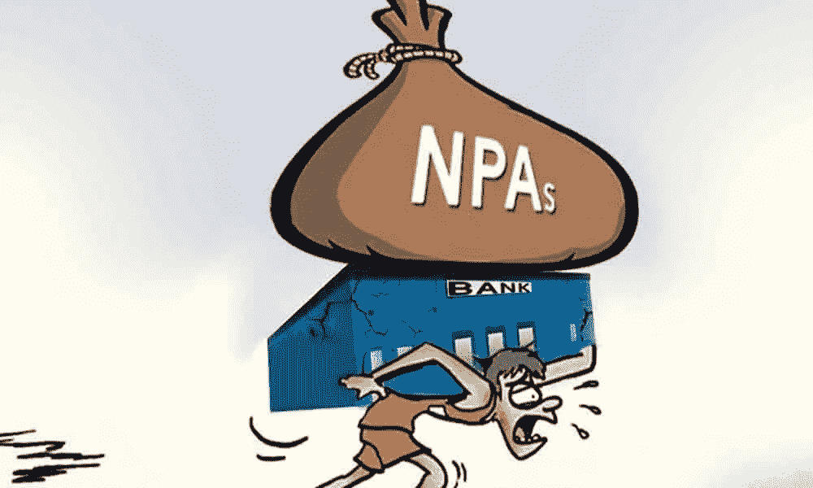
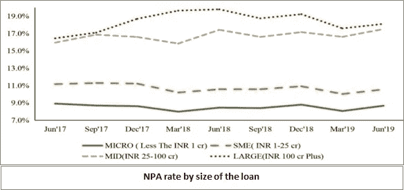
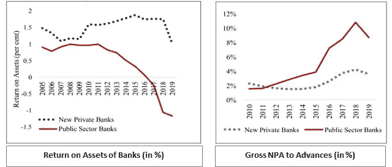
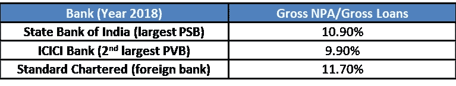
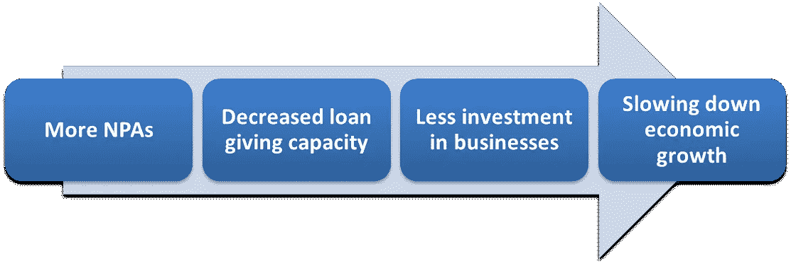
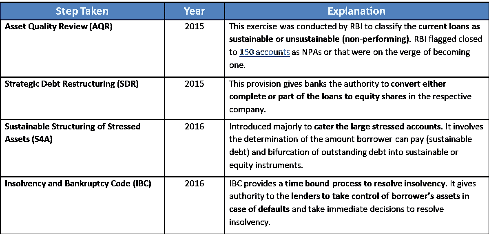

# 不良资产:罗伯特·清崎的富爸爸不希望任何人收购的唯一资产

> 原文：<https://medium.datadriveninvestor.com/non-performing-assets-the-only-asset-robert-kiyosakis-rich-dad-wouldn-t-want-anyone-to-acquire-ae552fbc76b4?source=collection_archive---------7----------------------->

在这篇文章中，我将谈论不良资产的起源，它对印度经济的影响，以及如何建立一个稳健的担保贷款机制。

[Image Credit](https://www.thehansindia.com/hans/opinion/the-lurking-npa-issue-in-psu-banks--536931)

> **双资产负债表问题**

在理解一笔贷款如何变成不良资产之前，我们需要看一个被称为“双资产负债表”的重要术语。这涉及到两方，我们来分解一下:

*   ***企业:*** 为了给庞大的资本密集型项目提供资金，企业除了使用发起人的股权作为融资方式外，还倾向于以一定的利率从银行贷款来筹集资金。贷款一经处理，就被记入公司资产负债表的“负债”栏。
*   *银行:由于它们向这些大公司发放贷款，贷款金额会被添加到它们资产负债表的资产栏中，因为它们将赚取利息，直到全部金额从被投资者的账簿中注销。*

*当企业无法偿还贷款金额(包括利息和本金)时，资产(银行的收入来源之一)就变成了银行的“负债”。这被称为“双资产负债表”问题，即公司和银行都资金紧张。*

> ***不良资产有哪些？***

*简单地说，现在已经停止为银行创造收入的资产被称为不良资产。*

* [## 使用谷歌搜索趋势预测首次申请失业救济人数|数据驱动的投资者

### 几年来，我的重点一直是使用多种替代数据来预测宏观经济统计数据…

www.datadriveninvestor.com](https://www.datadriveninvestor.com/2020/03/25/using-google-search-trends-to-predict-initial-jobless-claims/) 

**这里有一个更加** [**的技术定义**](https://economictimes.indiatimes.com/definition/non-performing-assets#:~:text=Definition%20of%20'Non%20Performing%20Assets,Substandard%2C%20Doubtful%20and%20Loss%20assets.) **:** “不良资产(NPA)是本金或利息支付逾期**90 天**的贷款或预付款

以下是一些数字，可以看出不良资产问题有多严重。

[Source](https://www.indiabudget.gov.in/economicsurvey/doc/echapter.pdf)

[Source](https://www.indiabudget.gov.in/economicsurvey/doc/echapter.pdf)

银行将不良贷款进一步分为以下类别:

*   ***次级资产:*** 保持不良资产少于或等于 12 个月的资产。
*   ***可疑资产:*** 保持不良资产超过 12 个月的资产。
*   ***损失资产:*** 银行无法再收回的资产。

> **不良贷款背后的主要原因**

不良资产的增加可归因于外部和内部(印度银行业)因素。让我们分别来看看这两个因素。

## ***外部因素***

*   ***2007 年至 2009 年的房地产危机:****2000 年代初，印度经济蓬勃发展，其结果是企业仅凭最近的增长数据就获得了大量贷款。但当全球经济在房地产危机中停滞不前时，这些公司的还款能力急剧下降。*
*   ****繁文缛节:*** 大部分贷款发放给了电信、电力、基础设施、采矿、钢铁和航空等行业的项目，这些行业需要政府批准环境和土地征用。由于这些批准的延误，项目的时间表受到影响。*

## ****内部因素****

*   ****贷款增加:*** 银行家们也对印度经济非常乐观，开始向大公司放贷，而没有进行适当的审查，如查看信用评分、公司未来的增长以及将尽职调查外包给第三方。*
*   **拒绝承认不良贷款:银行选择发放新的贷款，让借款人偿还旧贷款的利息，而不是对拖欠的贷款竖起红旗。这就是通常所说的*[*贷款常青*](https://economictimes.indiatimes.com/industry/banking/finance/auditors-dilemma-when-is-evergreening-a-fraud/articleshow/69718411.cms?from=mdr#:~:text=Evergreening%20is%20a%20ploy%20to,central%20to%20functioning%20of%20IL%26FS.&text=These%20disbursements%20towards%20repayment%20of,Group%2C%20ABG%20Group%2C%20Varun.)*，后来损害了印度银行业。****

> *****公共部门银行与私营部门银行*****

***经常有人认为，公共服务机构管理薄弱和腐败导致了不良资产的增加。让我们看看一些数字，以了解公安局紧张局势背后的实际原因。***

******

***[Made by the author](https://www.drishtiias.com/pdf/solving-the-npa-crisis-in-india.pdf)***

******

***[Source](https://www.ibef.org/download/Banking-May-2020.pdf)***

***不良资产总额与贷款总额比率表显示，所有主要商业银行都存在不良资产，但由于在银行业享有更大的市场份额(参见银行业资产总额图), PSB 受到的冲击最大。***

> *****不良资产证券化对印度经济的影响*****

******

***Made by the author***

*****参考前面提到的信息图:**随着不良资产数量的增加，银行变得资金紧张，导致它们在市场上流动资金的能力下降。这种封闭式债务期权是企业启动新项目的一种融资方式。没有新的项目和商业机会，更少的人有机会加入劳动力队伍，因此减缓了整体经济增长。***

> *****政府迄今采取的措施*****

***印度政府和印度储备银行采取的一些主要步骤如下:***

******

***[Made by the author](https://www.clearias.com/non-performing-assets-npa/)***

> *****结论*****

***在 RBI 和 GoI 采取措施后，[截至 2019 年 9 月，总不良资产比率已从同比 11.20%提高至 9.10%](https://www.business-standard.com/article/finance/gross-npa-ratio-improves-to-9-1-at-sept-end-from-11-2-y-o-y-rbi-119122400782_1.html)。为避免未来出现更多不良资产，必须采取以下措施:***

*   ***在不良贷款达到资产损失状态之前，利用数据和技术来标记不良贷款。***
*   ***贷款的尽职调查不应外包给第三方，应由银行官员尽职调查。***
*   ***应定期采取 AQR 等措施来识别任何隐藏的不良资产。***

*****访问专家视图—** [**订阅 DDI 英特尔**](https://datadriveninvestor.com/ddi-intel)****