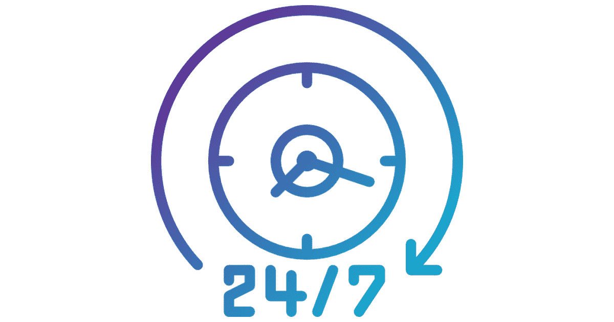

# 非传统支付

> 原文：<https://medium.datadriveninvestor.com/non-traditional-payments-99ad588a4ea2?source=collection_archive---------17----------------------->

## 未来的支付

现在我们已经看到了比特币的简要概述，我们可以更好地理解这种领先的加密货币如何为其用户提供潜在的好处。

如果已经有如此多的传统支付方式，为什么还需要比特币呢？比特币的一个关键因素是它的分散状态，这意味着它不受任何中央权力机构的控制或监管。这立即将它与法定货币区分开来。比特币支付是通过一个由共享账本连接的私人电脑网络来处理的。每笔交易同时记录在每台电脑的“区块链”中，并更新和通知所有账户。区块链起到分布式分类账的作用，消除了任何中央机关维护此类记录的需要。

 [## 5 行业转型区块链应用|数据驱动投资者

### 除非你一直生活在岩石下，否则我相信你现在已经听说过区块链了。而区块链…

www.datadriveninvestor.com](https://www.datadriveninvestor.com/2019/02/13/5-real-world-blockchain-applications/) 

比特币不像法定货币那样由中央银行或政府系统发行。相反，比特币要么是由计算机通过解决越来越复杂的数学算法的过程来“挖掘”，以验证将被添加到区块链的交易块，要么是用标准的国家货币购买，并放入最常见的通过智能手机或计算机访问的“比特币钱包”。

## 比特币的好处

使用加密货币支付的一些重要优势包括:

**1。立即供货**

这可能是加密货币支付的第一个最重要的好处。由于没有第三方的参与，一旦交易完成，钱就在收款人的钱包里。

比特币可以很容易地转换成当地货币，并在每次交易结束时收到。由于比特币不时会继续波动，您的付款将按照交易时的汇率进行。

**2。省时**

在这个时代，时间是非常重要的。随着科技的进步，世界继续变得越来越小。不管怎样，互联网让一切变得更容易，这就是为什么人们如此投入地寻找减少时间的方法。

用加密货币支付又快又可靠。一旦你付款，它会在眨眼之间到达对方手中。这意味着与通常耗时的现金或信用卡支付相比，使用加密货币支付可以节省大量时间。

**3。公司提供优惠折扣**

你会惊讶地发现，提供加密货币支付的公司为他们的客户提供了巨大的折扣。如果用比特币付款，许多网上药店会提供高达 35%的折扣。同样，许多公司提供用数字货币支付的批量折扣。

首先，数字货币到达对方手中的时间更短。其次，节省了很多时间。因此，如果你在网上购物，你必须检查该公司是否提供通过数字货币支付的选项。

**4。减去交易成本**

这是消费者可以享受的数字货币支付的另一个主要好处。自从比特币在数字世界的演变以来，对于那些必须将产品提供给世界各地的人的公司来说，事情变得容易多了。比特币就是这样一种数字货币，与通过信用卡和其他媒介支付相比，其交易成本非常低。因此，如果你用数字货币支付，你会产生更少的税收和交易成本。

**5。在任何地方付款**

由于加密货币是分散的，没有明确的平台，你可以在世界任何地方进行支付。如果你将这种支付方式与传统的支付方式相比较，无论如何，去公司的分支机构或通过银行进行支付都是很困难的。有了数字货币，只要你知道你的数字钱包的密码，你就可以在世界任何地方安全地进行支付，并节省通勤时间。

这些只是加密货币提供的一些常见好处。不仅仅是消费者，公司也是数字货币支付的受益者。如果没有加密货币，这个世界在支付方面会慢下来。

***如果您想了解更多，请访问 BIDITEX 页面并提出您的问题，关注我们的*** [***推特***](https://twitter.com/biditex_com) ***，*** [***脸书***](https://www.facebook.com/biditex/) ***，*** [***中型***](https://medium.com/@biditex) ***，*** 用[***bidi tex***](http://www.biditex.com/)***投标你的空间。*** ***如果你想了解更多，请访问 BIDITEX 页面并提出你的问题，关注我们的*** [***推特***](https://twitter.com/biditex_com) ***，*** [***脸书***](https://www.facebook.com/biditex/) ***，***用[***BIDITEX***](http://www.biditex.com/)***投标你的空间。***