# 非易失性存储器和计算存储器的历史背景

> 原文：<https://medium.datadriveninvestor.com/non-volatile-memory-and-the-historical-backdrop-of-computing-memory-12ce3ca8b072?source=collection_archive---------5----------------------->

Star-gazer in the sahara dessert — Photo by [@mvds](https://unsplash.com/@mvds)

## 为什么在人工智能的背景下很重要？

记忆是迷人的。计算中的内存实际上是一个独立的概念。一个简单的论点是——随着人工智能领域更快、更可靠的内存应用程序可能能够以更好、更安全的方式运行。然而记忆更有趣！考虑历史背景和即将到来的创新。

> 在计算技术中，**内存**是指一种用来存储信息的装置，可在计算机或相关的计算机硬件设备中立即使用

用一种外行的方式来说，就是存储信息，但用于计算工作的特定目的。

那么什么是非易失性存储器呢？

根据 [Techopedia](https://www.techopedia.com/definition/2793/non-volatile-memory-nvm) 的说法是:

> **“非易失性存储器** (NVM)是一种计算机存储器，即使在电源关闭的情况下也能保存数据。与易失性存储器不同，NVM 不需要定期刷新其存储器数据。常用于二级存储或长期一致存储。
> 
> 非易失性存储器在数字媒体中非常受欢迎；它广泛应用于 USB 记忆棒和数码相机的存储芯片中。非易失性存储器消除了对包括硬盘在内的相对较慢类型的辅助存储系统的需求。
> 
> 非易失性存储器也称为非易失性存储器。"

在试图理解这一点之前，我认为看看计算记忆的历史背景会很有趣。

## 计算内存的历史背景

奇怪的是，计算存储的历史可以追溯到 1725 年，当时 Basile Bouchon 通过穿孔纸卷存储机器指令来控制纺织织机。

1804 年，这项技术发展成为成功的提花织机。它也用于亚历山大·贝恩的自动电报机和机械风琴。

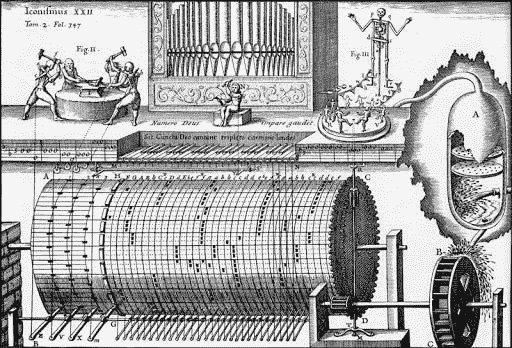

因此，它是金属或纸张上的机械印记。

 [## AI 将军是否已经超过了人类的智力容量？数据驱动的投资者

### 不仅在游戏中，而且在劳动力市场上，机器都比人类聪明。在今天的许多领域，使用…

www.datadriveninvestor.com](https://www.datadriveninvestor.com/2020/02/12/has-general-ai-exceeded-the-intellectual-capacity-of-humans/) 

后来又有古斯塔夫·陶谢克于 1932 年在奥地利研制出一种磁性数据存储装置。这被称为**鼓内存**。

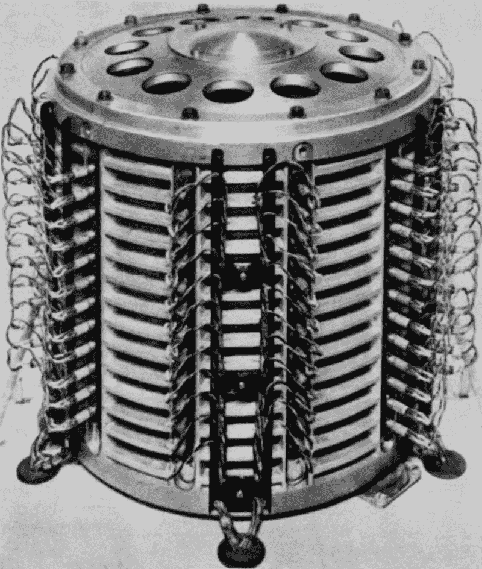

如今，当我们提到架子鼓时，有些人可能会想到嘻哈音乐。

然而对于一些早期的计算机来说，*鼓形内存*构成了计算机的主要工作内存。这是如此普遍，以至于这些计算机经常被称为*鼓机*。

1932 年的原鼓机容量约为 [50 万比特(62.5 千字节)](https://en.wikipedia.org/wiki/Drum_memory)，用于首批量产的计算机之一。

> 第一台大规模生产的计算机 IBM 650 的磁鼓内存约为 8.5 千字节(后来在 Model 4 中增加到 17 千字节)。

后来**发明了磁芯存储器**。有一系列人参与其中，但该领域早期发展的实质性工作是由当时在哈佛大学计算实验室工作的两个人完成的。1949 年，出生于上海的美国物理学家王安和吴伟东发明了*脉冲传输控制装置*。专利是在 1949 年申请的。

麻省理工学院的杰伊·福雷斯特(Jay Forrester)有一种随机存取磁芯存储器的方法，这种方法在未来几十年里变得越来越占主导地位。

Project Whirlwind — core memory, circa 1951, developed at MIT Lincoln Laboratory, Massachusetts, USA.

[随机存取](https://en.wikipedia.org/wiki/Random_access) [计算机内存](https://en.wikipedia.org/wiki/Computer_memory)大约在 1955 年到 1975 年之间的 20 年间。

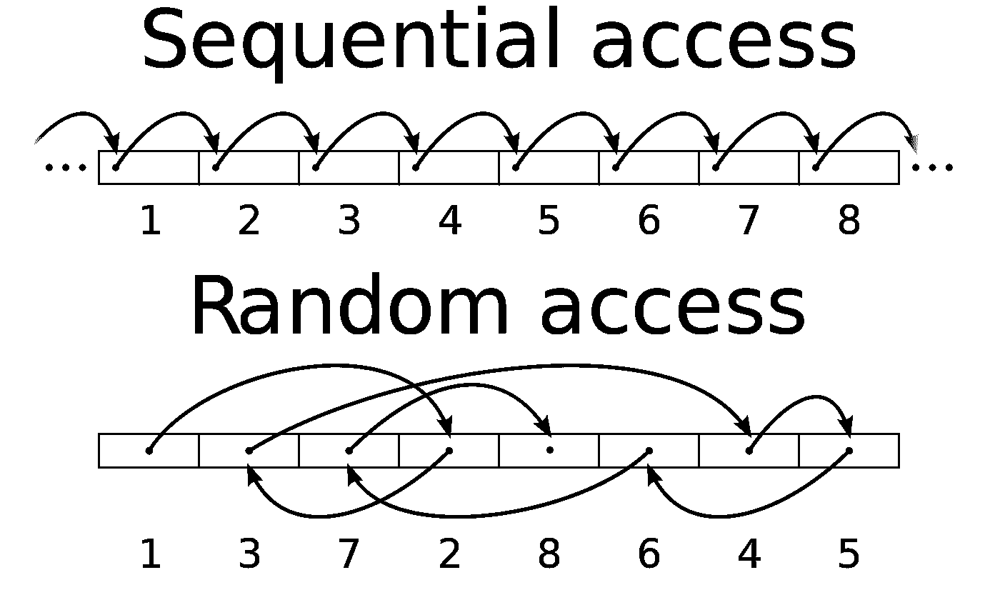

这是一个很大的进步，因为它可以通过给定坐标来检索数据，而不是以存储的方式(顺序)来访问数据。

显然，这经常被比作一个卷轴，而不是一本书。

有趣的事实法国电子音乐二人组蠢朋克的第四张录音室专辑于 2013 年 5 月 17 日发行，名为《随机存取记忆》!

在磁芯存储器中:*"…术语“芯”来自传统的变压器，其绕组围绕着一个磁芯。在磁芯存储器中，导线穿过任何给定的磁芯一次，它们是单匝器件。”*

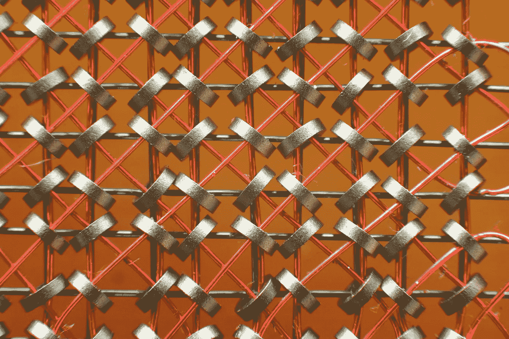

Close-up of a core plane. The distance between the rings is roughly 1 mm (0.04 in). The green horizontal wires are X; the Y wires are dull brown and vertical, toward the back. The sense wires are diagonal, colored orange, and the inhibit wires are vertical twisted pairs.

还有其他形式，如镀线记忆(1957 年)和芯绳记忆(20 世纪 60 年代)。

很多都是固定的，在一个地方。虽然也有军事用途的例外，如安装在半挂卡车拖车上的 MOBIDIC。

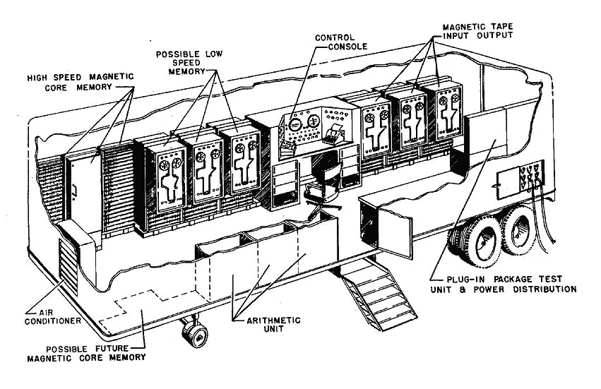

磁盘组和磁盘盒是计算机数据存储的可移动介质的早期形式。

它是在 20 世纪 60 年代和 70 年代推出的。

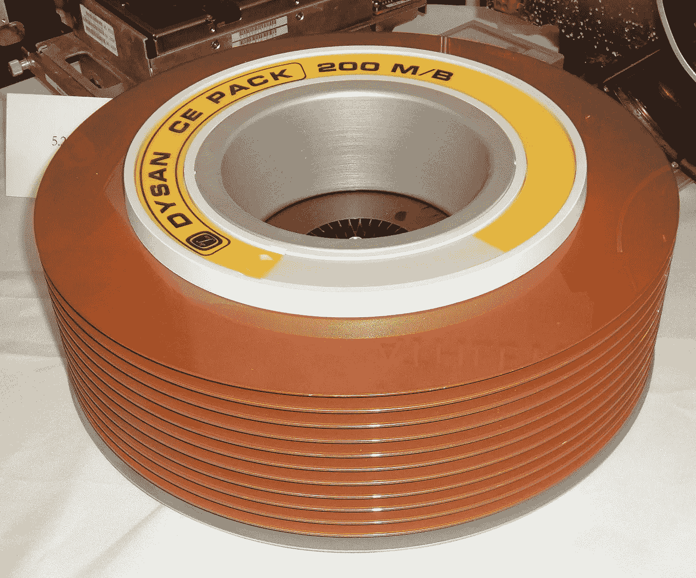

1970s vintage 200 megabyte disk pack manufactured by Dysan, with the cover removed

不仅是所描述的磁盘组，还有早期的磁盘盒。

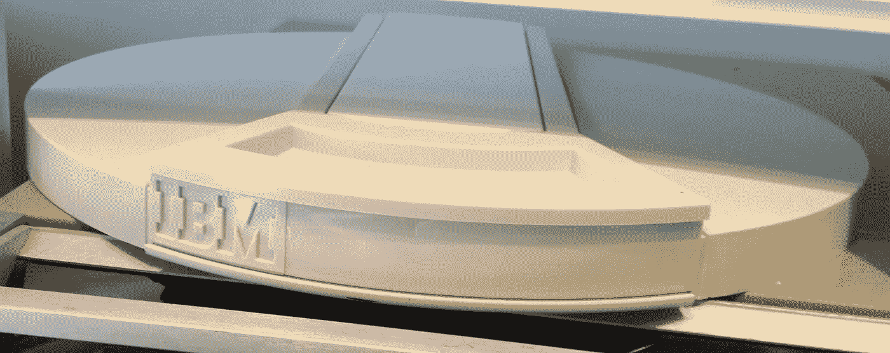

The IBM 2315 disk cartridge stored 1 megabyte of data. Used in The **IBM 1130** Computing System, introduced in 1965

对某些人来说，更接近于内存的一种内存形式可能是软盘。

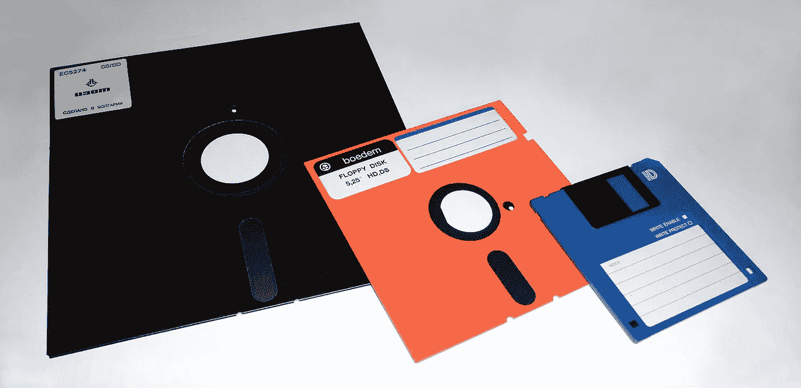

8-inch, ​5 1⁄4-inch, and ​3 1⁄2-inch floppy disks

从 20 世纪 70 年代中期到 21 世纪初，软盘是一种无处不在的数据存储和交换形式。

所以让我们在这里兜一圈，或者至少兜一圈。

让我们回到非易失性存储器。

因为软盘是非易失性存储器的一个例子，有几种不同的存储设备，我们可以按照这些思路来考虑。

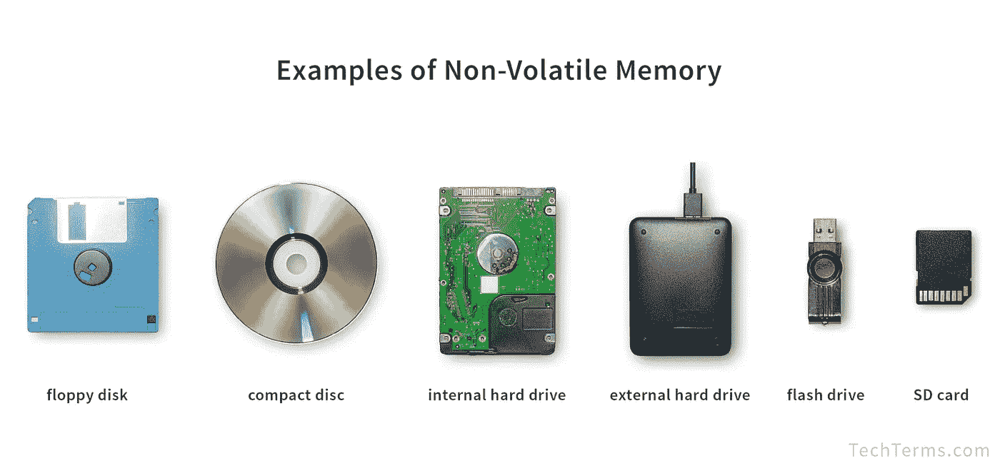

然而，这是存储系统多年来令人难以置信的变化。

来自西班牙马拉加的丹尼尔·桑丘(Daniel Sancho)做了一个有趣的对比，在这张照片中，我们看到了 8 字节的磁芯存储器，旁边是一张 8 GB 的 microSDHC 卡。

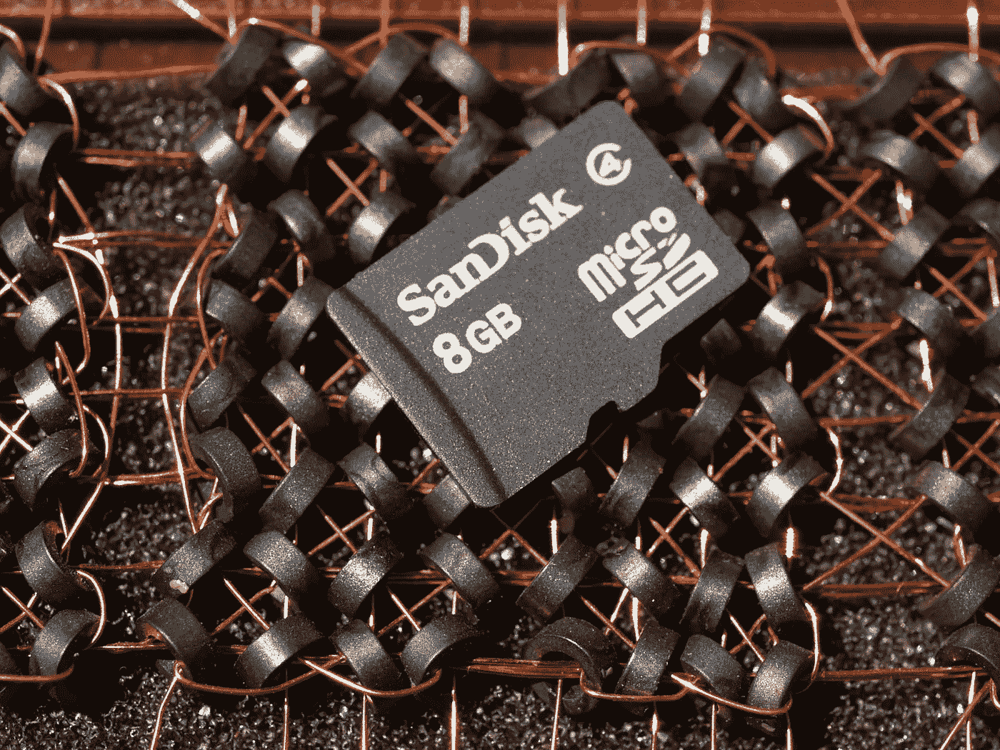

也就是说，8589934592 字节占用的空间比 8 字节少！

什么是易失性存储器？一个例子是动态随机存取存储器。

> 1959 年贝尔实验室的阿塔拉和康发明金属氧化物半导体场效应晶体管，也称为 MOS 晶体管，导致金属氧化物半导体动态随机存取存储器的发展。

MOSFET 不仅实现了动态存储器，也是 USB 闪存驱动器的基础。

USB 被定义为代表 [**通用串行总线**](https://www.yourdictionary.com/usb) 的首字母缩写词，通用串行总线是一种计算机端口，可用于将设备连接到计算机。

然而，USB 是闪存，一种由桀冈富士雄在 20 世纪 80 年代早期发明的浮栅半导体存储器。闪存使用浮栅 MOSFET 晶体管作为存储单元。

因此，易失性存储器与诸如 USB 之类的非易失性存储器的闪存驱动器相反。

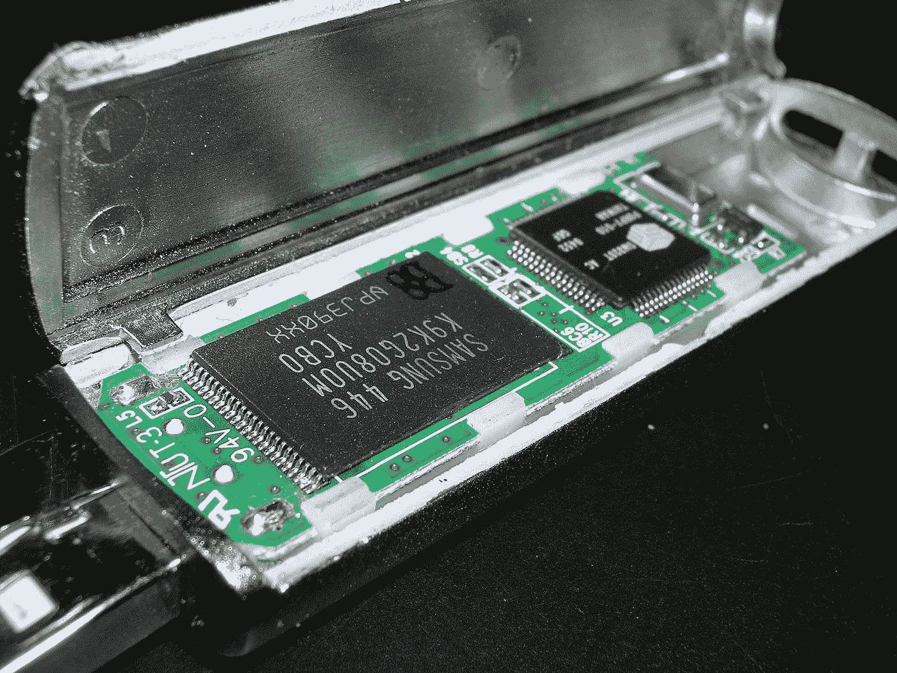

存储数据的固态芯片。

这些闪存驱动器通常以传输数据的速率来衡量。

这可能会让我们更接近这一点。

但首先，看看这个神奇的 USB。

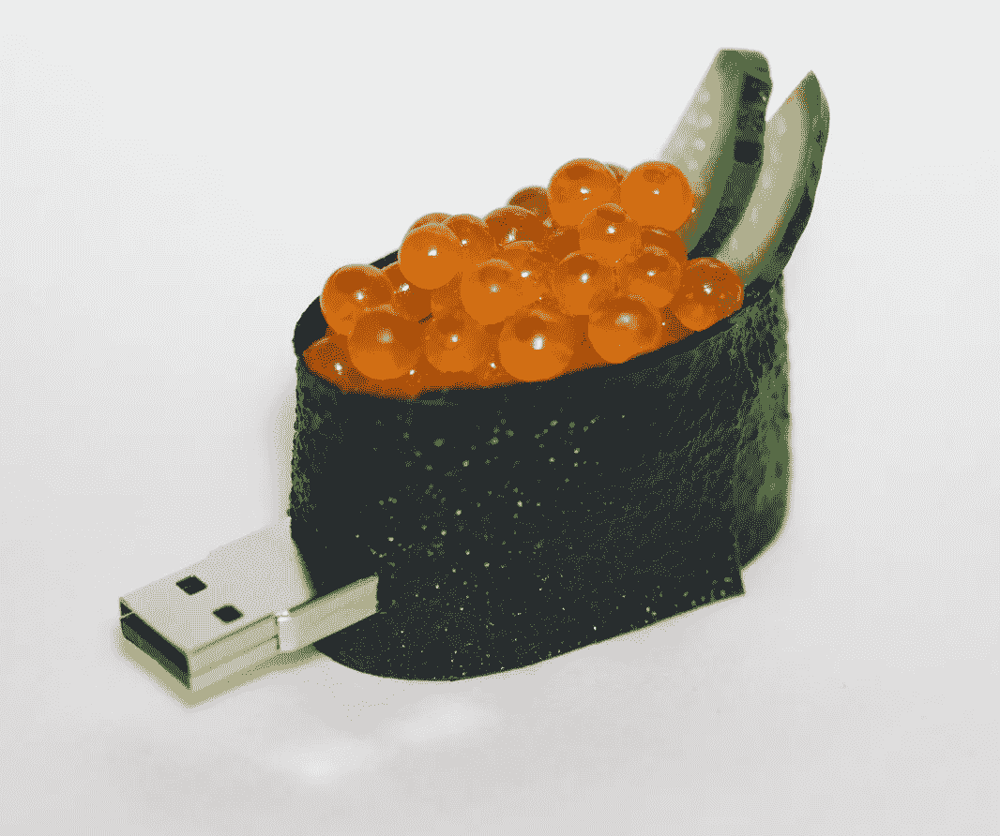

A USB flash drive in the shape of a piece of ikura (salmon roe) sushi. Photo taken by [Tokugawapants](https://en.wikipedia.org/wiki/User:Tokugawapants)

回到正题——硬件和软件共同支持内存和处理。

在人工智能领域的应用环境中，这种非易失性存储器确实需要硬件能够相当快速地传输数据——处理并存储数据，然后处理并存储数据，等等。

因此，需要开发专门用于解决这些类型应用的新形式的非易失性存储器。

## 现代非易失性数据存储

因此，回到 Techopedia，他们使用了寻址系统分类(AD ),即:

1.  机械地。
2.  电动的。

第一种使用接触结构在选定存储介质上读写。

其次是电寻址系统。这些系统价格昂贵，但速度比机械寻址系统快，后者价格低廉但速度慢。

电寻址系统的几个例子是闪存、FRAM 和 MRAM。

**“铁电 RAM** ( **FeRAM** 、 **F-RAM** 或 **FRAM** )是一种随机存取存储器，其结构类似于 DRAM，但使用铁电层代替电介质层来实现非易失性。”

考虑电介质。

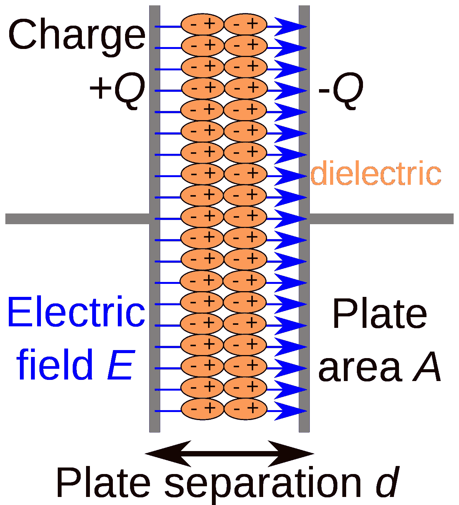

[Papa November](https://commons.wikimedia.org/wiki/User:Papa_November) — self-made SVG version of [Image:Dielectric.png](https://commons.wikimedia.org/wiki/File:Dielectric.png)

与铁电体相反。

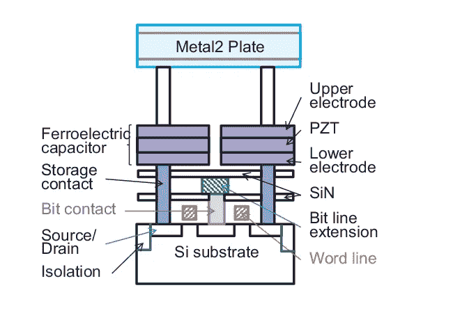

Illustration by [Wensheng Wang](https://www.researchgate.net/profile/Wensheng_Wang9)

那么区别在哪里呢？

> 铁电材料响应外部电场产生自发极化(积累电荷)。[……]大多数电介质材料是绝缘的(电子或离子都不导电)致密固体(没有可以重新定向的分子)。因此，极化率必须来自离子极化率和电子极化率。在这两种物质中，离子极化率的贡献最大，特别是在一类叫做铁电体的固体中。P.Ravindran，PHY085 —材料特性，2014 年 4 月:[材料的介电和铁电特性](http://folk.uio.no/ravi/cutn/pmat/8.Ferroelectric.pdf)

然后是 MRAM。

> **[**磁阻随机存取存储器** ( **MRAM**](https://en.wikipedia.org/wiki/Magnetoresistive_random-access_memory) )是一种在磁畴中存储数据的非易失性随机存取存储器**

**这些是在 20 世纪 80 年代中期开发的。**

**显然，有观点认为磁阻 RAM 将最终超越竞争技术，成为主导甚至通用存储器。**

****

**From [Spintronics based random access memory: a review](https://www.sciencedirect.com/science/article/pii/S1369702117304285?via%3Dihub).**

**就人工智能而言，这是一个关于 [*ReRam*](https://en.wikipedia.org/wiki/Resistive_random-access_memory) 或:**

> **电阻式随机存取存储器是一种非易失性随机存取计算机存储器，它通过改变介电固态材料(通常称为忆阻器)的电阻来工作**

**如上所述，电介质不同于铁电体。**

**然而，ReRam 似乎成本更高。**

**因此，尽管它被视为闪存的替代技术，但取代它的性价比一直是个挑战。**

**现在有关于 3D 打印记忆的说法。**

**毫无疑问，记忆是一个有趣的概念。**

**这里是#500daysofAI，您正在阅读的是第 315 篇文章。500 天来，我每天都在写一篇关于或与人工智能相关的新文章。我 300-400 天的重点是关于人工智能、硬件和气候危机。**