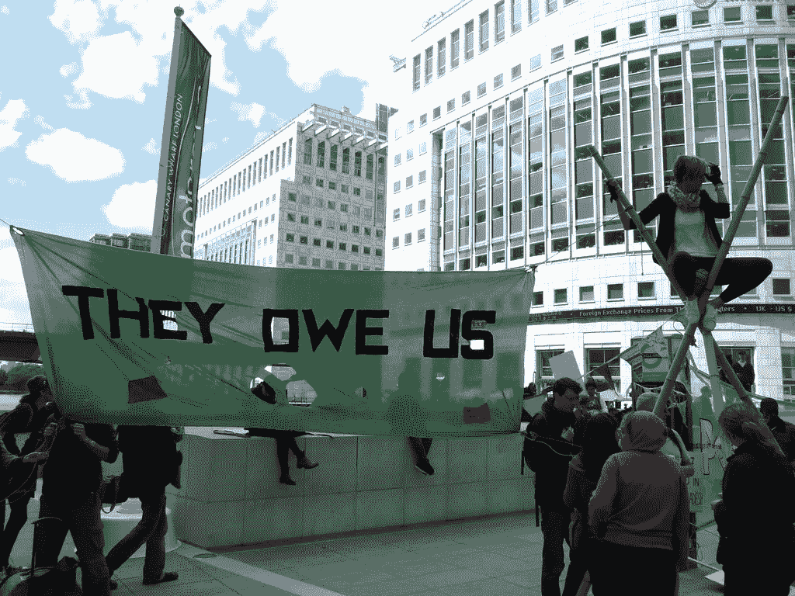
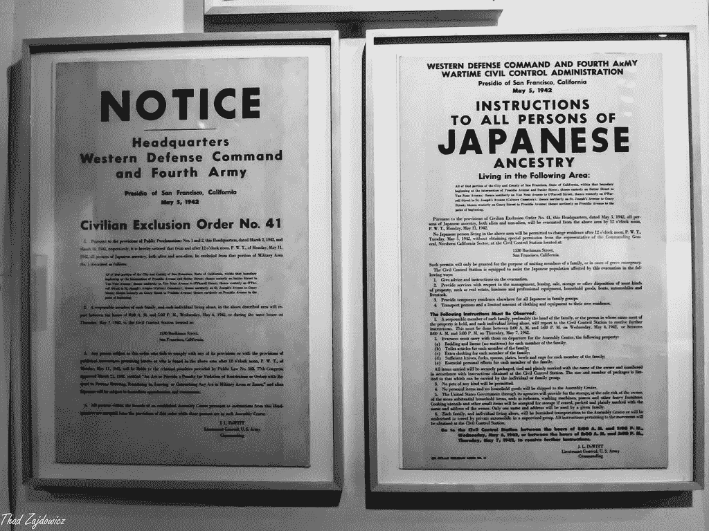
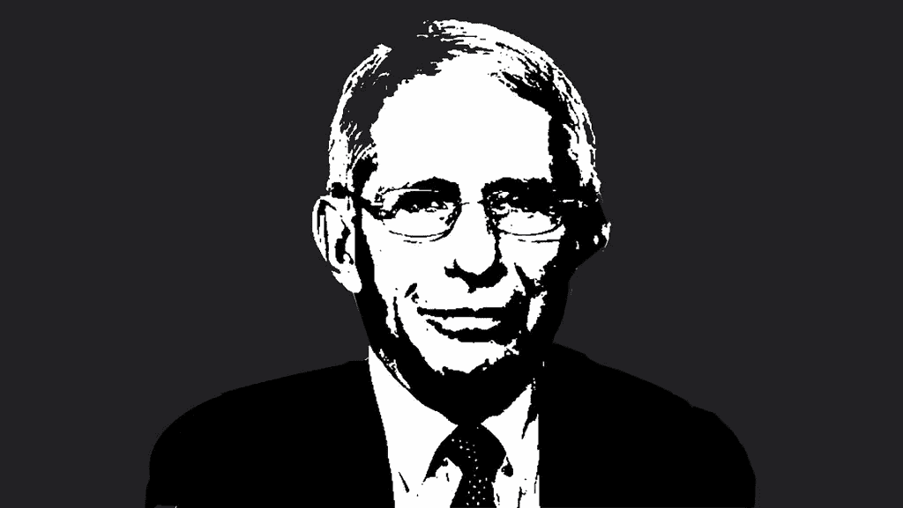
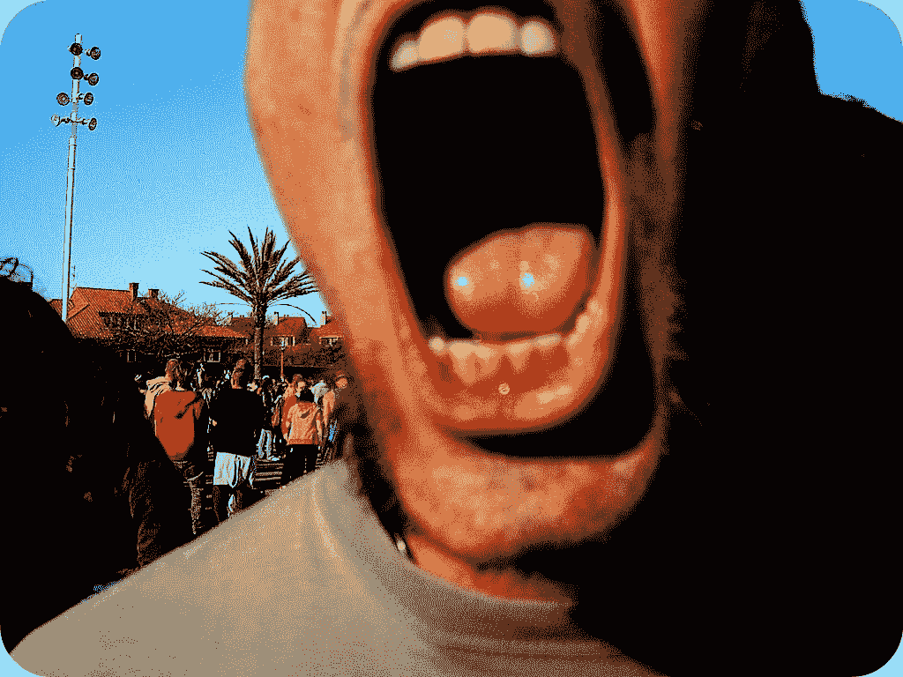
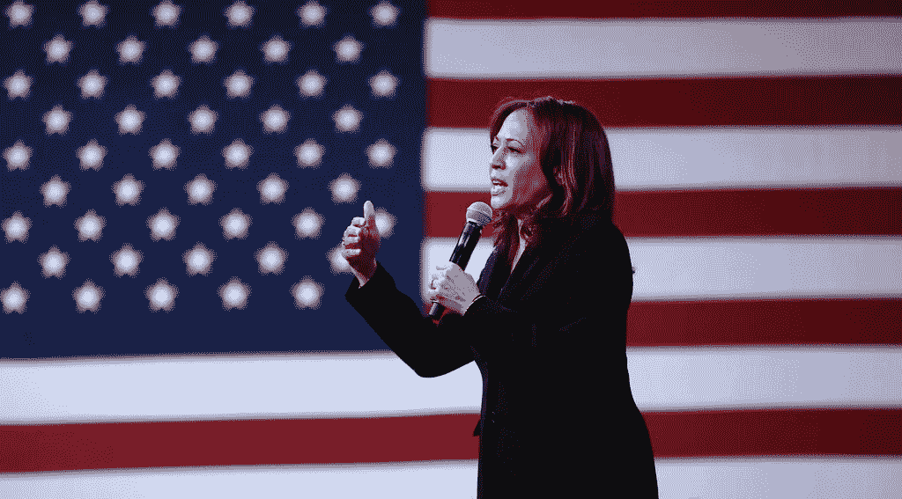
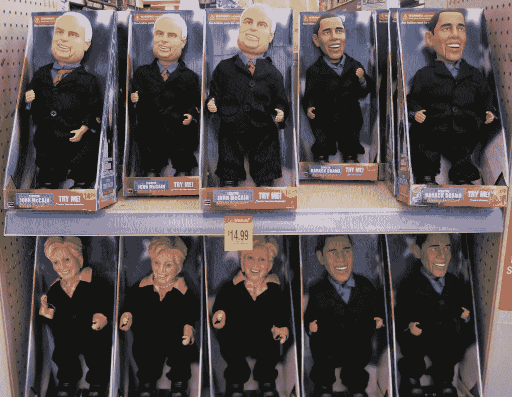

# 与邻居的争论其实都无关紧要

> 原文：<https://medium.datadriveninvestor.com/none-of-the-debates-with-your-neighbors-actually-matter-a470cd91dc7f?source=collection_archive---------22----------------------->

直到你们中的一个人意识到整个美国政府系统辜负了我们，彼此之间的争吵应该被改变。

[“‘They Owe Us’ Protest at Canary Wharf”](https://www.flickr.com/photos/9400557@N07/9066215742) by [copwatcher](https://www.flickr.com/photos/9400557@N07) is licensed under [CC BY-NC-SA 2.0](https://creativecommons.org/licenses/by-nc-sa/2.0/?ref=ccsearch&atype=rich)

美国人口今年比我成年以来的任何一年都要活跃。每个人对每件事都有自己的看法，我们不能对此闭口不谈。我们都拿着扩音器，这正是当权者想要的。

政客们和那些他们伸手可及的人优雅地接受了音量的上升，并保证穷人创造的分贝会被误导到其他穷人的相反观点。这使他们能够在暗处和明处运作，建立和维持一个帝国。与此同时，我们在烂泥中一个原子一个原子地互相撕扯。

底层的一些原因和对话是有道理的。当然，黑人的生命很重要。反对这种观点就是成为戈培尔驱动的影响的后代。美国司法部长威廉·巴尔将新冠肺炎留在家中的命令称为[“美国历史上对公民自由的最大侵犯”](https://www.reuters.com/video/watch/idOVCW31KGV)既令人恐惧又令人发笑。

[“E.O. 9066”](https://www.flickr.com/photos/40632439@N00/36507145020) by [Thad Zajdowicz](https://www.flickr.com/photos/40632439@N00) is marked with [CC0 1.0](https://creativecommons.org/licenses/cc0/1.0/?ref=ccsearch&atype=rich)

巴尔漫不经心地忘记了二战期间关押日裔美国人的美国集中营。同样被忽略的是越南战争草案，它剥削了贫穷的美国人，同时给了富人免于这种谴责的特权。他忘记了私刑处死黑人的普遍做法——通常是在当地执法部门的支持和帮助下。

然而，我们在非选举领域沉迷的大多数一般话题要么太大，公众不会错过，反过来被媒体分解成几层，要么太不重要，寡头政治满足了我们的胃口，转移了我们对现实的注意力。通常，当权者会将这些要点结合起来，以制造出想要的结果。

在大范围内，你有像冠状病毒疫情，黑人的命也是命运动和 2020 年总统大选这样的事情。无论哪一年，这三者都是如此重要。当权者知道这一点。他们意识到，当公众比领导层更积极参与时，这些情况是无法对公众隐瞒的。

这就是政治策略的闪光点。政府不是作为一个代表公众的选举实体来解决这些问题，而是将所有的担忧都推到穷人和工人阶级身上。他们说话含糊不清，观点相左，而不是提供实质性的支持和行动步骤。令人震惊。

看看疫情对冠状病毒的处理。即使有最微小的信息，也很明显，为了公众形象，现任政府积极地危及和丧失美国人的生命。

从特朗普总统在二月份的[鲍勃·伍德沃德采访中承认冠状病毒的危险以及他的“淡化”评论，特朗普坚定的](https://www.youtube.com/watch?v=70V3nI9fAG8)[反口罩立场](https://www.wtsp.com/article/news/health/coronavirus/trump-downplays-pandemic-affects-virtually-nobody/507-71bb297e-a9b6-4cdd-8d99-f739aa060a05)，以及他与 AXIOS 的乔纳森·斯旺令人不安和[彻头彻尾的喜剧对话；最明显的证据唾手可得。](https://www.rev.com/blog/transcripts/donald-trump-interview-transcript-with-axios-on-hbo)

AXIOS on HBO: President Trump Exclusive Interview (Full Episode) | HBO via HBO’s YouTube channel

坦白地说，这些启示应该是特朗普总统的墓碑、铲子和棺材。但由于新闻业的疏忽和快节奏的社交媒体，公众消化了这些信息，并比他们应该的更快地转移到下一个话题。那些决定留下来向房间里的无数大象发表演讲的人遇到了不诚实的媒体策略和肮脏的政治。

CNN、MSNBC 和福克斯新闻频道之流转移了人们对本方政治支持者的注意力。相反，他们推动挑战科学家和专家合法性的叙事，并强调人们大规模迁移到国家抗议和海滩。基层的反对力量没有挑战特朗普及其亲信，而是更加关注特朗普的基层支持者，因为 MSNBC 将他们描绘成人类的祸害。于是，脸书和推特的争斗就诞生了。

[“The Stately Dr Faucci”](https://www.flickr.com/photos/7267297@N05/49871697596) by [ClaraDon](https://www.flickr.com/photos/7267297@N05) is licensed under [CC BY-NC-SA 2.0](https://creativecommons.org/licenses/by-nc-sa/2.0/?ref=ccsearch&atype=rich)

接受特朗普教义的工人阶级对遵守严格的新冠肺炎准则的当地餐馆和企业感到愤怒。这些场所的雇员和企业主将他们的不满发泄在愤怒的顾客身上。我们互相指责和抱怨，却很少联合起来质疑那些要么在第一时间煽风点火，要么对混乱视而不见的当权者。我们正中他们下怀。

政府善于在人民中间实行分化。它们没有给我们提供重要的信息，而是让我们处于黑暗之中，让我们制造模糊的故事。当他们打高尔夫球，在乡村俱乐部享用三杯马提尼午餐时，我们在战斗。他们一边啃着橄榄，一边挥舞着五根铁杆，留下的面包屑导致了混乱。

以南希·佩洛西冠状病毒沙龙丑闻为例。佩洛西理发成了好几天的全国新闻，但是谁会关心佩洛西理发呢？有更糟糕的事情，我们应该叫佩洛西出来。类似地，特朗普涉嫌侮辱美国军队和参议员约翰·麦凯恩(John McCain)也是几周前的一个主要话题。

谁在乎呢。鉴于特朗普过去说过的一切，如果他把死去的士兵称为失败者，会令人惊讶吗？就此而言，我们家乡有多少人真正关心军队？当然，原则上我们尊重这种牺牲，但是当一名士兵在一场战争或占领一个我们不应该在的国家中失去生命时，我们是否曾经愤怒过？不，我们不知道，因为政府已经灌输了一种观念，即美国帝国是我们最神圣的财富。

此外，麦凯恩是一个战争贩子——他应该被轻视。

这种破坏在 2020 年评估反对系统性种族主义和警察暴行的黑人的命也是命运动时最为明显。为正义而战是正义的，是几个世纪以来反对腐败专制精英的公众起义的延续。然而，美国的基地再次被告知要在彼此之间战斗，而不是与允许这种不公正发生的制度争吵。这是一个典型的“不要注意窗帘后面的人”思维模式的例子。

例如，BLM 之战已经被扭曲成一种政治*他说她说*现象，政治人物和电视新闻主播将人们的注意力推向抗议者和暴徒以及公共民兵，而不是那些没有采取任何行动起草改革政策或调整他们操纵的制度的当权者。

已经变成了抗议者对抗警察，暴徒对抗武装的*义务警员*。雅各布·布莱克和一把刀，布里奥纳·泰勒和一个不正确的警察无敲门许可证，凯尔·里顿豪斯和非法持枪。雕像、象征和被剥削者的行为掩盖了联邦政府的疏忽。

[“Yell!”](https://www.flickr.com/photos/26312553@N02/3467211299) by [Vetustense Photorogue](https://www.flickr.com/photos/26312553@N02) is licensed under [CC BY-NC 2.0](https://creativecommons.org/licenses/by-nc/2.0/?ref=ccsearch&atype=rich)

我们上当了。然后我们去掐邻居的喉咙。引诱他们，抨击他们，以证明我们的，往往仓促和媒体稀释，点。房间里充满了过度劳累、恐惧和疲惫的尖叫声——与此同时，那些真正应对美国国内动荡不安的气氛负责的人从他们看上的服务器上又点了一杯马提尼。

这种基层的混乱是腐败继续在银幕下发展的完美分心。特朗普和领先的右翼官员将注意力集中在暴乱的暴力上，并将任何反对力量称为危险的暴徒或 Antifa 的附属力量。他们的使徒跟随花衣风笛手，因此所有生命和蓝色生命形成。沿着这条线，[亲社会主义和反警察暴行的组织者因和平呼吁威权国家的不公正状况而被监禁。](https://www.liberationnews.org/jailed-denver-anti-racist-leaders-subjected-to-dangerous-and-degrading-conditions-in-custody/)

黑人生活问题倡导者提出反对意见，他们所谓的政治领导人通过排练好的新闻发布会采取半心半意的立场。虽然倡导者的回答通常是诚实和公正的，但政客们只是在为他们假想的选民装傻。

佩洛西是这一策略的一贯使用者。该国最强大的民主党人举行了一次新闻发布会，她在会上呼吁参议院在 Breonna Taylor 案后寻求适当的正义。尽管[她和其他民主党人的议程](https://www.blackenterprise.com/ninety-three-members-of-the-house-and-23-senators-voted-to-cut-the-pentagon-budget/)，这个电话还是让不知情的听众对她赞不绝口。

*Pelosi: Breonna Taylor “murdered by the police” via The Hill’s YouTube channel*

佩洛西和许多其他民主党人喜欢在推特上发布“黑人的命也是命”的标签，但他们中的大多数人一直反对这场运动。最直接的例子之一就是两党对美国与以色列联盟的支持。

以色列是巴勒斯坦种族隔离的肇事者。它的谋杀数量每天都在上升，然而美国却不顾一切地宣誓效忠。除了明显的战争罪行之外，以色列还为美国警察进行基于军事的警察训练。这些军官接受以色列军事教官的教导，向头部开枪，平民应被视为恐怖威胁。然后这些警察返回，在美国城市穿上蓝色制服，因此国内警察部队的以色列化和军事化仍在继续。

佩洛西不是唯一突出的鹰派人物。“头号警察”卡玛拉·哈里斯也是一个笑话。在夏季的大规模抗议和呼吁社会正义改革期间，民主党提名一名前检察官担任副总统职位，他的记录摧毁了数千名加州居民的生活。她对大麻指控执行了更长的刑期，以维持廉价的监狱劳动力。哈里斯威胁要逮捕逃学儿童的母亲。2013 年现任财政部长史蒂文·姆努钦在加州剥削和取消公民赎回权后，她拒绝起诉他。

[“Kamala Harris”](https://www.flickr.com/photos/22007612@N05/46823600565) by [Gage Skidmore](https://www.flickr.com/photos/22007612@N05) is licensed under [CC BY-SA 2.0](https://creativecommons.org/licenses/by-sa/2.0/?ref=ccsearch&atype=rich)

除了她的马桶记录之外，她还是 324 名国会议员中投票反对今年夏天五角大楼削减 10%开支提案的[。她声称她投票反对该法案是因为它是如何提出的，而不是因为它代表了什么。在疫情时期，这些资金本可以被重新分配给医疗保健支持，因为它对美国黑人的影响更大。](https://clerk.house.gov/evs/2020/roll148.xml)

像佩洛西一样，[哈里斯是亲美以关系的支持者。](https://thegrayzone.com/2020/08/11/netanyahu-top-cop-kamala-harris-israel-racism/)

对哈里斯的讨论是向 2020 年总统大选的适当过渡。多年来，民主党人推动了关于俄罗斯门的扭曲故事，并不断咀嚼弹劾特朗普总统的提议。然而，在今年的民主党全国代表大会上，这两点都没有被提出。

这证明了一些重要的事情——民主党人从来不关心所谓的 2016 年俄罗斯选举干预或弹劾本身。这些仅仅是制造公众歇斯底里情绪和让民主党选民反对共和党和共和党选民基础的表面策略。简单地说，他们是谈话的开始者，保证永远不会有任何结果。

即使没有这些所谓的突破点，民主党全国委员会还是设法挖了一个更深的洞。该党邀请多名战犯上台代表拜登/哈里斯竞选团队发言。当所谓的自由派选民关注和倾听希拉里和比尔·克林顿、约翰·克里和科林·鲍威尔等人的时候，民主党传递了一个重要的信息。民主党目前的状态就像几十年前一样鹰派和腐败，所有的社交媒体帖子和半吊子新闻发布会都被证实是旨在暂时安抚选民的谎言。当肥猫们在餐桌上用餐时，为我们老鼠预先选择的面包屑。

[“Animatronic John McCain & Barack Obama Presidential Dolls”](https://www.flickr.com/photos/27403767@N00/2818719072) by [Scott Beale](https://www.flickr.com/photos/27403767@N00) is licensed under [CC BY-NC-ND 2.0](https://creativecommons.org/licenses/by-nc-nd/2.0/?ref=ccsearch&atype=rich)

但公众并没有看到这一点。相反，他们看到两个前民主党总统候选人，一个前民主党当选总统，和一个布什顾问变成共和党叛徒。令人发指的过去时代的冠军。他们认为这是积极的，因为他们不知道建立这些邪恶人物遗产的严酷性。

没有提出任何政策，进步思想仅限于“黑人的命也是命”和“负担得起的医疗保健”这两个词。

民主党全国委员会欺骗了公众，让进步的纽约州众议员亚历山大·奥卡西奥-科尔特斯发表了一篇关于参议员伯尼·桑德斯的程序性演讲。大约 90 秒的时间似乎描绘了 AOC 无视拜登提名的场景，尽管演讲完全是仪式性的。尽管如此，媒体还是进行了错误的叙述，一位主要的进步民主党人为此受到了指责。

Rep. Alexandria Ocasio-Cortez remarks at Democratic National Convention via C-SPAN’s YouTube channel

我们工人阶级经常被富人和当权者剥削。两党制是一个双头怪物，要求我们都选择一个头来防御。与此同时，另一个头会在我们的盲点上下手。政府官员参与战斗，告诉我们穿上盔甲是我们的责任，尽管他们是我们选择来捍卫自由的人。民主已经在怪物的胃酸中溶解了。

统治阶级希望邻居成为敌人，这样他们就可以毫发无损地继续腐蚀世界。我们需要理解这一点。如果我们不改变责备和责任的心态，和谐将永远不会到来，我们的命运将在我们第一次呼吸之前就已注定。

与你的朋友、邻居和家人争论是没有意义的，因为他们没有能力去改变一件事。再多的名人和伪名人说“今年 11 月投票”也没有任何意义。请记住，目前我们的选票很重要，但我们的声音不重要。然而，如果我们把重点转移到摧毁领导层的腐败，而不是其他底层居民的腐败，从长远来看，我们可能有机会拯救民主。

下面是美国政府在没有公众强烈反对的情况下取得成就的更多例子。

[田纳西州法律将抗议美联储财产定为剥夺投票权的重罪](http://wapp.capitol.tn.gov/apps/BillInfo/Default.aspx?BillNumber=HB8005&fbclid=lwAR2EtH7yBsJJy2153w_wBMoygjTJegCyqNQiiUpVHW4JCSQsFGezHqvJF6Y)

[里根时代战犯埃利奥特·艾布拉姆斯被任命为伊朗特使](https://www.mintpressnews.com/disbelief-as-trump-appoints-disgraced-iran-contra-criminal-elliott-abrams-as-iran-envoy/270201/)

[朱利安·阿桑奇审判](https://caitlinjohnstone.com/2020/09/18/exposing-war-crimes-should-always-be-legal-committing-and-hiding-them-should-not/)

[拜登和川普支持委内瑞拉政治政变和瓜伊多](https://www.macaubusiness.com/venezuelas-guaido-banking-on-us-support-even-if-trump-loses/)

[美国盟友圭多和以色列加强联系](https://thegrayzone.com/2020/08/14/venezuela-guaido-israel-pynchas-brener/)

[美国对黎巴嫩的制裁和贝鲁特危机](https://thegrayzone.com/2020/08/13/us-lebanon-sanctions-regime-change/)

[叙利亚制裁粉碎战后重建](https://thegrayzone.com/2020/08/21/crushing-us-sanctions-devastate-syrias-people-and-post-war-reconstruction/)

[新冷战](https://caitlinjohnstone.com/2020/08/30/nuclear-war-a-thought-experiment/)

[美国支持玻利维亚政变政权](https://thegrayzone.com/2020/08/02/while-bolivias-coup-regime-lets-its-citizens-die-cuba-has-nearly-defeated-covid-19/)