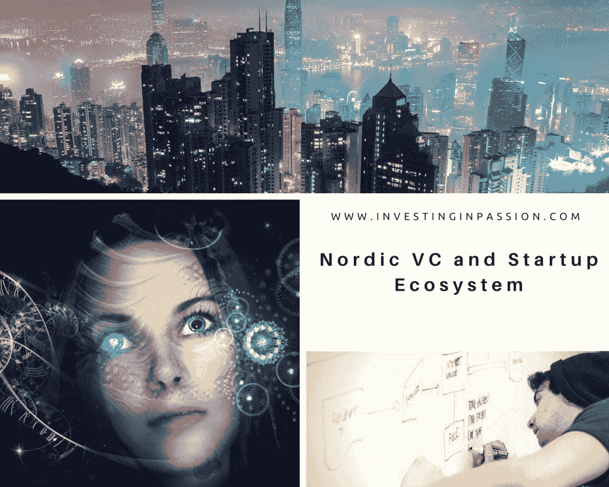
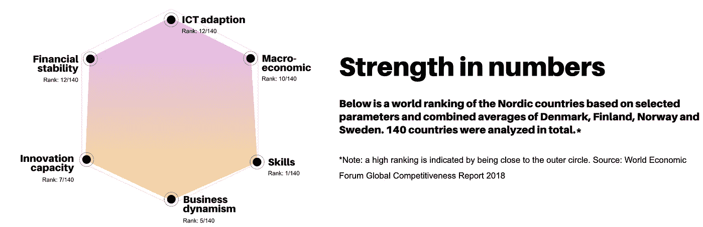
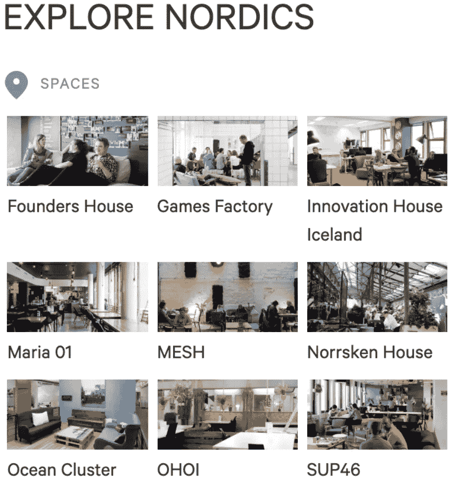
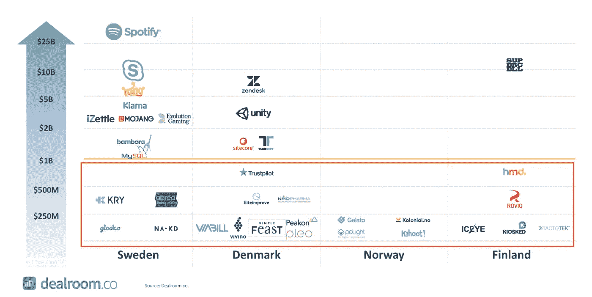

# 北欧风险投资和创业生态系统

> 原文：<https://medium.datadriveninvestor.com/nordic-vc-and-startup-ecosystem-1fa0dfb3de19?source=collection_archive---------4----------------------->

北欧的创业生态系统不再处于阴影中，显然正在成为风险资本投资最感兴趣的市场之一。它多年来一直在努力工作，每年肯定都有相当多的好交易可以炫耀。市场正在被打乱，人们正在改变他们的工作方式，更多地选择创业而不是企业职业，越来越多的本地创业公司出现在全球排名名单上。这导致越来越多的海外投资者对欧洲和北欧国家的聪明才智感兴趣。近年来，北欧风险投资领域出现了复苏，在过去五年中，北欧地区的风险投资基金筹集了超过 30 亿欧元(*)*

*“我从未感受到北欧人如此强烈的地区自豪感和发展创业关系的意愿。”
——埃丽卡·斯沃夫，《赫芬顿邮报》*

*美国投资者密切关注北欧创业市场已经有一段时间了。那里发生了很多事情，现在是时候开始认真对待它，或许在那里建立存在。人们有企业家精神，他们关心环境，想要有所作为，加快创新进程。有了硅谷的投资经验，在欧洲有了巨大的潜力，我们可以开始大胆地融合这一切，从开放的边界、移动性、远程工作、分布式团队中受益，并将感兴趣的领域扩大到没有边界。*

> **'* 丹麦、挪威、瑞典、芬兰和冰岛的创始人据说是欧洲最成功的金融科技独角兽*。”**
> 
> **由* [*定调书*](https://pitchbook.com/news/articles/a-very-nordic-fintech-revolution)*

*我研究了北欧国家，以了解他们做什么，他们如何运营和支持他们的创业生态系统。我观察他们已经有一段时间了，我访问了几乎所有的国家，我很乐意介绍更密切的市场参与者，迄今为止值得注意的投资，世界闻名的事件，会议和思想开放，有技能和有抱负的社会。*

**

*根据投资公司 Atomico 最近的一份报告，尽管英国的独角兽数量比瑞典多，但这个斯堪的纳维亚国家是世界上人均第二多产的科技中心，每百万人产生 63 家价值 10 亿美元的公司，而硅谷只有 8.1 家。*

* [## 风险投资家在给创业公司播种时会考虑什么标准？数据驱动的投资者

### 2017 年，风险投资资金攀升至十年来的最高水平。你的创业公司目前吸引风险投资的机会是…

www.datadriveninvestor.com](https://www.datadriveninvestor.com/2018/04/20/what-criteria-do-venture-capitalists-consider-when-seeding-a-startup/) 

主要的北欧创业中心有**斯德哥尔摩、赫尔辛基、哥本哈根和奥斯陆**。规模稍小但增长迅速的枢纽包括马尔默(南)、隆德(南)、哥德堡(南)、奥胡斯(D)、埃斯波(F)和雷克雅未克(I)。

**少数最活跃的北欧风险投资者:**

**VC Fund country**[Accelerace](https://www.linkedin.com/company/accelerace-management-a-s/)丹麦 [Bird Dog Equity Partners](https://www.linkedin.com/company/bird-dog-equity-partners-llc/about/) 丹麦[创新基金](https://www.linkedin.com/company/innovationsfonden/)丹麦 [PreSeed Ventures](https://www.linkedin.com/company/preseed-ventures/) 丹麦[种子资本](https://www.linkedin.com/company/seed-capital-denmark/)丹麦 [Sunstone Capital](https://sunstone.eu/) 丹麦 [byFounders](https://www.linkedin.com/company/byfounders/) 丹麦 [Blazar Capital](https://www.linkedin.com/company/blazarcapital/) 丹麦[erhversinvest](https://www.linkedin.com/company/erhvervsinvest/)丹麦[丹麦成长基金](https://vf.dk/en/)丹麦[第一](https://www.linkedin.com/company/first-fellow-partners/) [起飞伙伴](https://www.linkedin.com/company/takeoff-partners/)芬兰[特克斯](https://www.linkedin.com/company/tekes/)芬兰[特斯(FII)](https://www.linkedin.com/company/finnish-industry-investment-ltd/) 芬兰 [Wave Ventures](https://www.linkedin.com/company/wave-ventures/) 芬兰 [Inventure](https://www.linkedin.com/company/inventure/) 芬兰[破冰者](https://www.linkedin.com/company/icebreaker-vc/)芬兰 [Maki.vc](https://www.linkedin.com/company/maki-vc/) 芬兰 [Vendep](https://www.linkedin.com/company/vendepcapital/) 芬兰 [Frumtak Ventures](https://www.linkedin.com/company/frumtak/) 冰岛[科技发展基金](https://en.rannis.is/funding/research/technology-development-fund/)冰岛 [Hadean Ventures](https://www.linkedin.com/company/hadean-ventures/) 挪威 [Investinor](https://www.linkedin.com/company/investinor/) 挪威[联盟 Venture](https://www.linkedin.com/company/alliance-venture/) 挪威[ider](https://www.linkedin.com/company/idekapital/)

**支持创业生态系统的组织:**

[北欧创新](https://www.nordicinnovation.org/what-we-support)，

[paomasijoittajat](https://paaomasijoittajat.fi/en/finnish-venture-capital-association/)—芬兰风险投资协会，

[瑞典风险投资&私募股权协会](https://www.svca.se/info-in-english/)，

[NVCA](https://www.linkedin.com/company/norwegian-venture-capital-&-private-equity-association-nvca-/) —挪威风险投资&私募股权协会，

[DVCA](https://dvca.dk/en/about-dvca/) —丹麦风险投资&私募股权协会，

**加速器、孵化器和共同工作空间:**

*by StartupGuide*

**丹麦** : [**创始人之家**](https://foundershouse.dk/) 是一个共享的工作空间，位于哥本哈根布里格岛的一个前仓库里。
**丹麦** : [**人才花园造雨**](https://talentgardenrainmaking.com/) —哥本哈根科技创业公司的合作与社区。你可以在他们的校园里工作，在创新学校学习未来的技能，或者举办一场活动。
**丹麦**:[**FintechLab**](http://fintechlab.dk/)是一家完全专注于 FinTech 的孵化器和加速器。他们正致力于创建一个符合北欧最高标准的丹麦金融科技生态系统。
**丹麦**:[**BloxHub**](https://www.wework.com/en-GB/l/copenhagen)是北欧可持续城市化的枢纽。基于这样的信念，即全球城市化和气候变化的挑战需要伙伴关系和新的合作方式。
**丹麦**:[**+冲击加速器**](https://accelerator.plusimpact.io/) 。他们的使命是支持有影响力的初创公司，并通过扩展解决方案来弥合发展差距。
**丹麦** : [**兔子洞**](https://www.coworker.com/denmark/copenhagen/the-rabbit-hole) 是 2018 年最佳合作空间奖的获得者。兔子洞是一个位于弗雷德里克伯格大街中心的社区。
**丹麦**:[**Accelerance**](https://www.accelerace.io/)是欧洲领先的种子加速器，位于哥本哈根商学院校园内(也提供企业配对)。accelerated 已经加速了 600 多家创业公司，其中超过 50%已经筹集了资金。

**诺威** : [**卡塔普尔特加速器**](https://katapultaccelerator.com/) 带着“建造你想要生活的世界”的惊人使命，他们被对指数技术的深刻信念所激励。他们认为人工智能和区块链可以帮助影响创业公司更快地扩大规模，同时解决真正的全球问题。
**挪威** : [**奥斯陆国际枢纽**](https://oslointernationalhub.com/) 。他们创造了一个创新和发展的环境，在这个环境中，社交网络和职业网络携手并进。
**挪威**:[**Startup Norway**](http://www.startupnorway.com/)是一个由充满激情的企业家于 2011 年成立的私人影响力组织，他们希望在该地区创建一个更强大、更具包容性的创业社区。
**挪威** : [**创业实验室加速器**](https://startuplab.no/accelerator/) 是一个为期 3 个月的密集项目，在这个项目中，你可以探索和利用 Startup Lab 的广泛网络，并接触经验丰富的创始人、投资者和行业专家。
**挪威**:[**tech stars**](https://www.techstars.com/programs/energy-program/)能量加速器。他们正在能源领域的四个领域寻求创新的解决方案:石油和天然气、新的商业模式、数字化和可再生能源。
**挪威** : [**鹿角**](https://www.antler.co/) 是建立开创性技术公司的全球创业发电机和早期风险投资公司。
**诺威**:[**Driv Inkubator**](http://www.drivinkubator.no/)帮助那些寻求发展其高增长、独特想法以改善医疗保健行业的企业家。
**挪威** : [**阿克莱特 X**](https://arkwrightx.no/) 是有志创业公司创新发展的地方。他们提供种子期前的资本注入、高质量的工作环境、策略培训建议、多种支持功能以及 Arkwright 的广泛网络。
**挪威** : [**充电**](https://www.charge.no/) 是一家创业孵化器，面向那些热衷于将自己的想法成长为成功企业的移民。
**挪威** : [**网**](https://meshnorway.com/) 号称挪威第一个合作社区。

**瑞典**:[**sup 46**](http://sup46.com/)——瑞典的创业人士——通过资金筹集、招聘、扩张、公关&营销以及办公场所，帮助瑞典的下一批创业明星更快成功。
**瑞典**:[**Norrsken House**](https://www.norrskenhouse.org/)是一个超过 350 位影响力企业家的共同工作空间。
**瑞典**:[**Skane Startups**](https://www.skanestartups.com/)是本地创业社区计划 Malmö Startups、Lund Startups、Helsingborg Startups 以及创业社区和 Startup Live 中的女性的家园。
**瑞典** : [**地面**](https://www.theground.se/) 是马尔默的一个数字专家枢纽。
**瑞典**:[**Fast Track Malmo**](https://www.fasttrackmalmo.com/)是一家向种子期初创公司投资 5 万美元的创业加速器。他们帮助有才华的团队加速成长，筹集他们的第一轮风险投资。
**瑞典:** [**工厂**](http://www.factorysthlm.com/) 生态系统由创业公司、规模化企业、企业、组织和人才组成。它注定会成为北欧最大的创新和科技中心。

**冰岛** : [**创新之家**。他们通过提供廉价的办公设施、网络和协作空间来孵化冰岛当地的初创公司和企业家。
**冰岛** :](https://innovationhouse.is/) [**启动雷克雅未克**](https://startupreykjavik.is/) 。为期 10 周的导师推动的种子期加速器计划，从每年 6 月到 8 月进行。
**冰岛** : [**海洋克卢斯特**](http://www.sjavarklasinn.is/en/) 。它的使命是通过联系海洋产业的企业家、企业和知识来创造价值和发现新的机会。

**芬兰** : [**游戏工厂**](https://nordicgame.com/join-game-studio-incubator-games-factory/) 是部分由城市所有的科技创业社区 Maria 01 的成员。芬兰游戏产业的社区空间。
**芬兰** : [**Maria 01**](https://maria.io/) 是一个创业社区、科技团队精选校园和科技建设者俱乐部的非盈利组合。
**芬兰** : [**创业桑拿**](http://startupsauna.com/) 联合工作空间是北欧创业者和投资人的一个聚集地。这是一个与创业相关的常规活动空间:创始人会谈、投球比赛和黑客马拉松。这个空间对所有人开放，不需要会员。
**芬兰** : [**清洁技术投资**](http://www.cleantechfinland.com/web/cleantech) 是芬兰清洁技术专业和可持续创新的中心。
**芬兰**:[**Catapult**](https://catapult.guru/)**帮助欧洲大公司找到来自初创公司和技术创新者的最佳数字解决方案和技术。
**芬兰**:[**Boost**](https://boostturku.com/)**是一个鼓励青年学生和创业者实现梦想的企业家社团。
**芬兰** : [**Kiuas**](https://www.kiuas.com/) 是芬兰领先的创业加速器。在他们的项目中，他们将早期阶段的团队聚集在一起，并为他们提供最好的支持和工具，以使他们的进展更上一层楼。
**芬兰**:[**xEdu**](https://www.xedu.co/#acceleration-program)**是欧洲领先的商业加速器，为教育科技初创公司创造具有教学影响力的变革性学习解决方案。******

********创业/技术活动和会议:********

********

****[雪泥](https://www.slush.org/events/helsinki/)，芬兰，
[TechChill](https://techchill.co/) ，里加，
[北欧。艾节](http://nordic.ai/)、
[女性科技](https://www.womenintech.se/)、瑞典、
[The Shift](https://the-shift-2019.confetti.events/) 、挪威、
[TechnoPort](https://conference.technoport.no/) 、挪威、
[#GBG 科技周](https://gbgtechweek.com/)、瑞典、
[北极 15](https://arctic15.com/) 、瑞典、
[Katapult Future Fest](http://www.katapult.tech/)、挪威、
[创业冰岛](https://startupiceland.com/)、冰岛、****

******几个** **最近在北欧成立的成功创业公司:******

****久保机器人 (丹麦)以直观的方式向年仅四岁的孩子介绍编码。编码变得像拼图一样简单，为下一代 techstars 提供了无尽的见解、想法和灵感。
[**Labster**](https://www.labster.com/) (丹麦)创造了屡获殊荣的虚拟实验室模拟。只需点击一下鼠标，它就能让全球教育机构使用价值百万美元的实验室，包括麻省理工学院和加州大学伯克利分校等顶级大学。Pleo(丹麦)为员工提供智能支付卡，使他们能够购买工作所需的物品，同时保持公司对支出的控制。
[**grand hood**](https://grandhood.dk/)(丹麦)已经接受了改革养老产业的挑战。它简化了职业养老金计划，其投资算法确保人们在达到退休年龄时的财务需求得到满足。
[**卡豪特**](https://kahoot.com/) 【诺威】让学习变得牛逼！卡霍特。每年在学校、工作场所和家中为超过 10 亿玩家带来参与和乐趣。
[**北伏**](https://northvolt.com/) (瑞典)。该公司为电动汽车、重型运输、采矿和能源行业设计、开发和制造锂离子电池和完整的电池系统，以及便携式设备
[**Anyfin**](https://anyfin.com/en_SE) (瑞典)。Anyfin 旨在降低贷款利率，据称平均降低 50%。
[**Klarna**](https://www.klarna.com/us/) (瑞典)今天就买你喜欢的东西，以后用 Klarna 分 4 期付款。没兴趣。不收费。通过 Klarna 应用程序，可在您最喜爱的所有在线商店购买。
[**Einride**](http://www.einride.tech/#/)**【瑞典】开发了一种全电动自主伐木卡车，名为 T-Log 和 T-pod，这是一种电动自动驾驶货运卡车，由司机远程控制。
[**Kry**](https://www.kry.se/) (瑞典)是一个基于 app 的视频服务，可以通过智能手机或平板电脑在任何时间或任何地点与医生和治疗师会面。
[**Sana Labs**](https://sanalabs.com/)(瑞典)提供了一个人工智能平台，它从学生的个人学习风格中学习，并确定他或她的最佳学习模式。
[**Authenteq**](https://authenteq.com/)(冰岛)Authenteq 提供基于隐私原则的实时身份验证。保证在 60 秒或更短时间内验证身份！
[**Rovio**](http://www.rovio.com/) (芬兰)是一家总部位于埃斯波的视频游戏开发商。该公司于 2003 年由赫尔辛基理工大学的学生 Niklas Hed、Jarno vkevinen 和 Kim Dikert 创立，以《愤怒的小鸟》系列而闻名。******

********

******其他资源:******

*   ****北欧成长秀— [播客](https://www.aurabear.com/podcast/)，****
*   ****[创业指南](https://startupguide.com/cities/nordicshttps://startupguide.com/cities/nordics)——北欧国家、****
*   ****北欧人。VC [报告](https://nordics.vc/report)，****
*   ****[北欧 100 强](https://thenordicweb.com/) —年度榜单，评选出北欧科技界最具影响力的 100 位人物。****
*   ****[协同工作区](https://www.coworkies.com/) —协同工作空间目录，网络&工作板，****
*   ****15 [**影响**芬兰的创业公司](https://blog.thehub.io/blog/15-impact-startups-in-finland-to-keep-an-eye-on-in-2019/)要关注，****
*   ****[Hub](https://thehub.io/about)—免费社区平台，****
*   ****北欧海盗:[北欧/波罗的海 I](http://siliconvikings.com/nordic-baltic-investors) 变阻器，****
*   ****[FiBAN](https://www.fiban.org/accelerators.html) —芬兰天使商业网，****
*   ****[NVN](https://nordicventurenetwork.com/)——北欧风险投资网络。****

## ****新闻报道:****

****北欧科技列表是一个帮助提供北欧科技事实和信息的网站****

****北欧的风险投资者对该地区风险投资的未来越来越乐观——59%的投资者对未来的看法比 12 个月前的北欧更加乐观。VC 。****

****北欧创业公司 Bits 不仅仅是一个媒体平台——它是任何对北欧创业感兴趣的人的中心。****

****Accel 为北欧和以色列的早期公司募集了 5.75 亿欧元。****

****创始人创办的早期风险投资[关闭了€1 亿美元基金](https://techcrunch.com/2019/04/02/byfounders/)来支持北欧和波罗的海的创业公司。****

****北欧创业奖 2019 [地区获奖者](https://www.eu-startups.com/2019/12/nordic-startup-awards-2019-regional-winners-announced-in-copenhagen/)在哥本哈根揭晓。****

****现在是在北欧建立一个[影响力创业公司](https://startupguide.com/why-now-is-the-time-to-build-an-impact-startup-nordics?fbclid=IwAR0Xpjmu1f4ScbNkc-YYwJXZbXdDW59h-dmqtOn3d2HUNCfY1huRDyDvytI)的时候了。****

****2019 年最热门 [VC 趋势](https://paaomasijoittajat.fi/en/the-hottest-vc-trends-of-2019-2/)。****

****一场非常典型的北欧金融科技革命。****

> ****红杉资本投资组合中表现最好的三家公司来自北欧——Unity(丹麦)、Klarna(瑞典)和 Medalia(挪威)。****
> 
> *****由*[*TechCrunch*](https://techcrunch.com/2019/04/02/byfounders/)****

****最初发表于 www.InvestingInPassion.com*****