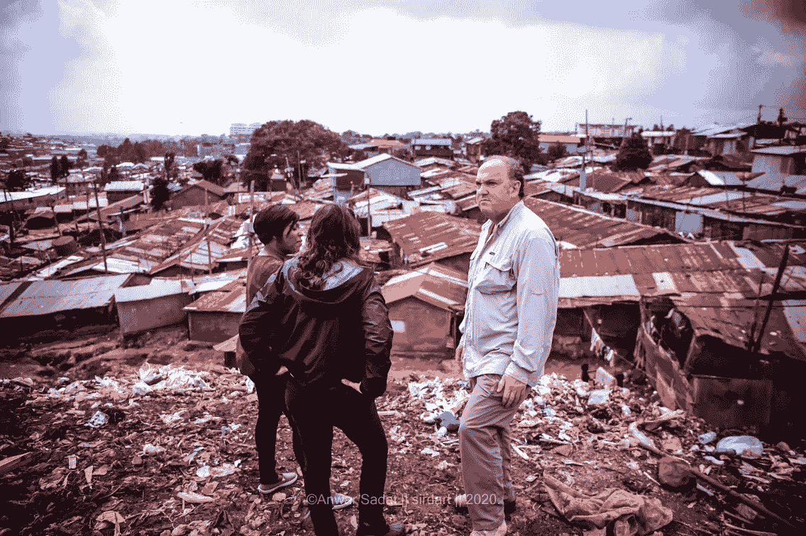
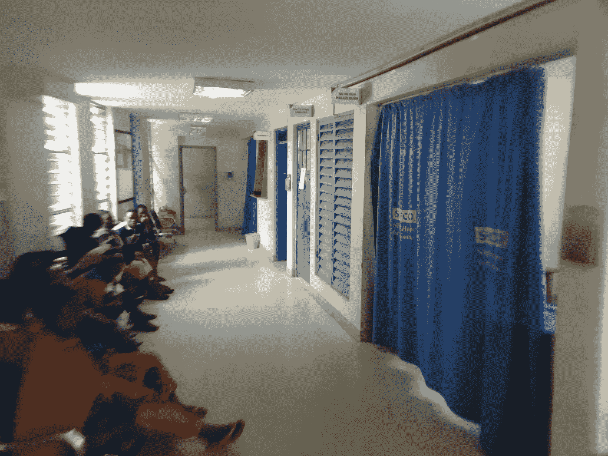
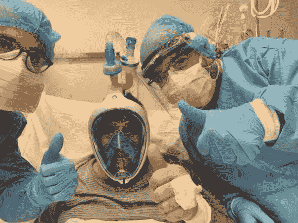
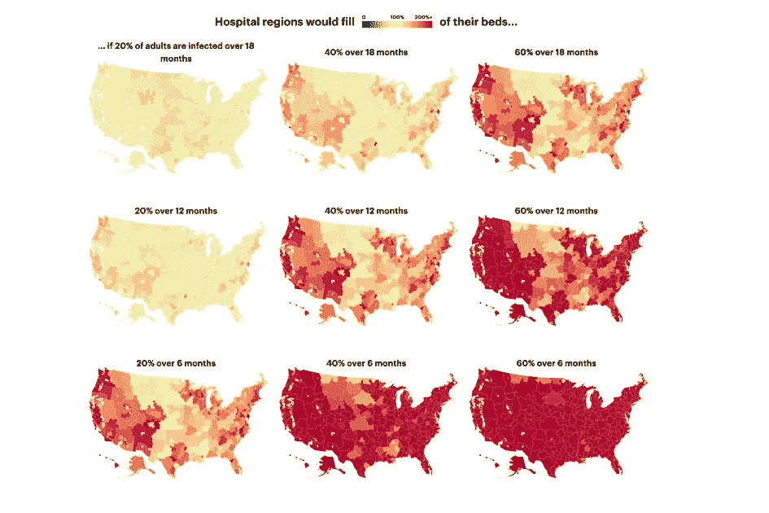
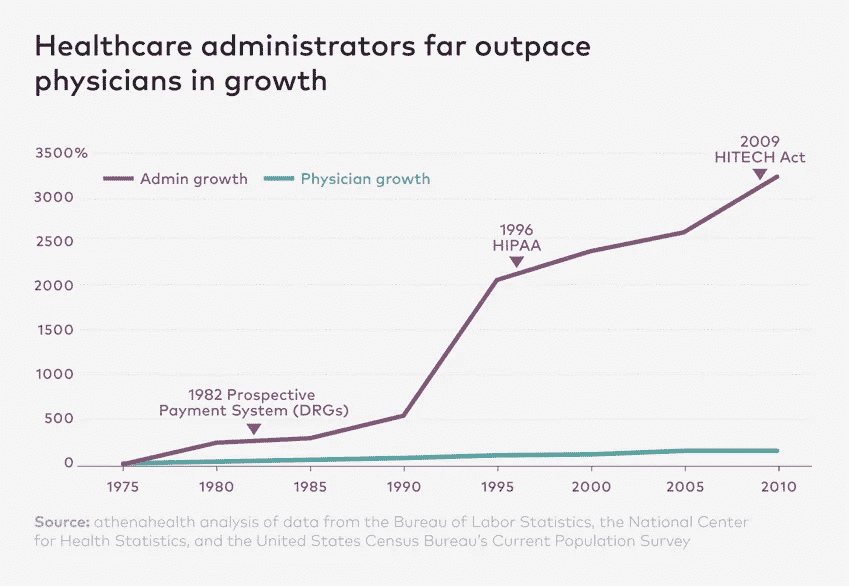
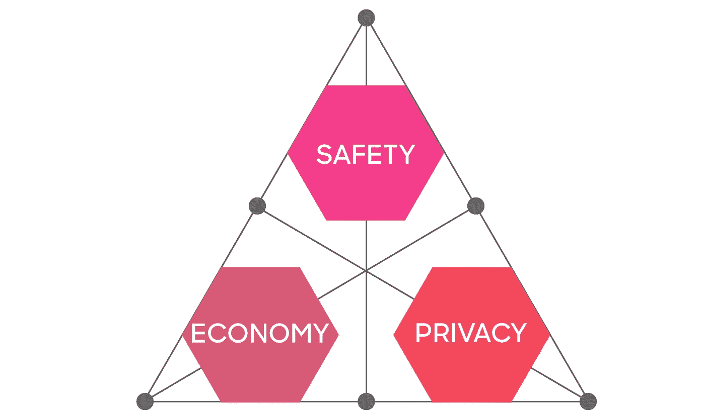
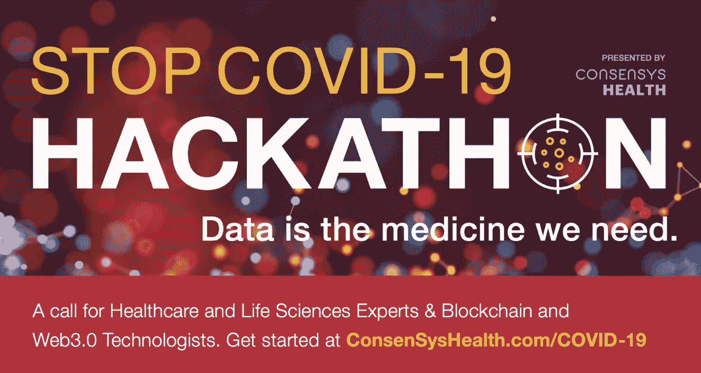

# 并非一切都是坏的:新冠肺炎的三件好事

> 原文：<https://medium.datadriveninvestor.com/not-everything-is-bad-3-good-things-about-covid-19-a131228c786c?source=collection_archive---------8----------------------->

I am looking into the “blockchainized” future ([Kibera](https://en.wikipedia.org/wiki/Kibera) slums, Nairobi, Kenya, February 25th, 2020)

*最后，人们意识到区块链和医疗保健是有意义的*

当我参观位于奈洛比郊区的有着 120 年历史、100 万人口的城市贫民窟[基贝拉](https://en.wikipedia.org/wiki/Kibera)时，我一点也不知道，一个月后，我将被锁在一个废弃的、反乌托邦式的城市居住区——纽约市——新冠肺炎疫情的[震中](https://www.businessinsider.com/new-york-city-coronavirus-cases-over-time-chart-2020-3)。*(特别感谢* [*诺曼·弗里德兰*](https://www.linkedin.com/in/norman-friedland-b64a63122/) *，他把我介绍给了绍夫科的领导层)*

在基贝拉，在基贝拉社会企业家 [Kennedy Odede](https://en.wikipedia.org/wiki/Kennedy_Odede) 和他的非营利组织 [SHOFCO](https://www.shofco.org/) (社区的希望之光)的带领下，我与社区领袖、诊所管理者、社会工作者、教师和职业培训师交谈，无法停止对这个社区令人惊叹的成就的钦佩。一个社区决定通过其水、环境卫生和个人卫生(WASH)计划用干净的水代替脏水，通过学校和收容所培养女孩的领导力和教育，这些学校和收容所设计为针对*最弱势群体*并创建基于社区的免费医疗服务，包括初级保健、艾滋病毒、结核病、疫苗接种、营养、计划生育和产前护理。

The busy medical center in [Mathare](https://en.wikipedia.org/wiki/Mathare) has quality services that surpass that of Nairobi’s public health hospitals (Image: February 26, 2020)

但是 SHOFCO 并不是免费提供服务。SHOFCO 是关于社区、透明治理、金融包容性和建立社会资本。通过名为 SUN (SHOFCO 城市网络)的自治委员会，他们消除了部落间的紧张关系，他们名为可持续生计的职业培训项目让肯尼亚人开始了从赤贫走向经济独立和繁荣的旅程。

因此，毫不奇怪，我的东道主立即理解了建立在信任、货币和非货币激励以及对等经济活动基础上的透明、分布式、分散化社会的概念，或者用他们自己的话说:

> 我们不需要给社区带来任何东西的腐败中间人或政客。我们需要信任、透明、公平。如果这就是你们的技术所做的，我们现在就想要…我们已经准备好了！

那么，为什么一个几乎没有基础设施的社区已经准备好迎接一个无现金、无信任、点对点的社会，一个直观地说“区块链”的社会，而我们在美国和欧洲仍然看不到将分布式账本技术添加到我们自己的遗留结构中的需要，以确保数字弹性、[计算信任](https://www.forbes.com/sites/jasonbrett/2020/03/23/how-blockchain-technology-offers-computational-trust-for-tracking---the-coronavirus-outbreak/#38148eb81cd0)和经济包容性？

> **也许新冠肺炎正在改变这一切**，随着我们的[公共卫生系统](https://www.nytimes.com/2020/03/13/us/coronavirus-deaths-estimate.html)、[健康 IT](https://www.brookings.edu/blog/techtank/2020/03/13/the-u-s-lacks-health-information-technologies-to-stop-covid-19-epidemic/https://www.brookings.edu/blog/techtank/2020/03/13/the-u-s-lacks-health-information-technologies-to-stop-covid-19-epidemic/) 、[经济脆弱性](https://www.brookings.edu/blog/the-avenue/2020/03/13/coronavirus-makes-it-impossible-to-ignore-the-economic-insecurity-built-into-our-labor-market/?utm_campaign=Brookings%20Brief&utm_source=hs_email&utm_medium=email&utm_content=84809588)，以及[民粹主义](https://www.brookings.edu/blog/order-from-chaos/2020/03/05/the-coronavirus-is-exposing-the-limits-of-populism/?utm_campaign=Brookings%20Brief&utm_source=hs_email&utm_medium=email&utm_content=84401973)和[自私自利](https://theweek.com/articles/902415/coronavirus-exposing-americas-shameful-selfish-streak?utm_source=newsletter&utm_medium=email&utm_campaign=newsletter_axiosfutureofwork&stream=future)暴露出来，“封锁”我们的社会结构开始变得有意义。

也就是说，我确实感觉到新冠肺炎给我们带来了三件好事:

# 事情#1:我们变得更有创造力:

*(感谢萨曼莎·拿撒勒博士的广泛研究)*

正如我们试图从[研究以前的](https://syncedreview.com/2020/03/16/learning-from-the-1854-cholera-outbreak-tracking-and-containing-covid-19-using-ai-spatiotemporal-analysis/) [大流行](https://www.visualcapitalist.com/history-of-pandemics-deadliest/)和当前的[大流行](https://medium.com/@tomaspueyo/coronavirus-act-today-or-people-will-die-f4d3d9cd99ca)一样(还有这里的[、这里的](https://www.foreignaffairs.com/articles/asia/2020-03-20/how-civic-technology-can-help-stop-pandemic)和这里的)大多数发展都是为了[分流、检测和治疗](https://medium.com/@tomaspueyo/coronavirus-act-today-or-people-will-die-f4d3d9cd99ca)新冠肺炎。

**检伤分类:** [粒子健康](https://healthtransformer.co/particle-healths-api-makes-covid-19-screenings-faster-and-smarter-and-now-it-s-free-to-use-d377d492ddae)、[碳健康](https://patient.carbonhealth.com/?lng=en#/schedule?practiceId=5bdaef44-8ff0-439f-99d7-3285afcc6911&virtual=true&instant=true&&apptReasonId=a516b4f7-339d-47bc-910d-3b89b81e2e9a&_ga=2.183076454.1549742182.1584576081-293113151.1584576081)、[里米迪](https://rimidi.com/)和 [Verily](https://www.projectbaseline.com/study/covid-19/) 已经建立了 API，可以清除现有电子病历上的数据，以帮助识别高风险个体。 [Tytocare](https://www.tytocare.com/) 、 [Kinsa Health](https://www.kinsahealth.co/) 、 [KroniKare](https://kronikare.ai/) 正在增加联网体温计，以跟踪发烧情况，并帮助实时检测患者。 [Eko Health](https://www.ekohealth.com/beatcovid) 开发了一种具有人工智能心肺听诊功能的数字听诊器， [SenseTime](https://www.sensetime.com/en/Technology/face.html) 正在使用面部识别来促进非接触式识别， [MayaMD.ai](https://corona.mayamd.ai/#/app/diagnose) 正在为临床医生提供人工智能引擎来帮助他们做出决策。

 [## 冠状病毒；惊慌失措；字里行间的 z |数据驱动的投资者

### 围绕冠状病毒的话题；更准确地说，新冠肺炎几乎占据了整个新闻预报的头条…

www.datadriveninvestor.com](https://www.datadriveninvestor.com/2020/03/23/coronavirus-a-to-panic-z-between-the-lines/) 

[DAMO](https://www.alizila.com/how-damo-academys-ai-system-detects-coronavirus-cases/) 和 [Infervision](https://news.developer.nvidia.com/ai-helps-doctors-diagnose-the-coronavirus/?_lrsc=e8782d27-a31c-4fb9-80a7-86fb4fa5e247&ncid=so-lin-lt-798) 使用人工智能对疑似病例进行放射诊断和监控，而[阿里](https://asia.nikkei.com/Spotlight/Coronavirus/Alibaba-says-AI-can-identify-coronavirus-infections-with-96-accuracy)正在使用 NLP 浏览在线媒体资源，以检测感染[蓝点](https://www.cnbc.com/2020/03/03/bluedot-used-artificial-intelligence-to-predict-coronavirus-spread.html)的群集。

**测试:**尽管美国的测试仍然有限，但像用于家庭测试的 [EverlyWell](https://www.everlywell.com/) 、用于护理点测试的 [SightDiagnostics](https://www.sightdx.com/us) 和[Veredus Laboratories](https://vereduslabs.com/)lab-on-chip 等解决方案正在开发中。

**治疗:**远程医疗和虚拟就诊正在吸引像 [MeMD](https://www.memd.net/) 和 [Datos](https://www.datos-health.com/) 这样的新解决方案，而来自 TelaDoc 的 [RO](https://ro.co/) 和 [InTouch Health](https://intouchhealth.com/) 这样的现有解决方案越来越感兴趣，这很可能代表着[区块链驱动的远程医疗](https://decrypt.co/23278/coronavirus-could-be-the-tipping-point-for-blockchain-powered-telemedicine)解决方案在未来的转折点。

Sonovia 已经升级了带有抗病原体材料的面罩以增强保护，意大利研究人员重新调整了[水肺潜水面罩](https://dgiluz.wordpress.com/2020/03/23/its-working/)用于通风(下图)，一名加拿大麻醉师[装配了一台呼吸机](https://www.dailymail.co.uk/news/article-8136299/Doctors-turns-one-ventilator-nine-genius-DIY-mechanics.html)以同时为九名患者服务，而 [UVD 机器人](http://www.uvd-robots.com/)、[蓝海机器人](https://www.blue-ocean-robotics.com/)和 [XAG 机器人](https://www.xa.com/en)已经建造了机器人系统来消毒房间并向感染区域发射紫外线。

500 patients in northern Italy are receiving right now respirators, produced by hacked scuba gear ([source](https://dgiluz.wordpress.com/2020/03/23/its-working/))

寻找疫苗的竞赛是 Gilead Sciences、AbbVie、Moderna、Regeneron、Inovio、Vir Biotechnology、赛诺菲阿派朗生物制品公司、CureVac、GSK、MIGAL 和其他六家制药公司的优先任务，一旦这些疫苗可用，MicroMultiCopter 和 Terradrone 已经承诺在隔离社区进行热成像的同时用无人机运输这些物资。

最后， [BrightMD](https://www.bright.md/) 、 [Phreesia](https://www.phreesia.com/demo-request-ppc/?_bt=329413043651&_bk=phreesia&_bm=e&_bn=g&_bg=64393809754&utm_source=google&utm_medium=cpc&utm_campaign=seer_brand&utm_term=phreesia&gclid=Cj0KCQjwjcfzBRCHARIsAO-1_OpfvmAvZu75-RjMaB6F9DNQ4c1f-ytjipu4_BKUNmge_8X9agbEgAUaAqIzEALw_wcB) 和 [Duration Health](https://durationhealth.com/?utm_source=newsletter&utm_medium=email&utm_campaign=newsletter_axiosfutureofwork&stream=future) 正在开发教育平台，帮助公众遵守新冠肺炎缓解和抑制策略。

# 第二件事:我们终于可以认真反思我们的医疗系统设计了:

我之前发表过关于我们医疗系统的[缺点](https://www.brookings.edu/research/a-dozen-facts-about-the-economics-of-the-u-s-health-care-system/?utm_campaign=Brookings%20Brief&utm_source=hs_email&utm_medium=email&utm_content=84552933)的文章，我们的医疗系统是十多年来经济合作与发展组织国家中表现最差的。随着疫情让我们的医院不堪重负，让经济陷入[停滞](https://files.pitchbook.com/website/files/pdf/PitchBook_Q1_2020_Analyst_Note_COVID-19_the_Sell-Everything_Trade_and_the_Impact_on_Private_Markets.pdf)，我们现在有机会认真反思我们的医疗体系设计。

当我们找出最佳缓解政策时，比如对疑似病例进行居家隔离、对居住在同一家庭的人进行居家隔离，以及对老年人和其他有严重疾病风险的人进行社会隔离(使曲线变平)，显然我们不会回到正常的状态。

Are Hospitals Near Me Ready for Coronavirus? Here Are Nine Different Scenarios. [Source](https://projects.propublica.org/graphics/covid-hospitals)

那么，大流行后我们的医疗保健系统会是什么样子呢？我们会经历季节性大流行吗？这种大流行需要大型医院和数百台备用呼吸机。我们会因为[群体免疫](https://medium.com/@wintonARK/what-if-there-already-is-a-large-latent-immune-population-bfbd09ead5ca)而需要[锤打舞蹈](https://medium.com/@tomaspueyo/coronavirus-the-hammer-and-the-dance-be9337092b56)的监控项目，以便使用甚至[更多的 AI](https://www.forbes.com/sites/nisaamoils/2020/03/18/is-ai-smarter-than-humans-to-flatten-the--curve-of-covid-19-coronavirus/#b223a0723c24) 来缓解未来的疫情爆发吗？我们如何为这个新的快速反应系统做预算，如何计算人类生命的代价，现在估计在每人 500-900 万美元之间？

找出答案的一个方法是看看纽约市和 NYS 医疗保健系统将如何在州长科莫的紧急状态法下运作。截至 3 月 23 日，纽约州对医院规模没有限制，不允许对执业护士、医师助理、护理人员和通常由医生监管的医科学生进行监督，这些人也将免于承担任何涉嫌伤害或死亡的民事责任。供应商的考试或重新认证要求**暂停**，医师和研究生实习生的工作时间**没有限制**。提供者**免除**所有的记录保存要求，对任何未能遵守的责任提供绝对豁免。

这种极度放松管制的环境会带来什么？当这一波疫情浪潮结束时，所有的法规会自动恢复吗？他们应该吗？如果记录保存的简化和繁琐的行政要求的省略将会改善病人的治疗效果呢？如果这样发现的话，它是否会降低夸大的[医生与行政人员的比例](https://www.medicaleconomics.com/business/who-do-patients-really-need-physicians-or-administrators)，目前是 7 名行政人员对 1 名医生，这是否有助于降低整体医疗成本？医疗保健[数据经纪人](https://www.fastcompany.com/90310803/here-are-the-data-brokers-quietly-buying-and-selling-your-personal-information)、[保险经纪人](https://www.npr.org/sections/health-shots/2019/02/20/694719998/insurers-hand-out-cash-and-gifts-to-sway-brokers-who-sell-employer-health-plans)、[药房福利经理](https://www.commonwealthfund.org/publications/explainer/2019/apr/pharmacy-benefit-managers-and-their-role-drug-spending)和[私募股权支持的医疗实践](https://www.modernhealthcare.com/physicians/specialty-physician-groups-attracting-private-equity-investment)仍然盈利，但未能兑现其控制医疗保健成本螺旋上升的承诺，情况又如何呢？

[Source](https://www.athenahealth.com/knowledge-hub/practice-management/expert-forum-rise-and-rise-healthcare-administrator)

> 这个疫情提醒了我们一件事——医疗保健需要医生和医疗保健专业人员来照顾病人，而不是一个臃肿的非医疗管理、金融机构来照顾自己。

# 事情#3:我们有机会在不牺牲隐私的情况下创造“全球智能”

每天都有人问我关于新冠肺炎的问题。任何事情，从疫情将持续多长时间，现有的最佳治疗方法是什么，我们将需要多少台呼吸机(很多)，以及我们中有多少人会死亡(少数)。

这些问题的问题在于，尽管它们看起来很简单，但实际上很难回答，因为它们是:

*   太大(即需要太多数据)
*   过于昂贵(即这些数据需要标准化)
*   过于敏感(即包括[受保护的](https://en.wikipedia.org/wiki/Health_Insurance_Portability_and_Accountability_Act)个人身份信息)

此外，有一种说法认为，为了保持安全和拯救经济，我们必须[牺牲我们的隐私](https://blog.oceanprotocol.com/the-pandemic-triangle-safety-privacy-economy-6e8214ea78e9)(也就是下面的疫情三角)，使用军用级别的侵入性工具来收集我们所有人的数据(这里的、这里的和这里的)，而没有“太多”的监督。

> 这种说法是错误的。

新冠肺炎追踪数据和监视的风险 [**要比它们的回报**](http://COVID-19 tracking data and surveillance risks are more dangerous than their rewards) 危险得多，事实上，我们可能正面临着尤瓦尔·赫拉利所说的[生物特征监视](https://www.ft.com/content/19d90308-6858-11ea-a3c9-1fe6fedcca75)的完美条件，这将加强[预测性监管](https://www.theguardian.com/world/2020/mar/09/the-new-normal-chinas-excessive-coronavirus-public-monitoring-could-be-here-to-stay)、不受监管的[紧急执法](https://www.law.com/newyorklawjournal/2020/03/16/coronavirus-the-law-and-you/)以及已经存在的[掠夺性数据](https://www.coindesk.com/think-a-privacy-law-will-stop-surveillance-capitalism-you-dont-know-google)经济(还记得 23andMe 出售你的基因数据吗？).

We can solve the Pandemic Triangle via aggressive data sharing, enhanced by new technologies that preserve privacy while sharing the data (s[ource](https://blog.oceanprotocol.com/the-pandemic-triangle-safety-privacy-economy-6e8214ea78e9))

作为回报，我们可以在共享数据的同时，通过使用*隐私保护技术* ( [ZKP](https://medium.com/web3studio/a-simple-explanation-of-zero-knowledge-proofs-ca574092e73b) 、[三通](https://en.wikipedia.org/wiki/Trusted_execution_environment)、[同态加密](https://www.forbes.com/sites/bernardmarr/2019/11/15/what-is-homomorphic-encryption-and-why-is-it-so-transformative/#131f95d57e93)和[安全多方计算](https://www.inpher.io/technology/what-is-secure-multiparty-computation\))的激进数据共享来解决今天的**疫情三角。**

此外，随着新冠肺炎疫情占据上风，我们在没有可靠数据或基于[大量但仍然孤立的](https://coronavirus-disasterresponse.hub.arcgis.com/)来源的数据的情况下做出决策[。我们现在可以使用*联合分析*，然后是](https://www.statnews.com/2020/03/17/a-fiasco-in-the-making-as-the-coronavirus-pandemic-takes-hold-we-are-making-decisions-without-reliable-data/) [*联合学习*](https://www.statnews.com/2020/02/13/federated-learning-safer-collaboration-health-research/) *(FL)，而不是传统地将越来越多数量和类型的数据聚合到一个[中心位置](https://www.zdnet.com/article/google-deepminds-effort-on-covid-19-coronavirus-rests-on-the-shoulders-of-giants/)。*

FL 提供了一个参与者网络来协作训练数据算法**,同时将每个利益相关者的数据保存在其本地。FL 向数据发送算法，然后与参与者共享更新的算法，而不是向训练算法的单个中央存储库发送数据。**

最后，由鼓励可信数据共享的透明智能合同*、*管理的区块链增强型分布式网络可以帮助现有的[人工智能计划](https://onezero.medium.com/computer-scientists-are-building-algorithms-to-tackle-covid-19-f4ec40acdba0)和创业公司，如[仁慈的人工智能](https://benevolent.ai/)、 [Cyclica](https://healthtransformer.co/health-startups-pivot-to-meet-the-covid-19-challenge-555647ada739) 、 [COVID 跟踪](https://covidtracking.com/)、[可信操作](http://demo.sitscape.com/p/ed6efcaa?pubid=m5sxuzdjfnjq?v=2019)和 [Anodot](https://insidebigdata.com/2020/03/11/covid-19-dashboard-uses-machine-learning-to-track-global-pandemic/) 连接到开放源，如 [CORD-19](https://pages.semanticscholar.org/coronavirus-research) 、 [COVID2020](https://covid2020.com/index.html) 和

# 最终想法:

在康赛斯健康公司，我们知道治愈新冠肺炎的方法是数据，我们必须创造一个适合应对这种疫情的运营环境**，并为后大流行时代做好准备。**

> 因此，我们诚邀感兴趣的团体加入我们的全球新冠肺炎黑客马拉松:数据是我们需要的良药；并帮助创建一个联合健康学习基础设施，通过为分布式网络设计和激励的隐私保护技术来增强，以进行道德和透明的合作。

我们意识到这种新的合作方式需要[教育](https://www.forbes.com/sites/michaeldelcastillo/2020/03/11/blockchain-professor-adds-coronavirus-to-curriculum-as-classes-go-remote/#2132186a7371)医疗保健和生命科学专业人员，以及 web 3 开发者社区，我们在这一旅程中的第一步是在 4 月 14 日发起我们的全球[阻止新冠肺炎黑客马拉松](https://consensyshealth.com/covid-19/)。所以请随时联系我，4 月 14 日再见！

Please join our ConsensysHealth global [effort](https://consensyshealth.com/covid-19/#) to stop COVID19

*如果你喜欢你所读的内容，* ***继续在下面“鼓掌”，这样其他人也会看到(最多允许 50 次鼓掌！)***