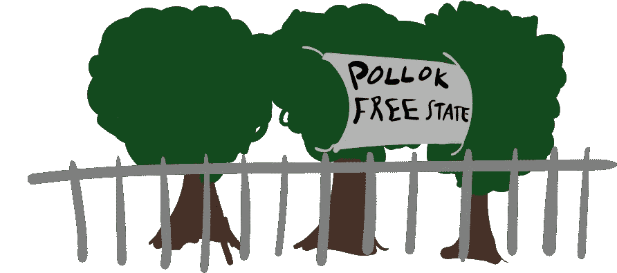
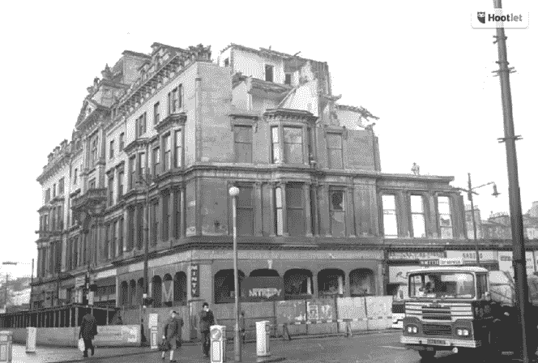
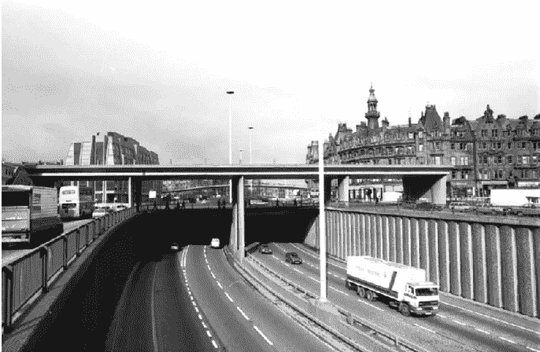
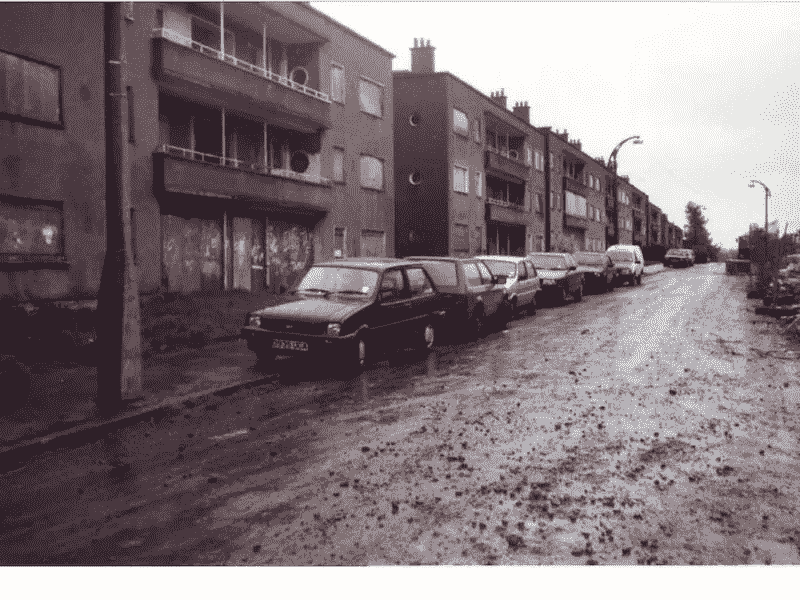
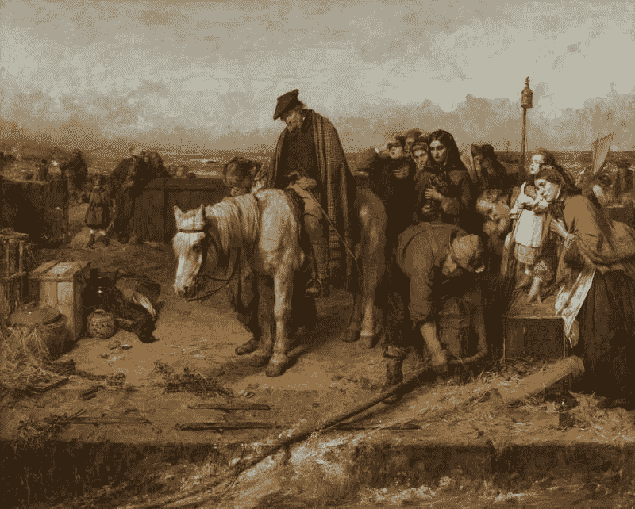
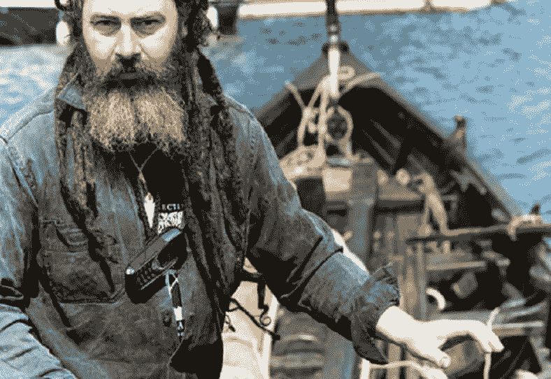

# 不消失:波洛克自由州

> 原文：<https://medium.datadriveninvestor.com/not-going-away-the-pollok-free-state-d0ca9b2371b4?source=collection_archive---------4----------------------->

## 穿越格拉斯哥公园的高速公路建设如何让新一代苏格兰工人阶级了解他们的过去

我以前写过穿过社区的高速公路；圣地亚哥巴里奥洛根奇卡诺公园的故事。这些事件不是一次性的。BBC Alba 电视台的纪录片《T2:波洛克公园的鸟人》讲述了当地人科林·麦克劳德试图阻止同样的事情发生在格拉斯哥波洛克国家公园的故事。两者都描述了两种对立文化之间的冲突:一种基于荣誉、血缘和社区原则，另一种基于对进步、利润和领土统治的积极追求。我发现，一条新的高速公路在一个关系紧密的社区中的野蛮到来，是这场全球性和永恒冲突的一个伟大隐喻。

格拉斯哥从 20 世纪中期汽车拥有量上升开始就没做好。60 年代后期，为了适应 M8 高速公路，查林十字街和安德斯顿街被夷为平地。它仍然是英国唯一一条直接穿过大城市中心而不是绕过它的高速公路；类似于伦敦穿过马里波恩的 M25 高速公路。

 [## 想知道领导是谁？请他决定。数据驱动的投资者

### 一个有效的领导者能为组织提供的最有价值的东西之一是决策能力…

www.datadriveninvestor.com](https://www.datadriveninvestor.com/2019/01/25/want-to-know-who-the-leader-is-ask-him-to-decide/) 

90 年代中期，M77 计划对城市南部的公园绿地进行同样的改造。当时，保守党政府正处于垂死挣扎，但仍在奉行可怕的个人主义，正是这种个人主义让玛格丽特·撒切尔在英格兰南部如此受欢迎。实际上，这意味着更多的高速公路，因为私人交通必须优先于公共交通和公共空间。

Before and After: The demolition of the Grand Hotel in Charing Cross to make way for the M8 motorway. Note the tower on Charing Cross Mansions in the 1st and 3rd picture as a reference point: the building left of it in the 1st picture was the demolished hotel.

高速公路将绕过考格伦高尔夫俱乐部，以避免干扰较富裕的格拉斯哥人的生活，相反，它将穿过五所学校，这些学校为来自议会庄园的儿童以及波洛克国家公园的树林提供服务。完工后，这条高速公路会切断波洛克人与公园的联系。对科林·麦克劳德来说，这意味着失去童年的逃避。科林的家庭从英国战后的和解中受益匪浅；经历了第二次世界大战的恐怖才实现的社会主义飞跃。格拉斯哥贫民窟被拆除后，他的家人得到了一栋很好的政府住宅；波洛克是该市在 50 年代和 60 年代建造的四个大型住宅区之一。虽然他的父母享受着工会组织带来的工资上涨和工作条件改善，但科林的童年是在公园里爬树度过的，这个公园是富裕的麦克斯韦尔家族捐赠给格拉斯哥的，条件是它仍然是公共的。

但当科林离开学校时，玛格丽特·撒切尔正处于权力的巅峰，她利用这一权力向外国买家出售国家的公共事业和工业，并鼓励贪婪的文化。公共资金和学徒被剥夺，波洛克成为欧洲最贫穷的地区之一。

***Dormanside Road, Pollok, in the 1980s (it’s nicer nowadays)***

科林在童年时就对大自然产生了热爱，离开学校后，他花时间在邓弗里斯学习树木外科。当 M77 计划宣布时，他感到震惊。当他意识到无论居民提出多少书面反对意见都无法改变政府的决定时，他决定采取直接行动。就像他小时候一样，科林爬上了一棵树——并呆在那里。有一个人住在公园的一棵树上的消息很快传开了，很快在科林周围出现了一个社区。他对当地电视台说，我们在这里告诉人们，我们可以做一些事情，走到建筑商面前，向政治家们表明，如果你们拒绝听我们的，我们不会离开。

这个快速发展的社区自称为“波洛克自由州”，由帐篷和重新利用的材料组成。很快，这个自由的州有了自己的护照和独立宣言。这是一个引导性的问题:地方民主和自治在哪里？那时没有苏格兰议会，整个国家由伦敦发号施令。从未被信任能对他们的家园做出决定的波洛克人，被他们自己的国家的想法所鼓舞。波洛克社会的每个部分都是受欢迎的。学生们出现了，并从学校开始罢工，向电视摄像机解释他们的决定，比政府部长们对一群工人阶级的格拉斯哥孩子的期望要清晰得多。一所学校最近获得了环境友好奖；后来才发现他们的大楼将被拆除，以便为一条道路让路。学生们没有忘记这一讽刺。在营地里，人们进行着不会在当地超市或公交车站发生的对话。听到了在别处听不到的盖尔语音乐。孩子们学到了学校里没有教过的苏格兰历史。人们充满想象力地生活。

正如在苏格兰经常发生的那样，对高速公路的抵抗以辉煌的失败告终。营地的居民最终被警方支持的私人法警赶了出去，在电锯发出的末日般的轰鸣声中，人们一离开营地，树木就被一棵接一棵地砍伐。

但波洛克自由邦并没有失败。科林在盖尔文化的熏陶下长大，他的家族起源于外赫布里底群岛的路易斯。许多盖尔文化、歌曲和诗歌都是关于山脉、湖泊和海洋的。苏格兰自然环境和精神的这些支柱给苏格兰人，尤其是盖尔人，一种彼此之间和他们生活的土地之间的联系感。但是这种联系已经被几百年前的一系列事件侵蚀了。随着 1603 年王冠的结合，苏格兰的詹姆斯六世也成为了英格兰和爱尔兰的国王，他认为苏格兰高地和爱尔兰的盖尔文化是一种威胁，应该被消灭。对文化的持续镇压，以及 18 和 19 世纪出现的高地开垦和饥荒，将人们从他们的传统和土地上连根拔起。

当许多盖尔人被迫移民到北美时，其他人则定居在格拉斯哥。他们住在贫民窟的房子里，组成了工人阶级，他们是工业革命的润滑剂。他们的孩子在学校里被打得不会说盖尔语。当贫民窟被拆除时，正是他们的后代被安置到像波洛克这样的地方；150 年后，他们再次目睹自己的土地被夺走。科林认为他一生的工作就是让他的人民拥有他们周围的环境，并帮助他们与他们的遗产联系起来。当人们谈论自由州时，他们关注的不是道路的胜利，而是他们在那个社区中感受到的联系感。科林使人们能够承担起自己的责任，关心他们的环境。

***The Last of the Clan, by Thomas Faed;*** Glasgow Museums; [http://www.artuk.org/artworks/the-last-of-the-clan-83914](http://www.artuk.org/artworks/the-last-of-the-clan-83914)

80 年代末，科林去过美国的南达科他州，在那里他遇到了苏族部落的成员。虽然远隔重洋，但科林对苏格兰的苏人和盖尔人之间的相似之处感到震惊。他看到了印第安人的保留地，就像他看到了苏格兰的议会庄园一样。这两个地方都住满了背井离乡的人；两人都有因失去生活方式而导致的酗酒和吸毒问题；两个民族都经历了他们的文化被漂白和数百年的历史被忽视，现在都看到他们的文化被殖民者侵占。在苏格兰，这意味着英国贵族成员要穿上格子花呢去高地的空私人庄园猎鹿，那里曾经住着成千上万的人。在美国，这意味着白人将美洲原住民转变为被一个伟大国家打败的英雄敌人——并且忘记了真正发生的野蛮事实。科林明白，他在波洛克看到的一切并不是格拉斯哥独有的。这是一个全球现象:当一个社会被不理解它的人系统地瓦解时，就会发生这种情况。波洛克自由州之后，科林比以往任何时候都更有决心帮助他家乡的人们与他们已经遗忘的传统和遗产联系起来。这表现在一艘伯林船的建造上，这是一艘被詹姆斯六世禁止的传统船只，试图阻碍盖尔人的发展。科林从街上拉进来的年轻人重新学习了在苏格兰文化记忆中沉寂了几个世纪的技能。他帮助他们找到了生活的意义，当时格拉斯哥正努力寻找自己的意义，因为最后一个造船厂关闭了大门。作为一个团队，他们首先建造了一个车间，然后是一艘船，科林和他的船员们沿着克莱德河驶向大海。这条河不再是富有的游艇驾驶员的领地；它也属于波洛克人民。

[*怪异的西班牙*](https://weirdspain.substack.com/) *是一份时事通讯，面向那些想要更深入地了解他们的第二故乡及其人民的移民，以及世界各地想要更多地了解这个神奇的国家正在发生的事情及其原因的西班牙爱好者。* [*订阅这里，在你的收件箱里收到这些文章。*](https://weirdspain.substack.com/subscribe)