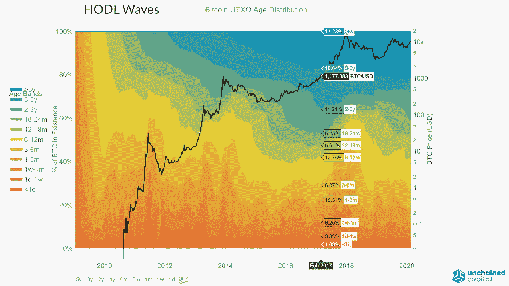

# “不动”的比特币

> 原文：<https://medium.datadriveninvestor.com/not-moved-bitcoins-ef3de725c3a3?source=collection_archive---------18----------------------->

根据 Coin Metrics 分析师 Jacob Franek 撰写的一份报告，截至 2020 年 3 月 1 日，大约 42%的 BTC 人在两年多的时间里没有进行连锁移动。这是自 2017 年 6 月以来的最大数字，该研究指出，“HODL 波”已经变得更大。

## 什么是“HODL 波”？

简而言之，HODL 浪潮是我们在区块链可以看到的比特币交易的一种具体行为。它最早是由 unchained capital 描述的，他绘制了一个图表，并对交易行为进行了分析。

Hodl 是一个互联网论坛上创造的术语，意思是“为了亲爱的生命坚持住”,被视为投资比特币的原始策略。对比特币网络的分析显示，有一波又一波的新投资者涌入。

 [## 总部位于瑞士的 ETP 进入加密交易市场|数据驱动的投资者

### 虽然金融市场几乎没有沉闷的时刻，特别是在引入…

www.datadriveninvestor.com](https://www.datadriveninvestor.com/2019/03/10/swiss-based-etp-enters-the-crypto-trading-market/) 

你可能已经注意到，比特币并不容易理解，它需要一些认真的努力来积累扎实的知识，因此我们想更深入地挖掘 HODL 浪潮背后的逻辑。

## 两年来，42%的比特币没有移动过

3 月 3 日，Coin Metrics 发布了“网络状态”更新，通过利用各种观点和数据集涵盖了 BTC 网络。在 Jacob Franek 撰写的报告中，研究人员讨论了未用交易产出(UTXO)年龄分析和 HODL 波。

Franek 提到了 2014 年对 HODL 波研究的其他贡献，作者也提到了 ban sal 2018 年的研究。Franek 写道，Unchained Capital 关于这个主题的帖子“有助于向更广泛的受众介绍积极供应”。Coin Metrics 的报告中提到了另外两项研究(Blummer 2018 和 Hauge 2019)，这两项研究都从不同角度研究了比特币持有者的行为。提到 Franek 的研究时，Coin Metrics 研究员 Nate Maddrey 解释说，42%的 BTC 人在两年内没有移动过。“截至 3 月 1 日，全 BTC 约有 42%的地区至少两年没有进行链上移动(即交易)，”Maddrey 在推特上说。

The HODL waves chart

HODL 波浪图显示，BTC 42%的土地已经闲置两年了。“绿色和蓝色代表很长时间没有交易的比特币，”HODL 波形图网站解释道。“在这段时间里，比特币的货币供应量从 50 BTC 增长到了约 1700 万 BTC，因此该图表已被每个日期的 BTC 标准化(左侧 y 轴)。”

***如果您想了解更多，请访问 BIDITEX 页面并提出您的问题，关注我们的*** [***推特***](https://twitter.com/biditex_com) ***，*** [***脸书***](https://www.facebook.com/biditex/) ***，*** [***中型***](https://medium.com/@biditex) ***，*** 用[***bidi tex***](http://www.biditex.com/)***投标你的空格。***