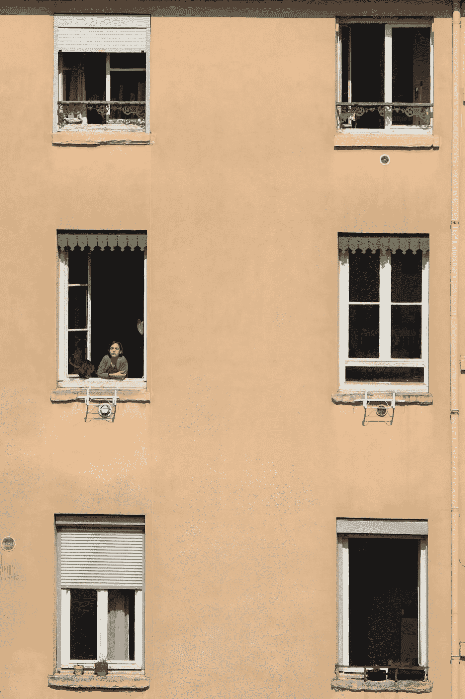
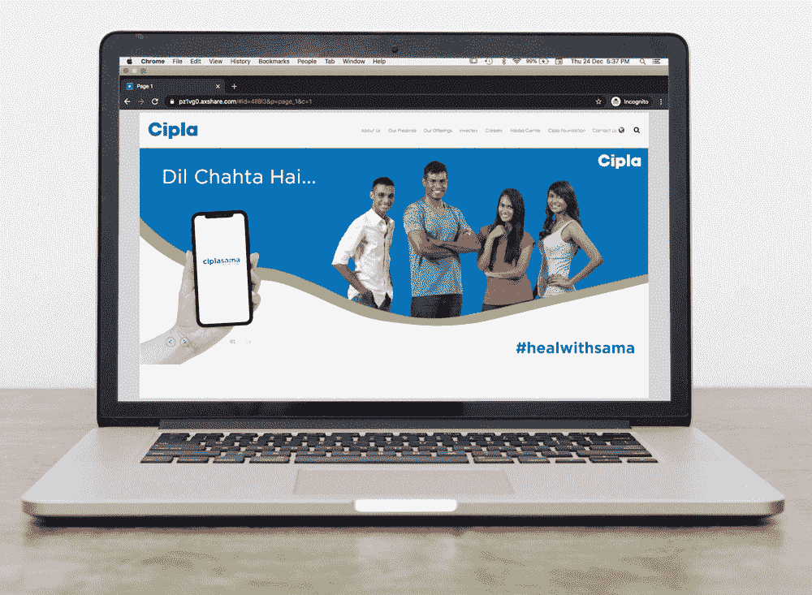
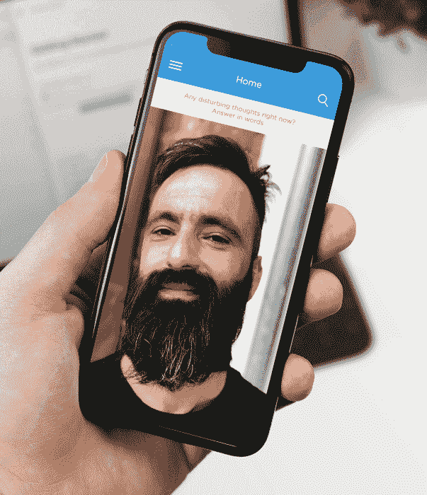

# 圣诞节不快乐吗？

> 原文：<https://medium.datadriveninvestor.com/not-so-merry-xmas-3a42d4ba3216?source=collection_archive---------14----------------------->

> 随着这一年接近尾声，你真的需要弄清楚你真正需要的和想要的是什么，你不能妥协或放弃你的权力，回到个人层面的旧模式。
> 
> 然而，一个指导原则是，自杀是可以预防的，现在就应该采取行动来保护人们的心理健康。在这个不断变化的不确定时期，我们必须保持警惕和反应灵敏，尽早在国际范围内分享证据(如国际新冠肺炎自杀预防研究合作 21)。


Picture Credit: pexels-craig-adderley-2306203 **“My beer drunk soul is sadder than all the dead Christmas trees of the world.” — Charles Bukowski**

目前，**世界**人口的 **29%** 已经淹没在精神疾病中。随着指数增长和对技术的依赖，精神健康障碍的问题预计将在未来几年快速增长。[在印度，**世卫组织**估计**精神健康问题**的负担大约为**每 10 万人口 2443 残疾调整日**，而**每 **10 万人口的年龄调整自杀率**为 21.1** 。](https://www.who.int/southeastasia)



Picture Credits: pexels-serinuscanaria-4010286

# 生命隔离的急剧增加正在导致精神健康不可预测的爆发。

[多种证据表明，冠状病毒疾病 2019(新冠肺炎)疫情具有深远的心理和社会影响。疫情的心理后遗症可能会持续数月甚至数年。研究表明，在普通人群和医疗保健专业人员中，新冠肺炎疫情与苦恼、焦虑、害怕传染、抑郁和失眠有关。社会孤立、焦虑、对传染的恐惧、不确定性、慢性压力和经济困难可能会导致弱势群体(包括已有精神障碍的个体)中抑郁、焦虑、药物使用和其他精神障碍的发展或恶化](https://academic.oup.com/qjmed/article/113/10/707/5857612)。

> 因此，重要的是**考虑紧急情况**并找到一个可以**增强**物理治疗**的替代方案。**

*传播设计师* **尼哈里卡·拉哈尔卡***——ISDI·帕森斯* ***(AIML |一个全新的世界)*** 推测一个平台，在这里**虚拟** [**色疗**](https://www.ncbi.nlm.nih.gov/pmc/articles/PMC1297510/#:~:text=Chromotherapy%20is%20a%20method%20of,years%20to%20cure%20various%20diseases.) 治疗在 **360 度**视图上**任何设备屏幕**注入其他**视觉效果**从在身为执业临床心理学家的母亲的帮助下，Niharika 推测道[**【Ciplasama】**](https://pz1vg0.axshare.com/#id=4ll8l3&p=page_1&g=1)**——这种感觉会过去的，*一个由“ **Cipla 基金会赞助的**心理健康需求虚拟助手**，该基金会植根于 Cipla 的宗旨驱动遗产，并受到该公司以患者为中心的理念的启发。***

**

***Niharika Rahalkar s**peculates [**‘Ciplasama’**](https://pz1vg0.axshare.com/#id=4ll8l3&p=page_1&g=1) — (AIML | A Whole New World)*

> *[在 **Cipla，**我们不断努力确保获得高质量且价格合理的药物，以支持有需要的患者。这就是为什么在过去的 80 年里，我们得到了世界各地医疗保健专业人士和患者的信任。](https://www.cipla.com/about-us)*

**

***Niharika Rahalkar s**peculates [**‘Ciplasama’**](https://pz1vg0.axshare.com/#id=4ll8l3&p=page_1&g=1) — (AIML | A Whole New World)*

***人工智能技术**将成为一个重要的反思工具，在解决印度[精神卫生保健](https://researchmatters.in/news/disentangling-india%E2%80%99s-mental-health-distress-does-india-have-resources-control-impending-mental)中的问题方面发挥重要作用。就提供负担得起和可获得的整体医疗保健而言，人工智能技术可以解决许多这些问题。*

*在目前的情况下，抛开成本不谈，仅仅是去看治疗师的耻辱感或每周去约会的不便，就真的可以通过你可以在手机上进行的语音或视频咨询来解决。能够在你的智能手机上把精神保健放在你的口袋里真的很令人兴奋。*

*[**【Ciplasama】**](https://pz1vg0.axshare.com/#id=4ll8l3&p=page_1&g=1)**——这种感觉会过去的。针对 18 岁以上患有* ***抑郁症、焦虑症、精神分裂症、压力症的人士。*******有*** *的规定，为* ***非患者*** *提供更好的心理健康治疗途径。****

**由**临床心理学家**指定的**治疗。****

****链接**到**心理健康诊所服务器**到**将**与**医生**立即**连接**并用于整体真实性和监控。**

**[](https://www.datadriveninvestor.com/2020/11/19/how-machine-learning-and-artificial-intelligence-changing-the-face-of-ecommerce/) [## 机器学习和人工智能如何改变电子商务的面貌？|数据驱动…

### 电子商务开发公司，现在，整合先进的客户体验到一个新的水平…

www.datadriveninvestor.com](https://www.datadriveninvestor.com/2020/11/19/how-machine-learning-and-artificial-intelligence-changing-the-face-of-ecommerce/) 

由**心理学家**给出细节，以获得**特定疾病**的治疗。**非患者**，**非**是否能够**进入**规定的治疗段并受到相应的监控。应用程序将**向**诊所服务器**发送信号**。**情感 AI** (图像、语音分析)用于精确治疗和跟踪患者的进展/退步。**联系小组**由来自**不同时区的心理学家**组成，提供快速联系。



**#healwithsama** — (AIML |A Whole New World)

所有的**加密数据**都会存储在云上。根据患者的类型，当**服务器**能够**自动纠正治疗的有限部分**并开始**推荐**它们时，可以实现疾病等更好的决策。

**视听库**的生成将由**的专门小组**在**医生和心理学家的监督**下完成。技术团队将**整合来自机器和小组成员的反馈**以**持续改进**音频和视觉库**。**

****#healwithsama****

**[*光既影响物质身体，也影响以太身体。颜色产生电脉冲和磁流或能量场，是人体生化和荷尔蒙过程的主要激活剂，是平衡整个系统及其器官所必需的兴奋剂或镇静剂*](https://www.ncbi.nlm.nih.gov/pmc/articles/PMC1297510/#:~:text=Chromotherapy%20is%20a%20method%20of,years%20to%20cure%20various%20diseases.)**

****

**[**‘Ciplasama’**](https://pz1vg0.axshare.com/#id=4ll8l3&p=page_1&g=1)*— This feeling shall pass***

**根据预算，可以推测出各种方案:**

****免费**一**年**然后**包月**。**

**治疗和支付齐头并进。**

****与**同时区**的**咨询**空闲**。**

****前 5 个**时段**免费**其余**付费**视病情**严重程度**而定。**

**作为 [**CSR 活动的一部分，为经济背景**较低的人制定了特殊规定。](https://www.cipla.com/ciplafoundation/annual-report/index.html) 而在不久的将来，这种治疗可能会用混合现实来完成。*混合现实*将提供**与**数字数据**互动**的能力，以及在相同背景和时间框架内与真实世界互动的能力。目前正在开发的软件是**微软全息镜头**。它有一个更紧凑的**版本**的**耳机**，使设备的使用更加方便。**

****

**Picture Credit:pexels-anna-shvets-4672553**

**随着我们进入更高的灵魂意识。个人有责任超越过去，看到永久改变了什么。看看你能在哪里得到我们自己的力量，一种权威感，在那里你能看到某些动态在起作用。随着你的成长、进化和转变，压力可能会很大。应用人工智能的灵魂层面的新编程，因为你负责为自己产生一种责任感，挖掘一种新的授权水平，以存在于这个星球上。**** 

> *****基于人工智能的解决方案渗透到我们生活和做生意的方式中，道德、隐私和安全问题也将出现。学生们进行了各种猜测和预测。* ***免责声明:*** *所有创意均为假设的课堂项目。* ***保留所有权利— I S D I 2 0 20*******

*****创作导师:* [***乌卡沙马尔卡尔***](https://www.linkedin.com/in/utkarsha20/) ***。|***[**https://www.utkarshaofficial.com/**](https://www.utkarshaofficial.com/)****

*******ISDI 校区*** *印度设计学院&创新
ISDI 大厦，One Indiabulls Centre，
Senapati Bapat Marg，Lower Parel，
孟买 400013。一般查询:* [*查询@isdi.in*](mailto:enquiries@isdi.in) *布点&行业连接:* [*布点@isdi.in*](mailto:placements@isdi.in)****

```
******UTKARSHA M. |** Author | Design Thinker | Creator  - A desire to understand the world and to improve it always remains at the core. Design is a managed process and my quest for knowledge is subject to an inquiry of the apparent, the imagined and the recalled. As I speculate and design, my liberty of self-expression is in direct correlation to my existence and knowledge.****
```

## ****访问专家视图— [订阅 DDI 英特尔](https://datadriveninvestor.com/ddi-intel)****