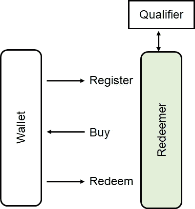
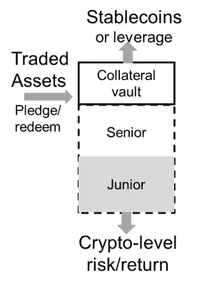
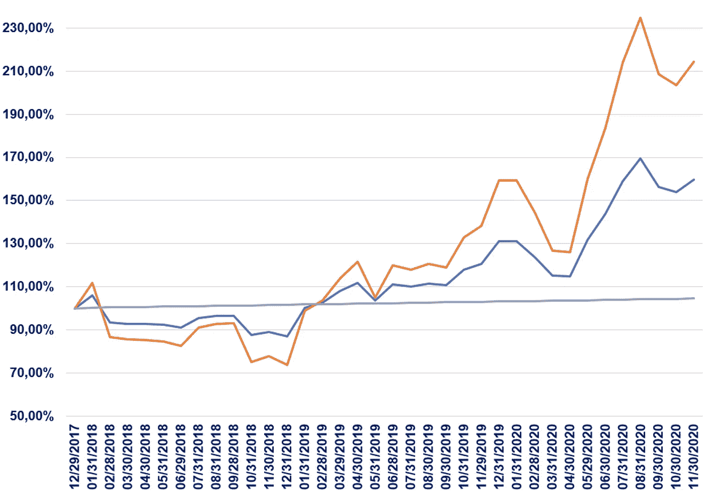
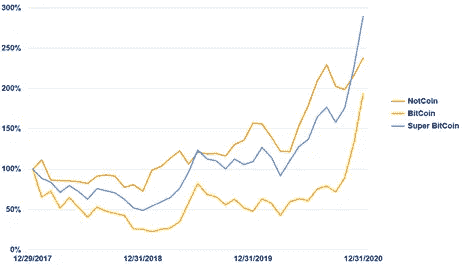

# Notcoin，一个加密再平衡器

> 原文：<https://medium.datadriveninvestor.com/notcoin-a-crypto-rebalancer-dcc141189ca?source=collection_archive---------12----------------------->

比特币价格上涨，给加密所有者留下了与比特币相关的蓝宝价值。这增加了他们投资组合的波动性和损失风险。他们将被诱惑去“再平衡”，去卖掉他们的一些赢来的钱，并寻找有新的上升空间的新机会。

Photo by [Leonardo Iheme](https://unsplash.com/@leoeye?utm_source=unsplash&utm_medium=referral&utm_content=creditCopyText) on [Unsplash](https://unsplash.com/s/photos/balance?utm_source=unsplash&utm_medium=referral&utm_content=creditCopyText)

人们本能地这样做。他们的直觉得到了数学的支持。现代投资组合理论告诉我们，如果我们拥有“不相关”的资产，我们可以以更低的风险赚更多的钱。这让我们度过了 BTC 无所作为，但其他资产平均都在上涨的时期。

比特币霍德尔们真的有动机出售宇宙中最好的投资吗？是的。一部分吧。比特币价格的上一次大幅上涨推动了 ICO 热潮。现在他们正在尝试 DeFi。[正如我在本文](https://blog.goodaudience.com/ico-boom-explained-by-weird-portfolio-math-36db6807ea4d)中指出的，“2017 年的 ICO 爆炸似乎完全不理智，这是人群变得疯狂的一个例子。然而，当投资者购买一袋欺诈性的抽水和倾倒计划时，他们可能是完全理性的。从数学上来说，交易一包蹩脚的高波动性资产，建立一个比你最好的资产表现更好的投资组合是可能的。”

也许我们能找到更好的投资。我们也许能够找到一个“不相关”的非加密证券投资组合，以平滑加密回报。这是我们 [Notcoin](http://launch.notcoin.io) 项目的目标。Notcoin 将是一个有良好回报的证券投资组合，并且大部分与加密无关。

我希望 DDI 社区能帮助我们设计和制造 [Notcoin](https://launch.notcoin.io/) 。我们想要方便的包装，我们需要一个合适的组合。

# 连锁销售和服务

我们有包装方面的好消息。我们可以直接把硬币送到加密钱包里。通过向 Notcoin 发送 crypto 来获利，通过向 Notcoin 发送 crypto 来购买 dip。

Notcoin 将是一种证券，所以我们需要遵守证券法。我们将通过将 Notcoin 代币设置为可兑换，但不可转让或交易来简化这一过程。此外，我们将查找收件人的资格(KYC，反洗钱，认证的东西)，希望有一个现有的帐户。

我正在建造一台我称之为“救赎者”的机器来提供简单的连锁销售和服务。

# 投资组合设计挑战

我们需要为非硬币投资组合找到不相关的资产。寻找不相关的资产很难。获得“有效边界”回报很难。用合理定价的杠杆获得它们很难。我希望数据驱动的投资者社区可以通过提出一些建议来帮助我们。你们中的一些人甚至可能有兴趣加入这个项目。

## 现代投资组合理论(MPT)

MPT 讲述了这样一个故事:投资者会竞购资产，直到预期回报相等。投资者可以购买高波动性资产，也可以购买低波动性资产，然后利用杠杆(借款)获得大致相同的回报和波动性。在这种情况下，可能很难通过选择资产来提高回报。

然而，投资者可以通过分散投资来提高风险调整后的回报。他们可以购买回报率不相关的资产组合。然后，他们会经历资产 A(例如，比特币)不动，但资产 B(例如，标准普尔 500 ETF)平均在上涨的情况。

## 金钱驱动相关性

考虑投资组合的一个简单方法是将其分为“风险”资产和“避险”资产，前者是人们在认为经济和货币供应将增长时购买的，后者是人们在认为经济或货币供应问题即将到来时购买的。这就是 60%股票和 40%债券的投资组合背后的理念。人们购买股票是为了投资增长(风险自负)。当他们想保证能收回资金(规避风险)时，他们就会购买债券。将它们放在一起会产生更平稳的回报。

这种方法的问题在于，每种资产都受到宏观货币供应量的影响。当可用于投资的资金增加时(这种情况已经发生了很长时间)，每种资产都会变得更贵——股票、债券、密码。它们的价格多少有些关联。当货币供应量减少时，这个问题变得更加严重。这往往发生在像 2007 年那样的恐慌时期，当时所有人都取消贷款并发出追加保证金通知。然后，资产价格变得更加相关，并下降。众所周知，在压力时期，资产的相关性会达到 1。

寻找不相关的资产很难。

## 负对冲不会增加预期回报

在这种情况下，你可以对冲。当你的其他资产下跌时，你可以购买上涨的短期期货。这种负相关会让你退出市场，降低你的风险。然而，它也会让你退出市场，从而降低你的回报。它不会给你一个不相关投资的效果，它会留在市场上，并(平均)赚取阿尔法。

## 我们想要大市值的流动性

Notcoin 将是一个开放式基金，人们可以随时购买和赎回。我们希望从我们可以轻松买卖的证券中建立它，因为它们有一个流动的市场。

## 相关性四处移动

加密和其他资产之间的相关性会发生变化。这里提出的方法只有在低相关性周期比随机周期长的情况下才有效。如果相关性在某种程度上是持久的，但在高相关性和低相关性之间移动，那么我们将希望主动管理在两种机制之间切换。

## 我们需要高波动性

密码具有很高的挥发性。如果你将风险调整后的回报与大多数证券等波动性较低的资产放在一起，你甚至可能不会注意到风险调整后回报的变化。为了有效地去相关加密，我们需要高挥发性。因此，我们将寻找异常波动的资产，或者更有可能的是，我们将寻找廉价的方式来利用资产提高其波动性。

而且，密码购买者想要高波动性。他们的加密投资目标是高风险和高回报。

## 瀑布会带来更高的波动性

我考虑了很多获得高波动性的方法，有一种方法因其低成本和灵活性而脱颖而出:瀑布。我们可以利用瀑布将投资回报分为低风险部分和高风险部分，前者承担损失，后者获得额外回报。在密码领域，我们甚至可以把风险最低的部分称为“稳定币”。请尽情疯狂这个常青的想法。

## 例如，瀑布中的哈尔戈·杰斐逊基金

我向我的朋友弗朗索瓦·德豪特弗耶提出了这个挑战。他的杰斐逊基金检查流动性、持续表现、杠杆和积极的风险管理。我们还没有计算与 BTC 的相关性(也许你能帮忙)。证券指数报告的相关性低至 0.13。

他提供了 Jefferson(蓝色)的回溯测试，分为两部分(灰色/稳定，橙色/不稳定)。

以下视图包括蓝线中的 50%比特币。BTC 非常重视回报。在这个精挑细选的时间段(在 BTC 最后一个高峰时买入)，与证券基金混合，回报更高。所以在这个时期就有了去相关的“免费午餐”。

# 更多关于 Notcoin

请与我们分享您对[不和谐](https://discord.gg/KtheGnfaqh)的想法，或者[注册](http://launch.notcoin.io)等待更新。

## Maxos:真实世界定义

Maxos 正在建立一个现实世界 DeFi 的市场。