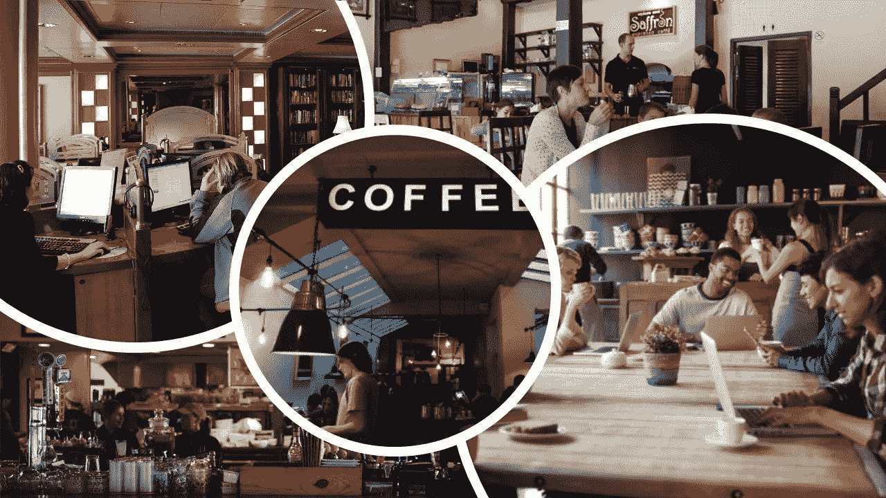

# 星巴克注意:你已经失去了一位忠实的顾客。

> 原文：<https://medium.datadriveninvestor.com/note-to-starbucks-youve-lost-a-loyal-customer-2924baf1028d?source=collection_archive---------4----------------------->

These Photos by Unknown Authors are licensed under [CC BY](https://creativecommons.org/licenses/by-sa/3.0/)

## 你不是在卖咖啡；你在推销社区。那是你的品牌；保护它。

我坐在星巴克，感觉有点烦。但我不确定我懊恼的真正罪魁祸首是谁，星巴克还是邮政兑换管理。他们两人成功地摧毁了汉弗莱斯营地的咖啡社区。

这家咖啡店对星巴克来说太小了。这篇文章中的三家星巴克咖啡店都挤在最小的空间里——不像大多数其他好的咖啡店那样开放和吸引人。桌子挤在一起——就在刚才，我旁边的一对夫妇离开了商店，去找一个更好的地方坐。这家商店到处都是大声尖叫的孩子。所有的商店都紧挨着交通最繁忙的地区。这对于利润最大化很好，但对于我们这些将星巴克视为咖啡店文化灯塔的人来说却很可怕。我们对星巴克的期望更高。

 [## 一个企业在肚子上移动:如何照顾直觉|数据驱动的投资者

### 事实证明，直觉不仅仅是一种感觉。科学很清楚:你的直觉比你知道的更多…

www.datadriveninvestor.com](https://www.datadriveninvestor.com/2018/11/09/a-business-moves-on-its-stomach-how-to-make-allowances-for-gut-feelings/) 

1986 年至 2000 年担任星巴克首席执行官的霍华德舒尔茨说，咖啡店不仅仅是卖咖啡。它是关于创建一个社区聚会场所，一个人们想出去玩，见他们的朋友和熟人，在一个放松的环境中做生意，或者只是一个放松的地方阅读一本好书的地方。它不仅仅是一个买咖啡的地方；这是人们来社交的“第三个地方”。霍华德说，“[咖啡是产品，但它不是我们的业务。”](https://businessisfun.club/starbucks-coffee-empire/)

当星巴克与美国陆军和空军交流服务(AAFES)谈判达成协议，在韩美军的主要设施汉弗莱营(Camp Humphreys)设立三家星巴克时，社区的概念就消失了。虽然我不知道合同中的细节，但很明显，帖子上的位置是为了最大化流量和销售额而选择的，很少(如果有的话)考虑到发展任何社区意识。

我决定去别处做生意。我选择的饮料是一杯上好的黑咖啡——本质上，只是一杯咖啡。在星巴克，我要花 3.95 美元。在我当地的 Exchange Express 商店，同样的一杯咖啡(好吧，不是同样的混合咖啡，但黑咖啡就是黑咖啡)要花我 1.79 美元。那么为什么我愿意每杯多付两块多钱呢？

我愿意为氛围感买单；社区意识。我愿意为本质上相同的产品支付更多的钱？不是。所以。很多。

所以我决定停止去星巴克——至少是《邮报》上的那些。我太习惯去有氛围的好咖啡店了，“第三地”觉得如果没有氛围，我就不愿意花高价买咖啡。

我要回到我在当地十狗咖啡馆的闲荡岗位。去那里很麻烦，一杯美式咖啡要 6000 韩元(约合 5.50 美元)。但它有氛围，有社区的感觉，有“第三地”的精神。

一个成功的零售咖啡店是关于品牌的——它不仅仅是纯利润。不幸的是，由于差价服务对外部供应商的绝对控制，星巴克韩国决定优化利润，而不是忠于星巴克品牌。你可以在任何一家星巴克咖啡店看到这一点；他们看起来和感觉上像任何其他的咖啡店——他们有典型的咖啡店氛围，这使得星巴克品牌闻名于世。这是一种以岗位利润为名而牺牲的氛围。

所以我要回到我最喜欢的下班后聚会。这是一个遗憾，因为我是一个典型的忠诚的咖啡店顾客，任何好的咖啡馆都希望有。