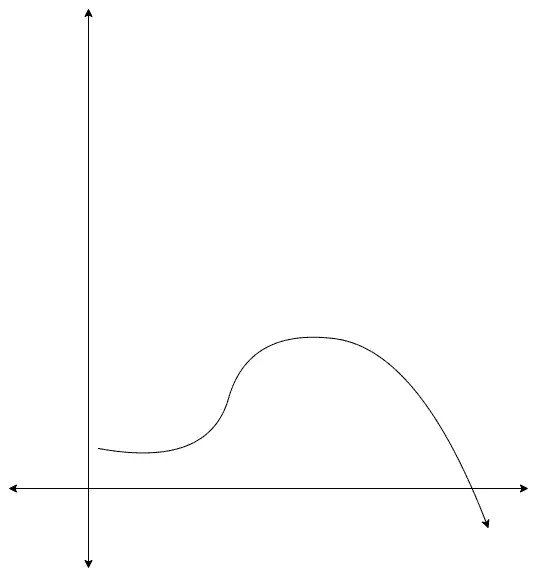
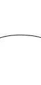
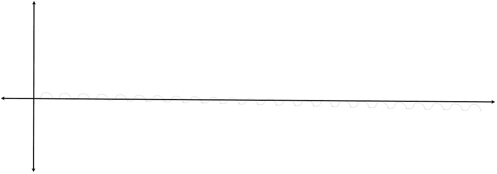

# 随着时间的推移，我们看到的一切都不一样了

> 原文：<https://medium.datadriveninvestor.com/nothing-we-see-is-the-same-when-the-time-changes-891f1566fe09?source=collection_archive---------29----------------------->

## 我们看一个物体，比如说一个带灯的招牌，一秒钟后就不一样了。它是那个物体的另一种形式。但是，为什么呢？

Photo by [Djim Loic](https://unsplash.com/@loic?utm_source=medium&utm_medium=referral) on [Unsplash](https://unsplash.com?utm_source=medium&utm_medium=referral)

你可能会说“不，这是同一个招牌。我看到了同样的事情”。好，现在想象你的总寿命是 10 万年。你活了 10 万年。你会怎么看那个招牌？它只会在你的一生中流行。就在一瞬间，它会出现又消失。它会被人们首先使用和清除，然后被扔掉，然后被回收。你可能会说“但是我感知的时间不会改变。我仍然会看到那个物体存在了许多年”。那么我会说“不要忘记时间是相对的。当你活了 100，000 年的时候，有些年只是你生命中的一小段时间。因为你的感知被调整到 10 万年”

 [## 胁迫时期提升美国劳动力技能|数据驱动的投资者

### 给一个人一条鱼，他可以吃一天。教一个人钓鱼，你可以喂他一辈子。令人吃惊的是…

www.datadriveninvestor.com](https://www.datadriveninvestor.com/2020/08/26/upskilling-the-american-labor-force-during-a-time-of-duress/) 

现在想象一下，从一个物体反射给你的光只是一个函数 f，如下图所示。

Figure 1: Function f

我们在物体反射光的过程中看到的只是函数 f 的一小部分，如下图所示。因为我们只看了这个函数的很小一部分，我们看不到任何变化。物体看起来是一样的。

Figure 2: Function f in a smaller period.

但是当我们看整体函数的时候，我们看到物体在每个时间秒都是不一样的。另一方面，如果我们从比图 1 中更长的时间来观察物体的功能，我们会发现物体是一样的，和以前一样没有变化。你可以在下面看到，我们在图一中看到的函数只是一般情况下的微小变化，我们的一般函数看起来几乎是稳定的。

Function f in a larger period.

然后，我们可以理解，使周期变大或变小，并不能帮助我们看到物体在每个时刻都不相同。那么，什么能帮助我们理解没有一个物体是和它们之前的版本一样的呢？

答案是“视角”。当我们有一个真正的视角去看待物体的时候，就意味着我们处于能够分辨物体新旧状况的时期。

这不仅适用于检测物体功能的变化，也适用于情绪、动机、快乐和悲伤等抽象事物。

当我们有达到目标的动机时，如果我们从一个小的角度来看这个功能，我们看不到变化。因此，我们可能在想，我们并没有更接近我们的目标。当我们从一条大的视野线看目标时，我们会看到当我们达到目标时，这个功能就结束了。由于在函数结束后我们什么也看不到，我们赋予目标的值可能会减少。这两种错误的观点都会打击我们实现目标的动力。但是，当我们从正确的角度来看代表达到目标的过程的函数时，无论是对没有进步的错误认识还是当我们达到目标时会出现的空虚都不会使我们失去动力。

我希望这篇文章能帮助你重新思考你的生活，你的心情，动机，快乐和悲伤，这样你就能对它们有一个更好的看法。

祝你今天愉快，

## 访问专家视图— [订阅 DDI 英特尔](https://datadriveninvestor.com/ddi-intel)