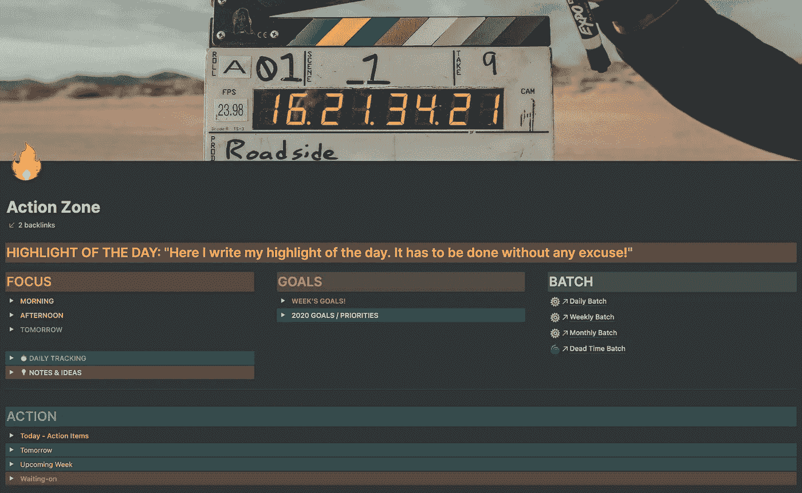

# 概念软件完全改变了我的生活！3 个月后，我可以 100%确定

> 原文：<https://medium.datadriveninvestor.com/notion-software-totally-changed-my-life-3-months-later-i-can-state-this-100-sure-a2f4b5cdbc1a?source=collection_archive---------0----------------------->

## 我很客观。我强烈建议你向前迈出这改变人生的一步

Photo by [Rodion Kutsaev](https://unsplash.com/@frostroomhead?utm_source=unsplash&utm_medium=referral&utm_content=creditCopyText) on [Unsplash](https://unsplash.com/s/photos/colors?utm_source=unsplash&utm_medium=referral&utm_content=creditCopyText)

> 重要建议:这里没有任何联盟营销链接，我也没有从我在这篇文章中提到的公司或个人那里收到任何东西。

# 测试和承担风险是生命进化的必要条件。

这样做了之后，你需要分析，得出结论。

这就是我在这篇文章中要做的。

2020 年 9 月 25 日，我写了这篇文章:“[为什么我认为观念软件可以改变你的生活](https://medium.com/datadriveninvestor/why-i-do-think-notion-software-can-change-your-life-3f09f22af91b)”。

3 个月后的今天，我可以肯定的肯定，幸好我是对的。

在 2020 年，观念软件和[奥古斯特·布拉德利](https://medium.com/u/29d851fc9454?source=post_page-----a2f4b5cdbc1a--------------------------------)的 PPV 方法论是我改变人生的里程碑。句号。

**你对这些话怎么看？**

*   安全性
*   镇定的;冷静的
*   和平
*   放松
*   控制
*   清楚
*   组织
*   实际的
*   结果
*   完成
*   快乐

你喜欢他们，不是吗？

嗯，我都是用 PPV +的概念。就这么简单。

# 两者我都觉得很舒服:

*   **PPV 的方法论**，因为我几十年来一直在用一个非常类似的自上而下的生产力系统架构。
*   观念，因为作为一名计算机科学工程师，观念的概念让我想起了我在 90 年代早期开始用 Dbase 编程的时候。

> 我刚刚花了一个周末来创建我的数据库模型，在 idea 中实现它，并在周一准备好我的系统。

在本文中，我将分享这个系统中的主要组件(我将称它们为“区域”)，因为我改进了 August 的并使其适应我自己的流程。

好的一点是，使用概念，你可以做任何你想让系统适应你需要的事情。

> 重要一点:ideal 不是一个记笔记的 app。对我来说，这是一个惊人的无代码框架。

我强调上面的概念，因为我一直认为这个概念只是“另一个 Evernote”。正因为如此，我忽略了概念，因为十多年来我一直是 Evernote 的忠实用户。

**将我所有的生产力架构转移到观念导致我停止(或几乎停止)使用这 4 个应用:**

*   全聚焦。
*   戴安。
*   特雷罗。
*   80% Evernote。

**将我的生产力系统的核心集中在一个软件中是一个非常冒险的举动，但是:**

1.  尽管诺昂不像亚马逊、谷歌或苹果那样是最大的玩家之一，但我对这家公司及其未来非常有信心。
2.  我通过这场运动所获得的利益是值得的。毫无疑问！

事不宜迟，我将描述我使用的主要功能以及我是如何实现它们的。

为了不把这篇文章变成一本书，我不会讲太多细节。如果我能帮到你，或者你遇到困难，请随时联系我。

我很乐意帮助任何人，因为这场运动 180 度地改变了我的生活，我很确定它也能改变你的生活。

让我们开始吧！

# 1.行动区

对我来说，这是我的主板。这是我白天花更多时间的地方。

我将描述我创建的不同部分，因为这个板是我根据自己的需要最个性化的一个。

这完全符合我的工作流程，我很高兴。

只有一个屏幕来管理你的一整天是一个梦想成真。

Photo by Author

## 1.1 一天的亮点

每天我都在定义我的伟大目标是什么。

不管是我能在一分钟内完成的“愚蠢”事情，还是我需要一天 12 小时才能完成的事情。

> 每当我上床睡觉时，我都会感到自豪，因为我完成了它。

你想成功，所以当你的一天开始时，你会花足够的时间来确定你会写些什么

1.  你可以实现。
2.  这对你很重要，因为它会让你离目标更近一点。

这个“突出想法”是我在零年级时从一个叫“阿尼克”(他是一个很棒的家伙)的网上社区中学到的。).

这是那种一开始看起来“愚蠢”的事情，但如果你深入思考，它可能会改变你的生活。

就像我上面说的，你永远不会成功，因为你做了一件伟大的事情。你会成功，因为你做了成百上千件小事。

## 1.2 重点

如您所见，这里有 3 个切换部分:

*   早上好。
*   下午好。
*   明天。

它们中的每一个都只是一个待办事项列表。由于隐私问题，我不能展示它们，但你可以了解这个想法。

> 我有一个规则:我不能在头两个(上午和下午)有超过 3 个项目。

如果我看到一些重要和紧急的事情，我会把它放在“明天板块”，只是为了让它在那里，在聚光灯下。

如果白天发生了意想不到的事情(不要骗自己。这总是会发生的)，对我来说，毫不费力就能看到我可以把它放在哪里，如果需要的话，把项目从“上午部分”移到“下午部分”，或者如果我知道我今天没有足够的时间，就移到“明天部分”。

使用一个切换开关很关键，因为每当我计划我的一天，**我关闭所有的切换开关，除了“早晨部分”的一个**。

> 对我来说，专注于三件事是最有成效的行动之一。

每当我决定要做什么任务时，我甚至会关闭“早晨部分”,因为我不想让任何事情分散我的注意力。

**使用待办事项列表让我能够以一种非常舒适的方式来区分事情的优先次序:**

*   上下移动物品很容易。
*   显而易见，你需要一个循序渐进的过程来提高工作效率。
*   待办事项清单为你指明了方向:从第一个任务开始，当它完成后，进入下一个。

> 待办事项列表也有一些很棒的东西。您可以检查它们是否完成，看到任务被划掉。

这又是一件“愚蠢”的事情，却激励了我很多。它给我一种充满活力的感觉，一种朝着我的目标前进的感觉。

当你完成一天的工作，看到 6 个被划掉的任务，你会觉得自己像个英雄:

*   你做到了。
*   你落下了一些东西。
*   你知道明天还是一样。
*   你知道复合努力会让你走得更远。只是时间问题。
*   你每晚都睡得很好，是因为你做了事情，你感受到了。
*   你也确定你已经做了你应该做的事情，因为你考虑了它们，你选择了它们，你区分了它们的优先次序，最后，你做了它们。

## 1.3 目标

有两个切换部分。

我通常只有一个，但我创建了第二个，因为我正在进行年度回顾，我想快速写下我想到的任何年度目标。

在周目标部分，我有一个待办事项清单，上面列有我每周想做的任务。

> 它们非常具体、清晰、直截了当。它们是推动我实现目标的基本任务。

我可以看到这些任务整整一周，因为，正如你所看到的，它们在我的主屏幕上，所以:

*   **当我计划我的日常任务的时候**，我总是会看看我一周的目标。
*   **当我优先处理我的待办事项清单**时，我会看看我一周的目标。

这给了我一种功能，那就是在实现目标的过程中，总是做我应该做的事情。

## 1.4 批次

在屏幕的右侧，我有我称之为“批处理”的东西。

**它们是 4 个不同的文档(概念的页面):**

*   每日一批。
*   每周一批。
*   每月一批。
*   停滞时间批次

上面的每一个文件都包含了一个待办事项列表，根据我生活的四个方面，它们都有不同的部分。我的 3 家公司各有一个区域，另一个区域用于我的个人问题。

每当我有事情要做的时候，我的第一个问题总是一样的:我什么时候需要做这件事？

*   **尽快？**然后，它将转到其相关部分内的每日批处理文件。
*   **本周？**然后，它将转到其相关部分内的每周批处理文件。
*   **这个月？**然后，它将转到其相关部分内的月度批处理文件。
*   **没有截止日期？**然后，它将转到其相关部分内的死区时间批处理文件。

我在一天开始时检查我的每日批处理文档，并且只选择 6 个项目(3 个进入我的“上午部分”，另外 3 个进入我的“下午部分”)。

如果你想更深入地了解我是如何管理我的批处理的，请查看这篇文章。

## 1.5 日常跟踪

此切换部分包含到我的每日跟踪数据库的连接。

**我用这个数据库追踪很多东西:**

*   我昨晚睡了多久。
*   我想标记为完成的习惯。
*   每天写日记来完成我早上和一天结束时的日常日志。
*   …

我想描述一下这最后一点。

如上所述，我不再用 DayOne 写日记了。

开始的时候有点尴尬，因为我的脑海里有一个清晰的日志的图像。我把它定义为我们一直拥有的物理日志，后来，用 DayOne 应用程序。

现在，我打破常规。

我提升我的思想，我观察它的功能。

**如果你想到一本杂志，它只是一个地方:**

*   写下想法。
*   执行早晨或一天结束时的例行公事，如一天的目标、感激、灵感、反思…

> 当你练习这种抽象思维时，你最终会得出这样的结论:你不需要只使用一个软件或数据库，所有的东西都可以“无处不在”(但要有条理！).

**我的解决方案是将我的日志功能合并到两个不同的数据库中:**

*   我的日常跟踪数据库。
*   我的笔记和想法数据库。我将在本文中解释它。

**概念的优点是你可以在一个页面中组合这两个完全不同的项目:**

*   数据库字段。
*   格式化文本，你可以在任何笔记应用程序。

**这种组合产生了惊人的结果，因为在一个概念的页面中，你可以创建两个不同的部分:**

*   **在顶部**，插入所有你想使用/填充的数据库字段。
*   **在那个**下面，你可以像用 Evernote 一样，开始一个格式完美、没完没了的笔记板块。

**这就是观念页的超能力！**

## 1.6 注释和想法

此切换节包含到我的笔记和想法数据库的连接。

它能让我毫不费力地快速输入数据。

## 1.7 行动领域

这是一个有 4 个切换部分的区域，每个都连接到我的任务数据库。

**打开每个开关让我看到:**

*   今日任务。
*   明天的任务。
*   即将到来的一周任务。
*   等待任务。

在这个部分下面，我有一个“日历视图”,里面有我所有的计划任务。

> 这是我最常用的视图，因为我可以很容易地将任务从一天拖到另一天，并且我对我一周内和之后几周内必须做的所有事情都有清晰的愿景。

如果我向下移动“日历视图”，我可以看到我的高级目标、低级目标和活动项目。

正如我之前所说，这个“行动区”是一个梦想成真。我的一生只是上下滚动了一点点…

# 2.商业区

这里我有三个数据库:

*   **嫖客。**我客户的所有信息和数据。
*   **人脉。**个人和职业联系数据。
*   **内容生产机器。这个数据库储存了我所有的内容。今天只有帖子，但在未来，它会有我可能发布的任何类型的内容格式(视频、播客……)。**

# 3.个人区域

在这里，我只是存储我的笔记本电脑数据库。

这是一个数据库，我在其中创建了一个字段来区分我可能拥有的所有不同的笔记本:个人的、商业的等等。

每个数据条目就像任何笔记应用程序的笔记。

# 4.支柱区

支柱是定义我生活的所有关键元素。

如果我的柱子没问题，我就没问题，就这么简单。

为了更好地解释它，我会给你一些例子:心态，写作，家庭，家庭，健康和健身…

**在这个区域中，我有这些不同的页面或数据库:**

*   **对齐区(第页)。**它定义了我自上而下的方法(和 PPV ),从顶层、我的指导原则(定义我生活的原则)到底层(高层目标、低层目标、项目和任务)。
*   **心态(第页)。在这一页上，我可以写下我想到的任何概念、引用、我在任何地方看到和看到的想法。任何引起我注意的东西。它可以是任何类型的主题:动机、灵感、表现、幽默……每天，我都会在早晨的例行公事中抽出 5 分钟的时间来阅读这份庞大的文件。**
*   **习惯和套路(数据库)。**这里我记录了所有我想定期执行的习惯。

# 5.管道区

作为一个目标达成者，我的程序总是一样的(非常简单，如你所见):

1.  定义策略。
2.  定义高层次目标。
3.  定义低级目标。
4.  定义任务(如果很多任务在一个相似的或者更高层次的概念中，我用一个项目将它们分组)。
5.  优先排序。
6.  在做。

> 这个区域让我可以完美地看到我创建的层次结构。

这是一个 4 层结构，从高级目标(由我的指导原则定义)到低级目标、项目和任务。

这个区域是一个极好的地方，可以完美地看到**我如何将我的高层次目标和日常任务联系起来，从抽象的概念(高层次目标)到最具体的元素(任务)。**

# 6.地下室

这是我的第二个大脑，数字大脑。让我感到安全、有保障和自信的那个。

**只要是我想存储和安全保存的数据，都可以放入这些数据库:**

*   **笔记和想法。这里是我把我的日志和任何其他种类的想法、灵感等混合在一起的地方。我的日志古典概念消失了，想着一个按天划分的地方，我写东西的地方。现在，一切都在这里，在我的日常跟踪数据库里。这听起来可能很混乱，但当你习惯了，它就灵活多了，因为这就是我们大脑的工作方式，以无政府的方式连接思想。**
*   **媒体。**推文、书籍、视频、文章、播客……任何我感兴趣的媒体都在这里注册。
*   **训练。我所有的课程、课、课…都在这里。**
*   **软件、技能和服务。任何看起来必不可少的软件或专业服务都会记录在这个数据库中。**
*   **知识库。**这就是我所谓的我的“个人维基百科”。任何事情，当我说，我的意思是，我进入我的系统有一个知识库领域。这使得将一个想法、一本书或一个培训课程与我创建的知识领域联系起来成为可能。我在这个知识库数据库中的一些知识领域的例子有:创造力、财务、成长、营销、心态、动机、生产力…你可以将它们命名为“标签”来更好地理解这个概念。

这些保险库让我有可能找到任何我感兴趣的信息。这是知识和灵感的源泉。

它给了我安全感，每个人都需要这种安全感才能在晚上睡个好觉。

这给了我很大的灵活性，因为我可以在任何地方使用任何设备访问它。

# 7.评论区

评论彻底改变了我的生活。

**开始的时候，我们都想的一样:**

*   是一些无聊的东西，
*   一些会花费你很多时间的事情，
*   没用的东西。

> 没有什么比这更偏离事实了。

在这里，我解释为什么它们对任何人的生活如此重要。我强烈建议你试一试。没什么可失去的。赢了很多。

**在这个区域中，我有一个数据库，用于我的每种评论类型:**

*   年度审查。
*   季度回顾。
*   月度回顾。
*   每周回顾。

# 外卖食品

刚开始可能看起来有些力不从心，但是**其实不是**。

一旦你理解了这些概念，这种自上而下的哲学，你开始创建概念的页面和数据库，一切都开始适应，变得有意义，以你想象不到的水平提高你的生产力。

将我所有的系统集中化改变了我的生活。

> 那种安全感，控制感，对我整个生活的轻松掌控感成倍增加。

我在这个系统上工作得越多，我就越能让它符合我的需求，我对它就越感到舒服。

**在这里，我总结了像这样的系统可以给你的一些要点:**

*   定义**什么对实现你的目标真正重要**。
*   **专注于最重要的事情。**
*   **正在做那些最重要的事情。**
*   基于在任何时候机械地做你应该做的事情，创造一个奇妙的生产力循环。
*   创建一个准备好**克服意外事件**的系统。
*   创建一个每天激励你的系统。
*   创建一个避免拖延的系统，因为它是基于小/微小/简单的任务。
*   创建一个抗压系统，因为**使用起来很简单**。相信我。是真的…

富有成效并不困难。

生活很简单，我们的系统也应该如此。

> 简单是生活中最有效的工具。

在从事了 30 多年的生产力工作之后，我从来没有同时拥有过这种复杂和简单的独特组合。

在我的生活中，外面是一个复杂的世界，这里是一个简单的世界。

去吧！

**访问专家视图—** [**订阅 DDI 英特尔**](https://datadriveninvestor.com/ddi-intel)