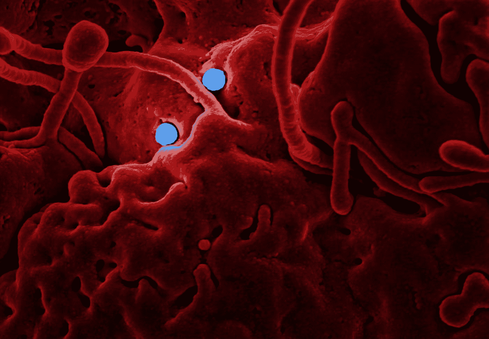
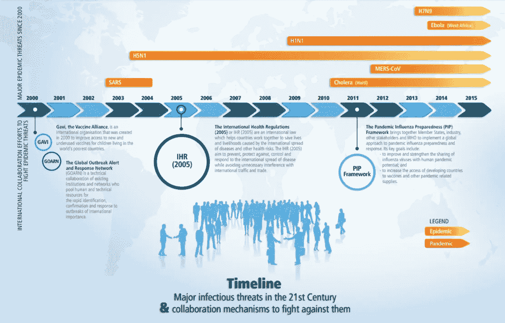
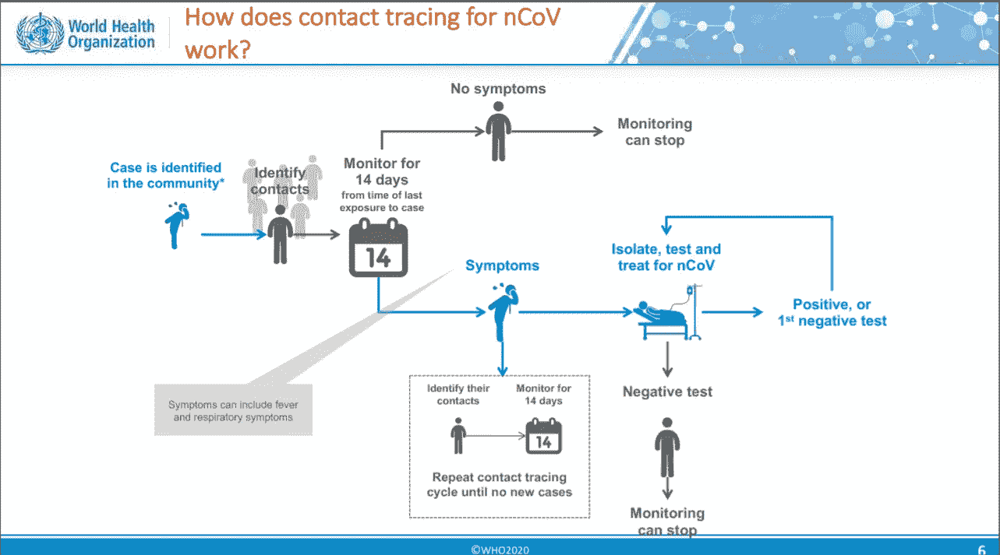
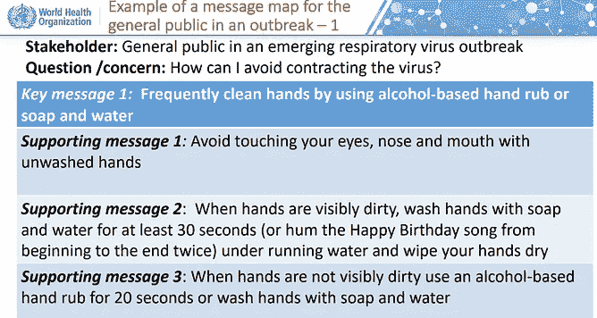
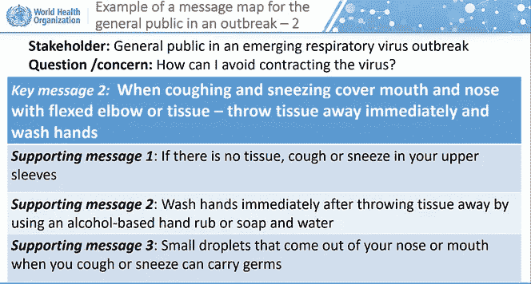
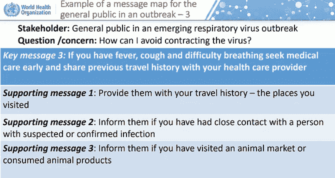
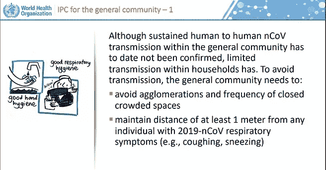
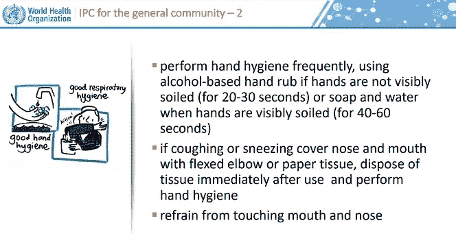
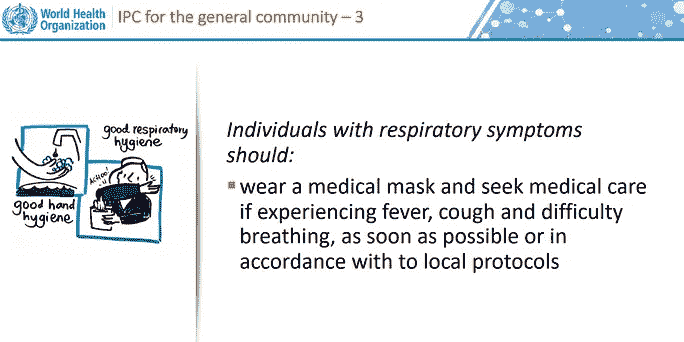

# 新型冠状病毒(2019-nCoV)——世卫组织针对冠状病毒爆发的新型互动、基于网络的在线培训

> 原文：<https://medium.datadriveninvestor.com/novel-coronavirus-2019-ncov-whos-new-interactive-web-based-online-training-for-coronavirus-d0865f0b47af?source=collection_archive---------2----------------------->

## 世卫组织的在线训练是目前对抗冠状病毒爆发的最佳武器；涵盖检测、预防、响应和控制的方法；

> “每一个在中国和其他地方受苦的人，愿上帝加强受害者和他们的家庭，引导他们度过这段艰难的时光。世卫组织推出了新的在线培训，让人们了解冠状病毒和相关的安全措施。本文将向您简要介绍培训内容以及您为什么应该参加培训。为了确保对培训的真实反馈，我注册并完成了必要的模块”

Photo by [CDC](https://unsplash.com/@cdc?utm_source=medium&utm_medium=referral) on [Unsplash](https://unsplash.com?utm_source=medium&utm_medium=referral)

世界卫生组织正试图阻止冠状病毒在中国和全球的加速传播。截至 2 月 9 日，世界卫生组织 ***已确认约 37558 例确诊病例，仅周日就确认了超过 2676 例(约占确诊病例总数的 7%)。*** 冠状病毒受害者的死亡人数持续上升，然而，只有 1%多一点的病例是在中国以外发现的。

 [## 医疗保健的未来正在被一场大型技术入侵所塑造|数据驱动型投资者

### 过去十年，全球经济的所有部门都经历了大规模的数字颠覆，而卫生部门现在…

www.datadriveninvestor.com](https://www.datadriveninvestor.com/2018/11/02/the-future-of-healthcare-is-being-shaped-by-a-big-tech-invasion/) 

作为其准备和响应计划的一部分，“**世卫组织突发卫生事件项目**的学习小组与技术专家合作，于 1 月 26 日快速开发并发布了[在线课程](https://openwho.org/courses/introduction-to-ncov)——在 2019-nCoV 爆发被宣布为国际关注的突发公共卫生事件的 4 天前。

# 你为什么要接受它？

数字不会说谎，所以这里有一个快速的事实检查。

*   **从该门户获取实时知识的用户**—20000 人
*   **新增用户/日** — 3000
*   **观看介绍视频的用户** — 20 万

知识/信息是你对抗和传播意识所需要的一切。学完所有必需的模块后，**我可以肯定地说，你会在结束一天的时候知道该做什么和不该做什么，并且不再那么担心。该模块目前正在以联合国所有正式语文制作，将在加强防备和实时应对突发卫生事件方面发挥关键作用。**

 [## 我们的体温正在下降吗？

### 一项新的研究表明，98.6 华氏度不再是我们身体的平均温度

medium.com](https://medium.com/@angeleastbengal/are-our-body-temperatures-cooling-down-17953e99d20b) 

# 这个培训是关于什么的？

该课程旨在提供关于 2019-nCoV(冠状病毒)和所有其他新兴呼吸道病毒的一般信息。它主要面向公共卫生专业人员和为联合国或当地和国际非政府组织工作的人员。然而，即使是普通公众也可以报名参加，以使自己了解这种新兴病毒的性质以及预防和控制这种爆发的策略。

WHO — Website: Introductory video on the novel coronavirus

# 它包括什么？

在线课程持续时间超过 1.5-2 小时，涵盖以下内容:

## 1.介绍新兴呼吸道病毒，包括 nCoV(视频教程，4 分钟)

Maria Van Kerkhove 博士是新发疾病和人畜共患病部门的负责人，她向我们概述了迄今为止发现的所有病毒，以及它们是如何从动物传播到人类的，这一过程被称为**溢出**。它涵盖 4 个关键领域:

*   病毒是如何出现的？↷
*   什么是冠状病毒？▶
*   谁的风险最大？☄
*   如何保护自己？☂

Image Credits — WHO: Timeline of virus outbreaks

## 2.**检测新出现的呼吸道病毒，包括 nCoV:监测和实验室调查(PowerPoint 演示，18 张幻灯片，10-15 分钟阅读)**

本单元主要**涵盖现场监测**和**如何在不同环境下开展不同的疫情调查**。同时采取了几项措施以发现更多病例并防止进一步传播。它们包括积极发现病例、疫情调查和加强监测。接触者追踪是关键措施之一，涉及对社区已确定的接触者进行 14 天的症状监测。

Image Credits — WHO: Contract tracing for nCoV

## 3.风险沟通和社区参与(PowerPoint 演示，50 张幻灯片，30-35 分钟)

风险沟通涵盖一些一般方面，包括专家或官员与面临健康
或经济或社会福祉威胁的人之间的实时信息、建议和意见交流。目的是确保处于危险中的每个人都能做出明智的决定来减轻疫情的影响，并采取保护和预防措施。

社区参与主要讨论在疾病爆发期间社区参与的重要性、面临的挑战以及有效参与检测、预防和应对疾病爆发的方法。

Image Credits — WHO — Message map for the general public in an outbreak

## **4。预防和应对新出现的呼吸道病毒，包括 nCoV (** PowerPoint **演示，31 张幻灯片，20-25 分钟)**

本模块涵盖了在社区和卫生保健环境中预防感染的原则。前 6 张幻灯片对公众来说很重要，讲述了手和呼吸卫生习惯、咳嗽或打喷嚏时应该做什么以及有呼吸道症状的人应该做什么。后面的幻灯片主要关注卫生保健环境、接触和空气传播预防措施、支持性治疗和无症状感染者的管理。支持疗法给了我们一个如何治疗和照顾感染者的概述。

Image Credits — WHO — IPC for the general community

# 如何入学？

OpenWHO 是世卫组织新的交互式、基于网络的知识转移平台，提供在线课程以改进卫生突发事件的应对。OpenWHO 使该组织及其主要合作伙伴能够向大量一线反应者传播救生知识。

第一步:登录 [OpenWHO](https://openwho.org/) 门户网站

第二步:如果你没有登录，去右上角创建一个帐户(你会被要求验证你的电子邮件)

第三步:在右上角寻找课程选项，点击它，在下面的推荐中你将能够找到“新兴呼吸道病毒，包括 nCoV:检测方法，预防…”

第四步:点击课程并注册

# 更多来自作者:

 [## 时间序列预测 vs .数据意义上的预测辩论！—什么行业需求？

### 我如何在预测冠状病毒爆发时实现 1.4%的 MAPE；

towardsdatascience.com](https://towardsdatascience.com/time-series-forecasting-vs-the-data-sense-prediction-debate-what-industry-demands-807ef1ae0db2)  [## 冠状病毒爆发会有多糟糕？—预测疫情数字

### 数据分析师的观点—您应该知道的 4 件重要事情

towardsdatascience.com](https://towardsdatascience.com/how-bad-will-the-coronavirus-outbreak-get-predicting-the-outbreak-figures-f0b8e8b61991)  [## 冠状病毒爆发会有多糟糕？—疾病爆发—假设分析

### 数据分析师对当前形势的看法

medium.com](https://medium.com/datadriveninvestor/how-bad-will-the-coronavirus-outbreak-get-the-outbreak-hypothesis-analysis-940197ed7815) 

*关于作者:高级分析专家和管理顾问，帮助公司通过对组织数据的商业、技术和数学的组合找到各种问题的解决方案。一个数据科学爱好者，在这里分享、学习、贡献；你可以和我在* [*上联系*](https://www.linkedin.com/in/angel-das-9532bb12a/)*；*