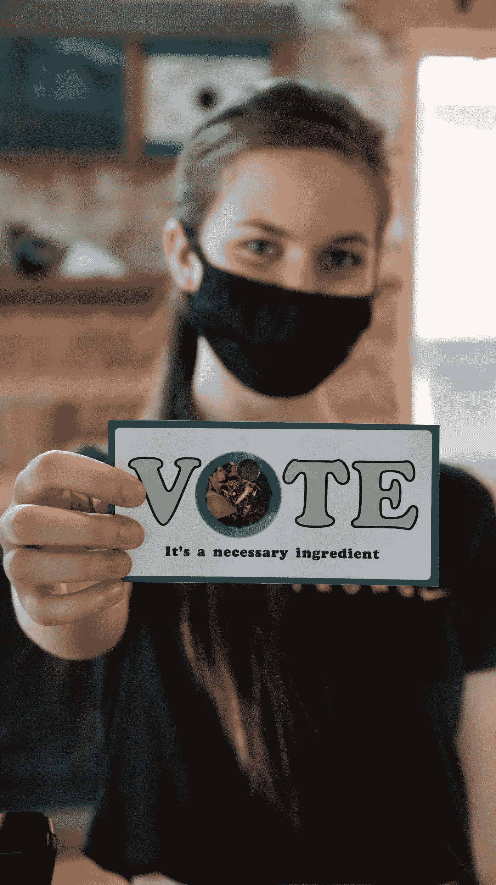

# 2020 年 11 月 3 日:我们的清算日

> 原文：<https://medium.datadriveninvestor.com/november-3-2020-our-day-of-reckoning-70c44d393788?source=collection_archive---------29----------------------->

Photo by [Manny Becerra](https://unsplash.com/@mannyb?utm_source=unsplash&utm_medium=referral&utm_content=creditCopyText) on [Unsplash](https://unsplash.com/s/photos/voting?utm_source=unsplash&utm_medium=referral&utm_content=creditCopyText)

我们生命中的选举只有几天了。它将揭示我们是谁，作为个人，作为一个社区，作为一个国家。它不仅将决定我们美国的未来，还将决定地球、环境和地球生命的未来。你会说，太多了。当然，我是在夸张。许多人会说，你只是想吓唬我们，让我们接受那些自由主义者和社会主义者试图让我们做的事情。对科学和事实的不相信和拒绝揭示了为什么我们发现自己处在这个十字路口。

每天，我都被新闻和报道所冲击，仅仅在几年前，我还认为这些新闻和报道是不可能的和荒谬的。这就好像洋葱已经成为事实新闻、深夜脱口秀和 T2 周六夜现场 T3 晚间新闻的来源。*很长一段时间以来，每日秀*一直是比网络新闻更真实的新闻来源。

我们美国人已经失去了作为一个更大的社区的一部分的意义。我们不仅在国家层面上看到这种情况，在我们的社区也是如此。让我解释一下。45 年前，当我们买下第一栋房子并搬进我们的社区时，它不仅仅是一个住所。我很快意识到我们是一个社区的一部分。我们有一个活跃的邻里协会，监测邻里问题，并提请城市注意，以帮助解决这些问题。这个社区有一个由主席领导的管理委员会，负责确保垃圾被清理，必要的维护被完成，甚至在冬天清除人行道上的积雪。

附近的社区庆祝主要的节日:圣诞节、复活节和 7 月 4 日。7 月 4 日有一场游行，游行队伍由一辆城市消防车带领，汽笛长鸣，几乎所有的男孩和女孩都骑着他们的自行车，在游行队伍的后面。游行结束后，整个社区都聚集在附近的公园野餐，吃热狗、汉堡、薯条和饮料。吃饭时，我们拜访了邻居，邻居乐队为我们助兴。我们的孩子们玩各种各样的游戏，包括奖品。

今天，没有 HOA。它的死亡是由于一个奇怪的州法律和目前的邻居无法走到一起创造一个新的。有些问题与上一批官员有关，但真正的原因更深层。上届理事会的问题只是为现在的情况提供了一个借口。

目前，我的许多邻居都在努力重建我们的 HOA，但也有相当一部分人反对重建。他们觉得他们的自由会受到侵犯。这将侵犯他们对个性和独立性的错误认识。它们反映了美国的一个新现实，这个现实得到了右翼和像白宫现任主人这样的人的推动。他们反对将自己视为社区的一部分。他们似乎认为任何一种集体或社区都是对他们基本权利和身份的侵犯。它们反映了随着新自由主义的出现而占主导地位的思想。重要的是我想要什么，我希望能够做任何能给我带来最大快乐的事情。

难怪抛开所有的玩笑，唐纳德·特朗普是美国的完美代表，我们是什么样的，我们已经成为什么样的。他的谎言、愚蠢、无知、傲慢、自私和自恋反映了我们自己。他对运动的兴趣和他的腰围是我们的写照。

当作家乌马尔哈克第一次写道，他认为美国人和英国人是地球上最愚蠢和最愚蠢的人，我想不同意。我想相信他是错的。我想相信他是错的，但后来我停顿了一下，思考了一下，并做了记录。

自 3 月份以来，我们已经有近 23 万人死于新冠肺炎病毒，预计到新年时还会有 20 万人死亡，而这种病毒早就应该得到控制。我看到美国人抱怨不得不戴口罩，声称他们的权利受到侵犯，他们的自由被剥夺，并且不理解甚至不关心他们的行为如何影响他们周围的人。我看到警察谋杀男人、女人和有色人种的孩子，却不承担任何后果。我看着听着人们发牢骚，抱怨生活的不便，抱怨失去了他们的特权生活方式。当我们沉迷于迷信和荒谬的阴谋论时，我看到种族主义仇恨隐藏在信仰宗教的错误观念背后。

数百万人失去了工作和医疗保障。他们中的许多人将很快失去他们的房子，流落街头，而股市神秘地飙升至创纪录的高度，将数十亿美元更多地放入少数超级富豪的口袋。

唐纳德·特朗普真正是我们这个国家的象征。如果我们不能动员起来阻止他再次当选，我们将会遭到报应。我们将赢得它！下周二我们将了解我们是谁。我们有一个选择。我们会选择，我们会知道，无论结果如何，我们都拥有它。

如果美国和整个人类要在当前的危机中生存下来，就必须发生重大的变化。我们正在经历的多重危机只会越来越多。必须运用科学和我们所能获得的最佳信息，理性地对待新冠肺炎疫情。必须承认全球变暖和气候变化，并将其作为生存危机加以解决。西部的大火会持续下去，消耗越来越多，造成越来越大的损失。风暴和飓风越来越大，越来越频繁，但移动速度却越来越慢，造成了更大的损害、破坏和人们的流离失所。我们必须有开明的真正领导，我们必须团结起来迎接我们面前的挑战。作为一个国家，我们可以做到这一点。作为个人的集合，每个人都自私地寻求他/她的需求，我们将失败和灭亡。