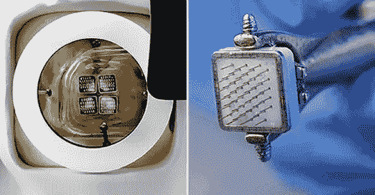

# 现在，一个仿生眼连接到大脑芯片上

> 原文：<https://medium.datadriveninvestor.com/now-a-bionic-eye-links-to-brain-chip-53c39ed9a56?source=collection_archive---------18----------------------->

一种与大脑芯片直接相连的仿生眼的人体试验正在进行中，这可能会在比赛中击败埃隆·马斯克的 Neuralink。

这是一个漫长的过程，历经十多年的酝酿，但科学家们最终准备在人体内植入一只仿生眼。

 [## 未来科技:Neuralink 更新|数据驱动的投资者

### 8 月 28 日，埃隆·马斯克提供了他的公司 Neuralink 的最新进展，该公司旨在创造植入式…

www.datadriveninvestor.com](https://www.datadriveninvestor.com/2020/09/03/futuristic-tech-neuralink-update/) 

Gennaris 仿生视觉系统由一个装有摄像头和无线发射器的定制头盔、一个视觉处理器单元、软件和一组 9x9mm 的瓷砖组成。

所有这些都被植入大脑表面，希望能让盲人恢复视力。

它通过绕过受损的视神经来完成工作，受损的视神经阻碍了从视网膜到大脑“视觉中心”的信号。

在临床前试验中，研究人员将该设备植入 10 只绵羊的大脑，没有任何不利的健康影响。

植入设备的工作原理是这样的:连接的摄像头通过使用多达 172 个光点的组合来捕捉用户的周围环境，然后将其发送到视觉处理器，该技术从传输中提取数据。

这些信息流经每个植入物中的复杂电路，并转换成电脉冲模式，使用微电极刺激大脑。

科学家们表示，该设备不仅可以治疗失明，还可以治疗瘫痪等其他疾病。

甚至有计划使用仿生视觉技术来治疗癫痫和抑郁症等疾病。

澳大利亚莫纳什大学的一组科学家开发了这种设备，现在正在寻找投资者来销售他们的产品。

报道称，该团队去年获得了 100 万美元的资金，并将在今年晚些时候举办另一场筹款活动。

**进入专家视角—** [**订阅 DDI 英特尔**](https://datadriveninvestor.com/ddi-intel)