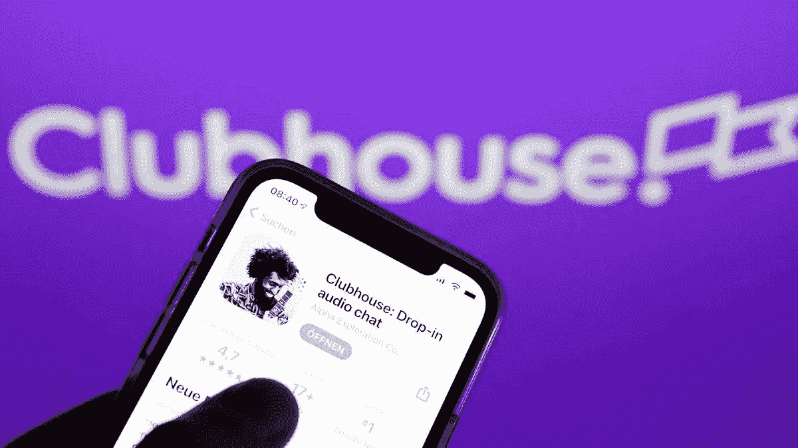

# 现在进入男孩俱乐部

> 原文：<https://medium.datadriveninvestor.com/now-entering-the-boys-club-1043f31ae292?source=collection_archive---------29----------------------->

会所的虚拟社区如何通过意识到这三个问题来解决女性的安全问题。

Source: [Film Daily](https://filmdaily.co/news/clubhouse-app/)

这些天来，似乎每一个被大肆宣传的新社交应用的出现都会带来一系列关于其对普通用户群体的影响的负面报道——**club house**也不例外。

在“独家”音频收听应用上呆了一周后，我觉得自己好像是一个有 200 万人参与的[大型社会实验的一部分](https://techcrunch.com/2021/01/24/clubhouse-announces-plans-for-creator-payments-and-raises-new-funding-led-by-andreessen-horowitz/)，这些人渴望在秘密环境下与行业专业人士和有共同兴趣的同行建立联系。当我在虚拟空间中与平台上的其他用户互动时，很容易忘记常规的社会规范仍然适用于我作为“商界女性”的在线个人资料。

尽管 Clubhouse 的语气与 Linkedin 相比有所减弱，但我们无法区分这样一个事实，即它的用户仍然是我们在 Linkedin 应用中遇到的那些人。因此，作为一名女性进入一个充满男性行业专业人士的“房间”的动力仍然存在并充分发挥作用，特别是当房间的男性主持人超过女性参与者或小组成员时。

自 2020 年 3 月成立以来，Clubhouse 一直被其创始人保罗·戴维森(Paul Davison)和罗汉·塞思(Rohan Seth)视为有声社交网络的先驱，他们两人经常出现在或参与主持小组讨论。

我们在男性创造者设计的类似技术方面面临的一个障碍是[他们在执行时对其对女性人口的影响关注有限](https://uxdesign.cc/designed-with-men-in-mind-786f1cfa652a)，这个问题一直在报告中流传，报告称俱乐部用户在平台上与男性互动时感到不适。

截至今天，一名发言人对这些指控的回应如下，该发言人对俱乐部会所的社区节制立场进行了辩护:

> “我们相信声音在建立共鸣方面的独特力量，并将 Clubhouse 视为一个地方，在这里，具有不同观点、背景和生活经历的人们可以扩大他们的理解，发展他们的世界观。公司明确谴责一切形式的种族主义、仇恨言论和虐待，正如我们的社区指南和服务条款中所指出的那样，并制定了信任和安全程序来调查和处理任何违反这些规则的行为。”—摘自 2020 年 12 月的《名利场》

与更多为女性设计的终身社交网络应用程序相比，如 **Bumble Bizz** ，这是最初 Bumble 约会应用程序的专业主题衍生产品，允许女性识别用户与其他用户进行对话，Clubhouse】尚未建立可靠的机制来适当控制攻击性或仇恨性言论的传播。

可以理解的是， **Clubhouse 的开发意图是为所有性别的用户开辟表达和交流的途径，不像 Bumble，它以“全球女性品牌”**、[解决互联网上过时的规范以及缺乏善意和责任感的问题](https://www.sec.gov/Archives/edgar/data/1830043/000119312521009745/d20761ds1.htm)。

虽然 Clubhouse 的团队已经因缺乏适度执法而受到指责，但除了女性在平台上受到口头攻击的问题之外，还有几个值得注意的领域值得关注。

# 1.不要“号召”参与者发言

Source: [Emojipedia](https://emojipedia.org/)

在俱乐部会所创建的每个“房间”都由一名主持人(或几名主持人)和一系列主持对话的小组成员主持。通过指定对话的流程，这些人可以号召房间里“举手”的听众就该主题发表意见。

正如教育研究表明的那样，多年来，反对在课堂上少叫女学生的偏见已经得到了很好的证明，[，**在同样的环境下，男性说话的时间是女性的 1.6 倍**，](https://www.insidehighered.com/quicktakes/2021/01/19/study-men-speak-16-times-more-women-college-classrooms)，**，**。为了对抗这种影响，一些机构的教职员工甚至求助于“[盲目冷呼](https://repository.upenn.edu/cgi/viewcontent.cgi?article=1049&context=spice)”的方法，包括匿名提交答案或向学生分发数字，并通过抽签系统随机选择。

虽然主持人与参与者的关系似乎是一个标准的概念，但如果主持人下意识地选择一名男性参与者，它可能会使女性参与者处于不利地位，被要求发言。

# 2.主动互动

Source: [Emojipedia](https://emojipedia.org/)

U 与大多数其他社交媒体应用程序一样，Clubhouse 消除了隐私设置的障碍，为新会员打开了查阅任何注册会员个人资料的大门。

虽然该应用程序的开发者已经[增加了功能，可以在 2020 年 10 月](https://www.joinclubhouse.com/on-community-moderation)、**阻止、静音和报告房间中的用户，但该平台仍然要求所有用户使用真实姓名注册——不允许使用假名或花哨的昵称。**

[纽约时报(New York Times)媒体记者泰勒·洛伦茨(Taylor Lorenz)](https://www.inputmag.com/culture/a-journalist-does-not-deserved-to-be-harassed-by-vcs-taylor-lorenz-balaji-srinivasan)因对 Away 前首席执行官在 Instagram 上发布的帖子表示失望而受到多名俱乐部成员的骚扰，这一事件发生后，很明显，如果要防止这种行为在会员中再次发生，该应用需要做出许多赔偿。

网络骚扰在社交应用中并不新鲜，这些行为**[**的不幸结果不成比例地偏向女性，成为网络厌女症和/或网络性别歧视的目标**](https://hbr.org/2020/06/youre-not-powerless-in-the-face-of-online-harassment) **。****

**在应用程序上分享用户的真实姓名可能会在俱乐部会所社区中创造透明度，并增加与他们在更亲密的层面上联系的阴谋——**然而，正如我们在上文中观察到的那样，这反过来会使他们有机会因说出自己的想法而受到更多的骚扰。****

# ****3.超越其他参与者****

********

****Source: [Emojipedia](https://emojipedia.org/)****

****如果说通过 Zoom 进行交流还不够有挑战性的话，Clubhouse 消除了常规互动的视觉成分，给参与者留下了更多的不确定性，他们可能不一定知道某人何时结束了讲话，也不知道如何在没有视觉提示的情况下管理对话。****

****[男性用户对女性的干扰](https://www.protocol.com/moderation-clubhouse-building-community)已经成为针对该应用的众多投诉之一，引发了如何适当“调节”实时音频的问题。****

****虽然还没有实施明确的解决方案，**这可能是一个号召，鼓励用户**采取更好的个人做法，例如“ [popcorning](http://www.ascd.org/publications/educational-leadership/apr20/vol77/num07/Moving-Beyond-%C2%A3Popcorn%C2%A3-Discussions.aspx) ”下一次与女性成员交谈的机会，或者通过使用他们的平台吸引对中途被打断的用户所做评论的积极关注。****

****随着俱乐部会所继续发展，为所有成员维持一个受欢迎的社区，这种方法的成功可能只会在男性用户致力于遵守这一行为准则的情况下取得进展，因此，焦点是要加强这些价值观。****

****虽然 Clubhouse 并无创新，但不可否认的是，在它成立一周年之际，它提高了关于在线监管辩论的标准。****

****在关于功能增强和让用户负责监控其行为的建议中，**必须指出的是，该应用从未被创建为专门为女性创造安全空间的目的。******

****除了在虚拟微观世界中为当前的改进集思广益之外，**我们难道不应该思考未来的社交应用程序应该如何设计，并考虑预防的方法吗？******

****这本身就是另一个需要讨论的章节。****